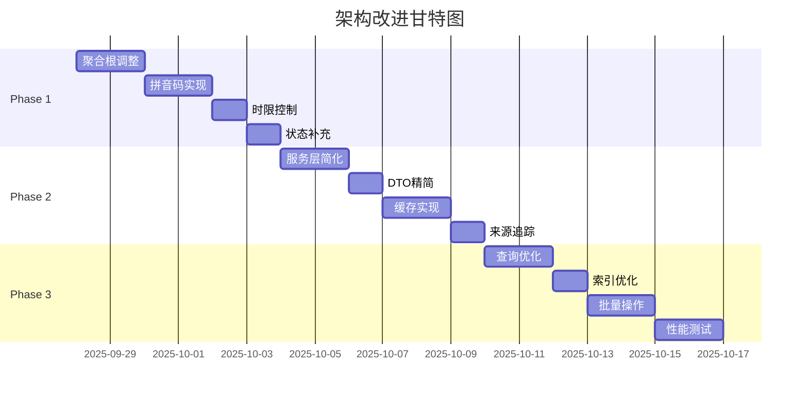

# 凌隐宝堂系统架构改进实施计划

**版本**：v1.0  
**日期**：2025-09-27  
**目标**：对齐业务需求，简化架构，提升效率  
**原则**：KISS优先，增量改进，保持稳定  

## 一、改进目标

### 1.1 业务对齐
- ✅ MedicalCase作为业务中心
- ✅ 实现完整的诊疗流程
- ✅ 支持三种开方方式
- ✅ 实现拼音码快速输入

### 1.2 架构简化
- ✅ 消除过度设计
- ✅ 减少代码复杂度
- ✅ 提升开发效率

### 1.3 性能优化
- ✅ 查询响应<1秒
- ✅ 支持10-15人并发
- ✅ 常用数据缓存

## 二、实施阶段

### 📅 Phase 1: 核心功能修复（第1周）

#### 任务1.1: 聚合根调整 [P0]
**目标**：将MedicalCase调整为聚合根

**具体步骤**：
1. 修改实体关系
```csharp
// 1. 更新MedicalCase实体
public class MedicalCase : BaseEntity
{
    public Guid PatientId { get; set; }
    public DateTime VisitDate { get; set; }
    public MedicalCaseStatus Status { get; set; } // 暂存/结束/取消
    
    // 一对一关系
    public virtual Consultation Consultation { get; set; }
    public virtual Prescription? Prescription { get; set; }
}

// 2. 调整Consultation（移除MedicalCaseId外键）
public class Consultation : BaseEntity
{
    public Guid Id { get; set; } // 与MedicalCase.Id相同
    // 移除 public Guid MedicalCaseId { get; set; }
}
```

2. 数据库迁移
```sql
-- 调整表结构
ALTER TABLE Consultations DROP COLUMN MedicalCaseId;
ALTER TABLE Consultations ADD CONSTRAINT FK_Consultation_MedicalCase 
    FOREIGN KEY (Id) REFERENCES MedicalCases(Id);
```

3. 更新Repository
```csharp
public class MedicalCaseRepository : BaseRepository<MedicalCase>
{
    public async Task<MedicalCase> GetWithDetailsAsync(Guid id)
    {
        return await _dbSet
            .Include(m => m.Consultation)
            .Include(m => m.Prescription)
            .ThenInclude(p => p.Items)
            .Include(m => m.Patient)
            .FirstOrDefaultAsync(m => m.Id == id);
    }
}
```

**验收标准**：
- [ ] 一次就诊创建一个MedicalCase
- [ ] Consultation和Prescription作为MedicalCase的组件
- [ ] 现有数据成功迁移

#### 任务1.2: 拼音码功能实现 [P0]
**目标**：实现自动拼音码生成和查询

**具体步骤**：
1. 添加拼音工具类
```csharp
// Shared.Utilities/PinyinHelper.cs
public static class PinyinHelper
{
    // 使用 TinyPinyin.NET 包
    public static string GetFirstLetters(string chinese)
    {
        if (string.IsNullOrWhiteSpace(chinese)) return "";
        
        var result = new StringBuilder();
        foreach (char c in chinese)
        {
            if (PinyinHelper.IsChinese(c))
            {
                var pinyin = PinyinHelper.GetPinyin(c);
                result.Append(pinyin[0].ToUpper());
            }
        }
        return result.ToString();
    }
}
```

2. 更新实体
```csharp
// 患者
public class Patient : BaseEntity
{
    private string _name;
    public string Name 
    { 
        get => _name;
        set
        {
            _name = value;
            PinyinCode = PinyinHelper.GetFirstLetters(value);
        }
    }
    public string PinyinCode { get; set; }
}

// 药材、方剂同理
```

3. 更新查询服务
```csharp
public async Task<List<PatientDto>> SearchAsync(string keyword)
{
    return await _repository.Query()
        .Where(p => p.Name.Contains(keyword) || 
                   p.PinyinCode.StartsWith(keyword.ToUpper()))
        .ToListAsync();
}
```

**验收标准**：
- [ ] 张三自动生成ZS
- [ ] 黄芪自动生成HQ  
- [ ] 支持拼音码查询

#### 任务1.3: 修改时限控制 [P0]
**目标**：实现当天可改、过期锁定

**具体步骤**：
1. 添加权限检查
```csharp
public static class EditPermissionHelper
{
    public static bool CanEdit(DateTime createdAt, bool isAdmin)
    {
        // 管理员始终可编辑
        if (isAdmin) return true;
        
        // 医生只能编辑当天的记录
        return createdAt.Date == DateTime.Today;
    }
}
```

2. Service层实现
```csharp
public async Task<ServiceResult> UpdateAsync(Guid id, UpdateDto dto, bool isAdmin)
{
    var entity = await _repository.GetByIdAsync(id);
    
    if (!EditPermissionHelper.CanEdit(entity.CreatedAt, isAdmin))
    {
        return ServiceResult.Fail("记录已锁定，无法修改");
    }
    
    // 执行更新...
}
```

**验收标准**：
- [ ] 当天记录可修改
- [ ] 过期记录医生无法修改
- [ ] 管理员可修改所有记录

#### 任务1.4: 诊疗状态补充 [P0]
**目标**：添加暂存状态支持

**具体步骤**：
1. 更新枚举
```csharp
public enum MedicalCaseStatus
{
    Draft = 0,      // 草稿/暂存
    Completed = 1,  // 已完成
    Cancelled = 2   // 已取消
}
```

2. 状态流转逻辑
```csharp
public class MedicalCaseService
{
    public async Task<ServiceResult> PauseAsync(Guid id)
    {
        var entity = await _repository.GetByIdAsync(id);
        entity.Status = MedicalCaseStatus.Draft;
        await _repository.UpdateAsync(entity);
        return ServiceResult.Success();
    }
    
    public async Task<ServiceResult> ResumeAsync(Guid id)
    {
        // 恢复编辑
    }
}
```

**验收标准**：
- [ ] 支持暂存功能
- [ ] 可恢复继续编辑
- [ ] 急诊插队场景正常

### 📅 Phase 2: 服务层优化（第2周）

#### 任务2.1: 服务层简化 [P1]
**目标**：合并QueryService到Service

**具体步骤**：
1. 删除所有QueryService
2. Service统一处理读写
```csharp
// 之前：ConsultationService + ConsultationQueryService
// 之后：MedicalCaseService（统一）
public class MedicalCaseService : IMedicalCaseService
{
    // 查询方法
    public async Task<PagedResult<MedicalCaseDto>> GetPagedAsync(QueryDto query);
    public async Task<MedicalCaseDto> GetByIdAsync(Guid id);
    
    // 业务方法
    public async Task<MedicalCaseDto> CreateAsync(CreateDto dto);
    public async Task<ServiceResult> UpdateAsync(Guid id, UpdateDto dto);
}
```

**验收标准**：
- [ ] QueryService全部移除
- [ ] Service统一处理
- [ ] API保持兼容

#### 任务2.2: DTO精简 [P1]
**目标**：每个模块4个DTO

**保留DTO**：
```csharp
// 每个模块只保留
1. XxxDto          // 显示用
2. CreateXxxDto    // 创建用
3. UpdateXxxDto    // 更新用
4. QueryXxxDto     // 查询用
```

**删除DTO**：
- DetailDto（合并到基础Dto）
- StartDto、CompleteDto（用UpdateDto）
- StatisticsDto（延后实现）
- 其他冗余DTO

**验收标准**：
- [ ] 每模块最多4个DTO
- [ ] 功能不受影响

#### 任务2.3: 统一缓存实现 [P1]
**目标**：实现高频数据缓存

**具体步骤**：
1. 创建缓存服务
```csharp
public interface ICacheService
{
    Task<T?> GetAsync<T>(string key);
    Task SetAsync<T>(string key, T value, TimeSpan? expiry = null);
    Task RemoveAsync(string key);
}

public class MemoryCacheService : ICacheService
{
    private readonly IMemoryCache _cache;
    // 实现...
}
```

2. Repository集成缓存
```csharp
public class PatientRepository
{
    public async Task<Patient> GetByIdAsync(Guid id)
    {
        var cacheKey = $"patient:{id}";
        
        var cached = await _cache.GetAsync<Patient>(cacheKey);
        if (cached != null) return cached;
        
        var entity = await _dbSet.FindAsync(id);
        await _cache.SetAsync(cacheKey, entity, TimeSpan.FromMinutes(5));
        
        return entity;
    }
}
```

**缓存策略**：
- 患者：5分钟
- 药材：30分钟
- 方剂：30分钟

**验收标准**：
- [ ] 缓存机制正常工作
- [ ] 查询性能提升50%

#### 任务2.4: 处方来源追踪 [P1]
**目标**：记录处方来源

**具体步骤**：
1. 添加来源字段
```csharp
public class Prescription : BaseEntity
{
    public string? Sources { get; set; } // "方剂:小柴胡汤|历史:2024-01-01"
    
    public void AddSource(string type, string value)
    {
        var source = $"{type}:{value}";
        Sources = string.IsNullOrEmpty(Sources) 
            ? source 
            : $"{Sources}|{source}";
    }
}
```

2. 导入时记录
```csharp
public async Task ImportFormulaAsync(Guid prescriptionId, Guid formulaId)
{
    var prescription = await GetByIdAsync(prescriptionId);
    var formula = await _formulaRepository.GetByIdAsync(formulaId);
    
    // 添加药材
    foreach (var item in formula.Items)
    {
        prescription.AddOrUpdateItem(item);
    }
    
    // 记录来源
    prescription.AddSource("方剂", formula.Name);
}
```

**验收标准**：
- [ ] 来源正确记录
- [ ] 支持多来源

### 📅 Phase 3: 性能优化（第3-4周）

#### 任务3.1: N+1查询优化 [P2]
**优化点**：
- Include预加载
- 投影查询
- 批量查询

#### 任务3.2: 数据库索引 [P2]
```sql
-- 患者查询索引
CREATE INDEX IX_Patients_PinyinCode ON Patients(PinyinCode);
CREATE INDEX IX_Patients_Name ON Patients(Name);

-- 诊疗查询索引
CREATE INDEX IX_MedicalCases_PatientId_VisitDate 
    ON MedicalCases(PatientId, VisitDate DESC);
```

#### 任务3.3: 批量操作 [P2]
- 批量导入药材
- 批量创建处方项

#### 任务3.4: 性能测试 [P2]
- 负载测试
- 响应时间测试
- 并发测试

## 三、实施保障

### 3.1 分支策略
```
master
  ├── feature/medical-case-refactor    # Phase 1
  ├── feature/service-simplification   # Phase 2
  └── feature/performance-optimization # Phase 3
```

### 3.2 测试要求
- 单元测试覆盖率>60%
- 集成测试必须通过
- 回归测试无问题

### 3.3 回滚方案
- 每个Phase独立分支
- 充分测试后合并
- 保留回滚脚本

## 四、风险控制

| 风险 | 概率 | 影响 | 应对措施 |
|------|------|------|----------|
| 数据迁移失败 | 低 | 高 | 备份数据，准备回滚脚本 |
| API不兼容 | 中 | 中 | 保持接口兼容，内部重构 |
| 性能下降 | 低 | 高 | 性能测试，优化后上线 |
| 工期延误 | 中 | 中 | 分阶段交付，核心优先 |

## 五、验收标准

### 5.1 功能验收
- [ ] 完整诊疗流程正常
- [ ] 拼音码功能可用
- [ ] 权限控制正确
- [ ] 三种开方方式都正常

### 5.2 性能验收
- [ ] 查询响应<1秒
- [ ] 支持15人并发
- [ ] 内存占用<2GB

### 5.3 质量验收
- [ ] 代码量减少30%
- [ ] 圈复杂度<10
- [ ] 测试覆盖>60%

## 六、时间计划



## 七、交付物清单

### Phase 1 交付
- ✅ MedicalCase聚合根实现
- ✅ 拼音码功能
- ✅ 权限控制机制
- ✅ 状态管理功能

### Phase 2 交付
- ✅ 简化的服务层
- ✅ 精简的DTO
- ✅ 统一缓存
- ✅ 来源追踪

### Phase 3 交付
- ✅ 优化的查询
- ✅ 性能测试报告
- ✅ 部署文档

## 八、成功标准

### 8.1 业务成功
- 医生操作效率提升50%
- 系统响应速度满意度>90%
- 零数据丢失

### 8.2 技术成功
- 代码可维护性提升
- 新人上手时间减少50%
- 缺陷率降低60%

## 九、后续规划

### 9.1 短期（1个月后）
- 统计功能设计
- 报表功能规划
- Excel导出实现

### 9.2 中期（3个月后）
- 多诊所支持
- 移动端开发
- 数据分析功能

### 9.3 长期（6个月后）
- AI辅助诊断
- 远程诊疗
- 大数据分析

---

**批准**：  
项目经理：_____________  
技术负责：_____________  
业务负责：_____________  

**文档版本**：v1.0  
**创建日期**：2025-09-27  
**最后更新**：2025-09-27