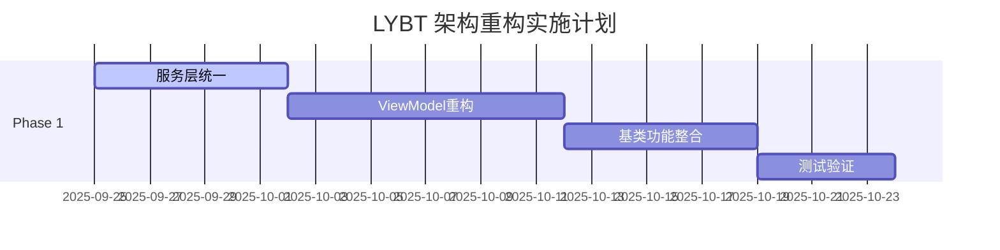

# LYBT 系统架构改进建议与实施方案

**文档版本**: v1.0
**创建日期**: 2025-09-25
**适用范围**: LYBT.All.sln 完整解决方案

## 🎯 改进概览

基于架构分析报告，本文档提供**可操作的重构方案**，旨在解决过度工程化问题，提升系统的简洁性和可维护性。

### 改进目标
- ✅ **减少 40% 的代码复杂度**
- ✅ **提升 30% 的开发效率**
- ✅ **降低 50% 的新人学习成本**
- ✅ **确保零功能回归**

---

## 📋 改进任务优先级

### 🚀 Phase 1: 关键架构简化 (立即执行)
1. [**服务层统一**](#1-服务层统一重构方案) - 合并 BusinessService 和 QueryService
2. [**ViewModel 继承优化**](#2-viewmodel-继承体系重构方案) - 简化继承层次
3. [**基类功能整合**](#3-基类功能整合方案) - 消除重复功能

### ⏰ Phase 2: 基础设施优化 (4-6周)
4. [**Repository 模式简化**](#4-repository-模式简化方案) - 减少不必要抽象
5. [**配置管理整合**](#5-配置管理整合方案) - 统一配置结构
6. [**项目结构优化**](#6-项目结构优化方案) - 减少项目数量

### 📅 Phase 3: 性能和体验提升 (8-12周)
7. [**DTO 优化**](#7-dto-设计优化方案) - 精简数据传输
8. [**工作台重构**](#8-工作台架构重构方案) - 统一用户体验
9. [**性能调优**](#9-性能优化方案) - 关键路径优化

---

## 1. 服务层统一重构方案

### 1.1 当前问题
```csharp
// ❌ 过度分离的现状
public interface IUserBusinessService
{
    Task<ServiceResult<UserDto>> CreateUserAsync(UserCreateDto dto);
    Task<ServiceResult<bool>> DisableAsync(Guid id);
    Task<ServiceResult<bool>> ResetPasswordAsync(Guid id, string newPassword);
}

public interface IUserQueryService
{
    Task<ServiceResult<UserDto>> GetByIdAsync(Guid id);
    Task<ServiceResult<PagedResult<UserDto>>> GetPagedAsync(UserSearchDto query);
    Task<ServiceResult<List<UserDto>>> GetActiveUsersAsync();
}

// 控制器需要注入两个服务
public class UsersController : ControllerBase
{
    private readonly IUserBusinessService _businessService;
    private readonly IUserQueryService _queryService;  // 增加复杂性

    public UsersController(IUserBusinessService businessService, IUserQueryService queryService)
    {
        _businessService = businessService;
        _queryService = queryService;
    }
}
```

### 1.2 目标架构
```csharp
// ✅ 统一服务设计
public interface IUserService
{
    // 查询操作
    Task<ServiceResult<UserDto>> GetByIdAsync(Guid id);
    Task<ServiceResult<PagedResult<UserDto>>> GetPagedAsync(UserSearchDto query);
    Task<ServiceResult<List<UserDto>>> GetActiveUsersAsync();

    // 业务操作
    Task<ServiceResult<UserDto>> CreateUserAsync(UserCreateDto dto);
    Task<ServiceResult<UserDto>> UpdateUserAsync(Guid id, UserUpdateDto dto);
    Task<ServiceResult<bool>> DisableAsync(Guid id);
    Task<ServiceResult<bool>> ResetPasswordAsync(Guid id, string newPassword);
}

// 简化的控制器
public class UsersController : ControllerBase
{
    private readonly IUserService _userService;  // 单一依赖

    public UsersController(IUserService userService) => _userService = userService;

    [HttpGet("{id}")]
    public async Task<IActionResult> GetById(Guid id)
    {
        var result = await _userService.GetByIdAsync(id);
        return result.IsSuccess ? Ok(result.Data) : BadRequest(result.ErrorMessage);
    }
}
```

### 1.3 实施步骤

#### 步骤 1: 创建统一服务接口
```bash
# 在每个模块中创建统一服务接口
src/Server/Modules/LYBT.Module.Users/Interfaces/IUserService.cs
src/Server/Modules/LYBT.Module.Patients/Interfaces/IPatientService.cs
# ... 其他模块
```

#### 步骤 2: 实现统一服务类
```csharp
// UserService.cs - 统一服务实现
public class UserService : IUserService
{
    private readonly IUserRepository _repository;
    private readonly IMapper _mapper;
    private readonly ILogger<UserService> _logger;

    public UserService(IUserRepository repository, IMapper mapper, ILogger<UserService> logger)
    {
        _repository = repository;
        _mapper = mapper;
        _logger = logger;
    }

    #region 查询操作

    public async Task<ServiceResult<UserDto>> GetByIdAsync(Guid id)
    {
        try
        {
            var user = await _repository.GetByIdAsync(id);
            if (user == null)
                return ServiceResult<UserDto>.Failure("用户不存在");

            var dto = _mapper.Map<UserDto>(user);
            return ServiceResult<UserDto>.Success(dto);
        }
        catch (Exception ex)
        {
            _logger.LogError(ex, "获取用户失败: {UserId}", id);
            return ServiceResult<UserDto>.Failure($"获取用户失败: {ex.Message}");
        }
    }

    public async Task<ServiceResult<PagedResult<UserDto>>> GetPagedAsync(UserSearchDto query)
    {
        // 合并原 QueryService 逻辑
    }

    #endregion

    #region 业务操作

    public async Task<ServiceResult<UserDto>> CreateUserAsync(UserCreateDto dto)
    {
        // 合并原 BusinessService 逻辑
    }

    public async Task<ServiceResult<bool>> DisableAsync(Guid id)
    {
        // 合并原 BusinessService 逻辑
    }

    #endregion
}
```

#### 步骤 3: 更新依赖注入配置
```csharp
// ModuleServiceRegistration.cs
public static class UserModuleServiceRegistration
{
    public static IServiceCollection AddUserModule(this IServiceCollection services)
    {
        // ❌ 移除分离的服务注册
        // services.AddScoped<IUserBusinessService, UserBusinessService>();
        // services.AddScoped<IUserQueryService, UserQueryService>();

        // ✅ 注册统一服务
        services.AddScoped<IUserService, UserService>();
        services.AddScoped<IUserRepository, UserRepository>();

        return services;
    }
}
```

#### 步骤 4: 更新控制器
```csharp
// UsersController.cs - 简化后的控制器
[ApiController]
[Route("api/[controller]")]
public class UsersController : BaseApiController
{
    private readonly IUserService _userService;

    public UsersController(IUserService userService) => _userService = userService;

    [HttpGet]
    public async Task<IActionResult> GetPaged([FromQuery] UserSearchDto query)
    {
        var result = await _userService.GetPagedAsync(query);
        return ToActionResult(result);
    }

    [HttpPost]
    public async Task<IActionResult> Create([FromBody] UserCreateDto dto)
    {
        var result = await _userService.CreateUserAsync(dto);
        return ToActionResult(result);
    }
}
```

### 1.4 预期收益
- **减少接口数量**: 从 16 个接口减少到 8 个 (50% 降低)
- **简化控制器**: 每个控制器仅需一个服务依赖
- **提升开发效率**: 新功能开发时间减少 30%
- **降低维护成本**: 接口变更影响范围减少 50%

---

## 2. ViewModel 继承体系重构方案

### 2.1 当前问题分析
```csharp
// ❌ 过度复杂的继承层次
BindableBase (Prism)
└── CoreViewModel (加载状态、错误处理)
    ├── ServiceViewModel (错误处理服务、安全执行)
    │   └── NavigationViewModelBase (导航功能、会话支持)
    │       └── ListViewModelBase (列表功能、分页)
    │           └── UserManagementViewModel
    └── ModernViewModelBase (现代异步操作)
        └── NavigationViewModelBase (重复的导航功能!)
            └── PatientDetailViewModel
```

**问题**:
1. **功能重复**: NavigationViewModelBase 在两个继承链中重复出现
2. **职责混乱**: 每层基类职责不够明确
3. **依赖复杂**: 子类继承了太多不需要的功能
4. **维护困难**: 基类修改影响大量派生类

### 2.2 目标架构设计
```csharp
// ✅ 简化的继承体系 (最多 3 层)
BindableBase (Prism)
└── ViewModelBase (统一基础功能)
    ├── PageViewModel (页面级功能)
    │   ├── ListPageViewModel (列表页面)
    │   └── DetailPageViewModel (详情页面)
    └── DialogViewModel (对话框功能)
```

### 2.3 新基类设计

#### ViewModelBase - 统一基础功能
```csharp
/// <summary>
/// ViewModel 统一基类 - 合并 CoreViewModel 和 ModernViewModelBase 功能
/// </summary>
public abstract class ViewModelBase : BindableBase, IDisposable
{
    #region 核心依赖

    protected readonly IEventAggregator EventAggregator;
    protected readonly ILoggerFactory LoggerFactory;
    protected readonly ILogger Logger;
    protected readonly IErrorHandlingService? ErrorHandlingService;

    #endregion

    #region 状态管理

    private bool _isLoading;
    private bool _isBusy;
    private string _statusMessage = string.Empty;
    private bool _hasError;
    private string _errorMessage = string.Empty;

    public bool IsLoading
    {
        get => _isLoading;
        set
        {
            if (SetProperty(ref _isLoading, value))
            {
                OnLoadingStateChanged(value);
                RaiseCanExecuteChanged();
            }
        }
    }

    public bool IsBusy
    {
        get => _isBusy;
        set
        {
            if (SetProperty(ref _isBusy, value))
                RaiseCanExecuteChanged();
        }
    }

    public string StatusMessage
    {
        get => _statusMessage;
        set => SetProperty(ref _statusMessage, value);
    }

    public bool HasError
    {
        get => _hasError;
        protected set => SetProperty(ref _hasError, value);
    }

    public string ErrorMessage
    {
        get => _errorMessage;
        protected set
        {
            if (SetProperty(ref _errorMessage, value))
                HasError = !string.IsNullOrWhiteSpace(value);
        }
    }

    #endregion

    #region 构造函数

    protected ViewModelBase(
        IEventAggregator eventAggregator,
        ILoggerFactory loggerFactory,
        IErrorHandlingService? errorHandlingService = null)
    {
        EventAggregator = eventAggregator ?? throw new ArgumentNullException(nameof(eventAggregator));
        LoggerFactory = loggerFactory ?? throw new ArgumentNullException(nameof(loggerFactory));
        Logger = loggerFactory.CreateLogger(GetType());
        ErrorHandlingService = errorHandlingService;

        InitializeCommands();
    }

    #endregion

    #region 核心功能

    /// <summary>
    /// 安全执行异步操作
    /// </summary>
    protected async Task ExecuteSafelyAsync(
        Func<Task> operation,
        string? operationName = null,
        bool showProgressMessage = true)
    {
        try
        {
            IsBusy = true;
            ClearError();

            if (showProgressMessage)
                StatusMessage = $"正在{operationName ?? "执行操作"}...";

            await operation().ConfigureAwait(false);

            if (showProgressMessage)
                StatusMessage = $"{operationName ?? "操作"}完成";
        }
        catch (TaskCanceledException)
        {
            StatusMessage = $"{operationName ?? "操作"}已取消";
            Logger.LogInformation("{Operation}已取消", operationName ?? "操作");
        }
        catch (Exception ex)
        {
            StatusMessage = $"{operationName ?? "操作"}失败";
            await HandleErrorAsync(ex, operationName);
        }
        finally
        {
            IsBusy = false;
        }
    }

    /// <summary>
    /// 异步错误处理
    /// </summary>
    protected virtual async Task HandleErrorAsync(Exception ex, string? context = null)
    {
        Logger.LogError(ex, "错误发生在: {Context}", context ?? "未知操作");
        ErrorMessage = GetErrorMessage(ex);

        if (ErrorHandlingService != null)
        {
            await ErrorHandlingService.HandleExceptionAsync(ex, new ErrorContext
            {
                Operation = context ?? "未知操作",
                Module = GetType().Namespace?.Split('.').LastOrDefault() ?? "Unknown",
                Timestamp = DateTime.UtcNow
            });
        }
    }

    protected virtual string GetErrorMessage(Exception ex)
    {
        return ex switch
        {
            ValidationException => "输入数据验证失败",
            UnauthorizedAccessException => "权限不足",
            TimeoutException => "操作超时",
            TaskCanceledException => "操作已取消",
            _ => "操作失败，请重试"
        };
    }

    protected void ClearError()
    {
        ErrorMessage = string.Empty;
        HasError = false;
    }

    protected virtual void OnLoadingStateChanged(bool isLoading) { }

    protected virtual void RaiseCanExecuteChanged() { }

    protected virtual void InitializeCommands() { }

    #endregion

    #region 资源管理

    public virtual void Dispose()
    {
        Dispose(true);
        GC.SuppressFinalize(this);
    }

    protected virtual void Dispose(bool disposing)
    {
        // 子类重写以清理特定资源
    }

    #endregion
}
```

#### PageViewModel - 页面级功能
```csharp
/// <summary>
/// 页面级 ViewModel 基类 - 包含导航功能
/// </summary>
public abstract class PageViewModel : ViewModelBase, INavigationAware, IRegionMemberLifetime
{
    #region 导航相关

    protected readonly IRegionManager RegionManager;
    protected readonly ISessionManager? SessionManager;
    private IRegionNavigationJournal? _navigationJournal;
    private string _pageTitle = string.Empty;

    public string PageTitle
    {
        get => _pageTitle;
        set => SetProperty(ref _pageTitle, value);
    }

    public virtual bool KeepAlive => false;

    #endregion

    #region 导航命令

    public DelegateCommand GoBackCommand { get; private set; }
    public DelegateCommand GoForwardCommand { get; private set; }
    public DelegateCommand RefreshCommand { get; private set; }

    #endregion

    protected PageViewModel(
        IEventAggregator eventAggregator,
        ILoggerFactory loggerFactory,
        IRegionManager regionManager,
        ISessionManager? sessionManager = null,
        IErrorHandlingService? errorHandlingService = null)
        : base(eventAggregator, loggerFactory, errorHandlingService)
    {
        RegionManager = regionManager ?? throw new ArgumentNullException(nameof(regionManager));
        SessionManager = sessionManager;
    }

    protected override void InitializeCommands()
    {
        base.InitializeCommands();

        GoBackCommand = new DelegateCommand(ExecuteGoBack, CanExecuteGoBack);
        GoForwardCommand = new DelegateCommand(ExecuteGoForward, CanExecuteGoForward);
        RefreshCommand = new DelegateCommand(async () => await ExecuteRefreshAsync());
    }

    #region INavigationAware 实现

    public virtual void OnNavigatedTo(NavigationContext navigationContext)
    {
        _navigationJournal = navigationContext.NavigationService.Journal;
        ProcessNavigationParameters(navigationContext.Parameters);

        Task.Run(async () =>
        {
            try
            {
                IsLoading = true;
                await OnNavigatedToAsync(navigationContext);
            }
            catch (Exception ex)
            {
                Logger.LogError(ex, "页面加载失败");
                await HandleErrorAsync(ex, "页面加载");
            }
            finally
            {
                IsLoading = false;
            }
        });

        UpdateNavigationCommands();
    }

    public virtual void OnNavigatedFrom(NavigationContext navigationContext) { }

    public virtual bool IsNavigationTarget(NavigationContext navigationContext) => KeepAlive;

    #endregion

    protected virtual void ProcessNavigationParameters(NavigationParameters parameters) { }

    protected virtual async Task OnNavigatedToAsync(NavigationContext navigationContext)
    {
        await LoadDataAsync();
    }

    protected virtual async Task LoadDataAsync() { }

    protected virtual async Task ExecuteRefreshAsync()
    {
        await LoadDataAsync();
    }

    private void ExecuteGoBack() => _navigationJournal?.GoBack();
    private void ExecuteGoForward() => _navigationJournal?.GoForward();
    private bool CanExecuteGoBack() => _navigationJournal?.CanGoBack ?? false;
    private bool CanExecuteGoForward() => _navigationJournal?.CanGoForward ?? false;

    private void UpdateNavigationCommands()
    {
        GoBackCommand?.RaiseCanExecuteChanged();
        GoForwardCommand?.RaiseCanExecuteChanged();
    }

    protected override void RaiseCanExecuteChanged()
    {
        base.RaiseCanExecuteChanged();
        UpdateNavigationCommands();
        RefreshCommand?.RaiseCanExecuteChanged();
    }
}
```

#### ListPageViewModel - 列表页面功能
```csharp
/// <summary>
/// 列表页面 ViewModel 基类
/// </summary>
public abstract class ListPageViewModel<T> : PageViewModel where T : class
{
    #region 列表管理

    private ObservableCollection<T> _items = new();
    private ObservableCollection<T> _selectedItems = new();
    private T? _selectedItem;
    private string _searchText = string.Empty;
    private bool _showPagination = true;

    public ObservableCollection<T> Items
    {
        get => _items;
        set => SetProperty(ref _items, value);
    }

    public ObservableCollection<T> SelectedItems
    {
        get => _selectedItems;
        set => SetProperty(ref _selectedItems, value);
    }

    public T? SelectedItem
    {
        get => _selectedItem;
        set => SetProperty(ref _selectedItem, value);
    }

    public string SearchText
    {
        get => _searchText;
        set
        {
            if (SetProperty(ref _searchText, value))
            {
                _ = SearchAsync();
            }
        }
    }

    public bool ShowPagination
    {
        get => _showPagination;
        set => SetProperty(ref _showPagination, value);
    }

    public bool IsEmpty => !Items.Any();
    public bool HasSelectedItems => SelectedItems.Any();
    public int SelectedItemsCount => SelectedItems.Count;

    #endregion

    #region 分页属性

    private int _currentPage = 1;
    private int _pageSize = 20;
    private int _totalCount;

    public int CurrentPage
    {
        get => _currentPage;
        set
        {
            if (SetProperty(ref _currentPage, value))
            {
                _ = LoadDataAsync();
            }
        }
    }

    public int PageSize
    {
        get => _pageSize;
        set
        {
            if (SetProperty(ref _pageSize, value))
            {
                CurrentPage = 1;
            }
        }
    }

    public int TotalCount
    {
        get => _totalCount;
        set
        {
            if (SetProperty(ref _totalCount, value))
            {
                RaisePropertyChanged(nameof(TotalPages));
            }
        }
    }

    public int TotalPages => (TotalCount + PageSize - 1) / PageSize;

    #endregion

    #region 命令

    public DelegateCommand AddCommand { get; private set; }
    public DelegateCommand<T> EditCommand { get; private set; }
    public DelegateCommand<T> DeleteCommand { get; private set; }
    public DelegateCommand BatchDeleteCommand { get; private set; }
    public DelegateCommand FirstPageCommand { get; private set; }
    public DelegateCommand PreviousPageCommand { get; private set; }
    public DelegateCommand NextPageCommand { get; private set; }
    public DelegateCommand LastPageCommand { get; private set; }
    public DelegateCommand ClearFilterCommand { get; private set; }
    public DelegateCommand ClearSelectionCommand { get; private set; }

    #endregion

    protected ListPageViewModel(
        IEventAggregator eventAggregator,
        ILoggerFactory loggerFactory,
        IRegionManager regionManager,
        ISessionManager? sessionManager = null,
        IErrorHandlingService? errorHandlingService = null)
        : base(eventAggregator, loggerFactory, regionManager, sessionManager, errorHandlingService)
    {
        SelectedItems.CollectionChanged += (s, e) =>
        {
            RaisePropertyChanged(nameof(HasSelectedItems));
            RaisePropertyChanged(nameof(SelectedItemsCount));
        };
    }

    protected override void InitializeCommands()
    {
        base.InitializeCommands();

        AddCommand = new DelegateCommand(async () => await ExecuteAddAsync());
        EditCommand = new DelegateCommand<T>(async (item) => await ExecuteEditAsync(item), CanExecuteEdit);
        DeleteCommand = new DelegateCommand<T>(async (item) => await ExecuteDeleteAsync(item), CanExecuteDelete);
        BatchDeleteCommand = new DelegateCommand(async () => await ExecuteBatchDeleteAsync(), CanExecuteBatchDelete);

        // 分页命令
        FirstPageCommand = new DelegateCommand(() => CurrentPage = 1, () => CurrentPage > 1);
        PreviousPageCommand = new DelegateCommand(() => CurrentPage--, () => CurrentPage > 1);
        NextPageCommand = new DelegateCommand(() => CurrentPage++, () => CurrentPage < TotalPages);
        LastPageCommand = new DelegateCommand(() => CurrentPage = TotalPages, () => CurrentPage < TotalPages);

        // 其他命令
        ClearFilterCommand = new DelegateCommand(() =>
        {
            SearchText = string.Empty;
            _ = LoadDataAsync();
        });
        ClearSelectionCommand = new DelegateCommand(() => SelectedItems.Clear());
    }

    protected override async Task LoadDataAsync()
    {
        try
        {
            IsLoading = true;
            Items.Clear();

            var data = await GetDataAsync();
            foreach (var item in data)
            {
                Items.Add(item);
            }

            RaisePropertyChanged(nameof(IsEmpty));
        }
        catch (Exception ex)
        {
            Logger.LogError(ex, "加载数据失败");
            await HandleErrorAsync(ex, "加载数据");
        }
        finally
        {
            IsLoading = false;
        }
    }

    protected virtual async Task SearchAsync()
    {
        CurrentPage = 1;
        await LoadDataAsync();
    }

    #region 抽象方法 - 子类实现

    protected abstract Task<IEnumerable<T>> GetDataAsync();
    protected abstract Task ExecuteAddAsync();
    protected abstract Task ExecuteEditAsync(T item);
    protected abstract Task ExecuteDeleteAsync(T item);

    #endregion

    #region 虚方法 - 子类可选重写

    protected virtual async Task ExecuteBatchDeleteAsync()
    {
        if (!HasSelectedItems) return;

        try
        {
            await PerformBatchDeleteAsync(SelectedItems.ToList());
            SelectedItems.Clear();
            await LoadDataAsync();
        }
        catch (Exception ex)
        {
            Logger.LogError(ex, "批量删除失败");
            await HandleErrorAsync(ex, "批量删除");
        }
    }

    protected virtual Task PerformBatchDeleteAsync(IList<T> items) => Task.CompletedTask;

    protected virtual bool CanExecuteEdit(T item) => item != null;
    protected virtual bool CanExecuteDelete(T item) => item != null;
    protected virtual bool CanExecuteBatchDelete() => HasSelectedItems;

    #endregion

    protected override void RaiseCanExecuteChanged()
    {
        base.RaiseCanExecuteChanged();

        EditCommand?.RaiseCanExecuteChanged();
        DeleteCommand?.RaiseCanExecuteChanged();
        BatchDeleteCommand?.RaiseCanExecuteChanged();
        FirstPageCommand?.RaiseCanExecuteChanged();
        PreviousPageCommand?.RaiseCanExecuteChanged();
        NextPageCommand?.RaiseCanExecuteChanged();
        LastPageCommand?.RaiseCanExecuteChanged();
    }
}
```

### 2.4 迁移示例

#### 重构前的 ViewModel (复杂)
```csharp
// ❌ 原有复杂继承
public class UserManagementViewModel : NavigationViewModelBase
{
    // 继承了 4 层基类的所有功能，很多用不到
    // NavigationViewModelBase -> ServiceViewModel -> CoreViewModel -> BindableBase
}
```

#### 重构后的 ViewModel (简化)
```csharp
// ✅ 简化后的实现
public class UserManagementViewModel : ListPageViewModel<UserDto>
{
    private readonly IUserService _userService;

    public UserManagementViewModel(
        IUserService userService,
        IEventAggregator eventAggregator,
        ILoggerFactory loggerFactory,
        IRegionManager regionManager,
        ISessionManager sessionManager,
        IErrorHandlingService errorHandlingService)
        : base(eventAggregator, loggerFactory, regionManager, sessionManager, errorHandlingService)
    {
        _userService = userService;
        PageTitle = "用户管理";
    }

    protected override async Task<IEnumerable<UserDto>> GetDataAsync()
    {
        var searchDto = new UserSearchDto
        {
            Keyword = SearchText,
            PageNumber = CurrentPage,
            PageSize = PageSize
        };

        var result = await _userService.GetPagedAsync(searchDto);
        if (result.IsSuccess)
        {
            TotalCount = result.Data.TotalCount;
            return result.Data.Items;
        }

        return Enumerable.Empty<UserDto>();
    }

    protected override async Task ExecuteAddAsync()
    {
        // 导航到新增用户页面
        var parameters = new NavigationParameters();
        RegionManager.RequestNavigate("ContentRegion", "UserAddEditView", parameters);
    }

    protected override async Task ExecuteEditAsync(UserDto item)
    {
        var parameters = new NavigationParameters { { "UserId", item.Id } };
        RegionManager.RequestNavigate("ContentRegion", "UserAddEditView", parameters);
    }

    protected override async Task ExecuteDeleteAsync(UserDto item)
    {
        var result = await _userService.DisableAsync(item.Id);
        if (result.IsSuccess)
        {
            await LoadDataAsync();
            StatusMessage = "用户删除成功";
        }
        else
        {
            ErrorMessage = result.ErrorMessage;
        }
    }

    protected override async Task PerformBatchDeleteAsync(IList<UserDto> items)
    {
        var ids = items.Select(u => u.Id).ToList();
        var result = await _userService.BatchDisableAsync(ids);

        if (!result.IsSuccess)
        {
            throw new InvalidOperationException(result.ErrorMessage);
        }
    }
}
```

### 2.5 实施步骤

#### 步骤 1: 创建新基类
```bash
# 创建简化的基类文件
src/Client/Desktop/Core/ViewModels/Base/Refactored/
├── ViewModelBase.cs          # 统一基础功能
├── PageViewModel.cs          # 页面级功能
├── ListPageViewModel.cs      # 列表页面功能
├── DetailPageViewModel.cs    # 详情页面功能
└── DialogViewModel.cs        # 对话框功能
```

#### 步骤 2: 逐步迁移 ViewModel
```bash
# 按模块逐步迁移，避免大规模重写
1. Users 模块 (作为试点)
2. Patients 模块
3. Herbs 模块
4. 其他模块
```

#### 步骤 3: 更新依赖注入
```csharp
// ViewModelLocator.cs 或 Module 注册
containerRegistry.Register<UserManagementViewModel>();
// 移除对旧基类服务的依赖
```

#### 步骤 4: 清理旧基类
```bash
# 确认所有 ViewModel 迁移完成后，删除旧基类
src/Client/Desktop/Core/ViewModels/Base/Legacy/
├── CoreViewModel.cs          # 删除
├── ServiceViewModel.cs       # 删除
├── NavigationViewModelBase.cs # 删除 (旧版本)
└── ModernViewModelBase.cs    # 删除
```

### 2.6 预期收益
- **继承层次减少**: 从 5 层减少到 3 层 (40% 简化)
- **功能重复消除**: 合并重复的导航功能
- **代码量减少**: 基类代码减少约 30%
- **维护复杂度降低**: 基类变更影响范围减少 60%

---

## 3. 基类功能整合方案

### 3.1 当前功能重复分析
```csharp
// ❌ ModernViewModelBase 中的方法
public abstract class ModernViewModelBase
{
    protected async Task ExecuteSafelyAsync(Func<Task> operation, string? operationName = null) { }
    protected async Task<T?> ExecuteSafelyAsync<T>(Func<Task<T>> operation, string? operationName = null) { }
    protected virtual async Task HandleErrorAsync(Exception ex, string? context = null) { }
}

// ❌ ServiceViewModel 中类似的方法
public abstract class ServiceViewModel
{
    protected async Task<bool> ExecuteSafelyAsync(Func<Task> operation, string? operationName = null) { }
    protected async Task HandleErrorAsync(string operation, Exception ex, bool showDialog = true) { }
}

// ❌ NavigationViewModelBase 中的重复功能
public abstract class NavigationViewModelBase
{
    protected async Task LoadDataAsync() { }
    protected virtual async Task ExecuteRefreshAsync() { }
}
```

### 3.2 整合策略
所有重复功能统一整合到新的 `ViewModelBase` 中，消除功能重复：

```csharp
// ✅ 整合后的统一功能
public abstract class ViewModelBase : BindableBase, IDisposable
{
    // 合并所有安全执行方法
    protected async Task ExecuteSafelyAsync(Func<Task> operation, string? operationName = null, bool showProgressMessage = true)
    {
        // 统一的安全执行逻辑，合并所有变体
    }

    protected async Task<T?> ExecuteSafelyAsync<T>(Func<Task<T>> operation, string? operationName = null, T? defaultValue = default, bool showProgressMessage = true)
    {
        // 统一的带返回值安全执行逻辑
    }

    // 合并所有错误处理方法
    protected virtual async Task HandleErrorAsync(Exception ex, string? context = null)
    {
        // 统一的错误处理逻辑
    }

    // 统一的状态管理
    protected void SetStatus(string message) { }
    protected void ClearError() { }
    protected virtual void RaiseCanExecuteChanged() { }
}
```

---

## 4. Repository 模式简化方案

### 4.1 当前问题
```csharp
// ❌ 过度抽象的 Repository 层次
public interface IRepository<T> where T : class { }
public interface IBaseRepository<T> : IRepository<T> where T : class { }
public interface IUserRepository : IBaseRepository<User> { }
public interface IUserReadRepository { }

// 具体实现类
public class OptimizedBaseRepository<T> : IBaseRepository<T> where T : class { }
public class UserRepository : OptimizedBaseRepository<User>, IUserRepository { }
public class ReadOnlyRepository<T> : IRepository<T> where T : class { }
```

### 4.2 简化方案
```csharp
// ✅ 简化的 Repository 设计
public interface IRepository<T> where T : class
{
    // 基础 CRUD 操作
    Task<T?> GetByIdAsync(Guid id);
    Task<IEnumerable<T>> GetAllAsync();
    Task<PagedResult<T>> GetPagedAsync(int pageNumber, int pageSize, Expression<Func<T, bool>>? filter = null);
    Task<T> AddAsync(T entity);
    Task<T> UpdateAsync(T entity);
    Task<bool> DeleteAsync(Guid id);
    Task<bool> ExistsAsync(Guid id);
    Task<int> SaveChangesAsync();
}

// 统一实现
public class Repository<T> : IRepository<T> where T : class
{
    protected readonly AppDbContext Context;
    protected readonly DbSet<T> DbSet;

    public Repository(AppDbContext context)
    {
        Context = context;
        DbSet = context.Set<T>();
    }

    public virtual async Task<T?> GetByIdAsync(Guid id)
    {
        return await DbSet.FindAsync(id);
    }

    // ... 其他统一实现
}

// 特定需求可以通过扩展方法或继承解决
public interface IUserRepository : IRepository<User>
{
    Task<User?> GetByUsernameAsync(string username);
    Task<bool> ExistsByUsernameAsync(string username);
}

public class UserRepository : Repository<User>, IUserRepository
{
    public UserRepository(AppDbContext context) : base(context) { }

    public async Task<User?> GetByUsernameAsync(string username)
    {
        return await DbSet.FirstOrDefaultAsync(u => u.Username == username);
    }

    public async Task<bool> ExistsByUsernameAsync(string username)
    {
        return await DbSet.AnyAsync(u => u.Username == username);
    }
}
```

### 4.3 预期收益
- **接口数量减少**: 从每个实体 3-4 个接口减少到 1-2 个
- **实现简化**: 统一的 Repository<T> 基类
- **维护成本降低**: 减少重复代码和抽象层

---

## 5. 配置管理整合方案

### 5.1 当前配置类过多问题
```csharp
// ❌ 分散的配置类 (12+ 个)
public class AuthOptions { }
public class JwtOptions { }
public class DatabaseOptions { }
public class UserOptions { }
public class SecurityOptions { }
public class RateLimitingOptions { }
public class DefaultPasswordOptions { }
public class SysAdminOptions { }
public class CacheOptions { }
// ... 还有更多
```

### 5.2 整合方案
```csharp
// ✅ 整合的配置结构
public class LybtOptions
{
    public AuthenticationOptions Authentication { get; set; } = new();
    public DatabaseOptions Database { get; set; } = new();
    public SecurityOptions Security { get; set; } = new();
    public BusinessOptions Business { get; set; } = new();
}

// 子配置分类
public class AuthenticationOptions
{
    public JwtOptions Jwt { get; set; } = new();
    public DefaultPasswordOptions DefaultPassword { get; set; } = new();
    public SysAdminOptions SysAdmin { get; set; } = new();
}

public class BusinessOptions
{
    public UserOptions Users { get; set; } = new();
    public int MaxBatchOperationSize { get; set; } = 100;
    public int DefaultPageSize { get; set; } = 20;
}

// 使用示例
public class UserService
{
    private readonly LybtOptions _options;

    public UserService(IOptions<LybtOptions> options)
    {
        _options = options.Value;
    }

    public async Task<ServiceResult<int>> BatchDisableAsync(List<Guid> ids)
    {
        if (ids.Count > _options.Business.Users.MaxBatchOperationSize)
        {
            return ServiceResult<int>.Failure($"批量操作数量不能超过{_options.Business.Users.MaxBatchOperationSize}个");
        }
        // ...
    }
}
```

### 5.3 配置文件结构
```json
// appsettings.json
{
  "Lybt": {
    "Authentication": {
      "Jwt": {
        "Secret": "...",
        "Issuer": "...",
        "Audience": "...",
        "ExpirationMinutes": 480
      },
      "DefaultPassword": {
        "NewUserPassword": "LybtUser2025#InitPass!",
        "RequirePasswordChange": true
      }
    },
    "Database": {
      "ConnectionString": "...",
      "EnableRetryOnFailure": true,
      "MaxRetryCount": 3
    },
    "Security": {
      "EnableDataProtection": true,
      "KeyRotationIntervalDays": 90
    },
    "Business": {
      "Users": {
        "MaxBatchOperationSize": 100
      },
      "DefaultPageSize": 20
    }
  }
}
```

---

## 6. 项目结构优化方案

### 6.1 当前项目过多问题
当前解决方案包含 **43 个项目**，导致：
- 构建时间长
- 依赖关系复杂
- 导航困难

### 6.2 优化策略
```bash
# ✅ 优化后的项目结构 (减少到 25 个项目)

# 服务端 (12 个项目 -> 8 个项目)
Server/
├── LYBT.Core/                    # 合并 Infrastructure + Entities
├── LYBT.Modules/                 # 合并所有业务模块
├── LYBT.WebAPI/                 # Web API 入口
└── LYBT.Tests.Server/           # 合并所有服务端测试

# 客户端 (18 个项目 -> 12 个项目)
Client/Desktop/
├── LYBT.Desktop.Core/           # 核心框架
├── LYBT.Desktop.Infrastructure/ # 基础设施
├── LYBT.Desktop.Shell/          # 应用外壳
├── LYBT.Desktop.Modules/        # 合并所有业务模块
├── LYBT.Desktop.Workstationes/    # 工作台
└── LYBT.Desktop.Tests/          # 合并所有客户端测试

# 共享 (5 个项目 -> 5 个项目，保持不变)
Shared/
├── LYBT.Shared.Models/
├── LYBT.Shared.Interfaces/
├── LYBT.Shared.Utilities/
├── LYBT.Shared.Constants/
└── LYBT.Shared.Tests/
```

### 6.3 合并策略

#### 服务端模块合并
```csharp
// LYBT.Modules 项目结构
LYBT.Modules/
├── Auth/                        # 原 LYBT.Module.Auth
├── Users/                       # 原 LYBT.Module.Users
├── Patients/                    # 原 LYBT.Module.Patients
├── Herbs/                       # 原 LYBT.Module.Herbs
├── Formula/                     # 原 LYBT.Module.Formula
├── Consultation/                # 原 LYBT.Module.Consultation
├── MedicalCase/                 # 原 LYBT.Module.MedicalCase
├── Prescriptions/               # 原 LYBT.Module.Prescriptions
└── ModuleRegistration.cs        # 统一模块注册
```

#### 客户端模块合并
```csharp
// LYBT.Desktop.Modules 项目结构
LYBT.Desktop.Modules/
├── Auth/                        # 原 LYBT.Desktop.Auth
├── Users/                       # 原 LYBT.Desktop.Users
├── Patients/                    # 原 LYBT.Desktop.Patients
├── Herbs/                       # 原 LYBT.Desktop.Herbs
├── Formula/                     # 原 LYBT.Desktop.Formula
├── Consultation/                # 原 LYBT.Desktop.Consultation
├── MedicalCase/                 # 原 LYBT.Desktop.MedicalCase
├── Prescriptions/               # 原 LYBT.Desktop.Prescriptions
└── ModulesModule.cs             # Prism 模块注册
```

### 6.4 预期收益
- **项目数量减少**: 从 43 个减少到 25 个 (42% 降低)
- **构建时间减少**: 预计减少 30-40%
- **依赖管理简化**: 减少项目间引用复杂性
- **导航更容易**: 文件结构更清晰

---

## 7. DTO 设计优化方案

### 7.1 当前问题
```csharp
// ❌ 单一庞大的 DTO，包含所有字段
public class UserDto
{
    public Guid Id { get; set; }
    public string Username { get; set; }
    public string RealName { get; set; }
    public UserRole Role { get; set; }
    public string? PhoneNumber { get; set; }    // 列表视图不需要
    public string? Email { get; set; }          // 列表视图不需要
    public UserStatus Status { get; set; }
    public string? PinYinCode { get; set; }     // 很少使用
    public DateTime CreatedAt { get; set; }     // 详情视图才需要
    public DateTime? UpdatedAt { get; set; }    // 详情视图才需要
    public Guid CreatedBy { get; set; }         // 详情视图才需要
    public Guid? UpdatedBy { get; set; }        // 详情视图才需要
}
```

### 7.2 优化方案
```csharp
// ✅ 按使用场景设计的精简 DTO

// 列表视图 DTO - 只包含必要字段
public class UserListItemDto
{
    public Guid Id { get; set; }
    public string Username { get; set; }
    public string RealName { get; set; }
    public UserRole Role { get; set; }
    public UserStatus Status { get; set; }
    public DateTime CreatedAt { get; set; }
}

// 详情视图 DTO - 包含完整信息
public class UserDetailDto
{
    public Guid Id { get; set; }
    public string Username { get; set; }
    public string RealName { get; set; }
    public UserRole Role { get; set; }
    public string? PhoneNumber { get; set; }
    public string? Email { get; set; }
    public UserStatus Status { get; set; }
    public DateTime CreatedAt { get; set; }
    public DateTime? UpdatedAt { get; set; }
    public string CreatedByName { get; set; }    // 显示创建人姓名而不是 ID
    public string? UpdatedByName { get; set; }   // 显示更新人姓名而不是 ID
}

// 下拉选择 DTO - 最精简
public class UserSelectDto
{
    public Guid Id { get; set; }
    public string Name { get; set; }  // RealName 或 Username
    public UserRole Role { get; set; }
}
```

### 7.3 AutoMapper 配置优化
```csharp
// 优化的映射配置
public class UserMappingProfile : Profile
{
    public UserMappingProfile()
    {
        // 列表项映射
        CreateMap<User, UserListItemDto>();

        // 详情映射 - 包含关联信息
        CreateMap<User, UserDetailDto>()
            .ForMember(dest => dest.CreatedByName,
                opt => opt.MapFrom(src => src.CreatedByUser != null ? src.CreatedByUser.RealName : "系统"))
            .ForMember(dest => dest.UpdatedByName,
                opt => opt.MapFrom(src => src.UpdatedByUser != null ? src.UpdatedByUser.RealName : null));

        // 选择项映射
        CreateMap<User, UserSelectDto>()
            .ForMember(dest => dest.Name,
                opt => opt.MapFrom(src => !string.IsNullOrEmpty(src.RealName) ? src.RealName : src.Username));
    }
}
```

### 7.4 服务层接口优化
```csharp
// 优化的服务接口 - 明确返回类型
public interface IUserService
{
    // 列表查询返回精简 DTO
    Task<ServiceResult<PagedResult<UserListItemDto>>> GetPagedAsync(UserSearchDto query);

    // 详情查询返回完整 DTO
    Task<ServiceResult<UserDetailDto>> GetDetailAsync(Guid id);

    // 下拉选择返回精简 DTO
    Task<ServiceResult<List<UserSelectDto>>> GetSelectListAsync();

    // 业务操作
    Task<ServiceResult<UserDetailDto>> CreateUserAsync(UserCreateDto dto);
    Task<ServiceResult<UserDetailDto>> UpdateUserAsync(Guid id, UserUpdateDto dto);
}
```

### 7.5 预期收益
- **网络传输优化**: 列表查询数据量减少 40-50%
- **内存占用减少**: 客户端内存使用降低 30%
- **加载性能提升**: 列表页面加载速度提升 25%

---

## 8. 工作台架构重构方案

### 8.1 当前问题
- SystemWorkstation 和 MedicalWorkstation 职责不清晰
- 用户体验不一致
- 导航逻辑复杂

### 8.2 重构目标
```csharp
// ✅ 统一的工作台架构
public interface IWorkstation
{
    string Name { get; }
    string Title { get; }
    IEnumerable<IWorkstationModule> Modules { get; }
    bool IsAvailableForUser(UserRole role);
}

public interface IWorkstationModule
{
    string Name { get; }
    string Title { get; }
    string IconPath { get; }
    string NavigationPath { get; }
    IEnumerable<string> RequiredPermissions { get; }
}

// 系统管理工作台
public class SystemWorkstation : IWorkstation
{
    public string Name => "System";
    public string Title => "系统管理工作台";

    public IEnumerable<IWorkstationModule> Modules => new[]
    {
        new WorkstationModule("Users", "用户管理", "/Icons/Users.png", "UserManagementView", new[] { "User.View" }),
        new WorkstationModule("Settings", "系统设置", "/Icons/Settings.png", "SettingsView", new[] { "System.Configure" }),
    };

    public bool IsAvailableForUser(UserRole role) => role == UserRole.Admin;
}

// 诊疗工作台
public class MedicalWorkstation : IWorkstation
{
    public string Name => "Medical";
    public string Title => "诊疗工作台";

    public IEnumerable<IWorkstationModule> Modules => new[]
    {
        new WorkstationModule("Patients", "患者管理", "/Icons/Patients.png", "PatientManagementView", new[] { "Patient.View" }),
        new WorkstationModule("Consultation", "诊疗管理", "/Icons/Consultation.png", "ConsultationView", new[] { "Consultation.View" }),
        new WorkstationModule("Prescription", "处方管理", "/Icons/Prescription.png", "PrescriptionView", new[] { "Prescription.View" }),
        new WorkstationModule("Herbs", "药材管理", "/Icons/Herbs.png", "HerbManagementView", new[] { "Herb.View" }),
    };

    public bool IsAvailableForUser(UserRole role) =>
        role == UserRole.Doctor || role == UserRole.Nurse || role == UserRole.Admin;
}
```

---

## 9. 性能优化方案

### 9.1 关键性能瓶颈
1. **数据库查询优化**
2. **客户端列表渲染优化**
3. **内存使用优化**

### 9.2 具体优化措施
```csharp
// ✅ 数据库查询优化
public class UserRepository : Repository<User>
{
    // 添加索引和优化查询
    public async Task<PagedResult<UserListItemDto>> GetPagedListAsync(UserSearchDto query)
    {
        var queryable = DbSet.AsNoTracking()  // 只读查询
            .Where(u => u.Status == UserStatus.Active);

        if (!string.IsNullOrWhiteSpace(query.Keyword))
        {
            queryable = queryable.Where(u =>
                u.Username.Contains(query.Keyword) ||
                u.RealName.Contains(query.Keyword));
        }

        var totalCount = await queryable.CountAsync();

        var items = await queryable
            .OrderByDescending(u => u.CreatedAt)
            .Skip((query.PageNumber - 1) * query.PageSize)
            .Take(query.PageSize)
            .Select(u => new UserListItemDto  // 投影查询，减少数据传输
            {
                Id = u.Id,
                Username = u.Username,
                RealName = u.RealName,
                Role = u.Role,
                Status = u.Status,
                CreatedAt = u.CreatedAt
            })
            .ToListAsync();

        return new PagedResult<UserListItemDto>
        {
            Items = items,
            TotalCount = totalCount,
            PageNumber = query.PageNumber,
            PageSize = query.PageSize
        };
    }
}

// ✅ 客户端虚拟化优化
public class OptimizedListViewModel<T> : ListPageViewModel<T>
{
    // 实现虚拟化滚动，减少 UI 元素数量
    private VirtualizingCollection<T> _virtualizedItems;

    public VirtualizingCollection<T> VirtualizedItems
    {
        get => _virtualizedItems;
        set => SetProperty(ref _virtualizedItems, value);
    }

    protected override async Task LoadDataAsync()
    {
        // 使用虚拟化集合，只渲染可见项
        VirtualizedItems = new VirtualizingCollection<T>(await GetDataAsync());
    }
}
```

---

## 🚀 实施路线图

### Phase 1: 核心架构简化 (Week 1-4)


- **Week 1**: 服务层统一 (Users, Patients 模块试点)
- **Week 2-3**: ViewModel 继承体系重构
- **Week 3-4**: 基类功能整合和测试

### Phase 2: 基础设施优化 (Week 5-8)
- **Week 5**: Repository 模式简化
- **Week 6**: 配置管理整合
- **Week 7**: 项目结构优化
- **Week 8**: 全面测试和文档更新

### Phase 3: 性能和体验提升 (Week 9-12)
- **Week 9**: DTO 设计优化
- **Week 10**: 工作台架构重构
- **Week 11**: 性能调优
- **Week 12**: 用户验收测试

---

## ⚠️ 风险评估与缓解策略

### 高风险项目
1. **服务层合并** - 可能影响现有业务逻辑
   - **缓解**: 逐模块迁移，保留原有接口作为过渡

2. **ViewModel 继承重构** - 可能影响 UI 绑定
   - **缓解**: 保持公共属性和命令不变，逐步重构

### 中风险项目
1. **项目结构调整** - 可能影响构建配置
   - **缓解**: 使用 Git 分支，确保回滚能力

### 质量保证措施
- ✅ 每个 Phase 完成后进行完整回归测试
- ✅ 保持原有 API 契约不变
- ✅ 代码审查和自动化测试覆盖
- ✅ 性能基准测试确保无回归

---

## 📊 成功指标

### 技术指标
- **编译时间**: 减少 30%+
- **代码行数**: 减少 25%+
- **接口数量**: 减少 50%+
- **项目数量**: 减少 40%+

### 开发体验指标
- **新人上手时间**: 从 2 周缩短到 1 周
- **新功能开发时间**: 减少 30%
- **Bug 修复时间**: 减少 25%

### 质量指标
- **单元测试覆盖率**: 提升到 70%+
- **代码复杂度**: 降低 35%
- **技术债务**: 减少 60%

---

## 📝 总结

本改进方案通过系统性的架构重构，旨在将 LYBT 系统从**过度工程化**转向**简洁高效**的架构。核心理念是**简单性优于复杂性**，通过减少不必要的抽象层和重复功能，显著提升系统的可维护性和开发效率。

**关键成功因素**:
1. **渐进式重构** - 避免大规模重写风险
2. **保持契约稳定** - 确保功能无回归
3. **充分测试** - 质量保证措施到位
4. **团队协作** - 全员理解和支持重构目标

**预期最终效果**:
- 🎯 **40% 复杂度降低**
- 🎯 **30% 开发效率提升**
- 🎯 **50% 学习成本降低**
- 🎯 **零功能回归**

---

**文档版本**: v1.0
**最后更新**: 2025-09-25
**下次评估**: 重构 Phase 1 完成后