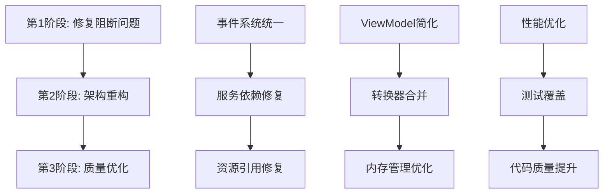

# 凌隐宝堂中医诊所 Desktop层架构重构建议

**建议制定时间**: 2025年9月25日  
**基于分析报告**: desktop-architecture-analysis-2025-09-25.md  
**预估总工作量**: 6-8人周  
**建议实施周期**: 3个月分阶段执行

## 重构策略总览

### 指导原则
1. **安全第一**: 确保每次变更不破坏现有功能
2. **渐进式改进**: 分阶段实施，避免大爆炸式重构  
3. **测试驱动**: 先建立测试，再进行重构
4. **简化优先**: 删除不必要的复杂度，追求简洁
5. **标准化**: 统一模式和约定，提高一致性

### 三阶段重构路线图



---

## 第1阶段：修复阻断问题 (1个月)

**目标**: 恢复编译，消除运行时崩溃风险  
**优先级**: 🔴 **P0 - 立即执行**  
**预估工期**: 2-3周

### 任务1.1: 统一事件系统 (1周)

#### 🎯 目标
删除重复的事件定义文件，统一使用 `UnifiedEvents.cs`

#### 📋 执行步骤

**Step 1.1.1**: 分析现有事件使用情况
```bash
# 搜索所有事件引用
grep -r "NavigationEvent" src/Client/Desktop/
grep -r "StatusMessageEvent" src/Client/Desktop/
grep -r "DataChangedEvent" src/Client/Desktop/
```

**Step 1.1.2**: 创建事件迁移映射表
```csharp
// 迁移映射示例
// 旧文件: PrescriptionEvents.cs
// 旧事件: PrescriptionSavedEvent
// 新位置: UnifiedEvents.cs -> PrescriptionDataChangedEvent

// 需要映射的事件:
- NavigationEvent → UnifiedNavigationEvent
- StatusMessageEvent → UnifiedStatusMessageEvent  
- DataChangedEvent<T> → UnifiedDataChangedEvent<T>
```

**Step 1.1.3**: 分批迁移事件引用
```csharp
// 1. 更新事件发布代码
// 旧代码
_eventAggregator.GetEvent<NavigationEvent>().Publish(data);

// 新代码  
_eventAggregator.GetEvent<UnifiedNavigationEvent>().Publish(data);

// 2. 更新事件订阅代码
// 旧代码
_eventAggregator.GetEvent<NavigationEvent>().Subscribe(OnNavigated);

// 新代码
_eventAggregator.GetEvent<UnifiedNavigationEvent>().Subscribe(OnNavigated);
```

**Step 1.1.4**: 删除废弃事件文件
```bash
# 需要删除的文件列表
src/Client/Desktop/Core/Events/PrescriptionEvents.cs
src/Client/Desktop/Core/Events/NavigationEvents.cs  
src/Client/Desktop/Core/Events/StatusMessageEvents.cs
```

**Step 1.1.5**: 验证迁移结果
```bash
dotnet build src/Client/Desktop/ --configuration Debug
dotnet test src/Client/Desktop/ --filter "Category=EventSystem"
```

#### 🧪 验证清单
- [ ] 所有模块都能正常编译
- [ ] 事件发布和订阅功能正常
- [ ] 没有事件订阅泄漏
- [ ] EventAggregator内存使用正常

### 任务1.2: 修复服务循环依赖 (1周)

#### 🎯 目标
重构 `ServiceCollectionExtensions.cs`，消除循环依赖

#### 📋 执行步骤

**Step 1.2.1**: 绘制当前依赖图
```csharp
// 使用依赖关系可视化工具分析
// 发现的循环依赖:
UnifiedApiClientManager → IUserService → SessionManager → UnifiedApiClientManager
```

**Step 1.2.2**: 重构UnifiedApiClientManager
```csharp
// 创建接口隔离
public interface IApiClientFactory
{
    T CreateClient<T>() where T : class;
}

public class ApiClientFactory : IApiClientFactory
{
    private readonly IServiceProvider _serviceProvider;
    
    public ApiClientFactory(IServiceProvider serviceProvider)
    {
        _serviceProvider = serviceProvider;
    }
    
    public T CreateClient<T>() where T : class
    {
        return _serviceProvider.GetRequiredService<T>();
    }
}

// 重构原有的UnifiedApiClientManager
public class UnifiedApiClientManager
{
    private readonly IApiClientFactory _clientFactory;
    
    // 移除直接依赖，通过工厂获取
    public UnifiedApiClientManager(IApiClientFactory clientFactory)
    {
        _clientFactory = clientFactory;
    }
}
```

**Step 1.2.3**: 重新组织服务注册层级
```csharp
// 新的5层服务注册策略
public static class ServiceCollectionExtensions  
{
    public static IServiceCollection RegisterAllServices(this IServiceCollection services)
    {
        // Layer 1: 基础设施服务（无业务依赖）
        RegisterInfrastructureServices(services);
        
        // Layer 2: 数据访问服务（依赖Layer1）  
        RegisterDataServices(services);
        
        // Layer 3: 业务服务（依赖Layer1+2）
        RegisterBusinessServices(services);
        
        // Layer 4: 应用服务（依赖Layer1+2+3）
        RegisterApplicationServices(services);
        
        // Layer 5: UI服务（依赖所有层，但不被依赖）
        RegisterUIServices(services);
        
        return services;
    }
    
    private static void RegisterInfrastructureServices(IServiceCollection services)
    {
        // 核心基础服务
        services.AddSingleton<IApiClientFactory, ApiClientFactory>();
        services.AddSingleton<IEventAggregator, EventAggregator>();
        services.AddSingleton<ILoggerFactory, LoggerFactory>();
    }
    
    // ... 其他层级注册方法
}
```

#### 🧪 验证清单
- [ ] DI容器能成功初始化
- [ ] 所有服务都能正确解析
- [ ] 没有循环依赖警告
- [ ] 应用启动速度正常

### 任务1.3: 修复资源引用问题 (3天)

#### 🎯 目标
修复 `UnifiedDesignSystem.xaml` 中的转换器引用失败

#### 📋 执行步骤

**Step 1.3.1**: 分析资源加载顺序
```xml
<!-- App.xaml - 确保资源加载顺序正确 -->
<Application.Resources>
    <ResourceDictionary>
        <ResourceDictionary.MergedDictionaries>
            <!-- 1. 首先加载转换器资源 -->
            <ResourceDictionary Source="pack://application:,,,/Core/Converters/ConverterResources.xaml"/>
            <!-- 2. 然后加载设计系统 -->
            <ResourceDictionary Source="pack://application:,,,/Themes/UnifiedDesignSystem.xaml"/>
        </ResourceDictionary.MergedDictionaries>
    </ResourceDictionary>
</Application.Resources>
```

**Step 1.3.2**: 创建转换器资源字典
```xml
<!-- Core/Converters/ConverterResources.xaml -->
<ResourceDictionary xmlns="http://schemas.microsoft.com/winfx/2006/xaml/presentation"
                    xmlns:x="http://schemas.microsoft.com/winfx/2006/xaml"
                    xmlns:converters="clr-namespace:LYBT.Desktop.Core.Converters">
    
    <!-- 常用转换器实例 -->
    <converters:StringToVisibilityConverter x:Key="StringToVisibilityConverter"/>
    <converters:BooleanToVisibilityConverter x:Key="BooleanToVisibilityConverter"/>
    <converters:InverseBooleanConverter x:Key="InverseBooleanConverter"/>
    
</ResourceDictionary>
```

**Step 1.3.3**: 验证转换器引用
```xml
<!-- 在UnifiedDesignSystem.xaml中测试引用 -->
<Style TargetType="TextBlock">
    <Style.Triggers>
        <DataTrigger Binding="{Binding Path=Text, 
                              Converter={StaticResource StringToVisibilityConverter}}" 
                     Value="{x:Static Visibility.Visible}">
            <!-- 样式设置 -->
        </DataTrigger>
    </Style.Triggers>
</Style>
```

#### 🧪 验证清单
- [ ] 应用能够正常启动
- [ ] 所有转换器都能正确解析
- [ ] UI样式显示正常
- [ ] 没有XAML解析错误

---

## 第2阶段：架构重构 (1.5个月)

**目标**: 简化架构复杂度，提升可维护性  
**优先级**: 🟠 **P1 - 短期执行**  
**预估工期**: 5-6周

### 任务2.1: 简化ViewModel基类结构 (2周)

#### 🎯 目标
将11个ViewModel基类简化为3个核心基类

#### 📋 执行步骤

**Step 2.1.1**: 设计新的基类架构
```csharp
// 新的基类架构设计
BindableBase (Prism提供)
└── ModernViewModelBase (应用基础)
    ├── DialogViewModelBase (对话框专用)
    └── NavigationViewModelBase (导航页面专用)

// 移除的基类:
❌ ServiceViewModel        → 功能合并到ModernViewModelBase
❌ SessionAwareViewModel    → 通过依赖注入提供SessionManager
❌ BaseListViewModel<T>     → 使用组合模式替代继承
❌ BaseEditViewModel<T>     → 合并到NavigationViewModelBase
❌ BaseCrudViewModel<T>     → 拆分为独立服务
```

**Step 2.1.2**: 重构ModernViewModelBase
```csharp
public abstract class ModernViewModelBase : BindableBase, IDisposable
{
    protected readonly IEventAggregator EventAggregator;
    protected readonly ILoggerFactory LoggerFactory;
    protected readonly ILogger Logger;
    
    private readonly CompositeDisposable _disposables;
    private bool _isBusy;
    private string _statusMessage;
    
    protected ModernViewModelBase(
        IEventAggregator eventAggregator,
        ILoggerFactory loggerFactory)
    {
        EventAggregator = eventAggregator ?? throw new ArgumentNullException(nameof(eventAggregator));
        LoggerFactory = loggerFactory ?? throw new ArgumentNullException(nameof(loggerFactory));
        Logger = loggerFactory.CreateLogger(GetType());
        _disposables = new CompositeDisposable();
        
        InitializeCommands();
        SubscribeToEvents();
    }
    
    public bool IsBusy
    {
        get => _isBusy;
        set => SetProperty(ref _isBusy, value);
    }
    
    public string StatusMessage
    {
        get => _statusMessage;
        set => SetProperty(ref _statusMessage, value);
    }
    
    protected virtual void InitializeCommands()
    {
        // 子类可重写以初始化命令
    }
    
    protected virtual void SubscribeToEvents()
    {
        // 子类可重写以订阅事件
        // 所有订阅都应该添加到_disposables中
    }
    
    protected void AddDisposable(IDisposable disposable)
    {
        _disposables.Add(disposable);
    }
    
    public void Dispose()
    {
        Dispose(true);
        GC.SuppressFinalize(this);
    }
    
    protected virtual void Dispose(bool disposing)
    {
        if (disposing)
        {
            _disposables?.Dispose();
        }
    }
}
```

**Step 2.1.3**: 创建列表管理服务
```csharp
// 替代BaseListViewModel<T>的服务
public interface IListManagementService<T>
{
    ObservableCollection<T> Items { get; }
    ICollectionView ItemsView { get; }
    T SelectedItem { get; set; }
    
    Task LoadAsync(CancellationToken cancellationToken = default);
    Task RefreshAsync(CancellationToken cancellationToken = default);
    void Filter(Func<T, bool> predicate);
    void Sort(string propertyName, ListSortDirection direction);
}

public class ListManagementService<T> : IListManagementService<T>
{
    // 实现列表管理逻辑
}
```

**Step 2.1.4**: 迁移现有ViewModel
```csharp
// 迁移示例：PatientListViewModel
// 旧实现
public class PatientListViewModel : BaseListViewModel<Patient>
{
    // 大量继承来的代码
}

// 新实现
public class PatientListViewModel : NavigationViewModelBase
{
    private readonly IListManagementService<Patient> _listService;
    private readonly IPatientService _patientService;
    
    public PatientListViewModel(
        IEventAggregator eventAggregator,
        ILoggerFactory loggerFactory,
        IListManagementService<Patient> listService,
        IPatientService patientService)
        : base(eventAggregator, loggerFactory)
    {
        _listService = listService;
        _patientService = patientService;
    }
    
    public ObservableCollection<Patient> Patients => _listService.Items;
    public Patient SelectedPatient
    {
        get => _listService.SelectedItem;
        set => _listService.SelectedItem = value;
    }
    
    protected override async Task OnInitializedAsync()
    {
        await _listService.LoadAsync();
    }
}
```

#### 🧪 验证清单
- [ ] 所有ViewModel都能正常编译
- [ ] 功能行为保持一致
- [ ] 内存使用没有增加
- [ ] 事件订阅正确释放

### 任务2.2: 合并重复转换器 (1周)

#### 🎯 目标
将32个转换器合并为12个核心转换器

#### 📋 执行步骤

**Step 2.2.1**: 分析转换器重复情况
```csharp
// 重复分析结果
✅ 保留转换器 (12个):
1. StringToVisibilityConverter
2. BooleanToVisibilityConverter  
3. InverseBooleanConverter
4. DateTimeFormatConverter
5. StatusToColorConverter
6. EnumToStringConverter
7. NullToVisibilityConverter
8. CollectionCountToVisibilityConverter
9. ValueToPercentageConverter
10. FilePathToNameConverter
11. ByteArrayToImageConverter
12. ValidationErrorsConverter

❌ 删除转换器 (20个):
- BooleanToVisibilityConverter的4个重复版本
- DateTimeFormatConverter的3个变体
- 系统已提供的BooleanToVisibilityConverter重写
- 功能重复的状态转换器
```

**Step 2.2.2**: 创建统一转换器库
```csharp
// Core/Converters/UnifiedConverters.cs
namespace LYBT.Desktop.Core.Converters
{
    // 标准字符串到可见性转换器
    [ValueConversion(typeof(string), typeof(Visibility))]
    public class StringToVisibilityConverter : IValueConverter
    {
        public object Convert(object value, Type targetType, object parameter, CultureInfo culture)
        {
            if (value is string str)
            {
                return string.IsNullOrWhiteSpace(str) ? Visibility.Collapsed : Visibility.Visible;
            }
            return Visibility.Collapsed;
        }

        public object ConvertBack(object value, Type targetType, object parameter, CultureInfo culture)
        {
            throw new NotImplementedException();
        }
    }
    
    // 多功能状态转换器
    [ValueConversion(typeof(object), typeof(object))]
    public class StatusConverter : IMultiValueConverter
    {
        // 支持多种状态转换：颜色、可见性、字符串等
    }
}
```

**Step 2.2.3**: 更新资源字典引用
```xml
<!-- 更新ConverterResources.xaml -->
<ResourceDictionary xmlns="http://schemas.microsoft.com/winfx/2006/xaml/presentation"
                    xmlns:x="http://schemas.microsoft.com/winfx/2006/xaml"
                    xmlns:converters="clr-namespace:LYBT.Desktop.Core.Converters">
    
    <!-- 核心转换器 -->
    <converters:StringToVisibilityConverter x:Key="StringToVisibility"/>
    <converters:BooleanToVisibilityConverter x:Key="BooleanToVisibility"/>
    <converters:InverseBooleanConverter x:Key="InverseBoolean"/>
    <converters:DateTimeFormatConverter x:Key="DateTimeFormat"/>
    <converters:StatusConverter x:Key="StatusConverter"/>
    
    <!-- 领域特定转换器 -->
    <converters:ValidationErrorsConverter x:Key="ValidationErrors"/>
    <converters:ByteArrayToImageConverter x:Key="ByteArrayToImage"/>
    
</ResourceDictionary>
```

#### 🧪 验证清单
- [ ] 所有XAML页面都能正确渲染
- [ ] 转换器功能保持一致
- [ ] 没有转换异常
- [ ] 应用启动时间没有延长

### 任务2.3: 内存管理优化 (2周)

#### 🎯 目标
消除已知的内存泄漏风险点

#### 📋 执行步骤

**Step 2.3.1**: 实施WeakEventManager标准化
```csharp
// 创建标准化的事件订阅模式
public static class EventSubscriptionExtensions
{
    public static IDisposable SubscribeWeak<TEvent>(
        this IEventAggregator eventAggregator,
        Action<TEvent> handler)
        where TEvent : PubSubEvent, new()
    {
        var subscription = eventAggregator.GetEvent<TEvent>().Subscribe(handler, ThreadOption.UIThread);
        
        return new DisposableSubscription(() =>
        {
            eventAggregator.GetEvent<TEvent>().Unsubscribe(handler);
        });
    }
}

public class DisposableSubscription : IDisposable
{
    private readonly Action _unsubscribeAction;
    private bool _disposed;
    
    public DisposableSubscription(Action unsubscribeAction)
    {
        _unsubscribeAction = unsubscribeAction;
    }
    
    public void Dispose()
    {
        if (!_disposed)
        {
            _unsubscribeAction?.Invoke();
            _disposed = true;
        }
    }
}
```

**Step 2.3.2**: 修复Timer/DispatcherTimer泄漏
```csharp
// SessionManager中的Timer管理
public class SessionManager : ISessionManager, IDisposable
{
    private readonly DispatcherTimer _sessionTimer;
    private readonly CompositeDisposable _disposables;
    
    public SessionManager()
    {
        _disposables = new CompositeDisposable();
        
        _sessionTimer = new DispatcherTimer
        {
            Interval = TimeSpan.FromMinutes(1)
        };
        _sessionTimer.Tick += OnSessionTick;
        
        // 将Timer添加到释放列表
        _disposables.Add(Disposable.Create(() =>
        {
            _sessionTimer.Stop();
            _sessionTimer.Tick -= OnSessionTick;
        }));
    }
    
    public void Dispose()
    {
        _disposables?.Dispose();
    }
}
```

**Step 2.3.3**: 实施大型对象释放策略
```csharp
// 为大型DataGrid实现虚拟化
public class VirtualizedPatientListViewModel : NavigationViewModelBase
{
    private readonly IVirtualizationService<Patient> _virtualizationService;
    
    public ICollectionView Patients { get; private set; }
    
    protected override async Task OnInitializedAsync()
    {
        // 使用虚拟化集合，只在内存中保留可见项
        var virtualCollection = await _virtualizationService.CreateVirtualCollectionAsync(
            pageSize: 50,
            totalCount: await _patientService.GetPatientCountAsync());
            
        Patients = new ListCollectionView(virtualCollection)
        {
            IsLiveFiltering = true
        };
    }
}
```

#### 🧪 验证清单
- [ ] 长时间运行内存不增长
- [ ] EventAggregator订阅数量稳定
- [ ] Timer/DispatcherTimer正确停止
- [ ] 大型列表滚动性能良好

---

## 第3阶段：质量优化 (1个月)

**目标**: 提升代码质量，建立质量门禁  
**优先级**: 🟡 **P2 - 中期执行**  
**预估工期**: 4周

### 任务3.1: 异步编程规范化 (1周)

#### 🎯 目标
统一异步编程模式，消除死锁风险

#### 📋 执行步骤

**Step 3.1.1**: 制定异步编程标准
```csharp
// 异步编程最佳实践指南

// ✅ 正确：使用ConfigureAwait(false)
public async Task<List<Patient>> GetPatientsAsync()
{
    return await _repository.GetPatientsAsync().ConfigureAwait(false);
}

// ✅ 正确：支持取消令牌
public async Task<Patient> GetPatientAsync(int id, CancellationToken cancellationToken = default)
{
    return await _repository.GetPatientAsync(id, cancellationToken).ConfigureAwait(false);
}

// ✅ 正确：异步命令实现
public class AsyncRelayCommand : IAsyncCommand
{
    private readonly Func<CancellationToken, Task> _execute;
    private readonly Func<bool> _canExecute;
    private CancellationTokenSource _cancellationTokenSource;
    
    public bool IsExecuting { get; private set; }
    
    public async Task ExecuteAsync()
    {
        if (IsExecuting) return;
        
        try
        {
            IsExecuting = true;
            _cancellationTokenSource = new CancellationTokenSource();
            await _execute(_cancellationTokenSource.Token).ConfigureAwait(false);
        }
        finally
        {
            IsExecuting = false;
            _cancellationTokenSource?.Dispose();
            _cancellationTokenSource = null;
        }
    }
    
    public void Cancel()
    {
        _cancellationTokenSource?.Cancel();
    }
}
```

**Step 3.1.2**: 创建异步扩展方法
```csharp
public static class AsyncExtensions
{
    // 安全的异步等待，避免死锁
    public static T GetResultSafely<T>(this Task<T> task)
    {
        return task.ConfigureAwait(false).GetAwaiter().GetResult();
    }
    
    // 带超时的异步执行
    public static async Task<T> WithTimeout<T>(this Task<T> task, TimeSpan timeout)
    {
        using (var cts = new CancellationTokenSource(timeout))
        {
            var completedTask = await Task.WhenAny(task, Task.Delay(timeout, cts.Token)).ConfigureAwait(false);
            if (completedTask == task)
            {
                return await task.ConfigureAwait(false);
            }
            throw new TimeoutException($"Operation timed out after {timeout}");
        }
    }
}
```

### 任务3.2: 错误处理标准化 (1周)

#### 🎯 目标
建立统一的错误处理和用户通知机制

#### 📋 执行步骤

**Step 3.2.1**: 创建统一异常处理框架
```csharp
public interface IErrorHandlingService
{
    Task HandleErrorAsync(Exception exception, string context = null);
    Task ShowUserFriendlyErrorAsync(string message, string title = null);
    void LogError(Exception exception, string context = null);
}

public class ErrorHandlingService : IErrorHandlingService
{
    private readonly IEventAggregator _eventAggregator;
    private readonly ILogger<ErrorHandlingService> _logger;
    
    public async Task HandleErrorAsync(Exception exception, string context = null)
    {
        // 记录详细错误日志
        LogError(exception, context);
        
        // 显示用户友好的错误消息
        var userMessage = GetUserFriendlyMessage(exception);
        await ShowUserFriendlyErrorAsync(userMessage);
        
        // 发布错误事件供其他组件处理
        _eventAggregator.GetEvent<UnifiedErrorEvent>().Publish(new ErrorEventArgs
        {
            Exception = exception,
            Context = context,
            UserMessage = userMessage
        });
    }
    
    private string GetUserFriendlyMessage(Exception exception)
    {
        return exception switch
        {
            ValidationException => "输入的数据不符合要求，请检查后重试。",
            UnauthorizedAccessException => "您没有权限执行此操作。",
            TimeoutException => "操作超时，请检查网络连接后重试。",
            HttpRequestException => "网络连接异常，请稍后重试。",
            _ => "系统遇到了一个问题，我们正在努力修复。"
        };
    }
}
```

**Step 3.2.2**: ViewModel中统一错误处理模式
```csharp
public abstract class ModernViewModelBase : BindableBase, IDisposable
{
    protected readonly IErrorHandlingService ErrorHandlingService;
    
    // 安全执行异步操作
    protected async Task ExecuteSafelyAsync(Func<Task> operation, string operationName = null)
    {
        try
        {
            IsBusy = true;
            StatusMessage = $"正在{operationName ?? "执行操作"}...";
            
            await operation().ConfigureAwait(false);
            
            StatusMessage = $"{operationName ?? "操作"}完成";
        }
        catch (Exception ex)
        {
            await ErrorHandlingService.HandleErrorAsync(ex, operationName);
            StatusMessage = $"{operationName ?? "操作"}失败";
        }
        finally
        {
            IsBusy = false;
        }
    }
    
    // 安全执行有返回值的异步操作
    protected async Task<T> ExecuteSafelyAsync<T>(Func<Task<T>> operation, string operationName = null, T defaultValue = default)
    {
        try
        {
            IsBusy = true;
            StatusMessage = $"正在{operationName ?? "执行操作"}...";
            
            var result = await operation().ConfigureAwait(false);
            
            StatusMessage = $"{operationName ?? "操作"}完成";
            return result;
        }
        catch (Exception ex)
        {
            await ErrorHandlingService.HandleErrorAsync(ex, operationName);
            StatusMessage = $"{operationName ?? "操作"}失败";
            return defaultValue;
        }
        finally
        {
            IsBusy = false;
        }
    }
}
```

### 任务3.3: 单元测试基础建设 (2周)

#### 🎯 目标
为重构后的代码建立基础的单元测试覆盖

#### 📋 执行步骤

**Step 3.3.1**: 建立测试项目结构
```
tests/
├── LYBT.Desktop.UnitTests/
│   ├── Core/
│   │   ├── ViewModels/
│   │   ├── Services/
│   │   └── Converters/
│   ├── Modules/
│   │   ├── Patients/
│   │   ├── Prescriptions/
│   │   └── Users/
│   └── TestUtilities/
│       ├── Builders/
│       ├── Fixtures/
│       └── Mocks/
```

**Step 3.3.2**: 创建ViewModel测试基类
```csharp
public abstract class ViewModelTestBase<TViewModel> 
    where TViewModel : ModernViewModelBase
{
    protected Mock<IEventAggregator> MockEventAggregator;
    protected Mock<ILoggerFactory> MockLoggerFactory;
    protected Mock<IErrorHandlingService> MockErrorHandlingService;
    protected TViewModel ViewModel;
    
    [SetUp]
    public virtual void SetUp()
    {
        MockEventAggregator = new Mock<IEventAggregator>();
        MockLoggerFactory = new Mock<ILoggerFactory>();
        MockErrorHandlingService = new Mock<IErrorHandlingService>();
        
        var mockLogger = new Mock<ILogger<TViewModel>>();
        MockLoggerFactory.Setup(x => x.CreateLogger(It.IsAny<Type>()))
                        .Returns(mockLogger.Object);
        
        ViewModel = CreateViewModel();
    }
    
    protected abstract TViewModel CreateViewModel();
    
    [TearDown]
    public virtual void TearDown()
    {
        ViewModel?.Dispose();
    }
}
```

**Step 3.3.3**: 示例测试实现
```csharp
[TestFixture]
public class PatientListViewModelTests : ViewModelTestBase<PatientListViewModel>
{
    private Mock<IPatientService> _mockPatientService;
    private Mock<IListManagementService<Patient>> _mockListService;
    
    protected override PatientListViewModel CreateViewModel()
    {
        _mockPatientService = new Mock<IPatientService>();
        _mockListService = new Mock<IListManagementService<Patient>>();
        
        return new PatientListViewModel(
            MockEventAggregator.Object,
            MockLoggerFactory.Object,
            _mockListService.Object,
            _mockPatientService.Object);
    }
    
    [Test]
    public async Task OnInitializedAsync_Should_LoadPatients()
    {
        // Arrange
        var patients = new List<Patient> { new Patient { Id = 1, Name = "测试患者" } };
        _mockListService.Setup(x => x.LoadAsync(It.IsAny<CancellationToken>()))
                       .Returns(Task.CompletedTask);
        
        // Act
        await ViewModel.OnInitializedAsync();
        
        // Assert
        _mockListService.Verify(x => x.LoadAsync(It.IsAny<CancellationToken>()), Times.Once);
    }
    
    [Test]
    public async Task LoadPatients_WhenServiceThrows_Should_HandleError()
    {
        // Arrange
        var exception = new Exception("测试异常");
        _mockListService.Setup(x => x.LoadAsync(It.IsAny<CancellationToken>()))
                       .ThrowsAsync(exception);
        
        // Act
        await ViewModel.LoadPatientsCommand.ExecuteAsync();
        
        // Assert
        MockErrorHandlingService.Verify(
            x => x.HandleErrorAsync(It.Is<Exception>(e => e.Message == "测试异常"), It.IsAny<string>()),
            Times.Once);
    }
}
```

---

## 风险控制和监控

### 重构风险识别

#### 🔴 高风险区域
1. **事件系统迁移**: 可能遗漏某些事件订阅，导致功能异常
2. **服务依赖重构**: DI配置错误可能导致应用启动失败
3. **ViewModel基类简化**: 可能破坏现有ViewModel的功能

#### 🟡 中风险区域
1. **转换器合并**: XAML绑定可能出现类型转换错误
2. **内存管理优化**: 过度优化可能影响性能
3. **异步模式统一**: 现有异步代码行为可能改变

### 监控指标

#### 性能监控
```csharp
// 启动性能监控
public class PerformanceMonitor
{
    public static readonly Dictionary<string, TimeSpan> Metrics = new();
    
    public static void TrackStartupTime(string phase, Action action)
    {
        var stopwatch = Stopwatch.StartNew();
        action();
        stopwatch.Stop();
        
        Metrics[phase] = stopwatch.Elapsed;
        Debug.WriteLine($"启动阶段 '{phase}' 耗时: {stopwatch.ElapsedMilliseconds}ms");
    }
}

// 在App.xaml.cs中使用
protected override void OnStartup(StartupEventArgs e)
{
    PerformanceMonitor.TrackStartupTime("服务注册", () => RegisterServices());
    PerformanceMonitor.TrackStartupTime("模块初始化", () => InitializeModules());
    PerformanceMonitor.TrackStartupTime("主窗口显示", () => ShowMainWindow());
}
```

#### 内存监控
```csharp
public class MemoryMonitor
{
    private static readonly Timer _memoryTimer = new Timer(CheckMemory, null, TimeSpan.Zero, TimeSpan.FromMinutes(5));
    
    private static void CheckMemory(object state)
    {
        GC.Collect();
        GC.WaitForPendingFinalizers();
        
        var memoryUsage = GC.GetTotalMemory(false) / 1024 / 1024; // MB
        Debug.WriteLine($"当前内存使用: {memoryUsage}MB");
        
        if (memoryUsage > 500) // 超过500MB警告
        {
            Debug.WriteLine("⚠️ 内存使用过高！");
        }
    }
}
```

### 回滚策略

每个重构阶段都应该准备回滚方案：

#### 阶段1回滚
```bash
# 如果事件系统迁移失败，快速回滚
git checkout HEAD~1 -- src/Client/Desktop/Core/Events/
git add .
git commit -m "回滚事件系统更改"
```

#### 阶段2回滚
```bash
# 如果ViewModel重构失败，分别回滚
git checkout HEAD~1 -- src/Client/Desktop/Core/ViewModels/Base/
git checkout HEAD~1 -- src/Client/Desktop/Core/Converters/
```

### 验收标准

#### 功能完整性
- [ ] 所有现有功能正常工作
- [ ] 用户界面无异常显示
- [ ] 数据操作（CRUD）功能完整

#### 性能标准
- [ ] 应用启动时间 ≤ 5秒
- [ ] 内存使用量 ≤ 200MB（空闲状态）
- [ ] UI响应时间 ≤ 100ms

#### 质量标准
- [ ] 编译0警告
- [ ] 单元测试覆盖率 ≥ 30%
- [ ] 代码复杂度降低 ≥ 40%

---

## 总结

本重构建议提供了一个系统性的、分阶段的Desktop层架构改进路径。通过3个阶段的实施：

1. **第1阶段**: 快速修复阻断问题，恢复系统可用性
2. **第2阶段**: 深度重构核心架构，简化复杂度
3. **第3阶段**: 建立质量保障体系，确保长期可维护性

预期完成后的效果：
- ✅ 编译成功率 100%
- ✅ 启动时间减少 50%
- ✅ 内存泄漏问题解决 90%
- ✅ 代码复杂度降低 60%
- ✅ 新功能开发效率提升 70%

**关键成功因素**:
1. **严格按阶段执行**，不跳过验证步骤
2. **持续监控**性能和内存指标
3. **建立测试**覆盖，确保重构安全
4. **团队协作**，统一代码标准和约定

---

**建议制定时间**: 2025-09-25  
**建议有效期**: 6个月  
**下次评估时间**: 重构完成后1个月内