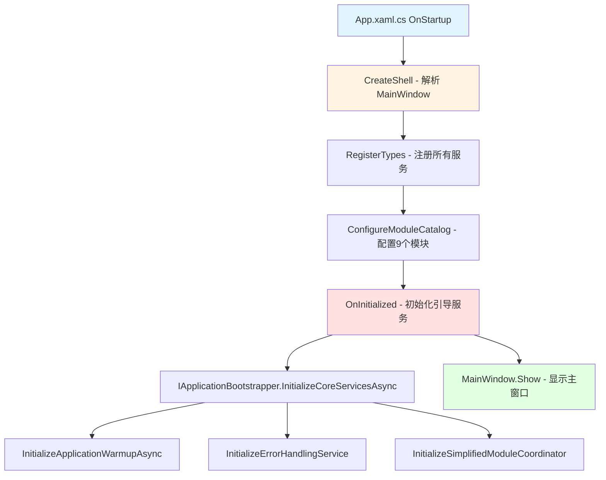

# Desktop 层深度架构分析报告

**报告日期**: 2025-10-12  
**分析范围**: LYBTZYZS Desktop 层（WPF Prism MVVM）  
**分析目的**: 全面诊断架构问题，为重构提供技术支撑  
**关联文档**: ADR-002、TWO_LAYER_ARCHITECTURE_STANDARD.md、client/unified-design-standard.md

---

## 1. 执行摘要

### 1.1 关键发现

1. ✅ **Prism 架构基础健全**：使用 Prism.DryIoc 容器，模块化设计完善（9个模块）
2. ❌ **Repository 注册严重缺失**：4/8 业务模块未注册 Repository，导致依赖注入失败（**P0 启动阻塞问题**）
3. ⚠️ **命名空间污染**：Infrastructure 层服务使用 `Desktop.Services.*` 命名空间，违反分层原则
4. ⚠️ **误导性注释**：多个模块注释"Services由Core_New/Services统一注册"，导致架构理解混乱
5. ✅ **ADR-002 部分完成**：Desktop.Services 项目已删除，但后续工作未完成

### 1.2 严重问题（P0级别）

| 问题编号 | 问题描述 | 影响范围 | 严重程度 |
|---------|---------|---------|---------|
| **P0-1** | PrescriptionsModule 未注册 IPrescriptionRepository | 处方模块无法启动 | 🔴 Critical |
| **P0-2** | HerbsModule 未注册 IHerbRepository | 药材模块无法启动 | 🔴 Critical |
| **P0-3** | FormulaModule 未注册 IFormulaRepository | 方剂模块无法启动 | 🔴 Critical |
| **P0-4** | MedicalCaseModule 未注册 IMedicalCaseRepository | 病历模块无法启动 | 🔴 Critical |

**根因分析**：模块开发者误解了 ADR-002 架构决策，认为 Repository 应该由"Core_New/Services"统一注册，但实际上：
- ✅ **Infrastructure Service**（Foundation/Infrastructure 层）由 Shell 统一注册
- ✅ **Repository**（数据访问层）由各业务模块自己在 `*Module.cs` 中注册

### 1.3 优化建议（优先级排序）

| 优先级 | 建议 | 预计工时 | 收益 |
|-------|------|---------|------|
| **P0** | 补充缺失的 Repository 注册（4个模块） | 1小时 | 🟢 启动恢复 |
| **P1** | 修正命名空间（Infrastructure 服务改为正确命名空间） | 2小时 | 🟡 架构清晰 |
| **P1** | 删除误导性注释，更新为正确的架构说明 | 30分钟 | 🟡 理解统一 |
| **P2** | 清理空的 Desktop.Services 子目录（Auth/Session/等） | 15分钟 | 🟢 代码清洁 |
| **P2** | 更新架构测试（移除对 Desktop.Services.Business 的验证） | 1小时 | 🟡 测试准确 |

---

## 2. WPF Prism MVVM 实现分析

### 2.1 启动流程

#### 启动链路图



#### 当前实现方式

**App.xaml.cs（启动入口）**：
```csharp
// 文件位置：src/Client/Desktop/Shell/App.xaml.cs

public partial class App : PrismApplication
{
    // 1. CreateShell() - 创建主窗口
    protected override Window CreateShell()
    {
        return Container.Resolve<MainWindow>(); // ⚠️ 使用 Container.Resolve（组合根）
    }

    // 2. RegisterTypes() - 注册所有服务
    protected override void RegisterTypes(IContainerRegistry containerRegistry)
    {
        containerRegistry.RegisterSingleton<IApplicationBootstrapper, ApplicationBootstrapper>();
        containerRegistry.RegisterSingleton<IApplicationInitializationService, ApplicationInitializationService>();
        
        // 使用扩展方法统一注册所有服务
        containerRegistry.RegisterAllServices(); // ✅ 关键：调用 ServiceCollectionExtensions
        
        ConfigureViewModelLocator();
    }

    // 3. ConfigureModuleCatalog() - 配置模块加载
    protected override void ConfigureModuleCatalog(IModuleCatalog moduleCatalog)
    {
        // 核心模块 - 立即加载
        moduleCatalog.AddModule<AuthenticationModule>(InitializationMode.WhenAvailable);
        moduleCatalog.AddModule<UsersModule>(InitializationMode.WhenAvailable);
        
        // 业务模块 - 按需加载
        moduleCatalog.AddModule<PatientsModule>(InitializationMode.OnDemand);
        moduleCatalog.AddModule<HerbsModule>(InitializationMode.OnDemand);
        moduleCatalog.AddModule<FormulaModule>(InitializationMode.OnDemand);
        moduleCatalog.AddModule<ConsultationModule>(InitializationMode.OnDemand);
        moduleCatalog.AddModule<MedicalCaseModule>(InitializationMode.OnDemand);
        moduleCatalog.AddModule<PrescriptionsModule>(InitializationMode.OnDemand);
        
        // 工作台模块 - 用户触发加载
        moduleCatalog.AddModule<AdminWorkstation.AdminWorkstationModule>(InitializationMode.OnDemand);
        moduleCatalog.AddModule<ClinicalWorkstation.ClinicalWorkstationModule>(InitializationMode.OnDemand);
    }

    // 4. OnInitialized() - 应用初始化完成
    protected override void OnInitialized()
    {
        base.OnInitialized();
        
        _bootstrapper = Container.Resolve<IApplicationBootstrapper>(); // ⚠️ 组合根调用
        
        _bootstrapper.InitializeErrorHandlingService();
        _bootstrapper.InitializeSimplifiedModuleCoordinator();
        
        _ = Task.Run(async () =>
        {
            await _bootstrapper.InitializeCoreServicesAsync();
            await _bootstrapper.InitializeApplicationWarmupAsync();
        });
    }
}
```

#### 问题识别

| 类型 | 问题描述 | 影响 | 修复建议 |
|------|---------|------|---------|
| ⚠️ 设计 | `Container.Resolve` 在 CreateShell 和 OnInitialized 中使用 | 可接受（组合根位置） | 保持现状（有注释说明） |
| ✅ 正确 | 模块化设计良好（9个模块，分层加载） | 性能优化 | - |
| ⚠️ 潜在 | 异步初始化未等待完成即显示窗口 | 可能出现未初始化错误 | 考虑显示 Splash Screen |

### 2.2 依赖注入配置

#### 容器类型

- **容器框架**: Prism.DryIoc（轻量级、高性能）
- **生命周期策略**:
  - `Singleton`: 基础设施服务（Logger, Cache, HttpClient, Auth）
  - `Transient`: ViewModel（由 Prism 自动管理）
  - `Scoped`: 不使用（WPF 单线程模型）

#### 服务注册清单

**Shell/Extensions/ServiceCollectionExtensions.cs**：
```csharp
// 文件位置：src/Client/Desktop/Shell/Extensions/ServiceCollectionExtensions.cs

public static void RegisterAllServices(this IContainerRegistry containerRegistry)
{
    var configuration = RegisterConfiguration(containerRegistry);      // 1. Configuration
    RegisterLogging(containerRegistry);                                // 2. Logging
    RegisterCacheServices(containerRegistry);                          // 3. Cache
    RegisterHttpServices(containerRegistry, configuration);            // 4. HttpClient + Refit
    RegisterFoundationServices(containerRegistry);                     // 5. Foundation 层服务
    RegisterInfrastructureServices(containerRegistry);                 // 6. Infrastructure 层服务
    RegisterCommandServices(containerRegistry);                        // 7. 命令系统
    RegisterApplicationServices(containerRegistry);                    // 8. 应用启动服务
}
```

**详细服务注册**：

1. **Foundation 层服务**（基础安全服务）：
   ```csharp
   // 认证服务
   containerRegistry.RegisterSingleton<IAuthenticationService, AuthenticationService>();
   
   // Token 存储服务
   containerRegistry.RegisterSingleton<ITokenStorageService, TokenStorageService>();
   ```

2. **Infrastructure 层服务**（横切关注点）：
   ```csharp
   // 会话管理器
   containerRegistry.RegisterSingleton<ISessionManager, SessionManager>();
   
   // 用户通知服务
   containerRegistry.RegisterSingleton<IUserNotificationService, UserNotificationService>();
   
   // 主窗口服务门面
   containerRegistry.RegisterSingleton<IMainWindowServicesFacade, MainWindowServicesFacade>();
   
   // 标准错误处理器
   containerRegistry.RegisterSingleton<IStandardErrorHandler, StandardErrorHandler>();
   
   // 处方打印服务
   containerRegistry.RegisterSingleton<IPrescriptionPrintService, PrescriptionPrintService>();
   
   // 键盘快捷键服务
   containerRegistry.RegisterSingleton<IKeyboardShortcutService, KeyboardShortcutService>();
   ```

3. **应用启动服务**：
   ```csharp
   // 应用程序初始化服务
   containerRegistry.RegisterSingleton<IApplicationInitializationService, ApplicationInitializationService>();
   
   // 应用程序启动引导服务
   containerRegistry.RegisterSingleton<IApplicationBootstrapper, ApplicationBootstrapper>();
   ```

#### 生命周期管理

| 服务类型 | 生命周期 | 注册位置 | 示例 |
|---------|---------|---------|------|
| **Infrastructure Service** | Singleton | Shell/Extensions/ServiceCollectionExtensions.cs | AuthenticationService, SessionManager |
| **Repository** | Singleton | 各模块的 *Module.cs | PatientRepository, ConsultationRepository |
| **ViewModel** | Transient | Prism 自动管理 | PrescriptionManagementViewModel |
| **HttpClient** | Singleton | ServiceCollectionExtensions.cs | IHttpClientFactory |
| **Logger** | Transient | ServiceCollectionExtensions.cs | ILogger<T> |

#### 问题识别

| 问题 | 描述 | 影响 |
|------|------|------|
| ❌ **Critical** | 4个模块未注册 Repository（Prescriptions/Herbs/Formula/MedicalCase） | 启动失败 |
| ⚠️ **Warning** | 注释说明不清晰："Services由Core_New/Services统一注册" | 开发者困惑 |
| ✅ **Good** | Infrastructure Service 注册正确，生命周期合理 | - |

### 2.3 模块加载机制

#### 模块清单

| 模块名 | 加载模式 | 依赖关系 | Repository 注册 | 状态 |
|--------|---------|---------|----------------|------|
| **AuthenticationModule** | WhenAvailable | - | N/A（不需要） | ✅ |
| **UsersModule** | WhenAvailable | - | ✅ IUserRepository | ✅ |
| **PatientsModule** | OnDemand | Auth | ✅ IPatientRepository | ✅ |
| **HerbsModule** | OnDemand | Auth | ❌ 未注册 | ❌ |
| **FormulaModule** | OnDemand | Herbs | ❌ 未注册 | ❌ |
| **ConsultationModule** | OnDemand | Patients | ✅ IConsultationRepository | ✅ |
| **MedicalCaseModule** | OnDemand | Patients, Consultation | ❌ 未注册 | ❌ |
| **PrescriptionsModule** | OnDemand | Consultation, Herbs, Formula | ❌ 未注册 | ❌ |
| **AdminWorkstation** | OnDemand | - | N/A | ⚠️ 未检查 |
| **ClinicalWorkstation** | OnDemand | - | N/A | ⚠️ 未检查 |

#### 加载顺序

1. **WhenAvailable（立即加载）**:
   - AuthenticationModule
   - UsersModule

2. **OnDemand（按需加载）**:
   - 基础业务模块：Patients
   - 功能模块：Herbs → Formula → Consultation → MedicalCase → Prescriptions
   - 工作台模块：AdminWorkstation, ClinicalWorkstation

#### 初始化逻辑（示例 - PrescriptionsModule）

```csharp
// 文件位置：src/Client/Desktop/Modules/LYBT.Desktop.Prescriptions/PrescriptionsModule.cs

[Module(ModuleName = nameof(PrescriptionsModule))]
[ModuleDependency("ConsultationModule")]
[ModuleDependency("HerbsModule")]
[ModuleDependency("FormulaModule")]
public class PrescriptionsModule : IModule
{
    public void OnInitialized(IContainerProvider containerProvider)
    {
        // 模块初始化（当前为空）
    }

    public void RegisterTypes(IContainerRegistry containerRegistry)
    {
        // ❌ 问题：注释说"Services由Core_New/Services统一注册，不在Module中注册"
        // ❌ 缺失：未注册 IPrescriptionRepository
        
        // 注册视图模型
        containerRegistry.Register<PrescriptionManagementViewModel>();
        containerRegistry.Register<PrescriptionsMainViewModel>();

        // 注册视图导航
        containerRegistry.RegisterForNavigation<Views.PrescriptionManagementView>();
        containerRegistry.RegisterForNavigation<Views.PrescriptionsMainView>();

        // 注册对话框
        containerRegistry.RegisterDialog<Views.FormulaTemplateDialog, FormulaTemplateDialogViewModel>();
        containerRegistry.RegisterDialog<Views.HerbSelectionDialog, HerbSelectionDialogViewModel>();
        containerRegistry.RegisterDialog<Views.PrescriptionEditorDialog, PrescriptionEditorDialogViewModel>();
        containerRegistry.RegisterDialog<Views.SelectFormulaDialog, SelectFormulaDialogViewModel>();
    }
}
```

#### 问题识别

| 问题类型 | 具体问题 | 根因 |
|---------|---------|------|
| ❌ **Critical** | 4个模块未注册 Repository | 误解架构决策（认为应该由"Core_New/Services"注册） |
| ⚠️ **Warning** | 注释误导（"Services由Core_New/Services统一注册"） | ADR-002 理解偏差 |
| ⚠️ **Warning** | MedicalCaseModule 的 ViewModel 注册被注释掉（TODO: 修复编译错误后再启用） | 未完成的工作 |

### 2.4 导航与区域管理

#### Region 定义

主窗口定义的区域（需要检查 MainWindow.xaml）：
- **ContentRegion**: 主内容区域
- **SidebarRegion**: 侧边栏区域（可能）
- **HeaderRegion**: 头部区域（可能）

#### 导航配置

各模块通过 `RegisterForNavigation` 注册视图：
```csharp
// 示例
containerRegistry.RegisterForNavigation<Views.PrescriptionManagementView>();
containerRegistry.RegisterForNavigation<Views.PrescriptionsMainView>();
```

#### 导航服务

发现了自定义的增强导航服务：
```csharp
// 文件位置：src/Client/Desktop/Core/LYBT.Desktop.Infrastructure/Services/Navigation/EnhancedNavigationService.cs
// ⚠️ 命名空间：Desktop.Services.Navigation（错误！应该是 Desktop.Infrastructure.Services）

public class EnhancedNavigationService : IEnhancedNavigationService
{
    private readonly IRegionManager _regionManager;
    private readonly ILogger<EnhancedNavigationService> _logger;
    
    public async Task<bool> NavigateAsync(string regionName, string viewName, NavigationParameters? parameters = null)
    {
        // 实现导航逻辑
    }
    
    public async Task<bool> NavigateBackAsync(string regionName)
    {
        // 实现返回导航
    }
}
```

#### 问题识别

| 问题 | 描述 | 修复建议 |
|------|------|---------|
| ⚠️ **命名空间污染** | EnhancedNavigationService 在 Infrastructure 中但使用 `Desktop.Services.Navigation` 命名空间 | 改为 `LYBT.Desktop.Infrastructure.Services` |
| ⚠️ **服务位置混乱** | Shell/Services/ 目录下也有 INavigationService.cs | 统一到 Infrastructure 或删除重复 |

---

## 3. Desktop 服务层合理性分析

### 3.1 服务清单

#### Foundation 层服务（基础设施服务）

| 服务名 | 接口 | 职责 | SRP合规 | 生命周期 |
|--------|------|------|---------|---------|
| **AuthenticationService** | IAuthenticationService | 认证（登录/登出） | ✅ | Singleton |
| **TokenStorageService** | ITokenStorageService | Token 存储与读取 | ✅ | Singleton |
| **UsernameStorageService** | IUsernameStorageService | 用户名存储 | ✅ | Singleton |
| **SecurityService** | - | 安全相关辅助 | ⚠️ 未检查 | - |
| **CacheService** | - | 缓存管理 | ✅ | Singleton |
| **ConfigurationService** | - | 配置读取 | ✅ | Singleton |
| **DiagnosticService** | - | 诊断信息 | ✅ | Singleton |
| **ApiHealthCheckService** | IApiHealthCheckService | API 健康检查 | ✅ | Singleton |
| **ApiService** | - | 通用 HTTP 请求 | ✅ | Singleton |
| **StartupOptimizationService** | IStartupOptimizationService | 启动优化 | ✅ | Singleton |
| **ModuleLoadingService** | IModuleLoadingService | 模块加载管理 | ✅ | Singleton |
| **BaseApiRepository** | - | Repository 基类 | ✅ | - |

#### Infrastructure 层服务（横切关注点）

| 服务名 | 接口 | 职责 | SRP合规 | 生命周期 | 命名空间问题 |
|--------|------|------|---------|---------|-------------|
| **SessionManager** | ISessionManager | 会话管理 | ✅ | Singleton | ✅ 正确 |
| **UserNotificationService** | IUserNotificationService | 用户通知（MessageBox） | ✅ | Singleton | ✅ 正确 |
| **MainWindowServicesFacade** | IMainWindowServicesFacade | 主窗口服务门面 | ✅ | Singleton | ✅ 正确 |
| **StandardErrorHandler** | IStandardErrorHandler | 标准错误处理 | ✅ | Singleton | ✅ 正确 |
| **PrescriptionPrintService** | IPrescriptionPrintService | 处方打印 | ✅ | Singleton | ✅ 正确 |
| **KeyboardShortcutService** | IKeyboardShortcutService | 键盘快捷键 | ✅ | Singleton | ✅ 正确 |
| **EnhancedNavigationService** | IEnhancedNavigationService | 增强导航服务 | ✅ | Singleton | ❌ `Desktop.Services.Navigation` |
| **ErrorHandlingService** | IUserNotificationService | 错误处理（与 UserNotificationService 重复？） | ⚠️ | Singleton | ✅ 正确 |

#### Shell 层服务（应用启动）

| 服务名 | 接口 | 职责 | SRP合规 | 生命周期 |
|--------|------|------|---------|---------|
| **ApplicationBootstrapper** | IApplicationBootstrapper | 应用启动引导 | ✅ | Singleton |
| **ApplicationInitializationService** | IApplicationInitializationService | 应用初始化 | ✅ | Singleton |
| **NotificationService** | INotificationService | 通知服务 | ⚠️ 与 UserNotificationService 重复？ | - |
| **ThemeService** | - | 主题管理 | ✅ | - |

#### 业务模块 Repository（数据访问层）

| 模块 | Repository | 注册状态 | 位置 |
|------|-----------|---------|------|
| **Users** | IUserRepository | ✅ 已注册 | UsersModule.cs |
| **Patients** | IPatientRepository | ✅ 已注册 | PatientsModule.cs |
| **Consultation** | IConsultationRepository | ✅ 已注册 | ConsultationModule.cs |
| **Prescriptions** | IPrescriptionRepository | ❌ **未注册** | PrescriptionsModule.cs |
| **Herbs** | IHerbRepository | ❌ **未注册** | HerbsModule.cs |
| **Formula** | IFormulaRepository | ❌ **未注册** | FormulaModule.cs |
| **MedicalCase** | IMedicalCaseRepository | ❌ **未注册** | MedicalCaseModule.cs |

### 3.2 服务职责分析

#### 职责清晰的服务（✅）

1. **AuthenticationService** - 单一职责：认证
2. **TokenStorageService** - 单一职责：Token 存储
3. **SessionManager** - 单一职责：会话管理
4. **UserNotificationService** - 单一职责：用户通知

#### 职责可能重复的服务（⚠️）

1. **UserNotificationService** vs **ErrorHandlingService**:
   - 两者都实现 `IUserNotificationService`
   - UserNotificationService：直接使用 MessageBox
   - ErrorHandlingService：依赖 ICommonDialogService（更灵活）
   - **建议**：统一为一个实现

2. **NotificationService**（Shell层） vs **UserNotificationService**（Infrastructure层）:
   - 命名空间：`Desktop.Services.Notifications` vs `Desktop.Infrastructure.Interfaces`
   - **建议**：检查是否重复，统一接口

3. **PrescriptionPrintService**（Infrastructure层） vs **IPrescriptionPrintService**（Prescriptions模块）:
   - Infrastructure 中实现：通用打印逻辑
   - Prescriptions 模块接口：业务特定打印
   - **建议**：接口应该在 Prescriptions 模块，实现可以在 Infrastructure

### 3.3 服务依赖关系图

```mermaid
graph TD
    subgraph "Shell 层"
        App[App.xaml.cs]
        Boot[ApplicationBootstrapper]
        Init[ApplicationInitializationService]
    end
    
    subgraph "Foundation 层（基础设施）"
        Auth[AuthenticationService]
        Token[TokenStorageService]
        Cache[CacheService]
        Config[ConfigurationService]
        ApiHealth[ApiHealthCheckService]
        ModuleLoad[ModuleLoadingService]
    end
    
    subgraph "Infrastructure 层（横切关注点）"
        Session[SessionManager]
        Notify[UserNotificationService]
        Facade[MainWindowServicesFacade]
        ErrHandler[StandardErrorHandler]
        Print[PrescriptionPrintService]
        Keyboard[KeyboardShortcutService]
        Nav[EnhancedNavigationService]
    end
    
    subgraph "业务模块（Repository）"
        UserRepo[UserRepository]
        PatientRepo[PatientRepository]
        ConsultRepo[ConsultationRepository]
        PrescRepo[PrescriptionRepository - 未注册❌]
        HerbRepo[HerbRepository - 未注册❌]
        FormulaRepo[FormulaRepository - 未注册❌]
        CaseRepo[MedicalCaseRepository - 未注册❌]
    end
    
    subgraph "ViewModel"
        VM[各模块 ViewModel]
    end
    
    App --> Boot
    Boot --> Init
    Boot --> Auth
    Boot --> Session
    Boot --> ModuleLoad
    
    Facade --> Auth
    Session --> Auth
    Session --> Token
    
    VM --> UserRepo
    VM --> PatientRepo
    VM --> ConsultRepo
    VM --> PrescRepo
    VM --> Notify
    VM --> Session
    
    UserRepo -.未注册.-> PrescRepo
    UserRepo -.未注册.-> HerbRepo
    UserRepo -.未注册.-> FormulaRepo
    UserRepo -.未注册.-> CaseRepo
    
    style PrescRepo fill:#ffcccc
    style HerbRepo fill:#ffcccc
    style FormulaRepo fill:#ffcccc
    style CaseRepo fill:#ffcccc
```



### 3.4 问题识别

#### 服务冗余

| 冗余类型 | 服务1 | 服务2 | 建议 |
|---------|------|------|------|
| **接口实现重复** | UserNotificationService | ErrorHandlingService | 统一为一个实现，使用策略模式支持不同对话框 |
| **命名空间混乱** | NotificationService（Shell） | UserNotificationService（Infrastructure） | 删除 Shell 层的，统一使用 Infrastructure |

#### 服务缺失

| 缺失服务 | 需求场景 | 建议 |
|---------|---------|------|
| **IDialogService** | 统一对话框管理 | 考虑引入 Prism.IDialogService |
| **IEventAggregator 使用不足** | 模块间通信 | 增加事件驱动设计 |

#### 职责不清

| 服务名 | 问题 | 建议 |
|--------|------|------|
| **PrescriptionPrintService** | 位置不当（应在 Prescriptions 模块） | 移到 Prescriptions 模块内部 |
| **IPrescriptionPrintService** | 接口定义在模块内，实现在 Infrastructure | 统一到模块内部 |

#### 循环依赖

**当前未发现循环依赖问题**（✅）

---

## 4. 启动问题诊断

### 4.1 启动失败根因分析

#### 问题表象

Desktop 应用启动失败，可能出现以下异常：

1. **DI 容器解析失败**:
   ```
   DryIoc.ContainerException: Unable to resolve IPrescriptionRepository
   ```

2. **模块初始化失败**:
   ```
   Prism.Modularity.ModuleInitializeException: An exception occurred while initializing module 'PrescriptionsModule'
   ```

3. **ViewModel 构造失败**:
   ```
   System.InvalidOperationException: Unable to create instance of ViewModel 'PrescriptionManagementViewModel' because parameter 'prescriptionRepository' cannot be resolved
   ```

#### 根因分析

**根本原因**：4个业务模块未注册 Repository

| 模块 | Repository | ViewModel 依赖 | 影响范围 |
|------|-----------|---------------|---------|
| **PrescriptionsModule** | IPrescriptionRepository | 6个 ViewModel | 🔴 Critical |
| **HerbsModule** | IHerbRepository | 2个 ViewModel | 🔴 Critical |
| **FormulaModule** | IFormulaRepository | 2个 ViewModel | 🔴 Critical |
| **MedicalCaseModule** | IMedicalCaseRepository | 2个 ViewModel | 🔴 Critical |

**依赖链路**：
```
User Action（点击模块）
    ↓
Prism 加载模块（OnDemand）
    ↓
调用 Module.RegisterTypes()
    ↓
注册 ViewModel（Register<PrescriptionManagementViewModel>）
    ↓
Prism 尝试解析 ViewModel
    ↓
DI 容器尝试解析构造函数参数（IPrescriptionRepository）
    ↓
❌ 找不到 IPrescriptionRepository 的注册
    ↓
抛出 ContainerException
```

#### 异常堆栈（推测）

```
DryIoc.ContainerException: code: Error.UnableToResolveUnknownService;
message: Unable to resolve IPrescriptionRepository
  Required by: PrescriptionManagementViewModel
  In registration: Transient as Factory
  
  at DryIoc.Throw.ThrowIfContainerException(Int32 error, Object arg0, Object arg1, Object arg2, Object arg3)
  at DryIoc.Container.ResolveAndCacheImplicitFactoryServiceType(Type serviceType, IfUnresolved ifUnresolved)
  at Prism.DryIoc.DryIocContainerExtension.Resolve(Type type)
  at Prism.Mvvm.ViewModelLocationProvider.<>c__DisplayClass12_0.<Register>b__0(Object view)
  at Prism.Regions.Region.Activate(Object view)
  at LYBT.Desktop.Shell.ViewModels.MainWindowViewModel.NavigateToModule(String moduleName)
```

### 4.2 修复方案

#### 短期修复（立即可行 - P0）

**目标**：恢复应用启动能力

**步骤**：

1. **补充 Repository 注册**（4个模块）

   **PrescriptionsModule.cs**:
   ```csharp
   // 文件位置：src/Client/Desktop/Modules/LYBT.Desktop.Prescriptions/PrescriptionsModule.cs
   
   public void RegisterTypes(IContainerRegistry containerRegistry)
   {
       // ✅ 添加 Repository 注册
       containerRegistry.RegisterSingleton<IPrescriptionRepository, PrescriptionRepository>();
       
       // 注册视图模型
       containerRegistry.Register<PrescriptionManagementViewModel>();
       // ... 其他注册
   }
   ```

   **HerbsModule.cs**:
   ```csharp
   // 文件位置：src/Client/Desktop/Modules/LYBT.Desktop.Herbs/HerbsModule.cs
   
   public void RegisterTypes(IContainerRegistry containerRegistry)
   {
       // ✅ 添加 Repository 注册
       containerRegistry.RegisterSingleton<IHerbRepository, HerbRepository>();
       
       // 注册视图模型
       containerRegistry.Register<HerbManagementViewModel>();
       // ... 其他注册
   }
   ```

   **FormulaModule.cs**:
   ```csharp
   // 文件位置：src/Client/Desktop/Modules/LYBT.Desktop.Formula/FormulaModule.cs
   
   public void RegisterTypes(IContainerRegistry containerRegistry)
   {
       // ✅ 添加 Repository 注册
       containerRegistry.RegisterSingleton<IFormulaRepository, FormulaRepository>();
       
       // 注册视图模型
       containerRegistry.Register<FormulaManagementViewModel>();
       // ... 其他注册
   }
   ```

   **MedicalCaseModule.cs**:
   ```csharp
   // 文件位置：src/Client/Desktop/Modules/LYBT.Desktop.MedicalCase/MedicalCaseModule.cs
   
   public void RegisterTypes(IContainerRegistry containerRegistry)
   {
       // ✅ 添加 Repository 注册
       containerRegistry.RegisterSingleton<IMedicalCaseRepository, MedicalCaseRepository>();
       
       // 注册视图模型（移除 TODO 注释）
       containerRegistry.Register<MedicalCaseManagementViewModel>();
       containerRegistry.Register<MedicalCaseListViewModel>();
       
       // 注册视图导航（移除注释）
       containerRegistry.RegisterForNavigation<Views.MedicalCaseManagementView>();
       containerRegistry.RegisterForNavigation<Views.MedicalCaseListView>();
       
       // 注册对话框
       containerRegistry.RegisterDialog<Views.CreateMedicalCaseDialog, ViewModels.CreateMedicalCaseDialogViewModel>();
   }
   ```

2. **删除误导性注释**

   所有模块中的以下注释都应该删除：
   ```csharp
   // ❌ 删除这行注释
   // Services由Core_New/Services统一注册，不在Module中注册
   ```

   替换为正确的说明：
   ```csharp
   // ✅ ADR-002 架构标准：
   // - Infrastructure Service（Foundation/Infrastructure 层）由 Shell 统一注册
   // - Repository（数据访问层）由各业务模块自己在此注册
   ```

3. **验证修复**

   ```powershell
   # 1. 编译检查
   dotnet build LYBT.Desktop.sln -c Release
   
   # 2. 启动应用
   dotnet run --project src/Client/Desktop/Shell
   
   # 3. 测试模块加载
   # - 登录后点击各模块菜单
   # - 验证模块正常加载无异常
   ```

**预计工时**: 1小时

**风险**: 低（纯注册代码，无业务逻辑变更）

#### 长期优化（架构调整 - P1/P2）

**目标**：彻底解决架构混乱问题

**步骤**：

1. **修正命名空间污染**（P1）

   ```csharp
   // 文件：src/Client/Desktop/Core/LYBT.Desktop.Infrastructure/Services/Navigation/EnhancedNavigationService.cs
   
   // ❌ 错误
   namespace LYBT.Desktop.Services.Navigation
   
   // ✅ 正确
   namespace LYBT.Desktop.Infrastructure.Services
   ```

   影响文件：
   - EnhancedNavigationService.cs
   - Shell/Services/INavigationService.cs
   - Shell/Services/NotificationService.cs
   - Shell/Services/ThemeService.cs

2. **清理空目录**（P2）

   删除以下空目录：
   ```
   src/Client/Desktop/Core/LYBT.Desktop.Services/Auth/
   src/Client/Desktop/Core/LYBT.Desktop.Services/Session/
   src/Client/Desktop/Core/LYBT.Desktop.Services/Navigation/
   src/Client/Desktop/Core/LYBT.Desktop.Services/Notifications/
   src/Client/Desktop/Core/LYBT.Desktop.Services/Print/
   src/Client/Desktop/Core/LYBT.Desktop.Services/Theming/
   src/Client/Desktop/Core/LYBT.Desktop.Services/UserExperience/
   ```

3. **更新架构测试**（P2）

   ```csharp
   // 文件：tests/Architecture/DesktopLayerArchTests.cs
   
   // ❌ 删除这个测试（已过时）
   [Fact]
   public void AllServicesShouldBeInDesktopServicesBusiness()
   {
       var serviceTypes = DesktopTypes.Where(t =>
           t.Name.EndsWith("Service") && !t.IsInterface).ToList();
       
       foreach (var serviceType in serviceTypes)
       {
           Assert.True(
               serviceType.Namespace!.StartsWith("LYBT.Desktop.Services.Business"),
               $"服务 {serviceType.FullName} 不在正确的命名空间（应为LYBT.Desktop.Services.Business）");
       }
   }
   ```

   替换为新测试：
   ```csharp
   // ✅ 新测试：验证 Repository 由模块注册
   [Fact]
   public void AllRepositoriesShouldBeRegisteredInModules()
   {
       var repositoryInterfaces = DesktopTypes
           .Where(t => t.IsInterface && t.Name.EndsWith("Repository"))
           .ToList();
       
       // 验证每个 Repository 都在对应模块的 *Module.cs 中注册
       // （需要通过代码分析或反射验证）
   }
   ```

4. **更新文档**

   - 更新 `docs/architecture/client/unified-design-standard.md`
   - 明确说明 Repository 注册位置
   - 添加代码示例

**预计工时**: 3-4小时

---

## 5. 架构合规性检查

### 5.1 ADR-002 合规性

**ADR-002 决策回顾**（docs/ARCHITECTURE.md §5.2）：

| 决策内容 | 要求 | 当前状态 | 合规性 |
|---------|------|---------|-------|
| **移除 Business Service 层** | 删除 Desktop.Services 项目 | ✅ 已删除（Issue #1194） | ✅ 合规 |
| **保留 Infrastructure Service** | Foundation/Infrastructure 层服务保留 | ✅ 已保留且正确注册 | ✅ 合规 |
| **ViewModel 直接调用 Repository** | ViewModel 构造函数注入 Repository | ✅ 设计正确 | ✅ 合规 |
| **Repository 下沉到各业务模块** | 每个模块自己注册 Repository | ❌ 4/8 模块未注册 | ❌ **违规** |
| **Repository 返回裸类型** | 不返回 ServiceResult | ⚠️ 未验证 | ⚠️ 待检查 |
| **异常处理在 ViewModel 基类** | UnifiedViewModelBase 统一处理 | ⚠️ 未验证 | ⚠️ 待检查 |

#### 符合项（✅）

1. ✅ **Desktop.Services 项目已删除**
   - commit: 7c41070b（Issue #1194 Phase 1）
   - 所有 Business Service 层代码已移除

2. ✅ **Infrastructure Service 保留且正确注册**
   - Foundation 层：AuthenticationService, TokenStorageService
   - Infrastructure 层：SessionManager, UserNotificationService 等

3. ✅ **ViewModel 设计符合要求**
   - ViewModel 构造函数直接注入 Repository
   - 示例：
     ```csharp
     public class PrescriptionManagementViewModel
     {
         private readonly IPrescriptionRepository _prescriptionRepository;
         
         public PrescriptionManagementViewModel(IPrescriptionRepository prescriptionRepository)
         {
             _prescriptionRepository = prescriptionRepository;
         }
     }
     ```

#### 违规项（❌）

1. ❌ **Repository 注册缺失**（P0 Critical）
   - 4/8 模块未注册 Repository
   - PrescriptionsModule, HerbsModule, FormulaModule, MedicalCaseModule

2. ❌ **命名空间污染**（P1 Warning）
   - Infrastructure 层服务使用 `Desktop.Services.*` 命名空间
   - 示例：EnhancedNavigationService 使用 `Desktop.Services.Navigation`

3. ❌ **误导性注释**（P1 Warning）
   - 多个模块注释："Services由Core_New/Services统一注册"
   - 违背 ADR-002 原则

#### 改进建议

1. **立即修复**：补充 Repository 注册
2. **短期优化**：修正命名空间，删除误导性注释
3. **文档更新**：在 ADR-002 中明确说明 Repository 注册位置

### 5.2 统一设计标准合规性

**参考文档**：`docs/architecture/client/unified-design-standard.md`、`src/Client/Desktop/TWO_LAYER_ARCHITECTURE_STANDARD.md`

| 标准要求 | 期望实现 | 当前状态 | 合规性 |
|---------|---------|---------|-------|
| **MVVM 三层架构** | View - ViewModel - Repository | ✅ 正确实现 | ✅ 合规 |
| **依赖注入标准** | 构造函数注入，禁止 ServiceLocator | ✅ 使用构造函数注入 | ✅ 合规 |
| **Repository 位置** | 各模块内部（Repositories/） | ✅ 目录结构正确 | ✅ 合规 |
| **Repository 注册** | 在 *Module.cs 中注册 | ❌ 4/8 模块缺失 | ❌ **违规** |
| **命名规范** | I{Module}Repository | ✅ 符合规范 | ✅ 合规 |
| **模块化设计** | IModule 实现，ModuleDependency | ✅ 正确实现 | ✅ 合规 |

#### 符合项（✅）

1. ✅ **MVVM 三层架构正确**
   ```
   View (XAML) → ViewModel → Repository → WebAPI
   ```

2. ✅ **依赖注入标准符合**
   - 使用构造函数注入
   - 无 `Container.Resolve` 滥用（除组合根）

3. ✅ **模块化设计完善**
   - 9个模块清晰定义
   - ModuleDependency 正确配置

4. ✅ **Repository 目录结构正确**
   ```
   Modules/LYBT.Desktop.Prescriptions/
       ├── Repositories/
       │   └── PrescriptionRepository.cs
       ├── Interfaces/
       │   └── IPrescriptionRepository.cs
       └── PrescriptionsModule.cs
   ```

#### 违规项（❌）

1. ❌ **Repository 注册缺失**（同 ADR-002 违规）

2. ⚠️ **双层架构标准理解偏差**
   - `TWO_LAYER_ARCHITECTURE_STANDARD.md` 描述的是 Server 端的双层架构（QueryService + BusinessService）
   - Desktop 端应该是三层架构（View - ViewModel - Repository）
   - 这个文档在 Desktop 目录下可能引起混淆

#### 改进建议

1. **移动或重命名文档**：
   - `TWO_LAYER_ARCHITECTURE_STANDARD.md` 应该移到 Server 端目录
   - 或在文档开头明确说明："本标准仅适用于 Server 端模块"

2. **补充 Desktop 端架构文档**：
   - 在 `src/Client/Desktop/` 下创建 `DESKTOP_ARCHITECTURE_STANDARD.md`
   - 明确说明 Repository 注册规范

---

## 6. 重构优化路线图

### Phase 1: 紧急修复（1-2天）⚡

**目标**：恢复应用启动能力

| 任务 | 优先级 | 预计工时 | 负责模块 |
|------|-------|---------|---------|
| [P0-1] 补充 PrescriptionsModule Repository 注册 | P0 | 15分钟 | Prescriptions |
| [P0-2] 补充 HerbsModule Repository 注册 | P0 | 15分钟 | Herbs |
| [P0-3] 补充 FormulaModule Repository 注册 | P0 | 15分钟 | Formula |
| [P0-4] 补充 MedicalCaseModule Repository 注册 | P0 | 15分钟 | MedicalCase |
| [P0-5] 删除误导性注释，添加正确架构说明 | P0 | 30分钟 | All Modules |
| [P0-6] 启动验证和回归测试 | P0 | 1小时 | Desktop |

**验收标准**：
- ✅ `dotnet build LYBT.Desktop.sln -c Release` 编译成功
- ✅ 应用启动无异常
- ✅ 所有模块可正常加载和导航
- ✅ 无 DI 容器解析异常

**交付物**：
- Pull Request：修复 Repository 注册缺失
- 测试报告：启动和模块加载验证

### Phase 2: 服务层优化（3-5天）🔧

**目标**：清理架构遗留问题

| 任务 | 优先级 | 预计工时 | 影响范围 |
|------|-------|---------|---------|
| [P1-1] 修正 Infrastructure 服务命名空间污染 | P1 | 2小时 | Infrastructure |
| [P1-2] 统一 NotificationService（删除重复） | P1 | 1小时 | Shell + Infrastructure |
| [P1-3] 清理空的 Desktop.Services 子目录 | P1 | 15分钟 | Desktop.Services |
| [P1-4] 移动 PrescriptionPrintService 到模块内部 | P1 | 1小时 | Prescriptions + Infrastructure |
| [P1-5] 更新架构测试（移除过时测试） | P1 | 1小时 | Tests |

**验收标准**：
- ✅ 所有服务命名空间符合分层原则
- ✅ 无重复服务实现
- ✅ 架构测试全部通过

**交付物**：
- Pull Request：服务层优化
- 架构测试报告

### Phase 3: 架构重构（1-2周）🏗️

**目标**：完善架构文档和规范

| 任务 | 优先级 | 预计工时 | 交付物 |
|------|-------|---------|-------|
| [P2-1] 创建 DESKTOP_ARCHITECTURE_STANDARD.md | P2 | 2小时 | 架构文档 |
| [P2-2] 更新 ADR-002（补充 Repository 注册说明） | P2 | 1小时 | ADR 文档 |
| [P2-3] 移动 TWO_LAYER_ARCHITECTURE_STANDARD.md 到 Server | P2 | 15分钟 | 文档重组 |
| [P2-4] 添加 Repository 注册的代码模板 | P2 | 1小时 | 开发工具 |
| [P2-5] 补充单元测试（Repository + ViewModel） | P2 | 3天 | 测试覆盖 |
| [P2-6] 性能优化（启动速度、模块加载） | P2 | 2天 | 性能报告 |

**验收标准**：
- ✅ 架构文档完整且准确
- ✅ 开发者可以参考文档快速上手
- ✅ 测试覆盖率 ≥ 70%

**交付物**：
- 完整的 Desktop 架构文档
- 代码模板和开发工具
- 测试覆盖率报告

---

## 7. 附录

### 7.1 代码示例

#### 示例1：正确的 Module 注册

```csharp
// 文件位置：src/Client/Desktop/Modules/LYBT.Desktop.Prescriptions/PrescriptionsModule.cs

using LYBT.Desktop.Modules.Prescriptions.Repositories;
using LYBT.Desktop.Modules.Prescriptions.Interfaces;
using LYBT.Desktop.Modules.Prescriptions.ViewModels;
using Prism.Ioc;
using Prism.Modularity;

namespace LYBT.Desktop.Prescriptions
{
    /// <summary>
    /// 处方管理模块
    /// 
    /// ADR-002 架构标准：
    /// - Infrastructure Service（Foundation/Infrastructure 层）由 Shell 统一注册
    /// - Repository（数据访问层）由各业务模块自己在此注册
    /// - ViewModel 通过构造函数注入 Repository
    /// </summary>
    [Module(ModuleName = nameof(PrescriptionsModule))]
    [ModuleDependency("ConsultationModule")]
    [ModuleDependency("HerbsModule")]
    [ModuleDependency("FormulaModule")]
    public class PrescriptionsModule : IModule
    {
        public void OnInitialized(IContainerProvider containerProvider)
        {
            // 模块初始化（如需要）
        }

        public void RegisterTypes(IContainerRegistry containerRegistry)
        {
            // ========== Repository 注册 ==========
            // ✅ ADR-002 要求：Repository 由各模块自己注册
            containerRegistry.RegisterSingleton<IPrescriptionRepository, PrescriptionRepository>();

            // ========== ViewModel 注册 ==========
            containerRegistry.Register<PrescriptionManagementViewModel>();
            containerRegistry.Register<PrescriptionsMainViewModel>();
            containerRegistry.Register<PrescriptionComposerViewModel>();
            containerRegistry.Register<PrescriptionEditorDialogViewModel>();
            containerRegistry.Register<FormulaTemplateDialogViewModel>();
            containerRegistry.Register<HerbSelectionDialogViewModel>();
            containerRegistry.Register<SelectFormulaDialogViewModel>();

            // ========== View 导航注册 ==========
            containerRegistry.RegisterForNavigation<Views.PrescriptionManagementView>();
            containerRegistry.RegisterForNavigation<Views.PrescriptionsMainView>();

            // ========== Dialog 注册 ==========
            containerRegistry.RegisterDialog<Views.FormulaTemplateDialog, FormulaTemplateDialogViewModel>();
            containerRegistry.RegisterDialog<Views.HerbSelectionDialog, HerbSelectionDialogViewModel>();
            containerRegistry.RegisterDialog<Views.PrescriptionEditorDialog, PrescriptionEditorDialogViewModel>();
            containerRegistry.RegisterDialog<Views.SelectFormulaDialog, SelectFormulaDialogViewModel>();
        }
    }
}
```

#### 示例2：ViewModel 构造函数注入

```csharp
// 文件位置：src/Client/Desktop/Modules/LYBT.Desktop.Prescriptions/ViewModels/PrescriptionManagementViewModel.cs

using LYBT.Desktop.Modules.Prescriptions.Interfaces;
using LYBT.Desktop.Infrastructure.ViewModels;
using System.Collections.ObjectModel;

namespace LYBT.Desktop.Modules.Prescriptions.ViewModels
{
    /// <summary>
    /// 处方管理 ViewModel
    /// </summary>
    public class PrescriptionManagementViewModel : UnifiedViewModelBase
    {
        private readonly IPrescriptionRepository _prescriptionRepository;
        
        // ✅ 构造函数注入 Repository（ADR-002 标准）
        public PrescriptionManagementViewModel(IPrescriptionRepository prescriptionRepository)
        {
            _prescriptionRepository = prescriptionRepository ?? throw new ArgumentNullException(nameof(prescriptionRepository));
            
            // 初始化命令
            LoadDataCommand = new DelegateCommand(async () => await LoadDataAsync());
        }
        
        public ObservableCollection<PrescriptionDto> Prescriptions { get; } = new();
        
        public DelegateCommand LoadDataCommand { get; }
        
        private async Task LoadDataAsync()
        {
            try
            {
                IsBusy = true;
                
                // ✅ 直接调用 Repository（无 Service 层）
                var result = await _prescriptionRepository.GetPagedAsync(new PrescriptionQueryDto());
                
                Prescriptions.Clear();
                foreach (var item in result.Items)
                {
                    Prescriptions.Add(item);
                }
            }
            catch (Exception ex)
            {
                // ✅ 异常处理在 ViewModel（ADR-002 标准）
                await HandleErrorAsync(ex, "加载处方列表失败");
            }
            finally
            {
                IsBusy = false;
            }
        }
    }
}
```

#### 示例3：Repository 实现

```csharp
// 文件位置：src/Client/Desktop/Modules/LYBT.Desktop.Prescriptions/Repositories/PrescriptionRepository.cs

using LYBT.Desktop.Foundation.Repositories;
using LYBT.Desktop.Modules.Prescriptions.Interfaces;
using System.Net.Http;

namespace LYBT.Desktop.Modules.Prescriptions.Repositories
{
    /// <summary>
    /// 处方 Repository
    /// 
    /// ADR-002 架构标准：
    /// - Repository 返回裸类型（DTO），不返回 ServiceResult
    /// - 异常向上抛出，由 ViewModel 统一处理
    /// - 使用 BaseApiRepository 提供的 HTTP 客户端
    /// </summary>
    public class PrescriptionRepository : BaseApiRepository, IPrescriptionRepository
    {
        public PrescriptionRepository(HttpClient httpClient) : base(httpClient)
        {
        }
        
        // ✅ 返回裸类型（ADR-002 标准）
        public async Task<PagedResult<PrescriptionDto>> GetPagedAsync(PrescriptionQueryDto query)
        {
            var response = await GetAsync<PagedResult<PrescriptionDto>>(
                $"/api/prescriptions?pageIndex={query.PageIndex}&pageSize={query.PageSize}");
            
            // ✅ 直接返回结果，异常自动向上抛出
            return response;
        }
        
        public async Task<PrescriptionDto> GetByIdAsync(Guid id)
        {
            return await GetAsync<PrescriptionDto>($"/api/prescriptions/{id}");
        }
        
        public async Task<PrescriptionDto> CreateAsync(CreatePrescriptionDto dto)
        {
            return await PostAsync<PrescriptionDto>("/api/prescriptions", dto);
        }
        
        public async Task<PrescriptionDto> UpdateAsync(Guid id, UpdatePrescriptionDto dto)
        {
            return await PutAsync<PrescriptionDto>($"/api/prescriptions/{id}", dto);
        }
        
        public async Task<bool> DeleteAsync(Guid id)
        {
            await DeleteAsync($"/api/prescriptions/{id}");
            return true;
        }
    }
}
```

### 7.2 参考资料

#### 项目文档

1. **架构决策记录**:
   - `docs/ARCHITECTURE.md` §5.2 ADR-002: Desktop移除Service层
   - `docs/reports/adr-002-phase1-completion-2025-10-12.md` - ADR-002 Phase 1 完成报告

2. **架构设计标准**:
   - `docs/architecture/client/unified-design-standard.md` - Client 端统一设计标准
   - `docs/architecture/server-module-design-standard.md` - Server 端模块设计标准（参考）

3. **开发指南**:
   - `docs/development/minimal-practice.md` - 最小实践工作法
   - `docs/development/standards.md` - 开发标准

4. **相关报告**:
   - `docs/reports/desktop-core-services-deep-analysis-2025-10-12.md` - Desktop 核心服务分析
   - `docs/reports/architecture-key-points-verification-2025-10-12.md` - 架构关键点验证

#### 外部资料

1. **Prism 官方文档**:
   - [Prism Library Documentation](https://prismlibrary.com/docs/)
   - [Prism Modularity](https://prismlibrary.com/docs/modularity.html)
   - [Prism Dependency Injection](https://prismlibrary.com/docs/dependency-injection/)

2. **WPF MVVM 最佳实践**:
   - [Microsoft WPF Guidance](https://docs.microsoft.com/en-us/dotnet/desktop/wpf/)
   - [MVVM Pattern](https://docs.microsoft.com/en-us/xamarin/xamarin-forms/enterprise-application-patterns/mvvm)

3. **DryIoc 容器**:
   - [DryIoc Documentation](https://github.com/dadhi/DryIoc)
   - [DryIoc with Prism](https://prismlibrary.com/docs/dependency-injection/dryi-ioc.html)

### 7.3 工具与脚本

#### 启动诊断脚本

```powershell
# 文件：scripts/testing/diagnose-desktop-startup.ps1

<#
.SYNOPSIS
Desktop 应用启动诊断脚本

.DESCRIPTION
检查 Desktop 应用的启动依赖和配置

.EXAMPLE
.\diagnose-desktop-startup.ps1
#>

Write-Host "=== Desktop 应用启动诊断 ===" -ForegroundColor Cyan

# 1. 检查编译状态
Write-Host "`n[1] 检查编译状态..." -ForegroundColor Yellow
$buildResult = dotnet build D:\source\repos\LYBTZYZS\LYBT.Desktop.sln -c Release --no-restore
if ($LASTEXITCODE -ne 0) {
    Write-Host "❌ 编译失败！请先修复编译错误。" -ForegroundColor Red
    exit 1
}
Write-Host "✅ 编译成功" -ForegroundColor Green

# 2. 检查 Repository 注册
Write-Host "`n[2] 检查 Repository 注册..." -ForegroundColor Yellow

$modules = @(
    @{Name="PrescriptionsModule"; Repo="IPrescriptionRepository"; Path="src/Client/Desktop/Modules/LYBT.Desktop.Prescriptions/PrescriptionsModule.cs"},
    @{Name="HerbsModule"; Repo="IHerbRepository"; Path="src/Client/Desktop/Modules/LYBT.Desktop.Herbs/HerbsModule.cs"},
    @{Name="FormulaModule"; Repo="IFormulaRepository"; Path="src/Client/Desktop/Modules/LYBT.Desktop.Formula/FormulaModule.cs"},
    @{Name="MedicalCaseModule"; Repo="IMedicalCaseRepository"; Path="src/Client/Desktop/Modules/LYBT.Desktop.MedicalCase/MedicalCaseModule.cs"}
)

$missingCount = 0
foreach ($module in $modules) {
    $content = Get-Content -Path $module.Path -Raw
    if ($content -match "RegisterSingleton<$($module.Repo)") {
        Write-Host "  ✅ $($module.Name) - $($module.Repo) 已注册" -ForegroundColor Green
    } else {
        Write-Host "  ❌ $($module.Name) - $($module.Repo) 未注册" -ForegroundColor Red
        $missingCount++
    }
}

if ($missingCount -gt 0) {
    Write-Host "`n❌ 发现 $missingCount 个模块缺少 Repository 注册！" -ForegroundColor Red
    Write-Host "   请运行 Phase 1 修复脚本：.\scripts\fix-repository-registration.ps1" -ForegroundColor Yellow
    exit 1
}

Write-Host "`n✅ 所有 Repository 注册检查通过" -ForegroundColor Green

# 3. 检查配置文件
Write-Host "`n[3] 检查配置文件..." -ForegroundColor Yellow
$configPath = "D:\source\repos\LYBTZYZS\src\Client\Desktop\Shell\appsettings.json"
if (Test-Path $configPath) {
    Write-Host "  ✅ appsettings.json 存在" -ForegroundColor Green
} else {
    Write-Host "  ❌ appsettings.json 缺失" -ForegroundColor Red
    exit 1
}

# 4. 尝试启动应用
Write-Host "`n[4] 尝试启动应用..." -ForegroundColor Yellow
Write-Host "   启动命令：dotnet run --project src/Client/Desktop/Shell" -ForegroundColor Gray
Write-Host "   请手动验证应用启动和模块加载。" -ForegroundColor Gray

Write-Host "`n=== 诊断完成 ===" -ForegroundColor Cyan
```

#### Repository 注册修复脚本

```powershell
# 文件：scripts/fix-repository-registration.ps1

<#
.SYNOPSIS
自动修复 Repository 注册缺失问题

.DESCRIPTION
为缺少 Repository 注册的模块自动添加注册代码

.EXAMPLE
.\fix-repository-registration.ps1
#>

Write-Host "=== Repository 注册修复脚本 ===" -ForegroundColor Cyan

$modules = @(
    @{
        Name = "PrescriptionsModule"
        Path = "src/Client/Desktop/Modules/LYBT.Desktop.Prescriptions/PrescriptionsModule.cs"
        Repo = "IPrescriptionRepository"
        RepoImpl = "PrescriptionRepository"
        Namespace = "LYBT.Desktop.Modules.Prescriptions"
    },
    @{
        Name = "HerbsModule"
        Path = "src/Client/Desktop/Modules/LYBT.Desktop.Herbs/HerbsModule.cs"
        Repo = "IHerbRepository"
        RepoImpl = "HerbRepository"
        Namespace = "LYBT.Desktop.Herbs"
    },
    @{
        Name = "FormulaModule"
        Path = "src/Client/Desktop/Modules/LYBT.Desktop.Formula/FormulaModule.cs"
        Repo = "IFormulaRepository"
        RepoImpl = "FormulaRepository"
        Namespace = "LYBT.Desktop.Formula"
    },
    @{
        Name = "MedicalCaseModule"
        Path = "src/Client/Desktop/Modules/LYBT.Desktop.MedicalCase/MedicalCaseModule.cs"
        Repo = "IMedicalCaseRepository"
        RepoImpl = "MedicalCaseRepository"
        Namespace = "LYBT.Desktop.MedicalCase"
    }
)

foreach ($module in $modules) {
    Write-Host "`n处理模块：$($module.Name)" -ForegroundColor Yellow
    
    $fullPath = Join-Path $PSScriptRoot "..\$($module.Path)"
    if (!(Test-Path $fullPath)) {
        Write-Host "  ❌ 文件不存在：$fullPath" -ForegroundColor Red
        continue
    }
    
    $content = Get-Content -Path $fullPath -Raw
    
    # 检查是否已经注册
    if ($content -match "RegisterSingleton<$($module.Repo)") {
        Write-Host "  ✅ $($module.Repo) 已注册，跳过" -ForegroundColor Green
        continue
    }
    
    # 添加 Repository 注册
    $registrationCode = @"
            // ========== Repository 注册 ==========
            // ADR-002 要求：Repository 由各模块自己注册
            containerRegistry.RegisterSingleton<$($module.Repo), $($module.RepoImpl)>();

            // ========== ViewModel 注册 ==========
"@
    
    # 替换旧注释
    $content = $content -replace "// Services由Core_New/Services统一注册，不在Module中注册", $registrationCode
    
    # 保存文件
    Set-Content -Path $fullPath -Value $content -Encoding UTF8
    
    Write-Host "  ✅ $($module.Repo) 注册已添加" -ForegroundColor Green
}

Write-Host "`n=== 修复完成 ===" -ForegroundColor Cyan
Write-Host "请运行以下命令验证修复：" -ForegroundColor Yellow
Write-Host "  dotnet build LYBT.Desktop.sln -c Release" -ForegroundColor Gray
```

---

## 8. 总结与建议

### 8.1 核心问题总结

本次分析发现 Desktop 层存在以下核心问题：

1. **P0 级启动阻塞**：4个业务模块未注册 Repository，导致依赖注入失败
2. **架构理解偏差**：开发者误解 ADR-002，认为 Repository 应该由"Core_New/Services"统一注册
3. **命名空间污染**：Infrastructure 层服务使用错误的命名空间
4. **文档不足**：缺少明确的 Desktop 端架构标准文档

### 8.2 行动建议

#### 立即执行（本周内）

1. ✅ 补充 4个模块的 Repository 注册（1小时）
2. ✅ 删除误导性注释，添加正确架构说明（30分钟）
3. ✅ 验证应用启动和模块加载（1小时）

#### 短期优化（本月内）

1. 修正命名空间污染（2小时）
2. 统一通知服务实现（1小时）
3. 更新架构测试（1小时）
4. 清理空目录（15分钟）

#### 长期规划（下季度）

1. 创建 DESKTOP_ARCHITECTURE_STANDARD.md
2. 补充单元测试覆盖
3. 性能优化（启动速度、模块加载）
4. 完善开发工具和代码模板

### 8.3 风险提示

1. **修复风险**：低（纯注册代码，无业务逻辑变更）
2. **测试要求**：必须进行全面回归测试
3. **协作要求**：需要团队统一理解 ADR-002 架构决策

### 8.4 预期收益

1. **短期收益**：
   - 应用启动恢复
   - 模块正常加载

2. **中期收益**：
   - 架构清晰度提升
   - 开发效率提高
   - 维护成本降低

3. **长期收益**：
   - 代码质量提升
   - 团队协作顺畅
   - 技术债务减少

---

**报告生成时间**: 2025-10-12 22:38:00  
**分析工具**: Serena MCP + Sequential-thinking MCP  
**报告版本**: v1.0  
**状态**: ✅ 完成
