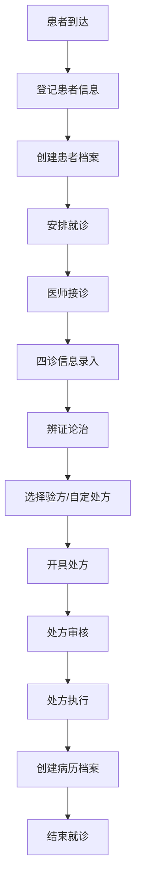
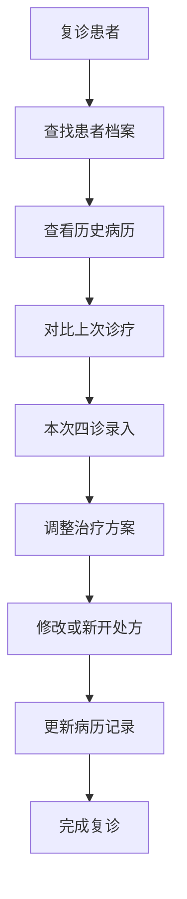
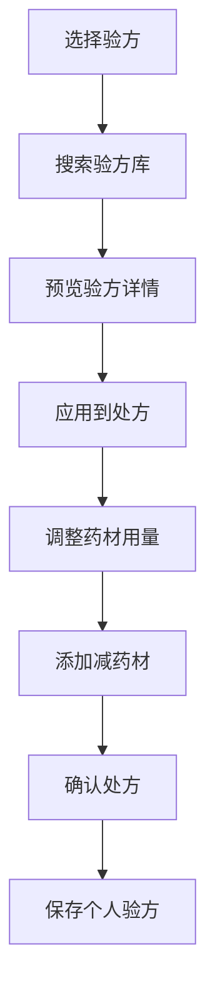

# 业务需求规格说明书 (UltraThink v2.0 重构后)

> **文档版本**: v2.0  
> **创建日期**: 2025-08-18  
> **更新日期**: 2025-08-18  
> **项目**: 凌隐宝堂中医诊所管理系统 (LYBTZYZS)  
> **架构版本**: UltraThink v2.0

## 📋 文档概述

本文档基于UltraThink v2.0架构重构后的系统状态，重新梳理和定义业务需求。反映当前已实现的功能模块、待开发功能以及业务流程优化需求。

## 🏥 业务背景

### 目标用户群体
- **主要用户**: 20人以下的中小型中医诊所
- **并发用户**: < 10人同时使用
- **日处理量**: < 1000次业务操作

### 核心业务场景
```
典型工作日流程:
上午: 患者接待 → 预约管理 → 看诊准备
诊疗: 四诊记录 → 辨证论治 → 开具处方
下午: 处方管理 → 药材配置 → 病历整理
```

## 🎯 核心业务需求

### 1. 患者管理模块 (Patients)

#### 1.1 功能现状 ✅
| 功能 | 状态 | 实现程度 | 技术架构 |
|------|------|----------|----------|
| 患者档案管理 | ✅ 完成 | 100% | DTO直接绑定 |
| 基础信息录入 | ✅ 完成 | 100% | 表单验证完整 |
| 患者查询检索 | ✅ 完成 | 100% | 支持多条件查询 |
| 数据导入导出 | ✅ 完成 | 90% | Excel批量处理 |

#### 1.2 业务规则
```csharp
// 患者信息必填项
- 姓名 (必填)
- 性别 (必填) 
- 出生日期或年龄 (必填)
- 联系方式 (手机或固话，必填其一)

// 可选信息
- 身份证号、地址、紧急联系人
- 既往病史、过敏史
- 医保信息
```

#### 1.3 待优化需求
- [ ] 患者照片上传与管理
- [ ] 患者分类标签系统
- [ ] 就诊频次统计分析
- [ ] 患者满意度反馈

### 2. 看诊管理模块 (Consultation)

#### 2.1 功能现状 ✅ 
| 功能 | 状态 | 实现程度 | 重构成果 |
|------|------|----------|----------|
| 中医四诊录入 | ✅ 完成 | 100% | 代码量减少72% |
| 症状体征管理 | ✅ 完成 | 100% | 移除西医体征 |
| 辨证论治记录 | ✅ 完成 | 100% | 界面简化 |
| 诊断建议生成 | ✅ 完成 | 80% | 移除AI功能 |

#### 2.2 四诊记录规范
```
望诊 (Visual):
- 神色形态: 精神状态、面色、形体
- 舌象: 舌质、舌苔描述
- 皮肤: 色泽、湿润度、疹子等

闻诊 (Auditory):
- 语音: 声音高低、清浊
- 呼吸: 呼吸音、节律
- 气味: 口气、体味等

问诊 (Inquiry):
- 主诉: 患者主要不适
- 现病史: 发病过程、诱因
- 既往史: 既往疾病、手术史
- 系统回顾: 各系统症状询问

切诊 (Palpation):
- 脉象: 浮沉、迟数、滑涩等
- 腹诊: 腹部触诊发现
- 其他: 局部触诊等
```

#### 2.3 待开发需求
- [ ] 常用症状快速录入模板
- [ ] 诊断辅助知识库集成
- [ ] 历次就诊对比分析
- [ ] 中医证候自动分析

### 3. 处方管理模块 (Prescriptions)

#### 3.1 功能现状 ✅
| 功能 | 状态 | 实现程度 | 重构收益 |
|------|------|----------|----------|
| 处方开具 | ✅ 完成 | 100% | 代码量减少34% |
| 药材选择 | ✅ 完成 | 100% | DTO直接使用 |
| 用量计算 | ✅ 完成 | 100% | 逻辑简化 |
| 处方打印 | ✅ 完成 | 95% | 保留核心功能 |

#### 3.2 处方规范
```
处方信息要求:
- 患者信息: 姓名、性别、年龄
- 诊断信息: 中医诊断、治法方药
- 药物信息: 药名、剂量、用法、疗程
- 医师信息: 开方医师、审方药师
- 时间信息: 开方日期、有效期

处方安全检查:
- 药物禁忌检查
- 剂量合理性检查  
- 配伍禁忌提醒
- 特殊人群用药提醒
```

#### 3.3 新增需求
- [ ] 电子处方签名功能
- [ ] 处方审查工作流
- [ ] 用药指导自动生成
- [ ] 处方费用详单

### 4. 验方管理模块 (Formula)

#### 4.1 功能现状 ✅
| 功能 | 状态 | 实现程度 | 架构优化 |
|------|------|----------|----------|
| 验方模板管理 | ✅ 完成 | 100% | DTO直接使用 |
| 经典验方库 | ✅ 完成 | 90% | 数据结构优化 |
| 个人验方 | ✅ 完成 | 100% | 创建编辑完整 |
| 验方应用 | ✅ 完成 | 95% | 与处方集成 |

#### 4.2 验方分类体系
```
按来源分类:
- 经典验方: 古籍经方、名医验方
- 院内验方: 本院医师总结验方
- 个人验方: 医师个人验方收藏

按疾病分类:
- 内科方: 感冒、咳嗽、胃病等
- 外科方: 跌打损伤、皮肤病等
- 妇科方: 月经不调、更年期等
- 儿科方: 小儿感冒、消化不良等
- 其他专科方
```

#### 4.3 扩展需求
- [ ] 验方疗效统计
- [ ] 验方智能推荐
- [ ] 验方成本分析
- [ ] 验方使用频次统计

### 5. 药材管理模块 (Herbs)

#### 5.1 功能现状 ✅
| 功能 | 状态 | 实现程度 | 重构成果 |
|------|------|----------|----------|
| 药材基础信息 | ✅ 完成 | 100% | 代码量减少40% |
| 药材查询检索 | ✅ 完成 | 100% | 支持拼音检索 |
| 价格管理 | ✅ 完成 | 100% | 实时价格更新 |
| 批量操作 | ✅ 完成 | 100% | 状态批量更新 |

#### 5.2 药材信息规范
```
基础信息:
- 药材名称: 中文名、拉丁名、别名
- 基本属性: 性味、归经、功效
- 规格信息: 规格、产地、等级
- 价格信息: 采购价、零售价、单位

使用信息:
- 常用剂量范围
- 配伍禁忌
- 特殊煎煮方法
- 适应症禁忌症
```

#### 5.3 扩展需求
- [ ] 药材库存预警（简化版）
- [ ] 药材价格趋势分析
- [ ] 供应商信息管理
- [ ] 药材质量等级管理

### 6. 病历档案模块 (MedicalCase)

#### 6.1 功能现状 ✅ 
| 功能 | 状态 | 实现程度 | 重构亮点 |
|------|------|----------|----------|
| 病历档案管理 | ✅ 完成 | 100% | 代码量减少58% |
| 诊疗记录整合 | ✅ 完成 | 100% | 统一数据模型 |
| 病程跟踪 | ✅ 完成 | 90% | 时间线视图 |
| 档案查询 | ✅ 完成 | 100% | 多维度检索 |

#### 6.2 病历档案结构
```
病历主档:
- 病历号: 唯一标识
- 患者信息: 关联患者档案
- 创建信息: 创建时间、创建医师
- 状态信息: 在诊、结案、随访

诊疗记录:
- 就诊记录: 每次就诊的四诊信息
- 处方记录: 关联的处方信息
- 检查记录: 相关检查报告
- 随访记录: 电话随访、复诊记录
```

#### 6.3 改进需求
- [ ] 病历模板标准化
- [ ] 图片资料上传
- [ ] 病历质控检查
- [ ] 病历统计报表

### 7. 用户权限模块 (Auth & Users)

#### 7.1 功能现状 ✅
| 功能 | 状态 | 实现程度 | 安全等级 |
|------|------|----------|----------|
| 用户认证 | ✅ 完成 | 100% | JWT安全令牌 |
| 角色权限 | ✅ 完成 | 100% | 三级权限体系 |
| 会话管理 | ✅ 完成 | 100% | 8小时有效期 |
| 操作日志 | ✅ 完成 | 90% | 关键操作记录 |

#### 7.2 权限角色定义
```
Admin (系统管理员):
- 用户管理: 增删改查用户
- 系统配置: 修改系统参数
- 数据管理: 数据备份恢复
- 全部功能: 不受限制访问

Doctor (医师):
- 患者管理: 查看修改患者信息
- 诊疗功能: 看诊、开方、病历
- 个人数据: 管理个人验方模板
- 统计查询: 个人工作量统计

Staff (工作人员):
- 患者接待: 患者登记、预约管理
- 基础查询: 查看患者基础信息
- 辅助功能: 协助打印、导出
- 受限访问: 不能修改关键数据
```

## 🔄 核心业务流程

### 流程1: 新患者接诊完整流程


### 流程2: 复诊患者流程


### 流程3: 验方应用流程


## 📊 数据需求分析

### 数据量估算
| 数据类型 | 年增长量 | 存储需求 | 查询频次 |
|---------|---------|---------|---------|
| 患者档案 | 2000条 | 50MB | 高频 |
| 诊疗记录 | 8000条 | 200MB | 高频 |
| 处方记录 | 8000条 | 100MB | 中频 |
| 病历档案 | 2000条 | 300MB | 中频 |
| 药材信息 | 200条 | 10MB | 低频 |
| 验方模板 | 50条 | 5MB | 低频 |

### 性能要求
```
响应时间要求:
- 患者查询: < 1秒
- 诊疗录入: < 0.5秒
- 处方生成: < 2秒
- 报表生成: < 10秒

并发要求:
- 同时在线: 10用户
- 同时录入: 5用户
- 高峰并发: 20操作/分钟
```

## 🎯 待实现功能模块

### 高优先级模块

#### 1. 诊断管理模块 (Diagnostics)
**目标**: 标准化中医诊断管理
```
核心功能:
- 中医诊断标准化词库
- 诊断辅助决策支持
- 诊断准确性统计
- 疾病谱分析

预计工作量: 3周
技术复杂度: 中等
业务价值: 高
```

#### 2. 药房管理模块 (Pharmacy)
**目标**: 简化的药房库存管理
```
核心功能:
- 基础库存管理
- 出入库记录
- 库存预警提醒
- 盘点功能

预计工作量: 4周
技术复杂度: 中等
业务价值: 高
```

### 中优先级模块

#### 3. 排队管理模块 (Queueing)
**目标**: 候诊队列管理
```
核心功能:
- 取号排队系统
- 候诊状态显示
- 叫号提醒功能
- 等候时间统计

预计工作量: 2周
技术复杂度: 低
业务价值: 中
```

#### 4. 增强验方模板 (FormulaTemplates)
**目标**: 完善验方模板功能
```
扩展功能:
- 验方分类细化
- 适应症关联
- 使用统计分析
- 智能推荐算法

预计工作量: 3周
技术复杂度: 中等
业务价值: 中
```

## 📈 非功能性需求

### 1. 性能需求
- **响应时间**: 核心功能 < 2秒响应
- **并发处理**: 支持10个并发用户
- **数据处理**: 单次查询 < 1000条记录
- **系统可用**: 99.5%系统可用性

### 2. 安全需求
- **身份认证**: JWT令牌 + 角色权限控制
- **数据安全**: 敏感信息加密存储
- **操作审计**: 关键操作完整日志
- **数据备份**: 每日自动备份

### 3. 可维护性需求
- **代码规范**: 遵循.NET编码标准
- **架构清晰**: 3层架构严格分离
- **文档完整**: API文档自动生成
- **版本管理**: Git标准化流程

### 4. 可扩展性需求
- **模块化**: 支持功能模块独立部署
- **数据库**: 支持数据库水平扩展
- **接口标准**: RESTful API设计
- **插件机制**: 预留第三方集成接口

## 🚀 交付计划

### Phase 1: 核心缺失模块 (6-8周)
```
Week 1-2: Diagnostics模块开发
Week 3-4: Pharmacy模块基础功能  
Week 5-6: Queueing模块实现
Week 7-8: FormulaTemplates功能增强
```

### Phase 2: 功能优化提升 (4-6周)
```
Week 9-10: 核心流程优化
Week 11-12: 用户体验改善
Week 13-14: 性能调优
```

### Phase 3: 测试与部署 (3-4周)
```
Week 15-16: 系统测试与Bug修复
Week 17-18: 部署准备与用户培训
```

## 📋 验收标准

### 功能验收
- [ ] 所有核心业务流程完整可用
- [ ] 新增模块功能满足业务需求
- [ ] 数据完整性和一致性检查通过
- [ ] 用户权限控制有效

### 性能验收
- [ ] 响应时间达到性能要求
- [ ] 并发用户数量满足需求
- [ ] 系统稳定性达到要求
- [ ] 数据库性能指标合格

### 安全验收
- [ ] 身份认证机制有效
- [ ] 数据访问权限控制正确
- [ ] 操作日志记录完整
- [ ] 数据备份恢复功能正常

---

**文档维护**: 开发团队  
**审批**: 项目经理  
**下次更新**: 根据开发进度动态更新