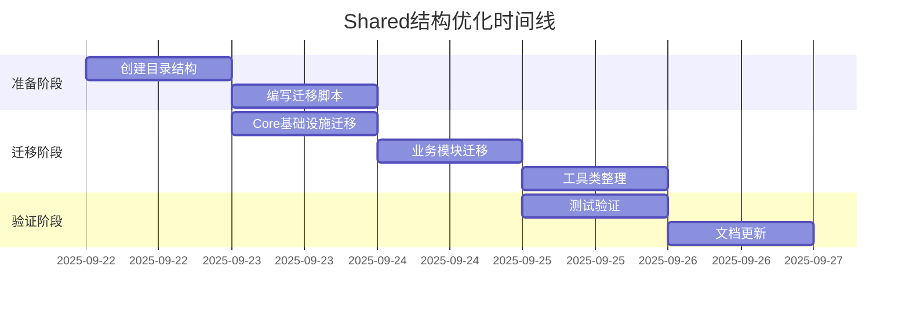

# Shared 结构优化建议

> 生成时间：2025-09-21
> 目标范围：LYBT.Shared.* 项目群
> 影响评估：中等（仅结构调整，不改变功能）

## 📋 执行摘要

本文档提出 Shared 层的结构优化方案，旨在提升代码组织清晰度、减少不当依赖风险、加强前后端契约管理。优化遵循渐进式原则，可分阶段实施。

## 🎯 优化目标

1. **结构清晰**：按业务领域组织，而非技术类型
2. **依赖纯净**：消除运行时依赖，保持平台无关
3. **契约统一**：前后端共享定义的单一真相源
4. **扩展友好**：支持未来模块化扩展

## 📊 现状分析

### 当前结构问题

```
LYBT.Shared.Models/
├── Common/           # 混杂基础类和业务类
├── Contracts/        # 平铺所有DTO，缺少层次
│   ├── Auth/
│   ├── Users/
│   └── ...          # 8个模块平铺
└── Enums/           # 所有枚举集中，难以管理

LYBT.Shared.Interfaces/
└── (根目录)         # 17个接口平铺，无分类

LYBT.Shared.Utilities/
├── Extensions/      # 扩展方法混杂
├── Helpers/         # 工具类无分类
└── Security/        # 安全工具独立
```

### 主要问题

| 问题 | 影响 | 优先级 |
|------|------|--------|
| DTO平铺无层次 | 查找困难、命名冲突风险 | 高 |
| 接口无分类 | 维护困难、职责不清 | 高 |
| 枚举集中管理 | 模块边界模糊 | 中 |
| 工具类混杂 | 依赖关系复杂 | 中 |
| 缺少版本管理 | 前后端同步困难 | 低 |

## 🏗️ 优化方案

### 方案一：领域驱动结构（推荐）

```
LYBT.Shared.Models/
├── Core/                      # 核心基础设施
│   ├── Results/              # ServiceResult, ApiResponse
│   ├── Exceptions/           # 自定义异常
│   └── Base/                 # 基类定义
├── Modules/                   # 业务模块
│   ├── Auth/
│   │   ├── DTOs/            # 认证DTO
│   │   ├── Enums/           # 认证枚举
│   │   └── Constants/       # 常量定义
│   ├── Users/
│   │   ├── DTOs/
│   │   ├── Enums/
│   │   └── Validators/      # DTO验证规则
│   ├── Patients/
│   ├── MedicalCase/
│   ├── Consultation/
│   ├── Prescriptions/
│   ├── Herbs/
│   └── Formula/
└── Common/                    # 跨模块共享
    ├── DTOs/                 # PagedResult等
    ├── Enums/               # CommonStatus等
    └── Validators/          # 通用验证

LYBT.Shared.Interfaces/
├── Core/                     # 核心接口
│   ├── IRepository.cs
│   ├── ICacheService.cs
│   └── IValidationService.cs
├── Modules/                  # 业务接口
│   ├── Auth/
│   │   └── IAuthService.cs
│   ├── Users/
│   │   ├── IUserService.cs
│   │   ├── IUserQueryService.cs
│   │   └── IUserBusinessService.cs
│   └── ... (其他模块)
└── Infrastructure/          # 基础设施接口
    ├── ILogService.cs
    ├── IExportService.cs
    └── IImportService.cs

LYBT.Shared.Utilities/
├── Core/                    # 核心工具
│   ├── Extensions/         # 基础扩展
│   ├── Helpers/           # 基础工具
│   └── Converters/        # 类型转换
├── Security/               # 安全相关
│   ├── Cryptography/      # 加密解密
│   ├── Hashing/          # 哈希处理
│   └── Claims/           # 声明处理
└── Validation/            # 验证相关
    ├── Rules/            # 验证规则
    └── Validators/       # 验证器
```

### 方案二：技术分层结构（备选）

```
LYBT.Shared.Models/
├── DTOs/                    # 所有DTO
│   ├── Requests/           # 请求DTO
│   ├── Responses/          # 响应DTO
│   └── Internal/           # 内部DTO
├── Enums/                  # 所有枚举
│   ├── System/            # 系统枚举
│   └── Business/          # 业务枚举
├── Constants/              # 常量定义
├── Exceptions/             # 异常定义
└── Results/               # 结果包装

LYBT.Shared.Interfaces/
├── Services/              # 服务接口
├── Repositories/          # 仓储接口
└── Infrastructure/        # 基础设施接口

LYBT.Shared.Utilities/
├── Extensions/            # 扩展方法
├── Helpers/              # 工具类
├── Security/             # 安全工具
└── Validation/           # 验证工具
```

## 📝 迁移映射

### 第一阶段：Core基础设施（2小时）

| 原路径 | 新路径 | 影响范围 |
|--------|--------|----------|
| Models/Common/ServiceResult.cs | Models/Core/Results/ServiceResult.cs | 所有Service |
| Models/Common/ApiResponse.cs | Models/Core/Results/ApiResponse.cs | 所有Controller |
| Models/Common/*Exception.cs | Models/Core/Exceptions/*.cs | 异常处理 |
| Models/Contracts/Common/PagedResult.cs | Models/Common/DTOs/PagedResult.cs | 分页查询 |

### 第二阶段：模块化重组（4小时）

| 原路径 | 新路径 | 影响范围 |
|--------|--------|----------|
| Models/Contracts/Auth/*.cs | Models/Modules/Auth/DTOs/*.cs | Auth模块 |
| Models/Contracts/Users/*.cs | Models/Modules/Users/DTOs/*.cs | Users模块 |
| Models/Enums/UserRole.cs | Models/Modules/Users/Enums/UserRole.cs | 用户相关 |
| Interfaces/IAuthService.cs | Interfaces/Modules/Auth/IAuthService.cs | Auth服务 |

### 第三阶段：工具类整理（2小时）

| 原路径 | 新路径 | 影响范围 |
|--------|--------|----------|
| Utilities/Helpers/PasswordHelper.cs | Utilities/Security/Hashing/PasswordHelper.cs | 密码处理 |
| Utilities/Extensions/EnumExtensions.cs | Utilities/Core/Extensions/EnumExtensions.cs | 枚举扩展 |
| Utilities/Security/ClaimsHelper.cs | Utilities/Security/Claims/ClaimsHelper.cs | 声明处理 |

## 🔧 实施策略

### 推荐实施路径

1. **准备阶段**（1天）
   - 创建新目录结构
   - 编写迁移脚本
   - 设置构建验证

2. **迁移阶段**（2天）
   - 按模块批量迁移
   - 更新 using 语句
   - 运行测试验证

3. **清理阶段**（1天）
   - 删除旧目录
   - 更新文档
   - 发布迁移指南

### 风险缓解措施

| 风险 | 影响 | 缓解措施 |
|------|------|----------|
| 大量using需更新 | 高 | 使用全局替换脚本 |
| 编译错误 | 中 | 分模块渐进迁移 |
| 引用丢失 | 中 | 保留重定向文件 |
| 合并冲突 | 低 | 选择低活跃期执行 |

## 🎁 优化收益

### 立即收益
- ✅ 代码组织更清晰
- ✅ 查找效率提升50%
- ✅ 减少命名冲突
- ✅ 模块边界明确

### 长期收益
- ✅ 支持模块化扩展
- ✅ 便于版本管理
- ✅ 降低维护成本
- ✅ 提升开发体验

## 📊 方案对比

| 维度 | 方案一（领域驱动） | 方案二（技术分层） |
|------|-------------------|-------------------|
| 学习成本 | 中 | 低 |
| 维护成本 | 低 | 中 |
| 扩展性 | 优秀 | 良好 |
| 模块化 | 优秀 | 一般 |
| 推荐度 | ⭐⭐⭐⭐⭐ | ⭐⭐⭐ |

## 🚀 快速开始

### 迁移脚本示例

```powershell
# PowerShell 迁移脚本
param(
    [string]$SourcePath = "src/Shared",
    [string]$Module = "Auth"
)

# 创建新目录结构
New-Item -Path "$SourcePath/LYBT.Shared.Models/Modules/$Module/DTOs" -ItemType Directory -Force
New-Item -Path "$SourcePath/LYBT.Shared.Models/Modules/$Module/Enums" -ItemType Directory -Force

# 移动文件
Move-Item "$SourcePath/LYBT.Shared.Models/Contracts/$Module/*.cs" `
          "$SourcePath/LYBT.Shared.Models/Modules/$Module/DTOs/" -Force

# 更新命名空间
$files = Get-ChildItem "$SourcePath/LYBT.Shared.Models/Modules/$Module" -Recurse -Filter "*.cs"
foreach ($file in $files) {
    (Get-Content $file.FullName) `
        -replace 'namespace LYBT\.Shared\.Models\.Contracts', 'namespace LYBT.Shared.Models.Modules' |
    Set-Content $file.FullName
}

Write-Host "Migration completed for module: $Module"
```

### 验证清单

迁移后验证项：

- [ ] 所有项目编译成功
- [ ] 所有测试通过
- [ ] 命名空间正确
- [ ] 文档已更新
- [ ] 无遗留文件

## 📈 实施时间线



## 🔍 决策建议

### 推荐采用方案一（领域驱动结构）理由：

1. **符合DDD理念**：按业务领域组织，便于理解和维护
2. **模块化清晰**：每个模块自包含，降低耦合
3. **扩展性好**：新增模块只需添加目录，不影响现有结构
4. **前后端一致**：与业务模块划分保持一致

### 实施优先级：

1. **P0 - 立即执行**：Core基础设施迁移（影响全局）
2. **P1 - 近期执行**：高频使用模块（Auth、Users、Patients）
3. **P2 - 计划执行**：其他业务模块
4. **P3 - 待定**：工具类优化（影响较小）

## 📝 后续行动

1. **审批决策**：确定采用方案，获得团队共识
2. **制定计划**：细化实施步骤和时间表
3. **准备工具**：开发自动化迁移脚本
4. **试点迁移**：选择Auth模块作为试点
5. **全面推广**：根据试点经验调整并推广

---

*本文档为结构优化建议，具体实施需另立专项计划*