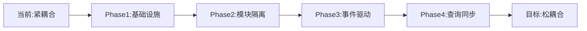

# #761 架构模块化改进 - 任务清单

## 任务概述
实现真正的模块化架构，解耦模块间依赖，引入事件驱动通信机制。

## 架构问题分析
- **强耦合依赖**：所有模块直接依赖AppDbContext
- **缺少模块边界**：模块间没有明确的接口契约
- **同步通信过度**：缺少异步解耦机制
- **共享数据模型**：所有模块共用LYBT.Entities

## 详细任务清单

### Phase 1: 基础设施准备（1周）

#### 1.1 创建事件总线项目（8小时）
- [ ] 创建LYBT.Core.EventBus项目
- [ ] 定义IEventBus接口
- [ ] 实现InMemoryEventBus
- [ ] 创建单元测试

```csharp
// 项目结构
LYBT.Core.EventBus/
├── Abstractions/
│   ├── IEventBus.cs
│   ├── IIntegrationEvent.cs
│   └── IIntegrationEventHandler.cs
├── Events/
│   └── IntegrationEventBase.cs
├── InMemory/
│   └── InMemoryEventBus.cs
└── EventBus.csproj
```

#### 1.2 定义模块接口契约（8小时）
```csharp
// LYBT.Shared.Contracts/IModule.cs
public interface IModule
{
    string Name { get; }
    string Version { get; }
    Task InitializeAsync();
    Task<TResult> ExecuteCommandAsync<TResult>(ICommand<TResult> command);
    Task<TResult> ExecuteQueryAsync<TResult>(IQuery<TResult> query);
}

// LYBT.Shared.Contracts/IModuleLifecycle.cs
public interface IModuleLifecycle
{
    Task StartAsync(CancellationToken cancellationToken = default);
    Task StopAsync(CancellationToken cancellationToken = default);
    ModuleStatus Status { get; }
    event EventHandler<ModuleStatusChangedEventArgs> StatusChanged;
}
```

- [ ] 创建模块基础接口
- [ ] 定义生命周期接口
- [ ] 创建命令/查询接口
- [ ] 定义模块状态枚举

#### 1.3 建立模块通信基础（8小时）
- [ ] 创建模块注册中心
- [ ] 实现模块发现机制
- [ ] 配置依赖注入扩展
- [ ] 创建模块间通信示例

### Phase 2: 模块隔离（2周）

#### 2.1 Users模块重构（16小时）

**创建模块边界**
```csharp
// LYBT.Module.Users/UsersModule.cs
public class UsersModule : IModule, IModuleLifecycle
{
    private readonly IServiceProvider _serviceProvider;
    private readonly IEventBus _eventBus;
    
    public string Name => "Users";
    public string Version => "1.0.0";
    
    public async Task InitializeAsync()
    {
        // 注册事件处理器
        _eventBus.Subscribe<RoleChangedEvent, RoleChangedEventHandler>();
        
        // 初始化模块特定配置
        await InitializeDatabase();
        await LoadConfiguration();
    }
    
    public async Task<TResult> ExecuteQueryAsync<TResult>(IQuery<TResult> query)
    {
        return query switch
        {
            GetUserByIdQuery getUserQuery => await HandleGetUserByIdAsync(getUserQuery),
            GetUsersByRoleQuery getUsersQuery => await HandleGetUsersByRoleAsync(getUsersQuery),
            _ => throw new NotSupportedException($"Query {query.GetType().Name} not supported")
        };
    }
}
```

- [ ] 创建UsersModule类
- [ ] 实现模块接口
- [ ] 分离UserDbContext
- [ ] 配置模块注册

**发布领域事件**
```csharp
public class UserService
{
    private readonly IEventBus _eventBus;
    
    public async Task<ServiceResult<UserDto>> CreateAsync(UserCreateDto dto)
    {
        // 创建用户
        var user = await _repository.CreateAsync(dto);
        
        // 发布事件
        await _eventBus.PublishAsync(new UserCreatedIntegrationEvent
        {
            UserId = user.Id,
            Username = user.Username,
            Role = user.Role,
            CreatedAt = DateTime.UtcNow
        });
        
        return ServiceResult<UserDto>.Success(user);
    }
}
```

- [ ] 定义UserCreatedEvent
- [ ] 定义UserUpdatedEvent
- [ ] 定义UserDeletedEvent
- [ ] 更新Service发布事件

#### 2.2 Patients模块重构（16小时）

**订阅外部事件**
```csharp
public class UserCreatedEventHandler : IIntegrationEventHandler<UserCreatedIntegrationEvent>
{
    private readonly IPatientRepository _repository;
    
    public async Task HandleAsync(UserCreatedIntegrationEvent @event)
    {
        if (@event.Role == "Doctor")
        {
            // 为医生创建档案
            await _repository.CreateDoctorProfileAsync(new DoctorProfile
            {
                UserId = @event.UserId,
                Name = @event.Username,
                CreatedAt = @event.CreatedAt
            });
        }
    }
}
```

- [ ] 创建PatientsModule类
- [ ] 分离PatientDbContext
- [ ] 实现事件订阅
- [ ] 配置模块通信

#### 2.3 其他模块重构（24小时）
- [ ] Consultation模块重构（8小时）
- [ ] Prescriptions模块重构（8小时）
- [ ] Auth模块重构（4小时）
- [ ] MedicalCase模块重构（4小时）

### Phase 3: 事件驱动迁移（3周）

#### 3.1 识别跨模块调用（8小时）
- [ ] 扫描所有跨模块引用
- [ ] 分类同步/异步场景
- [ ] 评估迁移优先级
- [ ] 制定迁移计划

#### 3.2 定义集成事件（16小时）

**核心业务事件**
```csharp
// 诊疗开始事件
public class ConsultationStartedEvent : IntegrationEventBase
{
    public Guid ConsultationId { get; set; }
    public Guid PatientId { get; set; }
    public Guid DoctorId { get; set; }
    public DateTime StartTime { get; set; }
}

// 诊疗完成事件
public class ConsultationCompletedEvent : IntegrationEventBase
{
    public Guid ConsultationId { get; set; }
    public string Diagnosis { get; set; }
    public List<string> Symptoms { get; set; }
    public DateTime CompletedTime { get; set; }
}

// 处方创建事件
public class PrescriptionCreatedEvent : IntegrationEventBase
{
    public Guid PrescriptionId { get; set; }
    public Guid ConsultationId { get; set; }
    public Guid PatientId { get; set; }
    public List<PrescriptionItem> Items { get; set; }
}
```

- [ ] 定义用户域事件（5个）
- [ ] 定义患者域事件（4个）
- [ ] 定义诊疗域事件（6个）
- [ ] 定义处方域事件（4个）

#### 3.3 事件处理器实现（24小时）

**示例：处方模块订阅诊疗完成**
```csharp
public class CreatePrescriptionDraftHandler : IIntegrationEventHandler<ConsultationCompletedEvent>
{
    private readonly IPrescriptionService _prescriptionService;
    private readonly ILogger<CreatePrescriptionDraftHandler> _logger;
    
    public async Task HandleAsync(ConsultationCompletedEvent @event)
    {
        try
        {
            _logger.LogInformation("处理诊疗完成事件: {ConsultationId}", @event.ConsultationId);
            
            // 创建处方草稿
            var draft = new PrescriptionDraft
            {
                ConsultationId = @event.ConsultationId,
                Diagnosis = @event.Diagnosis,
                Status = PrescriptionStatus.Draft
            };
            
            await _prescriptionService.CreateDraftAsync(draft);
            
            _logger.LogInformation("处方草稿创建成功");
        }
        catch (Exception ex)
        {
            _logger.LogError(ex, "处理诊疗完成事件失败");
            throw;
        }
    }
}
```

- [ ] Users模块处理器（3个）
- [ ] Patients模块处理器（4个）
- [ ] Consultation模块处理器（3个）
- [ ] Prescription模块处理器（5个）

#### 3.4 替换直接调用（16小时）
- [ ] 替换UserService调用
- [ ] 替换PatientService调用
- [ ] 替换ConsultationService调用
- [ ] 替换PrescriptionService调用

### Phase 4: 查询数据同步（2周）

#### 4.1 实现查询视图（16小时）

**跨模块查询视图**
```csharp
// 患者诊疗视图
public class PatientConsultationView
{
    public Guid PatientId { get; set; }
    public string PatientName { get; set; }
    public int TotalConsultations { get; set; }
    public DateTime? LastConsultationDate { get; set; }
    public List<RecentConsultation> RecentConsultations { get; set; }
}

// 视图更新服务
public class ViewUpdateService
{
    public async Task UpdatePatientConsultationViewAsync(ConsultationCompletedEvent @event)
    {
        var view = await _repository.GetViewAsync(@event.PatientId);
        
        view.TotalConsultations++;
        view.LastConsultationDate = @event.CompletedTime;
        view.RecentConsultations.Add(new RecentConsultation
        {
            ConsultationId = @event.ConsultationId,
            Date = @event.CompletedTime,
            Diagnosis = @event.Diagnosis
        });
        
        await _repository.UpdateViewAsync(view);
    }
}
```

- [ ] 设计查询视图模型
- [ ] 实现视图更新服务
- [ ] 配置事件订阅更新
- [ ] 实现视图查询接口

#### 4.2 数据一致性保证（8小时）
- [ ] 实现最终一致性策略
- [ ] 配置补偿事务
- [ ] 添加数据校验
- [ ] 实现数据修复工具

### Phase 5: 监控和健康检查（1周）

#### 5.1 模块健康检查（8小时）
```csharp
public class ModuleHealthCheck : IHealthCheck
{
    private readonly IModule _module;
    
    public async Task<HealthCheckResult> CheckHealthAsync(
        HealthCheckContext context,
        CancellationToken cancellationToken = default)
    {
        try
        {
            var status = await _module.GetHealthStatusAsync();
            
            return status.IsHealthy
                ? HealthCheckResult.Healthy($"模块 {_module.Name} 正常")
                : HealthCheckResult.Unhealthy($"模块 {_module.Name} 异常: {status.Message}");
        }
        catch (Exception ex)
        {
            return HealthCheckResult.Unhealthy($"健康检查失败: {ex.Message}");
        }
    }
}
```

- [ ] 实现模块健康检查
- [ ] 配置健康检查端点
- [ ] 创建监控Dashboard
- [ ] 设置告警规则

#### 5.2 事件总线监控（8小时）
- [ ] 事件发布统计
- [ ] 处理失败监控
- [ ] 延迟监控
- [ ] 死信队列处理

### Phase 6: 文档和培训（1周）

#### 6.1 架构文档（16小时）
- [ ] 编写模块化架构指南
- [ ] 创建模块接口文档
- [ ] 编写事件目录
- [ ] 创建通信流程图

#### 6.2 开发者指南（8小时）
- [ ] 模块开发模板
- [ ] 事件定义规范
- [ ] 最佳实践文档
- [ ] 故障排查指南

## 架构演进路线图



## 验收标准

### 技术指标
- [ ] 模块间零直接依赖
- [ ] 事件处理成功率>99%
- [ ] 查询响应时间<200ms
- [ ] 模块独立部署能力

### 架构指标
- [ ] 模块边界清晰定义
- [ ] 通信协议标准化
- [ ] 故障隔离实现
- [ ] 可观测性完备

## 风险评估和缓解

| 风险 | 概率 | 影响 | 缓解措施 |
|-----|-----|------|----------|
| 数据一致性问题 | 高 | 高 | 实现Saga模式 |
| 性能下降 | 中 | 中 | 优化事件处理 |
| 复杂度增加 | 高 | 中 | 完善文档培训 |
| 迁移中断服务 | 低 | 高 | 灰度发布策略 |

## 关键成功因素
1. **管理层支持**：获得架构改进的资源投入
2. **团队培训**：确保团队理解事件驱动架构
3. **渐进实施**：避免Big Bang式重构
4. **充分测试**：每步都有完整测试覆盖
5. **监控先行**：建立完善的监控体系

## 投资回报分析
- **投入**：约240小时（6周×40小时）
- **收益**：
  - 开发效率提升30%
  - 系统稳定性提升50%
  - 维护成本降低40%
  - 支持微服务演进
- **ROI**：6个月回收投资

## 下一步行动
1. 立即创建LYBT.Core.EventBus项目
2. 选择Users模块作为试点
3. 实现第一个事件发布订阅
4. 收集反馈优化方案