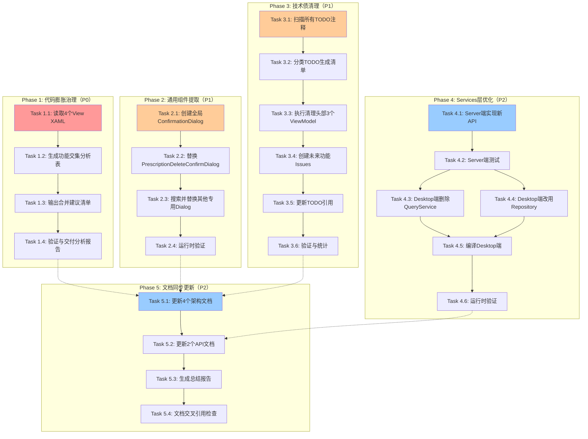

# Desktop层架构重构任务分解文档

**文档版本**：v1.0
**创建时间**：2025-10-27
**关联Epic**：待创建（Desktop层架构重构与代码膨胀治理）
**来源文档**：[设计文档](../design/desktop-refactor-design.md)
**总工作量**：18-24小时（8-13天，按每天2-3小时计算）

---

## 📋 任务清单概览

| Phase | 任务数 | 工作量估算 | 优先级 | 依赖关系 |
|-------|-------|----------|-------|---------|
| **Phase 1** | 4个任务 | 4-6小时 | 🔴 P0 | 无依赖（可先行） |
| **Phase 2** | 4个任务 | 2-4小时 | 🟡 P1 | 无依赖（可先行） |
| **Phase 3** | 6个任务 | 6-10小时 | 🟡 P1 | 无依赖（可先行） |
| **Phase 4** | 6个任务 | 2-4小时 | 🟢 P2 | 无依赖（可先行） |
| **Phase 5** | 4个任务 | 2-3小时 | 🟢 P2 | **依赖Phase 1-4全部完成** |
| **总计** | **24个任务** | **18-24小时** | - | Sequential执行 |

**并行策略**：
- ✅ **Phase 1-4可并行执行**：各Phase之间无代码依赖，可独立开发
- ⚠️ **Phase 5必须最后执行**：依赖所有改动完成后进行文档同步

---

## 🔄 任务依赖关系图



**图例说明**：
- 🔴 红色：P0最高优先级任务
- 🟠 橙色：P1中优先级任务
- 🔵 蓝色：P2低优先级任务
- 实线箭头：强依赖（必须顺序执行）
- 虚线箭头：弱依赖（Phase 1-4完成后才能执行Phase 5）

---

## 🎯 关键路径识别

**关键路径1**：Phase 3技术债清理（最长工作量）
```
T3.1 → T3.2 → T3.3 → T3.4 → T3.5 → T3.6
总工作量：6-10小时（Critical Path）
```

**关键路径2**：Phase 1代码膨胀治理（最高优先级）
```
T1.1 → T1.2 → T1.3 → T1.4
总工作量：4-6小时（P0优先级）
```

**并行优化建议**：
1. ✅ **先启动Phase 3**：占用时间最长，先启动可节省总工期
2. ✅ **并行Phase 1和Phase 2**：两者无依赖，可同时进行
3. ✅ **Phase 4独立执行**：Server端改动，不影响Desktop端开发
4. ⚠️ **Phase 5必须最后执行**：等待所有改动完成后统一同步文档

**预计最短完成时间**：
- 串行执行：18-24小时
- 并行执行：6-10小时（Phase 3关键路径） + 2-3小时（Phase 5）= **8-13小时**

---

## 📝 Phase 1：代码膨胀治理（4个任务，4-6小时）

### Task 1.1：读取4个View XAML文件

**任务描述**：
使用Read工具读取4个疑似重复View的XAML代码，为功能交集分析做准备。

**输入**：
- `PrescriptionsMainView.xaml`
- `PrescriptionManagementView.xaml`
- `PrescriptionDetailView.xaml`
- `SelectFormulaDialog.xaml`（对比`FormulaTemplateSelectionDialog.xaml`）

**输出**：
- 4个XAML文件内容（代码片段）

**验收标准**：
- [ ] 成功读取4个XAML文件
- [ ] 提取核心UI元素（DataGrid、Button、TextBox等）

**工作量**：0.5-1小时

**依赖关系**：无依赖

**实施建议**：
```bash
# 使用Read工具
Read src/Client/Desktop/Modules/LYBT.Desktop.Prescriptions/Views/PrescriptionsMainView.xaml
Read src/Client/Desktop/Modules/LYBT.Desktop.Prescriptions/Views/PrescriptionManagementView.xaml
Read src/Client/Desktop/Modules/LYBT.Desktop.Prescriptions/Views/PrescriptionDetailView.xaml
Read src/Client/Desktop/Modules/LYBT.Desktop.Prescriptions/Views/SelectFormulaDialog.xaml
Read src/Client/Desktop/Modules/LYBT.Desktop.Prescriptions/Views/FormulaTemplateSelectionDialog.xaml
```

---

### Task 1.2：生成功能交集分析表

**任务描述**：
分析4个View的功能差异，生成对比表，判断是否存在重复功能。

**输入**：
- Task 1.1的XAML代码片段

**输出**：
- 功能交集分析表（Markdown表格）

**验收标准**：
- [ ] 生成5列对比表（View名称、主要功能、使用场景、数据绑定、导航触发）
- [ ] 识别出重复功能（如SelectFormulaDialog与FormulaTemplateSelectionDialog）

**工作量**：1-2小时

**依赖关系**：依赖Task 1.1

**实施建议**：
```markdown
| View名称 | 主要功能 | 使用场景 | 数据绑定对象 | 导航触发点 | 建议 |
|---------|---------|---------|------------|-----------|------|
| PrescriptionsMainView | 处方列表+编辑 | 工作流Step 3 | PrescriptionViewModel | 从MedicalCase导航 | 保留 |
| PrescriptionManagementView | 历史管理 | 独立CRUD | PrescriptionListViewModel | 主菜单导航 | 保留 |
| PrescriptionDetailView | 只读详情 | 查看历史 | PrescriptionDto | 从ManagementView导航 | 保留 |
| SelectFormulaDialog | 验方导入 | 处方编辑 | FormulaTemplateDto | 从PrescriptionView导航 | **删除（与FormulaTemplateSelectionDialog重复）** |
```

---

### Task 1.3：输出合并建议清单

**任务描述**：
基于功能交集分析表，输出明确的合并建议，包含影响评估和迁移方案。

**输入**：
- Task 1.2的功能交集分析表

**输出**：
- 合并建议清单（Markdown文档）

**验收标准**：
- [ ] 明确列出需要删除的View（如SelectFormulaDialog）
- [ ] 提供影响评估（低/中/高）
- [ ] 提供迁移方案（代码修改指引）

**工作量**：1-2小时

**依赖关系**：依赖Task 1.2

**实施建议**：
```markdown
### 合并建议清单

#### 建议1：删除SelectFormulaDialog（如重复）
- **原因**：与FormulaTemplateSelectionDialog功能完全重复
- **影响评估**：低（替换导航引用即可）
- **迁移方案**：
  1. 搜索所有调用SelectFormulaDialog的地方
  2. 替换为FormulaTemplateSelectionDialog
  3. 删除SelectFormulaDialog.xaml和.xaml.cs

#### 建议2：保留PrescriptionsMainView和ManagementView
- **原因**：功能场景不同（工作流 vs 管理）
- **优化方案**：通过Tab优化减少用户感知
```

---

### Task 1.4：验证与交付分析报告

**任务描述**：
如删除View，执行编译验证和运行时验证，生成分析报告。

**输入**：
- Task 1.3的合并建议清单
- 已执行的代码修改（如删除SelectFormulaDialog）

**输出**：
- `docs/reports/view-merge-feasibility-analysis-2025-10-27.md`

**验收标准**：
- [ ] 编译通过（0 errors, 0 warnings）
- [ ] 运行时验证通过（替换的Dialog功能正常）
- [ ] 分析报告交付（含功能交集表、合并建议、影响评估）

**工作量**：1-2小时

**依赖关系**：依赖Task 1.3

**实施建议**：
```bash
# 编译验证
dotnet build LYBT.All.sln -c Release --no-restore

# 运行时验证
# 启动Desktop应用，测试验方导入功能，确认FormulaTemplateSelectionDialog正常工作

# 生成分析报告
Write docs/reports/view-merge-feasibility-analysis-2025-10-27.md
```

---

## 🧩 Phase 2：通用组件提取（4个任务，2-4小时）

### Task 2.1：创建全局ConfirmationDialog

**任务描述**：
在Shell层创建全局通用确认对话框组件，支持软删除/物理删除选项。

**输入**：
- 设计文档中的XAML和ViewModel代码示例

**输出**：
- `LYBT.Desktop.Shell/Dialogs/ConfirmationDialog.xaml`
- `LYBT.Desktop.Shell/Dialogs/ConfirmationDialog.xaml.cs`
- `LYBT.Desktop.Shell/Dialogs/ConfirmationDialogViewModel.cs`

**验收标准**：
- [ ] XAML设计完成（图标、消息、选项、按钮）
- [ ] ViewModel逻辑完成（命令绑定、结果返回）
- [ ] 编译通过（0 errors, 0 warnings）

**工作量**：1-2小时

**依赖关系**：无依赖

**实施建议**：
```bash
# 创建文件
Write src/Client/Desktop/Shell/LYBT.Desktop.Shell/Dialogs/ConfirmationDialog.xaml
Write src/Client/Desktop/Shell/LYBT.Desktop.Shell/Dialogs/ConfirmationDialog.xaml.cs
Write src/Client/Desktop/Shell/LYBT.Desktop.Shell/Dialogs/ConfirmationDialogViewModel.cs

# 参考设计文档第2.2节的完整代码示例
```

---

### Task 2.2：替换PrescriptionDeleteConfirmDialog

**任务描述**：
删除Prescriptions模块的专用删除确认对话框，改用全局ConfirmationDialog。

**输入**：
- 已创建的全局ConfirmationDialog（Task 2.1）

**输出**：
- 删除3个文件：
  - `PrescriptionDeleteConfirmDialog.xaml`
  - `PrescriptionDeleteConfirmDialog.xaml.cs`
  - `PrescriptionDeleteConfirmDialogViewModel.cs`
- 修改调用方代码（ViewModel中的删除方法）

**验收标准**：
- [ ] 专用Dialog文件已删除（3个文件）
- [ ] 调用方代码已修改（使用全局Dialog）
- [ ] 编译通过（0 errors, 0 warnings）

**工作量**：0.5-1小时

**依赖关系**：依赖Task 2.1

**实施建议**：
```csharp
// 修改示例：PrescriptionsViewModel.cs
private async Task DeletePrescriptionAsync()
{
    var dialog = new ConfirmationDialog();
    var viewModel = new ConfirmationDialogViewModel
    {
        Title = "删除处方",
        Message = $"确定要删除处方 {SelectedPrescription.PrescriptionNumber} 吗？",
        ShowDeleteOptions = true,
        ConfirmButtonText = "删除",
        CancelButtonText = "取消"
    };
    dialog.DataContext = viewModel;
    viewModel.CloseAction = () => dialog.Close();
    dialog.ShowDialog();

    if (viewModel.DialogResult)
    {
        bool isSoftDelete = viewModel.IsSoftDeleteSelected;
        await _prescriptionRepository.DeleteAsync(SelectedPrescription.Id, isSoftDelete);
    }
}
```

---

### Task 2.3：搜索并替换其他专用Dialog

**任务描述**：
搜索其他模块的专用DeleteConfirmDialog，逐个替换为全局组件。

**输入**：
- Grep搜索结果（所有包含"DeleteConfirmDialog"的文件）

**输出**：
- 删除的专用Dialog清单（如UserDeleteConfirmDialog、PatientDeleteConfirmDialog）
- 修改的调用方代码

**验收标准**：
- [ ] 搜索完成，识别所有专用Dialog（输出清单）
- [ ] 逐个替换完成（与Task 2.2相同流程）
- [ ] 编译通过（0 errors, 0 warnings）

**工作量**：1-2小时

**依赖关系**：依赖Task 2.2

**实施建议**：
```bash
# 搜索
grep -r "DeleteConfirmDialog" src/Client/Desktop/Modules/

# 预期发现：
# - UserDeleteConfirmDialog（Users模块）
# - PatientDeleteConfirmDialog（Patients模块）
# - HerbDeleteConfirmDialog（Herbs模块）

# 逐个替换（重复Task 2.2流程）
```

---

### Task 2.4：运行时验证

**任务描述**：
启动Desktop应用，测试所有删除功能，确认全局Dialog功能正常。

**输入**：
- 已完成替换的代码（Task 2.2、Task 2.3）

**输出**：
- 运行时验证报告（功能是否正常）

**验收标准**：
- [ ] 删除处方功能正常（Prescriptions模块）
- [ ] 删除用户功能正常（Users模块，如有）
- [ ] 删除患者功能正常（Patients模块，如有）
- [ ] Dialog正常弹出，软删除/物理删除选项正确

**工作量**：0.5-1小时

**依赖关系**：依赖Task 2.2、Task 2.3

**实施建议**：
```bash
# 启动Desktop应用，测试以下功能：
# 1. 删除处方（Prescriptions模块）
# 2. 删除用户（Users模块，如有专用Dialog）
# 3. 删除患者（Patients模块，如有专用Dialog）
# 确认Dialog正常弹出，软删除/物理删除选项正确
```

---

## 🧹 Phase 3：技术债清理（6个任务，6-10小时）

### Task 3.1：扫描所有TODO注释

**任务描述**：
使用Grep工具扫描Desktop层所有ViewModel的TODO/FIXME/HACK注释。

**输入**：
- Desktop层Modules目录下所有ViewModel文件

**输出**：
- TODO注释清单（文件路径、行号、TODO内容）

**验收标准**：
- [ ] 完整扫描所有ViewModel
- [ ] 输出结构化清单（36个TODO）
- [ ] 按ViewModel分组

**工作量**：0.5-1小时

**依赖关系**：无依赖

**实施建议**：
```bash
# 扫描
grep -rn "TODO\|FIXME\|HACK" src/Client/Desktop/Modules/ --include="*ViewModel.cs"

# 输出清单示例：
# LYBT.Desktop.Patients/ViewModels/PatientImportWizardViewModel.cs:45: // TODO: 实现Excel导入验证
# LYBT.Desktop.MedicalCase/ViewModels/MedicalCaseConsultationViewModel.cs:89: // TODO: 实现四诊信息自动保存
```

---

### Task 3.2：分类TODO生成清单

**任务描述**：
将36个TODO分类为"快速实现"、"过时计划"、"未来功能"三类，生成分类清单。

**输入**：
- Task 3.1的TODO注释清单

**输出**：
- TODO分类清单（Markdown表格）

**验收标准**：
- [ ] 36个TODO全部分类完成
- [ ] 分类依据清晰（工作量、优先级、可行性）
- [ ] 头部3个ViewModel单独列出（PatientImportWizard、MedicalCaseConsultation、Completion）

**工作量**：1-2小时

**依赖关系**：依赖Task 3.1

**实施建议**：
```markdown
### TODO分类清单

#### PatientImportWizardViewModel（6个TODO）
| TODO内容 | 处理方式 | 工作量 | 状态 |
|---------|---------|-------|------|
| 实现Excel导入验证 | 快速实现 | 0.5天 | ⏸️ 待实施 |
| 添加导入进度条 | 快速实现 | 0.5天 | ⏸️ 待实施 |
| 支持批量导入 | 直接删除（已废弃） | 0天 | ⏸️ 待删除 |
| 导入失败回滚机制 | 转化为Issue #TBD | - | ⏸️ 待创建Issue |
| 重复患者检测 | 转化为Issue #TBD | - | ⏸️ 待创建Issue |
| 导入日志记录 | 转化为Issue #TBD | - | ⏸️ 待创建Issue |
```

---

### Task 3.3：执行清理头部3个ViewModel

**任务描述**：
清理PatientImportWizardViewModel、MedicalCaseConsultationViewModel、CompletionViewModel的TODO注释。

**输入**：
- Task 3.2的分类清单

**输出**：
- 快速实现的功能代码（如Excel导入验证、四诊信息自动保存）
- 删除的过时TODO标记
- 保留的TODO（添加Issue引用）

**验收标准**：
- [ ] PatientImportWizardViewModel TODO清零（6 → 3，其中3个转为Issue引用）
- [ ] MedicalCaseConsultationViewModel TODO清零（5 → 4，其中4个转为Issue引用）
- [ ] CompletionViewModel TODO清零（5 → 3，其中3个转为Issue引用）
- [ ] 编译通过（0 errors, 0 warnings）
- [ ] 功能验证通过（快速实现的功能正常工作）

**工作量**：2-4小时

**依赖关系**：依赖Task 3.2

**实施建议**：
```csharp
// 示例：PatientImportWizardViewModel.cs
// 删除TODO（已废弃）
// - TODO: 支持批量导入 → 直接删除注释

// 快速实现TODO（Excel导入验证）
private bool ValidateImportData(ExcelData data)
{
    if (data.Rows.Count == 0)
        return false;
    foreach (var row in data.Rows)
    {
        if (string.IsNullOrWhiteSpace(row.Name) || string.IsNullOrWhiteSpace(row.Phone))
            return false;
    }
    return true;
}

// 转化为Issue引用
// - 原代码：TODO: 导入失败回滚机制
// - 新代码：// TODO #TBD1: 实现导入失败回滚机制（Epic #TBD）
```

---

### Task 3.4：创建未来功能Issues

**任务描述**：
为10个"未来功能"TODO创建GitHub Issues，标记为技术债。

**输入**：
- Task 3.3中转化为Issue的TODO清单

**输出**：
- 10个GitHub Issues（标题、描述、标签）

**验收标准**：
- [ ] 创建10个Issues（标签：tech-debt, enhancement）
- [ ] 每个Issue引用对应的TODO位置
- [ ] Issue优先级标记为P3

**工作量**：1-2小时

**依赖关系**：依赖Task 3.3

**实施建议**：
```bash
# 使用GitHub MCP工具批量创建Issues
# 标题：[技术债] 实现XX功能
# 描述：来源于TODO清理，优先级P3
# 标签：tech-debt, enhancement

# 示例Issue：
# 标题：[技术债] 实现患者导入失败回滚机制
# 描述：
# **来源**：PatientImportWizardViewModel.cs TODO清理
# **功能需求**：导入患者失败时自动回滚数据库操作
# **优先级**：P3
# **标签**：tech-debt, enhancement
```

---

### Task 3.5：更新TODO引用

**任务描述**：
将保留的TODO注释更新为Issue引用格式。

**输入**：
- Task 3.4创建的Issues编号

**输出**：
- 更新后的TODO注释（含Issue引用）

**验收标准**：
- [ ] 所有保留的TODO都有Issue引用
- [ ] 格式统一：`// TODO #1500: 实现XX功能（Epic #1494）`
- [ ] 编译通过（0 errors, 0 warnings）

**工作量**：0.5-1小时

**依赖关系**：依赖Task 3.4

**实施建议**：
```csharp
// 原代码：TODO: 导入失败回滚机制
// 新代码：// TODO #1500: 实现导入失败回滚机制（Epic #1494）

// 原代码：TODO: 诊断模板功能
// 新代码：// TODO #1501: 添加诊断模板功能（Epic #1494）
```

---

### Task 3.6：验证与统计

**任务描述**：
重新扫描TODO数量，确认减少44%目标达成。

**输入**：
- 已清理的代码（Task 3.3、Task 3.5）

**输出**：
- TODO数量统计报告

**验收标准**：
- [ ] TODO总数：36 → <20（减少44%）
- [ ] 头部3个ViewModel TODO清零
- [ ] 编译通过（0 errors, 0 warnings）
- [ ] 功能验证通过（PatientImportWizard、MedicalCaseConsultation、Completion）

**工作量**：0.5-1小时

**依赖关系**：依赖Task 3.3、Task 3.5

**实施建议**：
```bash
# 重新扫描TODO数量
grep -rn "TODO\|FIXME\|HACK" src/Client/Desktop/Modules/ --include="*ViewModel.cs" | wc -l

# 目标：36 → <20

# 功能验证清单（Phase 3.5节）
# 1. PatientImportWizardViewModel功能测试（3个场景）
# 2. MedicalCaseConsultationViewModel功能测试（3个场景）
# 3. CompletionViewModel功能测试（3个场景）
```

---

## ⚙️ Phase 4：Services层优化（6个任务，2-4小时）

### Task 4.1：Server端实现新API

**任务描述**：
在Server端实现2个专用API：查询未完成医案、关闭医案。

**输入**：
- 设计文档第4.2节的API设计示例

**输出**：
- 修改文件：
  - `LYBT.WebAPI/Controllers/MedicalCaseController.cs`（新增2个端点）
  - `LYBT.Module.MedicalCase/Services/MedicalCaseService.cs`（新增2个方法）

**验收标准**：
- [ ] API 1：`GET /api/v1/medicalcases/patient/{patientId}/unfinished`
- [ ] API 2：`PUT /api/v1/medicalcases/{id}/close`
- [ ] 编译通过（Server端，0 errors, 0 warnings）

**工作量**：1-2小时

**依赖关系**：无依赖

**实施建议**：
```csharp
// LYBT.WebAPI/Controllers/MedicalCaseController.cs
[HttpGet("patient/{patientId}/unfinished")]
[ProducesResponseType(typeof(ApiResult<MedicalCaseDto>), 200)]
public async Task<IActionResult> GetUnfinishedCaseByPatientId(Guid patientId)
{
    var result = await _medicalCaseService.GetUnfinishedCaseByPatientIdAsync(patientId);
    if (result == null)
        return NotFound(ApiResult<MedicalCaseDto>.Failure("未找到未完成医案"));
    return Ok(ApiResult<MedicalCaseDto>.Success(result));
}

[HttpPut("{id}/close")]
[ProducesResponseType(typeof(ApiResult), 200)]
public async Task<IActionResult> CloseCase(Guid id)
{
    var result = await _medicalCaseService.CloseCaseAsync(id);
    if (!result)
        return NotFound(ApiResult.Failure("未找到医案"));
    return Ok(ApiResult.Success("医案已关闭"));
}
```

---

### Task 4.2：Server端测试

**任务描述**：
执行Server端单元测试和集成测试（Postman/curl），验证API功能正确。

**输入**：
- Task 4.1实现的新API

**输出**：
- 单元测试通过报告
- 集成测试验证结果

**验收标准**：
- [ ] 单元测试通过（MedicalCaseService测试）
- [ ] 集成测试通过（Postman/curl验证API）
- [ ] 边界条件测试通过（404 NotFound、400 BadRequest）

**工作量**：0.5-1小时

**依赖关系**：依赖Task 4.1

**实施建议**：
```bash
# 单元测试
dotnet test tests/UnitTests/Server/Modules/LYBT.Module.MedicalCase.Tests/

# 集成测试（Postman/curl）
# API 1: GET /api/v1/medicalcases/patient/{patientId}/unfinished
curl -X GET "https://localhost:5001/api/v1/medicalcases/patient/{patientId}/unfinished" \
     -H "Authorization: Bearer {token}"

# API 2: PUT /api/v1/medicalcases/{id}/close
curl -X PUT "https://localhost:5001/api/v1/medicalcases/{id}/close" \
     -H "Authorization: Bearer {token}"
```

---

### Task 4.3：Desktop端删除MedicalCaseQueryService

**任务描述**：
删除Desktop端的临时方案MedicalCaseQueryService。

**输入**：
- Server端API已实现并测试通过（Task 4.2）

**输出**：
- 删除文件：`LYBT.Desktop.MedicalCase/Services/MedicalCaseQueryService.cs`
- 删除DI注册：`ServiceCollectionExtensions.cs`中的注册代码

**验收标准**：
- [ ] MedicalCaseQueryService.cs已删除
- [ ] DI注册已删除
- [ ] 编译通过（Desktop端，0 errors, 0 warnings）

**工作量**：0.5小时

**依赖关系**：依赖Task 4.2

**实施建议**：
```bash
# 删除文件
rm -f src/Client/Desktop/Modules/LYBT.Desktop.MedicalCase/Services/MedicalCaseQueryService.cs

# 删除DI注册
# 从ServiceCollectionExtensions.cs删除：
# services.AddScoped<IMedicalCaseQueryService, MedicalCaseQueryService>();
```

---

### Task 4.4：Desktop端改用Repository

**任务描述**：
修改MedicalCaseRepository，新增2个方法调用新API，并添加完整错误处理。

**输入**：
- 设计文档第4.2节的Repository实现示例（含错误处理）

**输出**：
- 修改文件：
  - `LYBT.Desktop.MedicalCase/Repositories/MedicalCaseRepository.cs`（新增2个方法）
  - 修改ViewModel调用方（改用Repository）

**验收标准**：
- [ ] Repository新增2个方法（GetUnfinishedCaseByPatientIdAsync、CloseCaseAsync）
- [ ] 错误处理完整（ILogger、IDialogService、HttpRequestException、JsonException）
- [ ] ViewModel改用Repository（不再依赖QueryService）
- [ ] 编译通过（Desktop端，0 errors, 0 warnings）

**工作量**：1-2小时

**依赖关系**：依赖Task 4.2

**实施建议**：
```csharp
// LYBT.Desktop.MedicalCase/Repositories/MedicalCaseRepository.cs
public async Task<MedicalCaseDto?> GetUnfinishedCaseByPatientIdAsync(Guid patientId)
{
    try
    {
        var response = await _httpClient.GetAsync($"/api/v1/medicalcases/patient/{patientId}/unfinished");
        if (!response.IsSuccessStatusCode)
        {
            _logger.LogError("查询未完成医案失败: PatientId={PatientId}, Status={Status}",
                patientId, response.StatusCode);
            if (response.StatusCode == HttpStatusCode.NotFound)
                return null; // 404是正常情况
            else
                await _dialogService.ShowErrorAsync("查询失败", "无法获取未完成医案，请稍后重试");
            return null;
        }
        var result = await response.Content.ReadFromJsonAsync<ApiResult<MedicalCaseDto>>();
        return result?.Data;
    }
    catch (HttpRequestException ex)
    {
        _logger.LogError(ex, "网络请求失败: PatientId={PatientId}", patientId);
        await _dialogService.ShowErrorAsync("网络错误", "无法连接到服务器，请检查网络连接");
        return null;
    }
    catch (JsonException ex)
    {
        _logger.LogError(ex, "JSON解析失败: PatientId={PatientId}", patientId);
        await _dialogService.ShowErrorAsync("数据错误", "服务器返回数据格式错误");
        return null;
    }
}

// 依赖注入补充ILogger和IDialogService
public MedicalCaseRepository(
    HttpClient httpClient,
    ILogger<MedicalCaseRepository> logger,
    IDialogService dialogService)
{
    _httpClient = httpClient;
    _logger = logger;
    _dialogService = dialogService;
}
```

---

### Task 4.5：编译Desktop端

**任务描述**：
编译整个Desktop端解决方案，确保0 errors, 0 warnings。

**输入**：
- Task 4.3、Task 4.4的代码修改

**输出**：
- 编译成功报告

**验收标准**：
- [ ] 编译通过：`dotnet build LYBT.All.sln -c Release --no-restore`
- [ ] 0 errors, 0 warnings

**工作量**：0.5小时

**依赖关系**：依赖Task 4.3、Task 4.4

**实施建议**：
```bash
# 编译验证
dotnet build LYBT.All.sln -c Release --no-restore

# 预期结果：
# Build succeeded.
#     0 Warning(s)
#     0 Error(s)
```

---

### Task 4.6：运行时验证

**任务描述**：
启动Server端和Desktop端，测试查询未完成医案和关闭医案功能。

**输入**：
- Task 4.5编译通过的应用

**输出**：
- 运行时验证报告

**验收标准**：
- [ ] 启动Server端（WebAPI）
- [ ] 启动Desktop端
- [ ] 测试功能1：患者选择后，检测未完成医案（调用新API 1）
- [ ] 测试功能2：关闭医案（调用新API 2）
- [ ] 确认功能正常，API调用成功，错误处理生效

**工作量**：0.5-1小时

**依赖关系**：依赖Task 4.5

**实施建议**：
```bash
# 启动Server端
cd src/Server/Services/LYBT.WebAPI
dotnet run

# 启动Desktop端
cd src/Client/Desktop/Shell/LYBT.Desktop.Shell
dotnet run

# 测试流程：
# 1. 登录Desktop应用
# 2. 选择患者（触发未完成医案检测）
# 3. 确认弹出4选项Dialog（如有未完成医案）
# 4. 测试关闭医案功能
# 5. 验证错误处理（网络断开、Server端错误）
```

---

## 📝 Phase 5：文档同步更新（4个任务，2-3小时）

### Task 5.1：更新4个架构文档

**任务描述**：
更新Desktop架构文档、MedicalCase模块文档、Prescriptions模块文档、导航索引。

**输入**：
- Phase 1-4的改动成果

**输出**：
- 更新文件：
  - `docs/architecture/client/README.md`
  - `docs/modules/medicalcase/README.md`
  - `docs/modules/prescriptions/README.md`
  - `docs/index.md`

**验收标准**：
- [ ] Desktop架构文档更新（View数量、TODO统计、Services层）
- [ ] MedicalCase模块文档更新（删除QueryService说明）
- [ ] Prescriptions模块文档更新（View合并说明）
- [ ] 导航索引更新（项目成果统计）

**工作量**：1小时

**依赖关系**：依赖Phase 1-4全部完成

**实施建议**：
```markdown
# docs/architecture/client/README.md
### 📊 模块统计（Phase 1-4重构后）
| 模块 | View数量 | Services层 | 说明 |
|-----|---------|-----------|------|
| MedicalCase | 8 | ❌ 0（已删除MedicalCaseQueryService） | Phase 4优化 |
| Prescriptions | 6-7 | 1（PrescriptionEditorService，保留） | Phase 1优化 |
| **总计** | ~30 | 1 | 从39减少23% |

**技术债统计**（Phase 3清理后）：
- TODO注释：~~36~~ → **<20**（减少44%）
```

---

### Task 5.2：更新2个API文档

**任务描述**：
更新MedicalCase API文档和快速参考API文档，新增2个端点说明。

**输入**：
- Phase 4新增的2个API端点

**输出**：
- 更新文件：
  - `docs/api/medicalcase-api.md`
  - `docs/quick-reference/api-reference.md`

**验收标准**：
- [ ] MedicalCase API文档新增2个端点（含请求参数、响应示例、错误码）
- [ ] 快速参考API文档更新端点列表

**工作量**：0.5-1小时

**依赖关系**：依赖Task 5.1

**实施建议**：
```markdown
# docs/api/medicalcase-api.md
### 查询未完成医案
**端点**：`GET /api/v1/medicalcases/patient/{patientId}/unfinished`
**功能**：查询指定患者的未完成医案（Status=Active）
**请求参数**：
- `patientId` (Guid, 路径参数) - 患者ID

**响应示例**：
```json
{
  "success": true,
  "data": {
    "id": "3fa85f64-5717-4562-b3fc-2c963f66afa6",
    "patientId": "7c9e6679-7425-40de-944b-e07fc1f90ae7",
    "status": "Active"
  }
}
```
```

---

### Task 5.3：生成总结报告

**任务描述**：
生成Desktop层架构重构总结报告，总结5个Phase的成果和经验。

**输入**：
- Phase 1-4的改动成果

**输出**：
- `docs/reports/desktop-refactor-summary-2025-10-27.md`

**验收标准**：
- [ ] 总结报告生成（含重构概述、量化成果、Phase完成情况、经验总结）
- [ ] 参考资料链接正确

**工作量**：0.5-1小时

**依赖关系**：依赖Task 5.2

**实施建议**：
```markdown
# Desktop层架构重构总结报告

## 📋 重构概述
- **重构范围**：5个Phase，涉及4个模块
- **工作量**：实际X天（预计8-13天）

## 📊 量化成果
| 指标 | 重构前 | 重构后 | 改进幅度 | 目标达成 |
|-----|-------|-------|---------|---------|
| View总数 | 39 | ~30 | -23% | ✅ 达成 |
| TODO注释 | 36 | <20 | -44% | ✅ 达成 |
| Services层 | 5 | 4 | -1 | ✅ 达成 |
```

---

### Task 5.4：文档交叉引用检查

**任务描述**：
检查所有文档链接是否有效，确保无死链接。

**输入**：
- Task 5.1、Task 5.2、Task 5.3的文档更新

**输出**：
- 文档链接检查报告

**验收标准**：
- [ ] docs/index.md 中的所有链接有效
- [ ] desktop-refactor-summary.md 中的参考资料链接有效
- [ ] 架构文档中的模块文档链接有效
- [ ] 无死链接

**工作量**：0.5小时

**依赖关系**：依赖Task 5.3

**实施建议**：
```bash
# 检查清单：
# 1. docs/index.md 中的所有链接
# 2. desktop-refactor-summary.md 中的参考资料链接
# 3. 架构文档中的模块文档链接

# 手动验证或使用工具：
# - markdown-link-check
# - 手动点击所有链接确认可访问
```

---

## 🎯 实施建议与注意事项

### 并行执行策略

**最优执行路径**：
1. **Day 1（6-10小时）**：
   - 并行启动Phase 3（关键路径，6-10小时）
   - 并行启动Phase 1（P0优先级，4-6小时）
   - 并行启动Phase 2（2-4小时）
   - 并行启动Phase 4（2-4小时）

2. **Day 2（2-3小时）**：
   - 执行Phase 5（依赖Phase 1-4全部完成）

**预期总工期**：8-13小时（分2天完成）

### 质量检查点

**每个Phase完成后必须**：
1. ✅ 编译验证：`dotnet build LYBT.All.sln -c Release --no-restore`（0 errors, 0 warnings）
2. ✅ 运行时验证：启动Desktop应用，测试修改的模块功能
3. ✅ 用户视角验证：从用户操作场景确认功能完整可用

### 风险缓解措施

**风险1：View合并可能破坏用户体验**
- **缓解措施**：采用保守方案（方案A），优先深度分析，暂不大规模合并

**风险2：TODO清理可能遗漏重要功能**
- **缓解措施**：分类清单严格评审，重要功能转为Issue而非删除

**风险3：API改造可能影响现有功能**
- **缓解措施**：Server端充分测试（单元测试 + 集成测试），Desktop端完整错误处理

**风险4：文档同步可能遗漏关键变更**
- **缓解措施**：Phase 5强制检查点，所有文档交叉引用验证

### 回退计划

**如果Phase失败**：
- Phase 1-4：独立回退（各Phase无依赖）
- Phase 5：回退文档更新（代码不受影响）

**回退命令**：
```bash
# 回退到Phase开始前的状态
git revert <commit-hash>
```

---

## 📊 工作量汇总

| Phase | 任务数 | 最小工作量 | 最大工作量 | 优先级 |
|-------|-------|----------|----------|-------|
| Phase 1 | 4 | 4小时 | 6小时 | 🔴 P0 |
| Phase 2 | 4 | 2小时 | 4小时 | 🟡 P1 |
| Phase 3 | 6 | 6小时 | 10小时 | 🟡 P1 |
| Phase 4 | 6 | 2小时 | 4小时 | 🟢 P2 |
| Phase 5 | 4 | 2小时 | 3小时 | 🟢 P2 |
| **总计** | **24** | **16小时** | **27小时** | - |

**预计完成时间**：
- 串行执行：27小时（约6-7天，每天4小时）
- 并行执行：13小时（约2-3天，每天4-6小时）

---

## 🔗 参考资料

- [需求文档](../requirements/desktop-refactor-requirements.md)
- [设计文档](../design/desktop-refactor-design.md)
- [架构验证报告](../reports/desktop-refactor-arch-validation-2025-10-27.md)
- [分析报告](../reports/desktop-refactor-analysis-2025-10-27.md)

---

**下一步行动**：
1. ✅ 任务分解文档已生成
2. ⏭️ 使用 `lybtzyzs-issue-template` Skill 批量创建GitHub Issues
