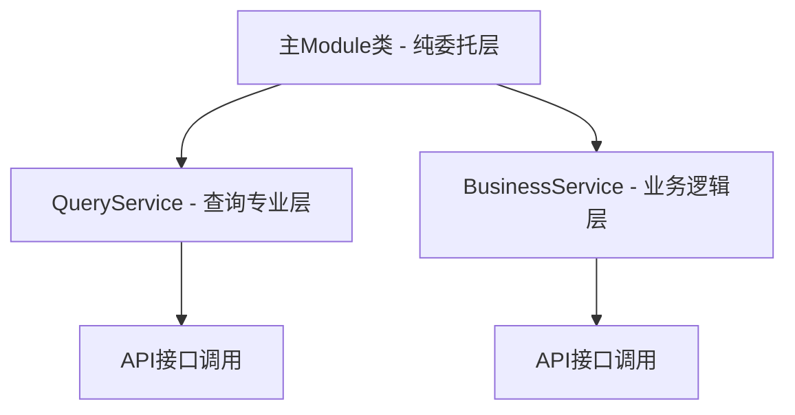

# UltraThink双层架构模式验证指南

> 🎯 **目标**: 确保所有模块严格遵循UltraThink双层架构标准，维护系统架构一致性

## 📋 概述

本文档提供UltraThink双层架构模式的完整验证指南，包括自动化验证工具使用、手动检查清单和常见问题解决方案。所有新模块和现有模块的修改都必须通过这些验证标准。

### 架构模式简介

**UltraThink双层架构**采用以下标准模式：



**核心原则**：
- **职责分离**: 每层有明确的单一职责
- **纯委托模式**: 主Module不包含业务逻辑
- **接口统一**: 统一的`ServiceResult<T>`响应格式
- **异步优先**: 所有IO操作使用async/await

## 🔍 自动化验证工具

### ServiceDiscovery验证器

项目集成了自动化架构模式验证器，位于 `ServiceDiscovery.cs`：

#### 使用方式

```csharp
// 在服务注册时自动验证
services.RegisterServicesWithConfiguration(moduleConfigs);

// 手动验证特定模块
var isValid = ServiceDiscovery.ValidateUltraThinkArchitecturePattern(typeof(UserModule));
```

#### 验证覆盖范围

- ✅ **UltraThink架构模式验证**
- ✅ **依赖注入模式检查**
- ✅ **委托模式验证**
- ✅ **服务类型识别**
- ✅ **参数命名约定检查**

### 验证结果解读

```csharp
// 验证通过示例
✅ UserModule: UltraThink架构模式验证通过
   - QueryService依赖: ✓ IUserQueryService
   - BusinessService依赖: ✓ IUserBusinessService  
   - 委托模式: ✓ 所有方法均为纯委托
   - 参数约定: ✓ 符合命名标准

// 验证失败示例  
❌ ExampleModule: UltraThink架构模式验证失败
   - QueryService依赖: ❌ 缺失IExampleQueryService
   - BusinessService依赖: ❌ 缺失IExampleBusinessService
   - 委托模式: ❌ 发现业务逻辑在主Module中
```

## 📝 手动验证清单

### 第一级：架构结构验证

#### 1.1 文件组织结构

```
Modules/{ModuleName}/
├── Interfaces/
│   ├── I{ModuleName}QueryService.cs      ✅ 必须存在
│   └── I{ModuleName}BusinessService.cs   ✅ 必须存在
├── Services/
│   ├── {ModuleName}Module.cs            ✅ 主Module类
│   ├── {ModuleName}QueryService.cs      ✅ 查询服务实现
│   └── {ModuleName}BusinessService.cs   ✅ 业务服务实现
├── ViewModels/                          ✅ 视图模型
├── Views/                               ✅ 用户界面
└── {ModuleName}Module.cs               ✅ Prism注册类
```

**验证检查点**：
- [ ] 目录结构完整，无缺失文件
- [ ] 命名约定一致（PascalCase，复数模块名）
- [ ] 接口和实现文件一一对应

#### 1.2 类继承和接口实现

**主Module类验证**：
```csharp
// ✅ 正确实现
public class UserModule(
    IUserQueryService queryService,
    IUserBusinessService businessService) : IUserService

// ❌ 错误实现
public class UserModule : IUserService, IUserModule  // 多余的接口
```

**QueryService验证**：
```csharp
// ✅ 正确实现
public class UserQueryService(
    ILogger<UserQueryService> logger,
    IUserApi userApi) : IUserQueryService

// ❌ 错误实现  
public class UserQueryService : IUserQueryService, IUserBusinessService  // 接口混乱
```

### 第二级：委托模式验证

#### 2.1 主Module类纯委托检查

**正确的委托模式**：
```csharp
✅ 纯委托实现
public async Task<ServiceResult<UserDto>> GetByIdAsync(Guid id)
    => await _queryService.GetByIdAsync(id);

public async Task<ServiceResult<UserDto>> CreateAsync(UserMutationDto dto)
    => await _businessService.CreateAsync(dto);
```

**禁止的实现**：
```csharp
❌ 包含业务逻辑
public async Task<ServiceResult<UserDto>> GetByIdAsync(Guid id)
{
    if (id == Guid.Empty)  // ❌ 验证逻辑应在BusinessService
        return ServiceResult<UserDto>.Failure("无效ID");
        
    var result = await _queryService.GetByIdAsync(id);
    
    // ❌ 数据处理逻辑应在QueryService或BusinessService
    if (result.IsSuccess)
    {
        result.Data.LastAccessTime = DateTime.Now;
    }
    
    return result;
}
```

#### 2.2 职责分离验证

**QueryService职责范围**（✅ 允许）：
- 数据查询和检索
- 搜索和过滤操作
- 分页和排序逻辑
- 数据格式转换
- 缓存读取操作

**QueryService禁止操作**（❌ 不允许）：
- 数据修改操作
- 状态变更逻辑
- 业务规则验证
- 事务管理
- 缓存写入操作

**BusinessService职责范围**（✅ 允许）：
- CRUD操作
- 业务规则验证
- 状态管理和转换
- 事务协调
- 缓存管理
- 业务流程编排

### 第三级：响应格式验证

#### 3.1 ServiceResult使用检查

**正确的响应格式**：
```csharp
✅ 统一响应格式
public async Task<ServiceResult<UserDto>> GetByIdAsync(Guid id)
{
    try
    {
        var refitResponse = await _userApi.GetByIdAsync(id);
        
        if (refitResponse.IsSuccessStatusCode && refitResponse.Content != null)
        {
            var apiResponse = refitResponse.Content;
            if (apiResponse.Success && apiResponse.Data != null)
            {
                return ServiceResult<UserDto>.Success(apiResponse.Data);
            }
            return ServiceResult<UserDto>.Failure(apiResponse.Message ?? "操作失败");
        }
        
        return ServiceResult<UserDto>.Failure("网络请求失败");
    }
    catch (Exception ex)
    {
        _logger.LogError(ex, "操作异常");
        return ServiceResult<UserDto>.Failure("操作过程发生错误");
    }
}
```

**禁止的响应处理**：
```csharp
❌ 直接抛出异常
public async Task<ServiceResult<UserDto>> GetByIdAsync(Guid id)
{
    var response = await _userApi.GetByIdAsync(id);
    return response.Content.Data;  // ❌ 未处理异常和错误响应
}

❌ 不一致的响应格式
public async Task<UserDto> GetByIdAsync(Guid id)  // ❌ 应返回ServiceResult<UserDto>
{
    // ...
}
```

### 第四级：异步模式验证

#### 4.1 异步操作检查

**正确的异步实现**：
```csharp
✅ 正确的async/await模式
public async Task<ServiceResult<UserDto>> GetByIdAsync(Guid id)
{
    var result = await _userApi.GetByIdAsync(id);
    return ProcessApiResponse(result);
}

✅ 正确的异步委托
public async Task<ServiceResult<UserDto>> GetByIdAsync(Guid id)
    => await _queryService.GetByIdAsync(id);
```

**禁止的异步实现**：
```csharp
❌ async void方法
public async void DeleteUserAsync(Guid id)  // ❌ 应返回Task或Task<T>
{
    await _businessService.DeleteAsync(id);
}

❌ 阻塞异步调用
public ServiceResult<UserDto> GetByIdAsync(Guid id)
{
    return _queryService.GetByIdAsync(id).Result;  // ❌ 可能死锁
}

❌ 不必要的Task.Run
public async Task<ServiceResult<UserDto>> GetByIdAsync(Guid id)
{
    return await Task.Run(async () =>  // ❌ 不必要的线程切换
        await _queryService.GetByIdAsync(id));
}
```

## 🔧 常见问题和修复方案

### 问题1：架构模式违规

**症状**：主Module类包含业务逻辑
```csharp
❌ 问题代码
public async Task<ServiceResult<UserDto>> CreateAsync(UserMutationDto dto)
{
    // ❌ 验证逻辑不应在主Module中
    if (string.IsNullOrEmpty(dto.Username))
        return ServiceResult<UserDto>.Failure("用户名不能为空");
        
    return await _businessService.CreateAsync(dto);
}
```

**修复方案**：
```csharp
✅ 修复后代码
// 主Module：纯委托
public async Task<ServiceResult<UserDto>> CreateAsync(UserMutationDto dto)
    => await _businessService.CreateAsync(dto);

// BusinessService：包含验证逻辑
public async Task<ServiceResult<UserDto>> CreateAsync(UserMutationDto dto)
{
    ArgumentNullException.ThrowIfNull(dto, nameof(dto));
    
    if (string.IsNullOrEmpty(dto.Username))
        return ServiceResult<UserDto>.Failure("用户名不能为空");
        
    // 继续业务逻辑...
}
```

### 问题2：依赖注入配置错误

**症状**：服务解析失败
```csharp
❌ 问题配置
containerRegistry.RegisterSingleton<UserModule>();
// ❌ 缺少接口映射
```

**修复方案**：
```csharp
✅ 正确配置
// UltraThink双层架构：注册Query和Business服务
containerRegistry.RegisterSingleton<IUserQueryService, UserQueryService>();
containerRegistry.RegisterSingleton<IUserBusinessService, UserBusinessService>();

// UltraThink修复：模块自己注册服务接口实现
containerRegistry.RegisterSingleton<UserModule>();
containerRegistry.RegisterSingleton<IUserService>(container => 
    container.Resolve<UserModule>());
```

### 问题3：异常处理不规范

**症状**：异常传播到UI层
```csharp
❌ 问题代码
public async Task<ServiceResult<UserDto>> GetByIdAsync(Guid id)
{
    var response = await _userApi.GetByIdAsync(id);  // ❌ 可能抛出异常
    return ServiceResult<UserDto>.Success(response.Content.Data);
}
```

**修复方案**：
```csharp
✅ 正确异常处理
public async Task<ServiceResult<UserDto>> GetByIdAsync(Guid id)
{
    try
    {
        _logger.LogDebug("查询用户详情: {UserId}", id);
        
        var refitResponse = await _userApi.GetByIdAsync(id);
        
        if (refitResponse.IsSuccessStatusCode && refitResponse.Content != null)
        {
            var apiResponse = refitResponse.Content;
            if (apiResponse.Success && apiResponse.Data != null)
            {
                return ServiceResult<UserDto>.Success(apiResponse.Data);
            }
            return ServiceResult<UserDto>.Failure(apiResponse.Message ?? "获取用户详情失败");
        }
        
        return ServiceResult<UserDto>.Failure("获取用户详情网络请求失败");
    }
    catch (Exception ex)
    {
        _logger.LogError(ex, "查询用户详情异常: {UserId}", id);
        return ServiceResult<UserDto>.Failure("获取用户详情失败");
    }
}
```

## 🧪 验证测试用例

### 单元测试验证

```csharp
[Test]
public void UserModule_ShouldImplementPureDelegationPattern()
{
    // 验证主Module所有方法都是纯委托
    var moduleType = typeof(UserModule);
    var methods = moduleType.GetMethods(BindingFlags.Public | BindingFlags.Instance);
    
    foreach (var method in methods.Where(m => m.DeclaringType == moduleType))
    {
        // 验证方法体只包含委托调用
        var methodBody = GetMethodBody(method);
        Assert.That(methodBody.ContainsBusinessLogic, Is.False, 
            $"Method {method.Name} contains business logic");
    }
}

[Test]
public void QueryService_ShouldOnlyContainQueryMethods()
{
    var queryServiceType = typeof(UserQueryService);
    var methods = queryServiceType.GetMethods(BindingFlags.Public | BindingFlags.Instance);
    
    foreach (var method in methods.Where(m => m.DeclaringType == queryServiceType))
    {
        // 验证QueryService方法不修改状态
        Assert.That(method.Name, Does.Not.Contain("Create"));
        Assert.That(method.Name, Does.Not.Contain("Update"));
        Assert.That(method.Name, Does.Not.Contain("Delete"));
    }
}
```

### 集成测试验证

```csharp
[Test]
public async Task Module_ShouldFollowUltraThinkPattern()
{
    // 设置
    var serviceProvider = BuildServiceProvider();
    var userService = serviceProvider.GetRequiredService<IUserService>();
    
    // 验证服务可正确解析
    Assert.That(userService, Is.Not.Null);
    Assert.That(userService, Is.InstanceOf<UserModule>());
    
    // 验证委托模式工作正常
    var result = await userService.GetByIdAsync(Guid.NewGuid());
    Assert.That(result, Is.Not.Null);
    Assert.That(result, Is.InstanceOf<ServiceResult<UserDto>>());
}
```

## 📊 验证报告模板

### 模块架构验证报告

```markdown
# {ModuleName}模块架构验证报告

## 基本信息
- 模块名称: {ModuleName}
- 验证日期: {Date}
- 验证人员: {Developer}
- 验证工具版本: {Version}

## 验证结果总览
- 架构合规性: ✅/❌
- 代码质量: ✅/❌  
- 测试覆盖率: {Percentage}%
- 总体评分: {Score}/100

## 详细验证结果

### 1. 架构结构验证
- [ ] 文件组织结构完整
- [ ] 命名约定符合标准
- [ ] 接口实现正确

### 2. 委托模式验证  
- [ ] 主Module纯委托实现
- [ ] QueryService职责单一
- [ ] BusinessService边界清晰

### 3. 响应格式验证
- [ ] ServiceResult统一使用
- [ ] 异常处理完整
- [ ] 错误消息友好

### 4. 异步模式验证
- [ ] 正确使用async/await
- [ ] 避免异步陷阱
- [ ] 性能优化合理

## 发现的问题
1. {问题描述} - {严重程度} - {修复建议}

## 改进建议
1. {改进项目} - {预期效果}

## 总结
{总体评价和后续行动计划}
```

## 🚀 持续改进

### 自动化验证增强

1. **静态代码分析**：集成Roslyn分析器进行编译时验证
2. **CI/CD集成**：在构建流水线中自动执行架构验证
3. **代码质量门禁**：不符合标准的代码无法合并

### 工具链扩展

1. **Visual Studio扩展**：实时架构模式检查
2. **代码生成器**：基于模板的自动代码生成
3. **重构工具**：自动将旧模式代码迁移到UltraThink架构

### 团队协作

1. **Code Review清单**：标准化的架构审查项目
2. **培训材料**：UltraThink架构最佳实践培训
3. **知识分享**：定期的架构设计讨论会

---

## 📞 支持和反馈

### 获取帮助
- **技术支持**: 架构团队
- **文档更新**: 提交PR到文档仓库
- **工具问题**: 开发工具团队

### 反馈渠道
- **改进建议**: 通过Issue tracker提交
- **最佳实践**: 分享您的经验和发现
- **工具增强**: 参与工具开发讨论

**记住：架构一致性是系统可维护性的基础，每个人都是架构质量的守护者！**