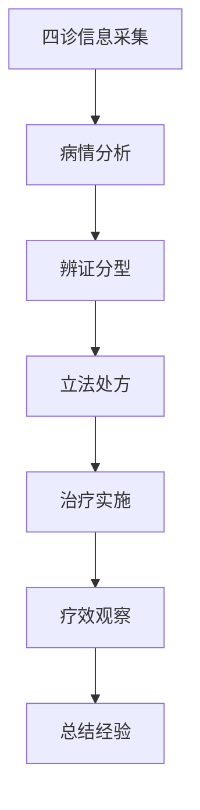

# 中医诊断完整教程

> **学习导向**: 面向零基础用户，提供手把手的中医诊断学习指导
> **学习时间**: 90分钟
> **适合人群**: 中医医生、实习医师、中医学生、系统管理员
> **学习方式**: 端到端、实践导向、循序渐进

## 🎯 学习目标

完成本教程后，您将能够：

- ✅ 理解LYBTZYZS中医诊断系统的四诊合参原理
- ✅ 熟练运用望闻问切四诊信息采集技术
- ✅ 掌握中医辨证论治的完整流程
- ✅ 运用中医诊断模板提高诊断效率
- ✅ 进行舌诊、脉诊等专业诊断技术
- ✅ 实现中医诊断的标准化和质量控制

## 📚 学习路线图

```
第1部分: 中医诊断基础 (20分钟)
├── 四诊合参理论
├── 望闻问切详解
├── 辨证论治原则
└── 系统界面概览

第2部分: 望诊技术 (15分钟)
├── 整体望诊
├── 局部望诊
├── 舌诊技术
└── 色泽形态观察

第3部分: 闻诊问诊 (20分钟)
├── 闻诊技巧
├── 问诊方法
├── 主诉采集
└── 病史询问

第4部分: 切诊技术 (25分钟)
├── 脉诊基础
├── 舌诊技术
├── 其他切诊
└── 诊断综合分析

第5部分: 辨证论治 (10分钟)
├── 中医诊断标准
├── 辨证分析
├── 治疗原则制定
└── 实践练习
```

---

## 第1部分: 中医诊断基础 (20分钟)

### 1.1 四诊合参理论

#### 什么是四诊合参？

四诊合参是中医诊断学的核心方法，通过望、闻、问、切四种诊断手段，全面收集患者的病情信息，进行综合分析和判断。

```csharp
// 四诊信息数据模型
public class ConsultationDto
{
    // 望诊信息
    [DisplayName("望诊")]
    public string Inspection { get; set; }

    // 闻诊信息（包含听声音和闻气味）
    [DisplayName("闻诊")]
    public string AuscultationOlfaction { get; set; }

    // 问诊信息
    [DisplayName("问诊")]
    public string Inquiry { get; set; }

    // 切诊信息（包含脉诊、舌诊等）
    [DisplayName("切诊")]
    public string Palpation { get; set; }

    // 中医诊断结果
    [DisplayName("中医辨证")]
    public string TCMDiagnosis { get; set; }

    [DisplayName("治疗原则")]
    public string TreatmentPrinciple { get; set; }
}
```

**四诊合参的核心价值**:
- **全面性**: 从不同维度收集病情信息
- **互补性**: 各种诊断方法互相印证补充
- **科学性**: 基于中医理论的系统化诊断
- **实用性**: 指导临床治疗决策

#### LYBTZYZS系统中的四诊实现

```csharp
// 四诊信息Service实现
public class ConsultationService : IConsultationService
{
    // 保存四诊信息
    public async Task<ConsultationEntity> SaveFourDiagnosisAsync(
        Guid medicalCaseId,
        FourDiagnosisDto fourDiagnosis)
    {
        var consultation = await _repository.GetByIdAsync(medicalCaseId);

        if (consultation == null)
        {
            throw new NotFoundException("辨证记录不存在");
        }

        // 保存望诊信息
        if (!string.IsNullOrEmpty(fourDiagnosis.Inspection))
        {
            consultation.Inspection = await ProcessInspectionAsync(fourDiagnosis.Inspection);
        }

        // 保存闻诊信息
        if (!string.IsNullOrEmpty(fourDiagnosis.AuscultationOlfaction))
        {
            consultation.AuscultationOlfaction = await ProcessAuscultationOlfactionAsync(
                fourDiagnosis.AuscultationOlfaction);
        }

        // 保存问诊信息
        if (!string.IsNullOrEmpty(fourDiagnosis.Inquiry))
        {
            consultation.Inquiry = await ProcessInquiryAsync(fourDiagnosis.Inquiry);
        }

        // 保存切诊信息
        if (!string.IsNullOrEmpty(fourDiagnosis.Palpation))
        {
            consultation.Palpation = await ProcessPalpationAsync(fourDiagnosis.Palpation);
        }

        // 标记Step 1完成
        consultation.Step1CompletedAt = DateTime.Now;

        return await _repository.UpdateAsync(consultation);
    }
}
```

### 1.2 辨证论治原则

#### 中医诊断标准流程



**辨证论治的关键环节**:

1. **病情分析**: 整理四诊信息，分析病情特点
2. **辨证分型**: 确定证型病机和病位
3. **立法处方**: 制定治疗原则和具体方药
4. **治疗实施**: 选择合适的治疗手段
5. **疗效观察**: 跟踪治疗效果
6. **总结经验**: 积累临床经验

### 1.3 实践练习1: 四诊基础认识

**练习目标**: 熟悉四诊基本概念和系统操作

**练习步骤**:

1. **理论学习**:
   - 阅读四诊合参的理论基础
   - 了解各诊法的适用范围
   - 理解四诊信息的互补关系

2. **系统界面熟悉**:
   - 打开LYBTZYZS系统的诊断界面
   - 识别四诊信息的录入区域
   - 了解诊断流程的操作顺序

3. **案例分析**:
   - 查看系统中的典型诊断案例
   - 分析四诊信息的完整性
   - 理解诊断结果的逻辑

**验证清单**:
- [ ] 能够说出四诊的具体内容
- [ ] 熟悉系统的诊断界面布局
- [ ] 理解四诊信息的重要性
- [ ] 掌握基本的辨证流程

---

## 第2部分: 望诊技术 (15分钟)

### 2.1 望诊基础理论

#### 望诊的内容和要点

**望诊**是通过视觉观察患者的神色形态、局部病变和排出物等，以判断病情的一种诊断方法。

```csharp
// 望诊信息处理
public class InspectionProcessor
{
    public async Task<string> ProcessInspectionAsync(string inspectionInput)
    {
        var inspection = new InspectionAnalysis
        {
            // 整体望诊
            GeneralAppearance = AnalyzeGeneralAppearance(inspectionInput),

            // 局部望诊
            LocalExamination = AnalyzeLocalExamination(inspectionInput),

            // 排出物望诊
            ExcretionObservation = AnalyzeExcretion(inspectionInput),

            // 舌诊观察
            TongueObservation = ExtractTongueInfo(inspectionInput)
        };

        // 生成结构化望诊记录
        return await GenerateInspectionRecordAsync(inspection);
    }

    private GeneralAppearanceAnalysis AnalyzeGeneralAppearance(string input)
    {
        return new GeneralAppearanceAnalysis
        {
            Spirit = ExtractSpiritCondition(input),      // 神态
            Expression = ExtractFacialExpression(input),  // 面色表情
            Complexion = ExtractComplexion(input),        // 气色
            Constitution = ExtractBodyConstitution(input)   // 体质类型
        };
    }
}
```

#### 望诊的标准化操作

1. **神色望诊**:
   - 神志状态：有神、少神、失神、假神
   - 面色变化：常色、病色、面色
   - 形态表现：动态、静态、异常姿态

2. **形态望诊**:
   - 胖瘦适中：判断体质强弱
   - 发育状况：儿童发育、成人形态
   - 异常形态：畸形、水肿、肿块

3. **局部望诊**:
   - 头面部：眼、耳、鼻、口、咽喉
   - 皮肤：颜色、纹理、皮疹、疮疡
   - 毛发：颜色、光泽、分布、脱落

### 2.2 舌诊专业操作

#### 舌诊理论基础

舌诊是中医特色的重要诊断方法，通过观察舌象的变化来判断脏腑气血的盛衰和病变性质。

```csharp
// 舌诊分析Service
public class TongueDiagnosisService
{
    public async Task<TongueDiagnosisResult> AnalyzeTongueAsync(
        TongueExaminationDto tongueData)
    {
        var analysis = new TongueDiagnosisResult();

        // 舌体分析
        analysis.TongueBody = await AnalyzeTongueBodyAsync(tongueData);

        // 舌质分析
        analysis.TongueCoating = await AnalyzeTongueCoatingAsync(tongueData);

        // 舌苔分析
        analysis.TongueFur = await AnalyzeTongueFurAsync(tongueData);

        // 舌形分析
        analysis.TongueShape = await AnalyzeTongueShapeAsync(tongueData);

        // 舌下络脉分析
        analysis.SublingualVeins = await AnalyzeSublingualVeinsAsync(tongueData);

        // 综合判断
        analysis.Diagnosis = await GenerateTongueDiagnosisAsync(analysis);

        return analysis;
    }

    private async Task<TongueBodyAnalysis> AnalyzeTongueBodyAsync(TongueExaminationDto data)
    {
        return new TongueBodyAnalysis
        {
            Color = AnalyzeTongueColor(data.TongueColor),
            Size = AnalyzeTongueSize(data.TongueSize),
            Moisture = AnalyzeTongueMoisture(data.TongueMoisture),
            Mobility = AnalyzeTongueMobility(data.TongueMobility),
            Abnormalities = DetectTongueAbnormalities(data)
        };
    }
}
```

#### 舌诊标准化操作步骤

1. **准备阶段**:
   - 让患者自然伸舌，放松面部肌肉
   - 确保光线充足、自然光为佳
   - 避免食物、药物染色影响

2. **观察顺序**:
   - 先观察舌体整体：颜色、大小、形态
   - 再观察舌质：荣润、枯槁、胖瘦
   - 然后观察舌苔：厚薄、颜色、分布
   - 最后观察舌下：络脉、瘀斑

3. **记录标准**:
   - 颜色：淡红、红、淡白、青紫、绛红等
   - 形态：正常、胖大、瘦薄、裂纹、齿痕等
   - 苔质：薄、厚、腻、燥、滑、剥落等
   - 分布：全舌、局部、偏侧、点状、条状

### 2.3 实践练习2: 望诊技能实战

**练习目标**: 掌握望诊的基本技能和标准化操作

**练习场景**: 模拟一位患者的望诊检查

**练习步骤**:

1. **整体望诊**:
   - 观察患者的精神状态
   - 评估面色变化（红、黄、白、青、黑）
   - 判断体质类型（强壮、虚弱、中等）
   - 注意异常形态（水肿、畸形、肿块）

2. **局部望诊**:
   - 检查面部表情和神态
   - 观察眼、耳、鼻、口、咽喉状态
   - 检查皮肤颜色和纹理
   - 注意毛发状态和分布

3. **舌诊操作**:
   - 指导患者正确伸出舌头
   - 按标准顺序观察舌象
   - 记录舌体、舌质、舌苔特征
   - 分析舌下络脉情况

4. **信息记录**:
   - 使用标准术语描述观察结果
   - 在系统中录入望诊信息
   - 拍照患者舌诊照片（如需要）
   - 生成望诊分析报告

**验证清单**:
- [ ] 能够正确指导患者进行舌诊检查
- [ ] 掌握望诊的基本顺序和要点
- [ - ] 能够识别常见的舌象异常
- [ ] 可以生成结构化的望诊记录
- [ ] 理解望诊信息在辨证中的价值

**预期结果**: 完成一次标准的望诊检查，获得详细的望诊记录。

---

## 第3部分: 闻诊问诊 (20分钟)

### 3.1 闻诊技术

#### 听声辨音

闻诊中的"听"主要是通过听患者的声音、呼吸、咳嗽等来判断病情。

```csharp
// 闻诊信息处理
public class AuscultationProcessor
{
    public async Task<string> ProcessAuscultationAsync(string auscultationInput)
    {
        var analysis = new AuscultationAnalysis
        {
            // 声音分析
            VoiceAnalysis = AnalyzeVoiceCharacteristics(auscultationInput),

            // 呼吸分析
            BreathingAnalysis = AnalyzeBreathingSounds(auscultationInput),

            // 咳嗽分析
            CoughAnalysis = AnalyzeCoughCharacteristics(auscultationInput),

            // 其他声音
            OtherSounds = AnalyzeOtherSounds(auscultationInput)
        };

        return await GenerateAuscultationRecordAsync(analysis);
    }

    private VoiceCharacteristics AnalyzeVoiceCharacteristics(string input)
    {
        return new VoiceCharacteristics
        {
            Volume = AnalyzeVoiceVolume(input),
            Clarity = AnalyzeVoiceClarity(input),
            Strength = AnalyzeVoiceStrength(input),
            Rhythm = AnalyzeVoiceRhythm(input),
            Changes = DetectVoiceChanges(input)
        };
    }
}
```

#### 闻气味分析

闻诊中的"闻"主要是通过闻患者的体味、口气、排泄物气味等来判断病情。

```csharp
public class OlfactionAnalysis
{
    public OlfactionResult AnalyzeBodyOdors(string patientInfo)
    {
        var result = new OlfactionResult();

        // 口气分析
        if (ContainsKeyWords(patientInfo, new[] { "口臭", "口气", "口干" }))
        {
            result.BreathOdor = AnalyzeBreathOdor(patientInfo);
        }

        // 汗液气味
        if (ContainsKeyWords(patientInfo, new[] { "汗臭", "体味" }))
        {
        result.BodyOdor = AnalyzeBodyOdor(patientInfo);
        }

        // 排泄物气味
        result.ExcretionOdor = AnalyzeExcretionOdors(patientInfo);

        return result;
    }
}
```

### 3.2 问诊技巧

#### 主诉采集

主诉是患者就诊时最主要的痛苦或不适，是问诊的核心内容。

```csharp
// 问诊信息处理器
public class InquiryProcessor
{
    public async Task<InquiryAnalysis> ProcessInquiryAsync(string inquiryInput)
    {
        var analysis = new InquiryAnalysis();

        // 主诉分析
        analysis.ChiefComplaint = ExtractChiefComplaint(inquiryInput);

        // 现病史采集
        analysis.PresentIllness = ExtractPresentIllness(inquiryInput);

        // 既往史询问
        analysis.PastHistory = ExtractPastHistory(inquiryInput);

        // 家族史调查
        analysis.FamilyHistory = ExtractFamilyHistory(inquiryInput);

        // 生活史询问
        analysis.LifestyleHistory = ExtractLifestyleHistory(inquiryInput);

        return analysis;
    }

    private ChiefComplaintAnalysis ExtractChiefComplaint(string input)
    {
        return new ChiefComplaintAnalysis
        {
            MainSymptom = IdentifyMainSymptom(input),
            SymptomDuration = DetermineDuration(input),
            SymptomLocation = IdentifyLocation(input),
            SymptomNature = IdentifyNature(input),
            AggravatingFactors = IdentifyAggravatingFactors(input),
            RelievingFactors = IdentifyRelievingFactors(input)
        };
    }
}
```

#### 问诊十大原则

1. **主诉优先**: 首先了解患者最主要的不适
2. **时间顺序**: 按照发病时间顺序询问
3. **空间关系**: 明确症状发生的部位和范围
4. **性质特征**: 了解症状的性质特点
5. **诱发因素**: 找出症状的诱发原因
6. **缓解因素**: 识别症状的缓解条件
7. **伴随症状**: 了解相关的其他症状
8. **全身状况**: 评估患者的整体状态
9. **既往病史**: 了解相关的疾病历史
10. **生活环境**: 考虑环境因素的影响

### 3.3 实践练习3: 问诊技能实战

**练习目标**: 掌握问诊的基本技巧和标准化流程

**练习场景**: 模拟一位患者因"头痛"就诊的问诊过程

**练习步骤**:

1. **主诉采集**:
   - "您现在最主要的困扰是什么？"
   - "这个症状有多长时间了？"
   - "疼痛的具体部位在哪里？"
   - "疼痛的性质是什么样的？"

2. **现病史询问**:
   - "症状是如何开始的？"
   - "有没有什么原因会加重或缓解？"
   - "有没有伴随的其他不适？"
   - "之前有没有看过医生或采取过治疗？"

3. **既往史调查**:
   - "以前有过类似的症状吗？"
   - "有慢性疾病吗？"
   - "有没有过敏史？"
   - "在吃什么药物？"

4. **家族史询问**:
   - "家里人有类似的疾病吗？"
   - "有遗传性疾病吗？"
   - "家人的健康状况如何？"

5. **生活史了解**:
   - "饮食习惯如何？"
   - "作息时间规律吗？"
   - "工作环境如何？"
   - "有什么特殊的生活习惯？"

**验证清单**:
- [ ] 能够按照问诊十大原则进行系统询问
- [ ] 主诉信息采集完整准确
- [ - ] 现病史询问详细有序
- [ ] 既往史调查全面无遗漏
- [ ] 能够生成结构化的问诊记录
- [ ] 掌握问诊的沟通技巧

**预期结果**: 完成一次标准的问诊流程，获得全面的患者信息。

---

## 第4部分: 切诊技术 (25分钟)

### 4.1 脉诊基础

#### 脉诊理论基础

脉诊是中医诊断的重要方法，通过触摸患者的脉搏来了解脏腑气血的盛衰和病理变化。

```csharp
// 脉诊分析Service
public class PulseDiagnosisService
{
    public async Task<PulseDiagnosisResult> AnalyzePulseAsync(
        PulseExaminationDto pulseData)
    {
        var analysis = new PulseDiagnosisResult();

        // 基础脉象分析
        analysis.BasicPulse = await AnalyzeBasicPulseAsync(pulseData);

        // 脉象特征分析
        analysis.PulseCharacteristics = await AnalyzePulseCharacteristicsAsync(pulseData);

        // 部位脉象分析
        analysis.PositionPulse = await AnalyzePositionPulseAsync(pulseData);

        // 异常脉象识别
        analysis.AbnormalPulse = IdentifyAbnormalPulses(pulseData);

        // 综合脉诊诊断
        analysis.Diagnosis = await GeneratePulseDiagnosisAsync(analysis);

        return analysis;
    }

    private async Task<BasicPulseAnalysis> AnalyzeBasicPulseAsync(PulseExaminationDto data)
    {
        return new BasicPulseAnalysis
        {
            Frequency = AnalyzePulseFrequency(data.PulseRate),
            Rhythm = AnalyzePulseRhythm(data.PulseRhythm),
            Strength = AnalyzePulseStrength(data.PulseStrength),
            Length = AnalyzePulseLength(data.PulseLength),
            Width = AnalyzePulseWidth(data.PulseWidth)
        };
    }
}
```

#### 二十八种脉象

中医经典脉象包括浮、沉、迟、数、滑、涩、虚、实、长、短、洪、微、紧、缓、弦、芤、革、牢、濡、弱、散、细、伏、动、促、结、代、疾等二十八种。

```csharp
public class PulseTypeClassifier
{
    public PulseType ClassifyPulse(PulseCharacteristics characteristics)
    {
        // 浮脉：轻取即得，如木浮水面
        if (characteristics.SurfaceLevel == "Superficial" &&
            characteristics.Strength == "Strong")
            return PulseType.Floating;

        // 沉脉：重取始得，如石沉水底
        if (characteristics.SurfaceLevel == "Deep" &&
            characteristics.Strength == "Weak")
            return PulseType.Deep;

        // 迟脉：一息四至，来去从容
        if (characteristics.Frequency >= 60 && characteristics.Frequency <= 90 &&
            characteristics.Rhythm == "Regular")
            return PulseType.Normal;

        // 数脉：一息六至，来去急促
        if (characteristics.Frequency > 90 &&
            characteristics.Rhythm == "Rapid")
            return PulseType.Rapid;

        // 滑脉：往来流利，如珠走盘
        if (characteristics.Tension == "Soft" &&
            characteristics.Rhythm == "Smooth" &&
            characteristics.Strength == "Moderate")
            return PulseType.Slippery;

        // 弦脉：往来艰涩，如刀刮竹
        if (characteristics.Tension == "Rough" &&
            characteristics.Rhythm == "Irregular" &&
            characteristics.Strength == "Weak")
            return PulseType.Choppy;

        return PulseType.Normal; // 默认返回正常脉
    }
}
```

### 4.2 切诊标准化操作

#### 脉诊操作规范

1. **环境准备**:
   - 安静的环境，避免干扰
   - 适宜的室温，避免患者受凉
   - 患者情绪稳定，呼吸自然

2. **患者准备**:
   - 患者取坐位或卧位，手臂自然放松
   - 手腕与心脏处于同一水平
   - 掌心向上，前臂自然伸展

3. **医生操作**:
   - 用食指、中指、无名指按在腕部桡动脉处
   - 轻轻用力，感受脉搏跳动
   - 调整按压力度，感受最清晰的脉象

4. **观察记录**:
   - 脉搏频率（次/分钟）
   - 脉搏节律（规律性）
   - 脉搏强度（有力、无力）
   - 脉搏长度（长脉、短脉）
   - 脉搏形态（弦脉、滑脉、涩脉等）

### 4.3 实践练习4: 切诊技能实战

**练习目标**: 掌握脉诊的基本技能和标准化操作

**练习场景**: 为三位不同患者进行脉诊检查

**练习步骤**:

**患者A: 正常成年人**
1. **环境设置**: 确保环境安静，温度适宜
2. **患者准备**: 患者坐姿正确，手臂放松
3. **医生操作**: 三指并按，调整力度
4. **脉象观察**:
   - 频率：约70次/分钟
   - 节律：规整
   - 强度：适中
   - 长度：适中
5. **结果记录**: 生成脉诊报告

**患者B: 头痛患者**
1. **脉象预期**: 可能有弦脉、紧脉
2. **特别关注**: 脉搏紧张度、频率变化
3. **对比分析**: 与正常脉象对比
4. **诊断关联**: 脉象与症状的对应关系

**患者C: 年老体弱患者**
1. **脉象预期**: 可能有细脉、弱脉
2. **力度控制**: 按压力度要轻柔
3. **仔细分辨**: 识别微弱的脉象变化
4. **综合判断**: 结合体质和年龄因素

**验证清单**:
- [ ] 能够正确进行脉诊环境准备
- [ ] 掌握标准的三指按脉技术
- [ - ] 能够识别基本的脉象特征
- [ ] 可以测定脉搏频率和节律
- [ ] 理解脉象与病情的对应关系
- [ ] 能够生成规范的脉诊记录

**预期结果**: 掌握基本的脉诊技术，能够识别常见脉象，生成脉诊分析报告。

---

## 第5部分: 辨证论治 (10分钟)

### 5.1 中医诊断标准

#### 八纲辨证

八纲辨证是中医诊断的基本方法，通过阴、阳、表、里、寒、热、虚、实八个方面来分析病情。

```csharp
public class EightPrincipleSyndromeDifferenciation
{
    public SyndromeDifferenciationResult DifferentiateSyndrome(
        ConsultationData consultationData)
    {
        var result = new SyndromeDifferenciationResult();

        // 阴阳分析
        result.YinYangBalance = AnalyzeYinYangBalance(consultationData);

        // 表里分析
        result.ExteriorInterior = AnalyzeExteriorInterior(consultationData);

        // 寒热分析
        result.ColdHeatNature = AnalyzeColdHeatNature(consultationData);

        // 虚实分析
        result.DeficiencyExcess = AnalyzeDeficiencyExcess(consultationData);

        return result;
    }

    private YinYangBalance AnalyzeYinYangBalance(ConsultationData data)
    {
        // 阴证表现
        var yinSymptoms = new[]
        {
            "畏寒", "肢冷", "舌淡", "脉沉"
        };

        // 阳证表现
        var yangSymptoms = new[]
        {
            "发热", "口渴", "舌红", "脉数"
        };

        var yinCount = yinSymptoms.Count(symptom =>
            ContainsAny(data.AllSymptoms, symptom));
        var yangCount = yangSymptoms.Count(symptom =>
            ContainsAny(data.AllSymptoms, symptom));

        return new YinYangBalance
        {
            YinScore = yinCount,
            YangScore = yangCount,
            Balance = DetermineBalance(yinCount, yangCount),
            ImbalanceType = DetermineImbalanceType(yinCount, yangCount)
        };
    }
}
```

#### 脏腑辨证

脏腑辨证是根据中医脏腑理论，分析病变部位和脏腑功能失调的辨证方法。

```csharp
public class OrganSyndromeDifferenciation
{
    public OrganSyndromeResult DifferentiateOrganSyndrome(ConsultationData data)
    {
        var result = new OrganSyndromeResult();

        // 心系辨证
        result.HeartSyndrome = AnalyzeHeartSyndrome(data);

        // 肝系辨证
        result.LiverSyndrome = AnalyzeLiverSyndrome(data);

        // 脾系辨证
        result.SpleenSyndrome = AnalyzeSpleenSyndrome(data);

        // 肺系辨证
        result.LungSyndrome = AnalyzeLungSyndrome(data);

        // 肾�系辨证
        result.KidneySyndrome = AnalyzeKidneySyndrome(data);

        return result;
    }

    private HeartSyndromeAnalysis AnalyzeHeartSyndrome(ConsultationData data)
    {
        var symptoms = data.AllSymptoms;

        if (ContainsSymptoms(symptoms, HeartSyndromeSymptoms.HeartBloodDeficiency))
        {
            return new HeartSyndromeAnalysis
            {
                Syndrome = "心血虚证",
                MainSymptoms = new[] { "心悸", "失眠", "健忘", "舌淡", "脉细弱" },
                TreatmentPrinciple = "补血养心安神"
            };
        }

        if (ContainsSymptoms(symptoms, HeartSyndromeSymptoms.HeartYangHyperactivity))
        {
            return new HeartSyndromeAnalysis
            {
                Syndrome = "心阳亢盛",
                MainSymptoms = new[] { "心悸", "烦躁", "失眠", "舌红", "脉数有力" },
                TreatmentPrinciple = "清心安神"
            };
        }

        return new HeartSyndromeAnalysis { Syndrome = "心系正常" };
    }
}
```

### 5.2 辨证分析实战

#### 辨证分析流程

```csharp
public class SyndromeAnalysisService
{
    public async Task<SyndromeAnalysisResult> AnalyzeSyndromeAsync(
        FourDiagnosisData fourDiagnosis,
        PatientBasicInfo patientInfo)
    {
        var result = new SyndromeAnalysisResult();

        // 1. 四诊信息整合
        var integratedData = await IntegrateFourDiagnosisAsync(fourDiagnosis);

        // 2. 症机分析
        result.Pathogenesis = AnalyzePathogenesis(integratedData);

        // 3. 证型诊断
        result.PatternIdentification = IdentifySyndromePattern(integratedData);

        // 4. 病位判断
        result.DiseaseLocation = DetermineDiseaseLocation(integratedData);

        // 5. 病性判断
        result.DiseaseNature = AnalyzeDiseaseNature(integratedData);

        // 6. 综合诊断
        result.Diagnosis = GenerateComprehensiveDiagnosis(
            result.Pathogenesis,
            result.PatternIdentification,
            result.DiseaseLocation,
            result.DiseaseNature);

        return result;
    }

    private async Task<FourDiagnosisIntegration> IntegrateFourDiagnosisAsync(
        FourDiagnosisData fourDiagnosis)
    {
        return new FourDiagnosisIntegration
        {
            InspectionData = ParseInspectionData(fourDiagnosis.Inspection),
            AuscultationData = ParseAuscultationData(fourDiagnosis.AuscultationOlfaction),
            InquiryData = ParseInquiryData(fourDiagnosis.Inquiry),
            PalpationData = ParsePalpationData(fourDiagnosis.Palpation)
        };
    }
}
```

### 5.3 治疗原则制定

#### 治则治疗原则

根据辨证结果，制定相应的治疗原则。

```csharp
public class TreatmentPrincipleService
{
    public TreatmentPrinciple GenerateTreatmentPrinciple(
        SyndromeAnalysisResult analysisResult)
    {
        var principle = new TreatmentPrinciple();

        switch (analysisResult.MainSyndrome)
        {
            case "风寒束表证":
                principle = new TreatmentPrinciple
                {
                    MainPrinciple = "辛温解表",
                    SpecificMethod = "发汗解表",
                    HerbalFormula = "麻黄汤加减",
                    AcupuncturePoints = "风池、大椎、列缺"
                };
                break;

            case "肝阳上亢证":
                principle = new TreatmentPrinciple
                {
                    MainPrinciple = "平肝潜阳",
                    SpecificMethod = "滋阴潜阳",
                    HerbalFormula = "天麻钩藤饮",
                    AcupuncturePoints = "太冲、太溪、行间"
                };
                break;

            case "脾胃虚弱证":
                principle = new TreatmentPrinciple
                {
                    MainPrinciple = "健脾益气",
                    SpecificMethod = "补中益气",
                    HerbalFormula = "四君子汤加减",
                    AcupuncturePoints = "足三里、中脘、关元"
                };
                break;

            case "肾阴虚证":
                principle = new TreatmentPrinciple
                {
                    MainPrinciple = "滋补肾阴",
                    SpecificMethod = "滋阴降火",
                    HerbalFormula = "六味地黄丸",
                    AcupuncturePoints = "肾俞、太溪、照海"
                };
                break;

            default:
                principle = new TreatmentPrinciple
                {
                    MainPrinciple = "调和气血",
                    SpecificMethod = "平衡阴阳",
                    HerbalFormula = "逍遥散加减",
                    AcupuncturePoints = "足三里、三阴交"
                };
                break;
        }

        return principle;
    }
}
```

### 5.4 实践练习5: 辨证论治实战

**练习目标**: 掌握中医辨证论治的完整流程

**练习场景**: 为一位"头痛、失眠、心悸"的患者进行辨证论治

**练习步骤**:

1. **四诊信息整合**:
   - 整理望诊信息：面色萎黄，精神疲惫
   - 整理闻诊信息：语声低微，口气无明显异常
   - 整理问诊信息：头痛失眠3个月，伴随心悸健忘
   - 整理切诊信息：脉细弱，舌淡苔白

2. **病机分析**:
   - 主要症状：头痛、失眠、心悸
   - 伴随症状：健忘、面色萎黄、精神疲惫
   - 病程特点：反复发作，劳累后加重
   - 体质特点：体质虚弱，气血不足

3. **证型诊断**:
   - 心血两虚证
   - 心脾两虚证
   - 肝肾阴虚证

4. **治疗原则**:
   - 主要原则：补益心脾，养血安神
   - 具体方法：健脾益气，补血养心
   - 推荐方剂：归脾汤加减
   - 针灸穴位：心俞、脾俞、足三里、三阴交

**验证清单**:
- [ ] 能够整合四诊信息进行综合分析
- [ - ] 掌握病机分析的基本方法
- [ ] 能够准确进行证型诊断
- [ ] 理解治疗原则的制定逻辑
- [ ] 可以生成规范的辨证论治方案
- [ ] 掌握中医术语的规范使用

**预期结果**: 完成一次标准的辨证论治流程，获得完整的中医诊断报告。

---

## 🎯 学习成果验收

### 知识检查点

请回答以下问题，检验学习成果：

1. **四诊合参**: 请描述望闻问切四种诊断方法的具体内容和操作要点？

2. **舌诊技术**: 舌诊中需要观察哪些要素？如何进行标准化操作？

3. **脉诊识别**: 如何识别浮脉、沉脉、弦脉、滑脉等常见脉象？

4. **八纲辨证**: 阴阳、表里、寒热、虚实八个纲的具体含义和临床表现？

5. **脏腑辨证**: 心、肝、脾、肺、肾五脏的主要证型及临床表现？

### 技能考核

完成以下实操任务：

1. **四诊技能**: 为虚拟患者完成一次完整的四诊检查
2. **舌诊技术**: 识别和分析不同类型的舌象变化
3. **脉诊技能**: 为不同患者进行脉诊并分析脉象
4. **辨证论治**: 综合运用四诊信息进行辨证论治
5. **诊断报告**: 生成规范的中医诊断报告

### 后续学习建议

恭喜完成中医诊断教程！建议继续学习：

- **深入知识**: [中医诊断系统架构设计](../../../explanation/architecture/consultation-system/tcm-diagnosis-architecture.md)
- **问题解决**: [中医诊断问题解决指南](../../../how-to-guides/modules/consultation/consultation-diagnosis-issues.md)
- **技术参考**: [中医诊断API文档](../../../reference/api/consultation.md)
- **相关模块**: [病历管理](../medicalcase/medical-case-management-tutorial.md)、[处方管理](../prescriptions/prescription-management-tutorial.md)

---

**文档类型**: Tutorial
**学习时间**: 90分钟
**难度等级**: 中高级
**更新时间**: 2025-11-22
**相关资源**: [中医诊断问题解决指南](../../../how-to-guides/modules/consultation/consultation-diagnosis-issues.md) | [API参考文档](../../../reference/api/consultation.md) | [中医术语表](../../../reference/tcm-terminology.md)