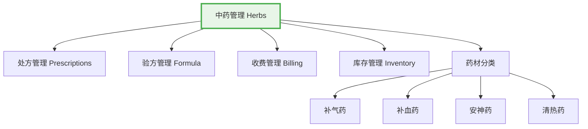

# 中药管理完全教程
**90分钟深入学习药材信息管理、价格维护、分类组织和智能搜索**

## 📋 目录

1. [系统概述](#1-系统概述) (5分钟)
2. [中药基础知识](#2-中药基础知识) (10分钟)
3. [药材数据模型详解](#3-药材数据模型详解) (10分钟)
4. [药材信息管理](#4-药材信息管理) (15分钟)
5. [价格维护管理](#5-价格维护管理) (10分钟)
6. [分类和组织管理](#6-分类和组织管理) (10分钟)
7. [智能搜索功能](#7-智能搜索功能) (8分钟)
8. [批量操作和导入](#8-批量操作和导入) (12分钟)
9. [实际业务应用](#9-实际业务应用) (10分钟)

---

## 1. 系统概述

### 1.1 中药管理在LYBTZYZS中的核心地位

中药管理是凌隐宝堂中医诊所管理系统的核心基础模块，为处方开具、验方管理、收费计算等业务提供标准化的药材数据支持。



### 1.2 系统功能概览

**核心功能**:
- 药材基础信息管理（名称、分类、规格、产地等）
- 价格体系管理（采购价、销售价、成本价）
- 智能搜索和索引（中文、拼音、分类多维度搜索）
- 分类组织和标签管理
- 批量导入和数据处理
- Excel导出和报表生成

### 1.3 业务价值

- **标准化管理**: 建立统一的药材标准和命名规范
- **价格管控**: 精确的成本核算和价格策略制定
- **效率提升**: 智能搜索提高处方开具效率
- **知识传承**: 系统化的药材知识库建设

---

## 2. 中药基础知识

### 2.1 中药分类体系

#### 2.1.1 按功效分类

**补益药**:
- **补气药**: 人参、黄芪、白术、甘草等
- **补血药**: 当归、熟地黄、白芍、阿胶等
- **补阴药**: 沙参、麦冬、枸杞子、女贞子等
- **补阳药**: 鹿茸、淫羊藿、巴戟天、肉苁蓉等

**安神药**:
- **重镇安神**: 朱砂、磁石、龙骨、牡蛎等
- **养心安神**: 酸枣仁、柏子仁、远志、合欢皮等

**清热药**:
- **清热泻火**: 石膏、知母、栀子、黄连等
- **清热燥湿**: 黄芩、黄柏、龙胆草、苦参等
- **清热解毒**: 金银花、连翘、蒲公英、板蓝根等

#### 2.1.2 按药性分类

**四气**:
- **寒性**: 石膏、知母、黄连、黄芩等
- **热性**: 附子、干姜、肉桂、吴茱萸等
- **温性**: 人参、黄芪、当归、川芎等
- **凉性**: 薄荷、菊花、桑叶、牛蒡子等

**五味**:
- **酸**: 乌梅、五味子、山茱萸、金樱子等
- **苦**: 黄连、黄芩、黄柏、大黄等
- **甘**: 人参、甘草、黄芪、熟地等
- **辛**: 麻黄、桂枝、生姜、薄荷等
- **咸**: 海藻、昆布、芒硝、牡蛎等

### 2.2 药材标准规范

#### 2.2.1 命名规范

**标准命名原则**:
- **正名优先**: 使用《中国药典》标准名称
- **别名管理**: 建立正名与别名的对应关系
- **拼音标准化**: 统一使用汉语拼音作为搜索索引

**常见别名对照**:
```csharp
public class HerbAliasMapping
{
    public static readonly Dictionary<string, string> CommonAliases = new()
    {
        // 人参别名
        ["园参"] = "人参",
        ["棒槌"] = "人参", 
        ["山参"] = "人参",
        
        // 黄芪别名
        ["黄芪"] = "黄芪",
        ["黄耆"] = "黄芪",
        ["箭芪"] = "黄芪",
        
        // 甘草别名
        ["国老"] = "甘草",
        ["甜草"] = "甘草",
        ["粉草"] = "甘草",
        
        // 当归别名
        ["干归"] = "当归",
        ["文无"] = "当归",
        ["岷当归"] = "当归"
    };
}
```

#### 2.2.2 规格标准

**常见规格标准**:
- **饮片规格**: 厚片、薄片、丝、段、块等
- **等级标准**: 一等品、二等品、三等品
- **包装规格**: 小包装(10g、20g)、大包装(500g、1000g)

### 2.3 药材质量标准

#### 2.3.1 质量等级

```csharp
public enum HerbQualityLevel
{
    Premium = 1,    // 优等品 - 道地药材、品质优良
    Standard = 2,   // 标准品 - 符合药典标准
    Ordinary = 3,   // 普通品 - 基本符合要求
    Inferior = 4    // 次等品 - 质量较差
}
```

#### 2.3.2 检验标准

**质量检验项目**:
- **外观检查**: 形状、大小、色泽、气味
- **理化指标**: 有效成分含量、重金属限量
- **微生物指标**: 细菌总数、霉菌总数
- **农药残留**: 有机磷、有机氯等农药残留

---

## 3. 药材数据模型详解

### 3.1 药材实体结构

#### 3.1.1 核心字段说明

```csharp
public class Herb : BaseEntity
{
    // 基础标识
    public string Name { get; set; }              // 药材名称（必填，1-50字符）
    public string? PinYinCode { get; set; }        // 拼音码（搜索索引）
    
    // 分类信息
    public string? Category { get; set; }          // 药材分类（如：补气药、安神药）
    public string? Origin { get; set; }            // 产地（如：云南、四川、东北）
    public string? Spec { get; set; }              // 规格（如：厚片、薄片、统货）
    
    // 计量信息
    public string Unit { get; set; }               // 单位（默认：克）
    public decimal Price { get; set; }             // 销售单价（元/单位）
    public decimal? CostPrice { get; set; }        // 成本单价（元/单位）
    
    // 药理信息
    public string? Effect { get; set; }            // 功效说明
    public string? Usage { get; set; }             // 用法用量
    public string? Remark { get; set; }            // 备注信息
    
    // 状态管理
    public CommonStatus Status { get; set; }       // 药材状态（启用/停用）
}
```

#### 3.1.2 扩展属性设计

```csharp
// 药材扩展属性（用于存储专业信息）
public class HerbExtendedProperty
{
    public Guid Id { get; set; }
    public Guid HerbId { get; set; }
    
    // 中医理论属性
    public string? Nature { get; set; }            // 药性（寒热温凉）
    public string? Flavor { get; set; }            // 药味（酸苦甘辛咸）
    public string? Meridian { get; set; }          // 归经（脏腑经络）
    
    // 现代药理
    public string? ModernResearch { get; set; }     // 现代研究进展
    public string? ActiveIngredient { get; set; }  // 有效成分
    public string? Pharmacology { get; set; }      // 药理作用
    
    // 用药禁忌
    public string? Contraindication { get; set; }  // 禁忌症
    public string? Interaction { get; set; }       // 药物相互作用
    public string? Toxicity { get; set; }          // 毒性反应
    
    // 质量控制
    public HerbQualityLevel? QualityLevel { get; set; } // 质量等级
    public string? QualityStandard { get; set; }   // 质量标准
    public string? StorageCondition { get; set; }  // 储存条件
}
```

### 3.2 数据关系设计

```mermaid
erDiagram
    HERB {
        Guid PK "药材ID"
        string "药材名称"
        string "拼音码"
        string "分类"
        string "产地"
        string "规格"
        string "单位"
        decimal "单价"
        decimal "成本价"
        string "功效说明"
        string "用法用量"
        string "备注"
        enum "状态"
        datetime "创建时间"
        string "创建人"
        datetime "更新时间"
        string "更新人"
    }
    
    HERB_ALIAS {
        Guid PK "别名ID"
        Guid FK "药材ID"
        string "别名"
        string "别名类型"
        bool "是否常用"
        datetime "创建时间"
    }
    
    HERB_CATEGORY {
        Guid PK "分类ID"
        string "分类名称"
        string "分类编码"
        Guid? FK "父分类ID"
        int "排序"
        string "备注"
    }
    
    HERB_PRICE_HISTORY {
        Guid PK "价格ID"
        Guid FK "药材ID"
        decimal "原价格"
        decimal "新价格"
        decimal "成本价"
        string "调价原因"
        string FK "操作人"
        datetime "调价时间"
    }
    
    HERB_USAGE_STATISTICS {
        Guid PK "统计ID"
        Guid FK "药材ID"
        datetime "统计日期"
        int "使用次数"
        decimal "使用总量"
        int "涉及处方数"
        decimal "总金额"
    }
    
    HERB ||--o{ HERB_ALIAS : has
    HERB ||--o{ HERB_PRICE_HISTORY : has
    HERB ||--o{ HERB_USAGE_STATISTICS : tracks
    HERB_CATEGORY ||--o{ HERB_CATEGORY : parent_child
```

### 3.3 拼音码生成算法

```csharp
public class HerbPinYinGenerator
{
    private static readonly Dictionary<char, string> PinyinMappings = new()
    {
        // 声母映射
        ['b'] = "b", ['p'] = "p", ['m'] = "m", ['f'] = "f", ['d'] = "d",
        ['t'] = "t", ['n'] = "n", ['l'] = "l", ['g'] = "g", ['k'] = "k",
        ['h'] = "h", ['j'] = "j", ['q'] = "q", ['x'] = "x", ['z'] = "z",
        ['c'] = "c", ['s'] = "s", ['r'] = "r", ['y'] = "y", ['w'] = "w",
        
        // 韵母映射（简化版）
        ['a'] = "a", ['o'] = "o", ['e'] = "e", ['i'] = "i", ['u'] = "u", ['v'] = "v"
    };

    public static string GeneratePinYinCode(string herbName)
    {
        if (string.IsNullOrEmpty(herbName))
            return string.Empty;

        var pinyinBuilder = new StringBuilder();
        
        foreach (char c in herbName)
        {
            if (IsChineseCharacter(c))
            {
                // 这里应该调用专业的拼音库，如PinyinNet
                // 简化实现，实际项目中建议使用成熟的拼音库
                pinyinBuilder.Append(GetCharacterPinyin(c));
            }
            else if (IsLetterOrDigit(c))
            {
                pinyinBuilder.Append(c.ToString().ToLower());
            }
        }

        return pinyinBuilder.ToString();
    }

    private static bool IsChineseCharacter(char c)
    {
        return c >= 0x4E00 && c <= 0x9FFF;
    }

    private static bool IsLetterOrDigit(char c)
    {
        return char.IsLetterOrDigit(c);
    }

    private static string GetCharacterPinyin(char c)
    {
        // 简化的常用汉字拼音映射
        // 实际项目应该使用完整的拼音库
        var commonPinyin = new Dictionary<char, string>
        {
            ['人'] = "ren", ['参'] = "shen", ['黄'] = "huang", ['芪'] = "qi",
            ['甘'] = "gan", ['草'] = "cao", ['当'] = "dang", ['归'] = "gui",
            ['白'] = "bai", ['芍'] = "shao", ['熟'] = "shu", ['地'] = "di",
            ['川'] = "chuan", ['芎'] = "xiong", ['红'] = "hong", ['花'] = "hua",
            ['桃'] = "tao", ['仁'] = "ren", ['酸'] = "suan", ['枣'] = "zao"
        };

        return commonPinyin.TryGetValue(c, out string pinyin) ? pinyin : c.ToString();
    }
}
```

---

## 4. 药材信息管理

### 4.1 药材创建和编辑

#### 4.1.1 新增药材

**创建药材的基本流程**:

```csharp
public class HerbCreationService
{
    public async Task<HerbDto> CreateHerbAsync(CreateHerbRequest request)
    {
        // 1. 数据验证
        await ValidateHerbDataAsync(request);

        // 2. 生成拼音码
        var pinYinCode = HerbPinYinGenerator.GeneratePinYinCode(request.Name);

        // 3. 检查重复
        await CheckDuplicateAsync(request.Name, pinYinCode);

        // 4. 创建药材实体
        var herb = new Herb
        {
            Id = Guid.NewGuid(),
            Name = request.Name,
            PinYinCode = pinYinCode,
            Category = request.Category,
            Origin = request.Origin,
            Spec = request.Spec,
            Unit = request.Unit,
            Price = request.Price,
            CostPrice = request.CostPrice,
            Effect = request.Effect,
            Usage = request.Usage,
            Remark = request.Remark,
            Status = CommonStatus.Enabled,
            CreatedBy = _currentUser.Id,
            CreatedAt = DateTime.UtcNow
        };

        // 5. 保存扩展属性
        if (request.ExtendedProperties != null)
        {
            await SaveExtendedPropertiesAsync(herb.Id, request.ExtendedProperties);
        }

        // 6. 添加别名
        if (request.Aliases?.Any() == true)
        {
            await SaveHerbAliasesAsync(herb.Id, request.Aliases);
        }

        // 7. 保存实体
        await _herbRepository.AddAsync(herb);
        await _herbRepository.SaveChangesAsync();

        // 8. 记录操作日志
        await LogOperationAsync("Create", herb.Id, request);

        return MapToHerbDto(herb);
    }

    private async Task ValidateHerbDataAsync(CreateHerbRequest request)
    {
        // 名称验证
        if (string.IsNullOrWhiteSpace(request.Name))
            throw new ValidationException("药材名称不能为空");

        if (request.Name.Length < 1 || request.Name.Length > 50)
            throw new ValidationException("药材名称长度必须在1-50字符之间");

        // 价格验证
        if (request.Price < 0)
            throw new ValidationException("价格不能为负数");

        if (request.CostPrice.HasValue && request.CostPrice.Value < 0)
            throw new ValidationException("成本价不能为负数");

        // 单位验证
        var validUnits = new[] { "g", "克", "kg", "千克", "两", "钱", "包", "盒", "瓶", "支" };
        if (!validUnits.Contains(request.Unit))
            throw new ValidationException($"无效的计量单位，支持的单位: {string.Join(", ", validUnits)}");
    }

    private async Task CheckDuplicateAsync(string name, string pinYinCode)
    {
        var existingHerb = await _herbRepository.GetByConditionAsync(
            h => h.Name == name || h.PinYinCode == pinYinCode);

        if (existingHerb != null)
        {
            throw new BusinessException($"药材已存在: {existingHerb.Name}");
        }
    }
}
```

#### 4.1.2 药材信息更新

```csharp
public async Task<HerbDto> UpdateHerbAsync(UpdateHerbRequest request)
{
    // 1. 获取现有药材
    var herb = await _herbRepository.GetByIdAsync(request.Id);
    if (herb == null)
        throw new NotFoundException("药材不存在");

    // 2. 记录变更前的数据
    var originalData = CloneHerbData(herb);

    // 3. 更新基础信息
    herb.Name = request.Name;
    herb.Category = request.Category;
    herb.Origin = request.Origin;
    herb.Spec = request.Spec;
    herb.Unit = request.Unit;
    herb.Price = request.Price;
    herb.CostPrice = request.CostPrice;
    herb.Effect = request.Effect;
    herb.Usage = request.Usage;
    herb.Remark = request.Remark;
    herb.Status = request.Status;
    herb.UpdatedBy = _currentUser.Id;
    herb.UpdatedAt = DateTime.UtcNow;

    // 4. 更新拼音码（如果名称变化）
    if (originalData.Name != request.Name)
    {
        herb.PinYinCode = HerbPinYinGenerator.GeneratePinYinCode(request.Name);
        
        // 检查新名称是否重复
        await CheckDuplicateForUpdateAsync(herb.Id, request.Name, herb.PinYinCode);
    }

    // 5. 价格变更处理
    if (Math.Abs(originalData.Price - request.Price) > 0.01m)
    {
        await RecordPriceChangeAsync(herb.Id, originalData.Price, request.Price, 
            request.PriceChangeReason);
    }

    // 6. 更新扩展属性
    if (request.ExtendedProperties != null)
    {
        await UpdateExtendedPropertiesAsync(herb.Id, request.ExtendedProperties);
    }

    // 7. 更新别名
    if (request.Aliases != null)
    {
        await UpdateHerbAliasesAsync(herb.Id, request.Aliases);
    }

    // 8. 保存更改
    await _herbRepository.UpdateAsync(herb);
    await _herbRepository.SaveChangesAsync();

    // 9. 记录操作日志
    await LogUpdateOperationAsync(originalData, herb);

    return MapToHerbDto(herb);
}
```

### 4.2 药材状态管理

#### 4.2.1 状态变更流程

```csharp
public class HerbStatusService
{
    public async Task ChangeHerbStatusAsync(Guid herbId, CommonStatus newStatus, string reason)
    {
        var herb = await _herbRepository.GetByIdAsync(herbId);
        if (herb == null)
            throw new NotFoundException("药材不存在");

        var oldStatus = herb.Status;

        // 1. 状态变更验证
        await ValidateStatusChangeAsync(herb, oldStatus, newStatus);

        // 2. 检查相关依赖
        await CheckDependenciesAsync(herbId, newStatus);

        // 3. 执行状态变更
        herb.Status = newStatus;
        herb.UpdatedBy = _currentUser.Id;
        herb.UpdatedAt = DateTime.UtcNow;

        // 4. 保存更改
        await _herbRepository.UpdateAsync(herb);
        await _herbRepository.SaveChangesAsync();

        // 5. 记录状态变更日志
        await LogStatusChangeAsync(herbId, oldStatus, newStatus, reason);

        // 6. 发送状态变更通知
        await SendStatusChangeNotificationAsync(herbId, oldStatus, newStatus);
    }

    private async Task ValidateStatusChangeAsync(Herb herb, CommonStatus oldStatus, CommonStatus newStatus)
    {
        // 禁用的药材需要检查是否在有效方剂中使用
        if (newStatus == CommonStatus.Disabled)
        {
            var activeFormulas = await _formulaRepository.GetByConditionAsync(
                f => f.Status == CommonStatus.Enabled && 
                     f.Items.Any(item => item.HerbId == herb.Id));

            if (activeFormulas.Any())
            {
                throw new BusinessException(
                    $"该药材正在 {activeFormulas.Count()} 个有效验方中使用，不能禁用。请先处理相关验方。");
            }
        }

        // 验证状态变更的合理性
        if (oldStatus == newStatus)
        {
            throw new BusinessException("药材状态没有发生变化");
        }
    }

    private async Task CheckDependenciesAsync(Guid herbId, CommonStatus newStatus)
    {
        // 检查是否被处方使用
        var activePrescriptions = await _prescriptionRepository.GetByConditionAsync(
            p => p.Status != PrescriptionStatus.Completed && 
                 p.Status != PrescriptionStatus.Cancelled &&
                 p.Items.Any(item => item.HerbId == herbId));

        if (activePrescriptions.Any() && newStatus == CommonStatus.Disabled)
        {
            throw new BusinessException(
                $"该药材正在 {activePrescriptions.Count()} 个有效处方中使用，不能禁用。");
        }

        // 检查是否有库存（如果启用了库存管理）
        if (_inventoryService.IsEnabled())
        {
            var inventory = await _inventoryService.GetInventoryAsync(herbId);
            if (inventory.Quantity > 0 && newStatus == CommonStatus.Disabled)
            {
                throw new BusinessException(
                    $"该药材还有库存数量 {inventory.Quantity}{inventory.Unit}，请先处理库存。");
            }
        }
    }
}
```

#### 4.2.2 批量状态管理

```csharp
public async Task<BatchStatusChangeResult> BatchChangeStatusAsync(
    BatchStatusChangeRequest request)
{
    var result = new BatchStatusChangeResult
    {
        TotalCount = request.HerbIds.Count,
        SuccessCount = 0,
        FailedItems = new List<BatchStatusChangeFailure>()
    };

    foreach (var herbId in request.HerbIds)
    {
        try
        {
            await ChangeHerbStatusAsync(herbId, request.NewStatus, request.Reason);
            result.SuccessCount++;
        }
        catch (Exception ex)
        {
            result.FailedItems.Add(new BatchStatusChangeFailure
            {
                HerbId = herbId,
                ErrorMessage = ex.Message
            });
        }
    }

    // 记录批量操作日志
    await LogBatchOperationAsync(result, request);

    return result;
}
```

---

## 5. 价格维护管理

### 5.1 价格体系结构

#### 5.1.1 多层次价格体系

```csharp
public class HerbPricingService
{
    public class HerbPriceStructure
    {
        public decimal BasePrice { get; set; }              // 基础价格
        public decimal CostPrice { get; set; }              // 成本价格
        public decimal WholesalePrice { get; set; }         // 批发价格
        public decimal RetailPrice { get; set; }            // 零售价格
        
        // 价格调整系数
        public decimal QualityMultiplier { get; set; } = 1.0m; // 品质系数
        public decimal OriginMultiplier { get; set; } = 1.0m;   // 产地系数
        public decimal SeasonMultiplier { get; set; } = 1.0m;  // 季节系数
        
        // 最终价格计算
        public decimal FinalPrice => BasePrice * QualityMultiplier * OriginMultiplier * SeasonMultiplier;
        
        // 利润率计算
        public decimal ProfitMargin => (FinalPrice - CostPrice) / FinalPrice;
        public decimal ProfitAmount => FinalPrice - CostPrice;
    }
}
```

#### 5.1.2 价格计算规则

```csharp
public class HerbPriceCalculator
{
    private readonly IHerbPricingRuleRepository _pricingRuleRepository;
    
    public async Task<HerbPriceStructure> CalculatePriceAsync(Guid herbId, HerbPriceContext context)
    {
        var herb = await _herbRepository.GetByIdAsync(herbId);
        var pricingRules = await _pricingRuleRepository.GetActiveRulesAsync();

        var priceStructure = new HerbPriceStructure
        {
            BasePrice = herb.Price,
            CostPrice = herb.CostPrice ?? herb.Price * 0.7m // 默认成本价为销售价的70%
        };

        // 应用品质系数
        if (context.QualityLevel.HasValue)
        {
            var qualityRule = pricingRules.FirstOrDefault(r => r.Type == PricingRuleType.Quality);
            priceStructure.QualityMultiplier = ApplyQualityMultiplier(qualityRule, context.QualityLevel.Value);
        }

        // 应用产地系数
        if (!string.IsNullOrEmpty(herb.Origin))
        {
            var originRule = pricingRules.FirstOrDefault(r => r.Type == PricingRuleType.Origin);
            priceStructure.OriginMultiplier = ApplyOriginMultiplier(originRule, herb.Origin);
        }

        // 应用季节系数
        if (context.PurchaseDate.HasValue)
        {
            var seasonRule = pricingRules.FirstOrDefault(r => r.Type == PricingRuleType.Season);
            priceStructure.SeasonMultiplier = ApplySeasonMultiplier(seasonRule, context.PurchaseDate.Value);
        }

        return priceStructure;
    }

    private decimal ApplyQualityMultiplier(PricingRule rule, HerbQualityLevel qualityLevel)
    {
        if (rule == null) return 1.0m;

        return qualityLevel switch
        {
            HerbQualityLevel.Premium => rule.GetMultiplier("premium", 1.2m),
            HerbQualityLevel.Standard => rule.GetMultiplier("standard", 1.0m),
            HerbQualityLevel.Ordinary => rule.GetMultiplier("ordinary", 0.9m),
            HerbQualityLevel.Inferior => rule.GetMultiplier("inferior", 0.7m),
            _ => 1.0m
        };
    }

    private decimal ApplyOriginMultiplier(PricingRule rule, string origin)
    {
        if (rule == null) return 1.0m;

        // 道地药材价格更高
        var famousOrigins = new[] { "东北", "云南", "四川", "甘肃", "河南" };
        if (famousOrigins.Contains(origin))
        {
            return rule.GetMultiplier("famous_origin", 1.1m);
        }

        return rule.GetMultiplier("common_origin", 1.0m);
    }

    private decimal ApplySeasonMultiplier(PricingRule rule, DateTime purchaseDate)
    {
        if (rule == null) return 1.0m;

        var month = purchaseDate.Month;
        
        // 根据不同药材的季节性调整价格
        return month switch
        {
            // 春季（3-5月）：补肝药材需求增加
            >= 3 and <= 5 when IsLiverHerb(rule.HerbCategory) => rule.GetMultiplier("spring_liver", 1.05m),
            
            // 夏季（6-8月）：清热药材需求增加
            >= 6 and <= 8 when IsHeatClearingHerb(rule.HerbCategory) => rule.GetMultiplier("summer_heat", 1.08m),
            
            // 秋季（9-11月）：润肺药材需求增加
            >= 9 and <= 11 when IsLungHerb(rule.HerbCategory) => rule.GetMultiplier("autumn_lung", 1.06m),
            
            // 冬季（12-2月）：补肾药材需求增加
            >= 12 or <= 2 when IsKidneyHerb(rule.HerbCategory) => rule.GetMultiplier("winter_kidney", 1.1m),
            
            _ => 1.0m
        };
    }
}
```

### 5.2 价格调整和审批

#### 5.2.1 价格调整流程

```csharp
public class HerbPriceAdjustmentService
{
    public async Task<PriceAdjustmentResult> RequestPriceAdjustmentAsync(PriceAdjustmentRequest request)
    {
        // 1. 验证调整权限
        await ValidateAdjustmentPermissionAsync(request);

        // 2. 计算新价格
        var currentHerb = await _herbRepository.GetByIdAsync(request.HerbId);
        var newPriceStructure = await CalculateNewPriceAsync(currentHerb, request);

        // 3. 价格合理性检查
        await ValidatePriceReasonablenessAsync(currentHerb, newPriceStructure, request);

        // 4. 创建调整记录
        var adjustmentRecord = new PriceAdjustmentRecord
        {
            Id = Guid.NewGuid(),
            HerbId = request.HerbId,
            HerbName = currentHerb.Name,
            OldPrice = currentHerb.Price,
            NewPrice = newPriceStructure.FinalPrice,
            OldCostPrice = currentHerb.CostPrice,
            NewCostPrice = newPriceStructure.CostPrice,
            AdjustmentType = request.AdjustmentType,
            AdjustmentReason = request.Reason,
            AdjustmentPercentage = CalculateAdjustmentPercentage(currentHerb.Price, newPriceStructure.FinalPrice),
            RequestedBy = _currentUser.Id,
            RequestedAt = DateTime.UtcNow,
            Status = PriceAdjustmentStatus.Pending,
            EffectiveDate = request.EffectiveDate ?? DateTime.Today
        };

        // 5. 判断是否需要审批
        var requiresApproval = await CheckApprovalRequirementAsync(currentHerb, newPriceStructure, request);

        if (requiresApproval)
        {
            await SubmitForApprovalAsync(adjustmentRecord);
            return new PriceAdjustmentResult
            {
                AdjustmentId = adjustmentRecord.Id,
                Status = PriceAdjustmentStatus.Pending,
                RequiresApproval = true,
                Message = "价格调整已提交，等待审批"
            };
        }
        else
        {
            // 直接生效
            await ApplyPriceAdjustmentAsync(adjustmentRecord);
            return new PriceAdjustmentResult
            {
                AdjustmentId = adjustmentRecord.Id,
                Status = PriceAdjustmentStatus.Approved,
                RequiresApproval = false,
                EffectivePrice = newPriceStructure.FinalPrice,
                Message = "价格调整已生效"
            };
        }
    }

    private async Task<bool> CheckApprovalRequirementAsync(Herb herb, HerbPriceStructure newPriceStructure, PriceAdjustmentRequest request)
    {
        var adjustmentPercentage = CalculateAdjustmentPercentage(herb.Price, newPriceStructure.FinalPrice);

        // 价格调整幅度超过20%需要审批
        if (Math.Abs(adjustmentPercentage) > 0.2m)
            return true;

        // 单价调整超过50元需要审批
        if (Math.Abs(newPriceStructure.FinalPrice - herb.Price) > 50m)
            return true;

        // 月销售额高的药材调整价格需要审批
        var monthlySales = await GetMonthlySalesAmountAsync(herb.Id);
        if (monthlySales > 10000m) // 月销售额超过1万元
            return true;

        // 系统定义的敏感药材需要审批
        var sensitiveHerbs = await GetSensitiveHerbListAsync();
        if (sensitiveHerbs.Contains(herb.Id))
            return true;

        return false;
    }

    public async Task<PriceAdjustmentApprovalResult> ApprovePriceAdjustmentAsync(Guid adjustmentId, ApprovalRequest approvalRequest)
    {
        var adjustment = await _priceAdjustmentRepository.GetByIdAsync(adjustmentId);
        if (adjustment == null)
            throw new NotFoundException("价格调整记录不存在");

        if (adjustment.Status != PriceAdjustmentStatus.Pending)
            throw new BusinessException("只能审批待处理的调整申请");

        // 检查审批权限
        await ValidateApprovalPermissionAsync(approvalRequest.ApproverId);

        // 审批处理
        adjustment.Status = approvalRequest.Approved ? PriceAdjustmentStatus.Approved : PriceAdjustmentStatus.Rejected;
        adjustment.ApprovedBy = approvalRequest.ApproverId;
        adjustment.ApprovedAt = DateTime.UtcNow;
        adjustment.ApprovalComments = approvalRequest.Comments;

        if (approvalRequest.Approved)
        {
            // 应用价格调整
            await ApplyPriceAdjustmentAsync(adjustment);
            
            // 设置生效日期
            if (approvalRequest.EffectiveDate.HasValue)
            {
                adjustment.EffectiveDate = approvalRequest.EffectiveDate.Value;
                await SchedulePriceChangeAsync(adjustment);
            }
            else
            {
                adjustment.EffectiveDate = DateTime.Today;
            }
        }

        await _priceAdjustmentRepository.UpdateAsync(adjustment);
        await _priceAdjustmentRepository.SaveChangesAsync();

        // 发送审批结果通知
        await SendApprovalNotificationAsync(adjustment);

        return new PriceAdjustmentApprovalResult
        {
            AdjustmentId = adjustmentId,
            Status = adjustment.Status,
            EffectiveDate = adjustment.EffectiveDate,
            NewPrice = adjustment.Status == PriceAdjustmentStatus.Approved ? adjustment.NewPrice : (decimal?)null
        };
    }
}
```

### 5.3 价格历史和分析

#### 5.3.1 价格历史记录

```csharp
public class HerbPriceHistoryService
{
    public async Task<List<HerbPriceHistoryDto>> GetPriceHistoryAsync(
        Guid herbId, 
        DateTime? startDate = null, 
        DateTime? endDate = null)
    {
        var query = _priceHistoryRepository.GetQueryable()
            .Where(h => h.HerbId == herbId);

        if (startDate.HasValue)
            query = query.Where(h => h.ChangeDate >= startDate.Value);

        if (endDate.HasValue)
            query = query.Where(h => h.ChangeDate <= endDate.Value);

        var historyRecords = await query
            .OrderByDescending(h => h.ChangeDate)
            .ToListAsync();

        return historyRecords.Select(record => new HerbPriceHistoryDto
        {
            Id = record.Id,
            ChangeDate = record.ChangeDate,
            OldPrice = record.OldPrice,
            NewPrice = record.NewPrice,
            PriceChange = record.NewPrice - record.OldPrice,
            ChangePercentage = record.ChangePercentage,
            ChangeReason = record.ChangeReason,
            ChangedBy = record.ChangedBy,
            ApprovalRequired = record.ApprovalRequired,
            ApprovedBy = record.ApprovedBy,
            ApprovedAt = record.ApprovedAt
        }).ToList();
    }

    public async Task<PriceAnalysisResult> AnalyzePriceTrendAsync(
        Guid herbId, 
        int months = 12)
    {
        var endDate = DateTime.Today;
        var startDate = endDate.AddMonths(-months);

        var history = await GetPriceHistoryAsync(herbId, startDate, endDate);
        
        if (!history.Any())
        {
            return new PriceAnalysisResult
            {
                HerbId = herbId,
                AnalysisPeriod = new DateRange(startDate, endDate),
                DataPoints = new List<PriceDataPoint>(),
                Trend = PriceTrend.Stable
            };
        }

        // 计算价格趋势数据点
        var dataPoints = history
            .GroupBy(h => new { h.ChangeDate.Year, h.ChangeDate.Month })
            .Select(g => new PriceDataPoint
            {
                Period = $"{g.Key.Year}-{g.Key.Month:D2}",
                AveragePrice = g.Average(h => h.NewPrice),
                MinPrice = g.Min(h => h.NewPrice),
                MaxPrice = g.Max(h => h.NewPrice),
                PriceChangeCount = g.Count()
            })
            .OrderBy(dp => dp.Period)
            .ToList();

        // 分析价格趋势
        var trend = AnalyzePriceTrend(dataPoints);

        return new PriceAnalysisResult
        {
            HerbId = herbId,
            AnalysisPeriod = new DateRange(startDate, endDate),
            DataPoints = dataPoints,
            Trend = trend,
            Volatility = CalculatePriceVolatility(dataPoints),
            AveragePrice = dataPoints.Average(dp => dp.AveragePrice),
            MinPrice = dataPoints.Min(dp => dp.MinPrice),
            MaxPrice = dataPoints.Max(dp => dp.MaxPrice)
        };
    }

    private PriceTrend AnalyzePriceTrend(List<PriceDataPoint> dataPoints)
    {
        if (dataPoints.Count < 2)
            return PriceTrend.Stable;

        var priceChanges = new List<decimal>();
        for (int i = 1; i < dataPoints.Count; i++)
        {
            var change = (dataPoints[i].AveragePrice - dataPoints[i-1].AveragePrice) / dataPoints[i-1].AveragePrice;
            priceChanges.Add(change);
        }

        var averageChange = priceChanges.Average();
        var totalChange = dataPoints.Last().AveragePrice - dataPoints.First().AveragePrice;
        var totalChangePercentage = totalChange / dataPoints.First().AveragePrice;

        return totalChangePercentage switch
        {
            > 0.1m => PriceTrend.Increasing,
            < -0.1m => PriceTrend.Decreasing,
            _ => PriceTrend.Stable
        };
    }

    private decimal CalculatePriceVolatility(List<PriceDataPoint> dataPoints)
    {
        if (dataPoints.Count < 2)
            return 0m;

        var prices = dataPoints.Select(dp => dp.AveragePrice).ToList();
        var mean = prices.Average();
        var variance = prices.Average(p => Math.Pow((double)(p - mean), 2));
        var standardDeviation = Math.Sqrt(variance);
        
        return (decimal)(standardDeviation / mean); // 变异系数
    }
}
```

---

## 6. 分类和组织管理

### 6.1 药材分类体系

#### 6.1.1 层级分类结构

```csharp
public class HerbCategoryService
{
    public class HerbCategoryTree
    {
        public Guid Id { get; set; }
        public string Name { get; set; }
        public string Code { get; set; }
        public Guid? ParentId { get; set; }
        public int Level { get; set; }
        public int Sort { get; set; }
        public string? Description { get; set; }
        public bool IsActive { get; set; }
        public int HerbCount { get; set; }
        
        public List<HerbCategoryTree> Children { get; set; } = new();
        
        // 计算属性
        public bool HasChildren => Children.Any();
        public string FullPath => ParentId.HasValue ? $"{GetParentPath()}/{Name}" : Name;
    }

    public async Task<List<HerbCategoryTree>> GetCategoryTreeAsync()
    {
        var categories = await _categoryRepository
            .GetAllAsync(c => c.IsActive, c => c.OrderBy(c => c.Sort));

        return BuildCategoryTree(categories);
    }

    private List<HerbCategoryTree> BuildCategoryTree(List<HerbCategory> categories)
    {
        var categoryDict = categories.ToDictionary(c => c.Id, c => new HerbCategoryTree
        {
            Id = c.Id,
            Name = c.Name,
            Code = c.Code,
            ParentId = c.ParentId,
            Level = CalculateLevel(c, categories),
            Sort = c.Sort,
            Description = c.Description,
            IsActive = c.IsActive
        });

        // 构建树形结构
        foreach (var category in categoryDict.Values)
        {
            if (category.ParentId.HasValue && categoryDict.TryGetValue(category.ParentId.Value, out var parent))
            {
                parent.Children.Add(category);
            }
        }

        // 返回根节点（ParentId为null的节点）
        return categoryDict.Values.Where(c => !c.ParentId.HasValue)
            .OrderBy(c => c.Sort)
            .ToList();
    }

    private int CalculateLevel(HerbCategory category, List<HerbCategory> allCategories)
    {
        if (!category.ParentId.HasValue)
            return 1;

        var parent = allCategories.FirstOrDefault(c => c.Id == category.ParentId.Value);
        return parent != null ? CalculateLevel(parent, allCategories) + 1 : 1;
    }
}
```

#### 6.1.2 标准分类体系

```csharp
public static class StandardHerbCategories
{
    // 一级分类：按功效大类
    public static readonly List<HerbCategoryDefinition> PrimaryCategories = new()
    {
        new HerbCategoryDefinition { Code = "BU_YI", Name = "补益药", Description = "补气、补血、补阴、补阳类药物" },
        new HerbCategoryDefinition { Code = "AN_SHEN", Name = "安神药", Description = "养心安神、重镇安神药物" },
        new HerbCategoryDefinition { Code = "QING_RE", Name = "清热药", Description = "清热泻火、清热燥湿、清热解毒药物" },
        new HerbCategoryDefinition { Code = "WEN_LI", Name = "温里药", Description = "温中散寒、回阳救逆药物" },
        new HerbCategoryDefinition { Code = "LI_QI", Name = "理气药", Description = "疏肝理气、行气止痛药物" },
        new HerbCategoryDefinition { Code = "HUA_XUE", Name = "活血药", Description = "活血化瘀、通络止痛药物" },
        new HerbCategoryDefinition { Code = "QU_SHI", Name = "祛湿药", Description = "芳香化湿、利水渗湿药物" },
        new HerbCategoryDefinition { Code = "QI_FENG", Name = "祛风药", Description = "祛风散寒、祛风清热药物" },
        new HerbCategoryDefinition { Code = "KAI_GUI", Name = "开窍药", Description = "开窍醒神药物" },
        new HerbCategoryDefinition { Code = "SHUAI_XIA", Name = "泻下药", Description = "攻下、润下、峻下药物" },
        new HerbCategoryDefinition { Code = "QING_RE_JIE_DU", Name = "清热解毒", Description = "清热解毒、凉血消痈药物" },
        new HerbCategoryDefinition { Code = "PING_FEI", Name = "平肝药", Description = "平肝潜阳、息风止痉药物" },
        new HerbCategoryDefinition { Code = "GUA_TANG", Name = "固涩药", Description = "固表止汗、涩肠止泻、固精止遗药物" },
        new HerbCategoryDefinition { Code = "HUA_TAN", Name = "化痰药", Description = "温化寒痰、清热化痰、润燥化痰药物" },
        new HerbCategoryDefinition { Code = "XIAO_SHI", Name = "消食药", Description = "消食导滞、健胃消食药物" },
        new HerbCategoryDefinition { Code = "QU_HAN", Name = "祛寒药", Description = "温中祛寒、回阳救逆药物" },
        new HerbCategoryDefinition { Code = "LI_XUE", Name = "理血药", Description = "活血调经、止血、凉血药物" }
    };

    // 二级分类：补益药细分
    public static readonly List<HerbCategoryDefinition> BuYiSubCategories = new()
    {
        new HerbCategoryDefinition { Code = "BU_YI_BU_QI", Name = "补气药", ParentCode = "BU_YI", Description = "补益元气、健脾益肺药物" },
        new HerbCategoryDefinition { Code = "BU_YI_BUE_XUE", Name = "补血药", ParentCode = "BU_YI", Description = "补血养血、调经活血药物" },
        new HerbCategoryDefinition { Code = "BU_YI_BU_YIN", Name = "补阴药", ParentCode = "BU_YI", Description = "滋阴润燥、养阴清热药物" },
        new HerbCategoryDefinition { Code = "BU_YI_BU_YANG", Name = "补阳药", ParentCode = "BU_YI", Description = "温补肾阳、填精益髓药物" }
    };

    // 三级分类：补气药细分
    public static readonly List<HerbCategoryDefinition> BuQiSubCategories = new()
    {
        new HerbCategoryDefinition { Code = "BU_QI_YUAN_QI", Name = "补元气", ParentCode = "BU_YI_BU_QI", Description = "大补元气药物" },
        new HerbCategoryDefinition { Code = "BU_QI_JIAN_PI", Name = "健脾益气", ParentCode = "BU_YI_BU_QI", Description = "健脾益气药物" },
        new HerbCategoryDefinition { Code = "BU_QI_YI_FEI", Name = "补益肺气", ParentCode = "BU_YI_BU_QI", Description = "补益肺气药物" }
    };
}
```

### 6.2 药材标签管理

#### 6.2.1 标签系统设计

```csharp
public class HerbTagService
{
    public class HerbTag
    {
        public Guid Id { get; set; }
        public string Name { get; set; }
        public string? Description { get; set; }
        public string? Color { get; set; }
        public TagType Type { get; set; }
        public int UsageCount { get; set; }
        public DateTime CreatedAt { get; set; }
        public bool IsActive { get; set; }
    }

    public enum TagType
    {
        Functional,      // 功能性标签（如：安神、补气）
        Quality,        // 品质标签（如：道地、有机）
        Seasonal,       // 季节性标签（如：春季、冬季）
        Toxicity,       // 毒性标签（如：无毒、小毒）
        Origin,         // 产地标签（如：东北、云南）
        Processing,     // 加工标签（如：蜜制、酒制）
        Custom         // 自定义标签
    }

    public async Task<List<HerbTagDto>> GetPopularTagsAsync(int limit = 20)
    {
        var tags = await _tagRepository.GetQueryable()
            .Where(t => t.IsActive)
            .OrderByDescending(t => t.UsageCount)
            .Take(limit)
            .ToListAsync();

        return tags.Select(MapToTagDto).ToList();
    }

    public async Task<TagSuggestionResult> SuggestTagsAsync(Guid herbId)
    {
        var herb = await _herbRepository.GetByIdAsync(herbId);
        var suggestions = new List<TagSuggestion>();

        // 基于药材名称的标签建议
        suggestions.AddRange(await GenerateNameBasedSuggestionsAsync(herb.Name));

        // 基于药材功效的标签建议
        if (!string.IsNullOrEmpty(herb.Effect))
        {
            suggestions.AddRange(await GenerateEffectBasedSuggestionsAsync(herb.Effect));
        }

        // 基于分类的标签建议
        if (!string.IsNullOrEmpty(herb.Category))
        {
            suggestions.AddRange(await GenerateCategoryBasedSuggestionsAsync(herb.Category));
        }

        return new TagSuggestionResult
        {
            HerbId = herbId,
            HerbName = herb.Name,
            Suggestions = suggestions.DistinctBy(s => s.TagId).ToList()
        };
    }

    private async Task<List<TagSuggestion>> GenerateNameBasedSuggestionsAsync(string herbName)
    {
        var suggestions = new List<TagSuggestion>();
        
        // 药材名称关键词映射
        var keywordMappings = new Dictionary<string, string[]>
        {
            ["人参"] = new[] { "补气", "大补元气", "名贵药材" },
            ["黄芪"] = new[] { "补气", "健脾益气", "常用药材" },
            ["当归"] = new[] { "补血", "调经", "女性常用药" },
            ["川芎"] = new[] { "活血", "行气止痛", "头痛要药" },
            ["酸枣仁"] = new[] { "安神", "养心安神", "失眠" },
            ["柏子仁"] = new[] { "安神", "润肠通便" },
            ["黄连"] = new[] { "清热", "清热燥湿", "苦寒" },
            ["金银花"] = new[] { "清热解毒", "疏散风热", "抗病毒" },
            ["甘草"] = new[] { "调和诸药", "补气", "解毒" },
            ["茯苓"] = new[] { "利水渗湿", "健脾", "安神" }
        };

        foreach (var mapping in keywordMappings)
        {
            if (herbName.Contains(mapping.Key))
            {
                var tags = await _tagRepository.GetByConditionAsync(
                    t => mapping.Value.Contains(t.Name) && t.IsActive);

                foreach (var tag in tags)
                {
                    suggestions.Add(new TagSuggestion
                    {
                        TagId = tag.Id,
                        TagName = tag.Name,
                        Reason = $"药材名称包含关键词: {mapping.Key}",
                        Confidence = 0.9m
                    });
                }
            }
        }

        return suggestions;
    }

    private async Task<List<TagSuggestion>> GenerateEffectBasedSuggestionsAsync(string effect)
    {
        var suggestions = new List<TagSuggestion>();
        
        // 功效关键词映射
        var effectKeywords = new Dictionary<string, string[]>
        {
            ["补气"] = new[] { "补气", "益气", "健脾" },
            ["补血"] = new[] { "补血", "养血", "调经" },
            ["安神"] = new[] { "安神", "养心", "镇静" },
            ["清热"] = new[] { "清热", "泻火", "解毒" },
            ["活血"] = new[] { "活血", "化瘀", "通络" },
            ["祛湿"] = new[] { "祛湿", "利水", "化湿" },
            ["疏肝"] = new[] { "疏肝", "理气", "解郁" },
            ["止咳"] = new[] { "止咳", "平喘", "润肺" },
            ["止痛"] = new[] { "止痛", "镇痛", "活血止痛" },
            ["消食"] = new[] { "消食", "导滞", "健胃" }
        };

        foreach (var mapping in effectKeywords)
        {
            if (effect.Contains(mapping.Key))
            {
                var tags = await _tagRepository.GetByConditionAsync(
                    t => mapping.Value.Contains(t.Name) && t.IsActive);

                foreach (var tag in tags)
                {
                    suggestions.Add(new TagSuggestion
                    {
                        TagId = tag.Id,
                        TagName = tag.Name,
                        Reason = $"功效描述包含关键词: {mapping.Key}",
                        Confidence = 0.8m
                    });
                }
            }
        }

        return suggestions;
    }
}
```

### 6.3 智能分类推荐

#### 6.3.1 基于机器学习的分类推荐

```csharp
public class HerbCategoryRecommendationService
{
    public async Task<CategoryRecommendationResult> RecommendCategoryAsync(
        Guid herbId, 
        List<Guid> excludeCategoryIds = null)
    {
        var herb = await _herbRepository.GetByIdAsync(herbId);
        var recommendations = new List<CategoryRecommendation>();

        // 1. 基于名称的推荐
        var nameBasedRecommendations = await GetRecommendationsByNameAsync(herb.Name);
        recommendations.AddRange(nameBasedRecommendations);

        // 2. 基于功效的推荐
        if (!string.IsNullOrEmpty(herb.Effect))
        {
            var effectBasedRecommendations = await GetRecommendationsByEffectAsync(herb.Effect);
            recommendations.AddRange(effectBasedRecommendations);
        }

        // 3. 基于相似药材的推荐
        var similarBasedRecommendations = await GetRecommendationsBySimilarHerbsAsync(herb);
        recommendations.AddRange(similarBasedRecommendations);

        // 4. 基于统计规律的推荐
        var statisticsBasedRecommendations = await GetRecommendationsByStatisticsAsync(herb);
        recommendations.AddRange(statisticsBasedRecommendations);

        // 5. 综合评分和排序
        var scoredRecommendations = await ScoreRecommendationsAsync(recommendations);

        // 6. 过滤已排除的分类
        if (excludeCategoryIds?.Any() == true)
        {
            scoredRecommendations = scoredRecommendations
                .Where(r => !excludeCategoryIds.Contains(r.CategoryId))
                .ToList();
        }

        return new CategoryRecommendationResult
        {
            HerbId = herbId,
            HerbName = herb.Name,
            Recommendations = scoredRecommendations.Take(10).ToList()
        };
    }

    private async Task<List<CategoryRecommendation>> GetRecommendationsByNameAsync(string herbName)
    {
        var recommendations = new List<CategoryRecommendation>();

        // 药材名称到分类的映射
        var nameCategoryMappings = new Dictionary<string, List<string>>
        {
            ["人参"] = new List<string> { "补气药", "补元气药", "名贵药材" },
            ["黄芪"] = new List<string> { "补气药", "健脾益气药" },
            ["当归"] = new List<string> { "补血药", "调经药" },
            ["川芎"] = new List<string> { "活血药", "行气止痛药" },
            ["酸枣仁"] = new List<string> { "安神药", "养心安神药" },
            ["黄连"] = new List<string> { "清热药", "清热燥湿药" },
            ["金银花"] = new List<string> { "清热药", "清热解毒药" },
            ["甘草"] = new List<string> { "补气药", "调和诸药" },
            ["茯苓"] = new List<string> { "利水渗湿药", "健脾药", "安神药" },
            ["麻黄"] = new List<string> { "解表药", "辛温解表药" }
        };

        foreach (var mapping in nameCategoryMappings)
        {
            if (herbName.Contains(mapping.Key))
            {
                var categories = await _categoryRepository.GetByConditionAsync(
                    c => mapping.Value.Contains(c.Name) && c.IsActive);

                foreach (var category in categories)
                {
                    recommendations.Add(new CategoryRecommendation
                    {
                        CategoryId = category.Id,
                        CategoryName = category.Name,
                        Score = 0.9m,
                        Reason = $"药材名称'{herbName}'通常归类为'{category.Name}'",
                        Source = "NameBased"
                    });
                }
            }
        }

        return recommendations;
    }

    private async Task<List<CategoryRecommendation>> ScoreRecommendationsAsync(
        List<CategoryRecommendation> recommendations)
    {
        // 按CategoryId分组并计算综合得分
        var groupedRecommendations = recommendations
            .GroupBy(r => r.CategoryId)
            .Select(g => new CategoryRecommendation
            {
                CategoryId = g.Key,
                CategoryName = g.First().CategoryName,
                Score = CalculateCompositeScore(g.ToList()),
                Reason = string.Join("; ", g.Select(r => r.Reason)),
                Sources = g.Select(r => r.Source).ToList()
            });

        return groupedRecommendations
            .OrderByDescending(r => r.Score)
            .ToList();
    }

    private decimal CalculateCompositeScore(List<CategoryRecommendation> recommendations)
    {
        if (!recommendations.Any()) return 0m;

        // 不同来源的权重
        var sourceWeights = new Dictionary<string, decimal>
        {
            ["NameBased"] = 0.4m,
            ["EffectBased"] = 0.3m,
            ["SimilarBased"] = 0.2m,
            ["StatisticsBased"] = 0.1m
        };

        var weightedScore = 0m;
        var totalWeight = 0m;

        foreach (var rec in recommendations)
        {
            var weight = sourceWeights.GetValueOrDefault(rec.Source, 0.1m);
            weightedScore += rec.Score * weight;
            totalWeight += weight;
        }

        return totalWeight > 0 ? weightedScore / totalWeight : 0m;
    }
}
```

---

## 7. 智能搜索功能

### 7.1 多维度搜索

#### 7.1.1 全文搜索引擎

```csharp
public class HerbSearchService
{
    private readonly ISearchEngine _searchEngine;
    private readonly IHerbRepository _herbRepository;

    public async Task<HerbSearchResult> SearchAsync(HerbSearchRequest request)
    {
        // 1. 构建搜索查询
        var searchQuery = BuildSearchQuery(request);

        // 2. 执行搜索
        var searchResponse = await _searchEngine.SearchAsync(searchQuery);

        // 3. 处理搜索结果
        var herbIds = searchResponse.Hits
            .Select(h => Guid.Parse(h.Id))
            .ToList();

        // 4. 获取完整的药材信息
        var herbs = await _herbRepository.GetByIdsAsync(herbIds);

        // 5. 计算相关性得分
        var scoredHerbs = await CalculateRelevanceScoresAsync(herbs, searchResponse);

        // 6. 应用排序和分页
        var paginatedResults = ApplySortingAndPagination(scoredHerbs, request);

        return new HerbSearchResult
        {
            Herbs = paginatedResults.Items,
            TotalCount = paginatedResults.TotalCount,
            PageIndex = request.PageIndex,
            PageSize = request.PageSize,
            SearchTime = searchResponse.SearchTime,
            Suggestions = await GenerateSearchSuggestionsAsync(request),
            Facets = searchResponse.Facets
        };
    }

    private SearchQuery BuildSearchQuery(HerbSearchRequest request)
    {
        var query = new SearchQuery
        {
            Index = "herbs",
            Text = request.Keyword,
            Size = request.PageSize,
            From = (request.PageIndex - 1) * request.PageSize
        };

        // 多字段搜索
        query.Fields = new List<string>
        {
            "name^3",           // 药材名称（权重最高）
            "pinyin^2",         // 拼音码（权重中等）
            "category^2",       // 分类（权重中等）
            "effect^1.5",        // 功效（权重较低）
            "origin^1",          // 产地（权重最低）
            "remark^1"           // 备注（权重最低）
        };

        // 筛选条件
        query.Filters = new Dictionary<string, object>();

        if (request.Categories?.Any() == true)
        {
            query.Filters["category"] = request.Categories;
        }

        if (request.Origins?.Any() == true)
        {
            query.Filters["origin"] = request.Origins;
        }

        if (request.Status.HasValue)
        {
            query.Filters["status"] = request.Status.Value.ToString();
        }

        if (request.PriceRange != null)
        {
            query.Filters["price"] = new Dictionary<string, object>
            {
                ["gte"] = request.PriceRange.Min,
                ["lte"] = request.PriceRange.Max
            };
        }

        // 聚合筛选
        query.Aggregations = new Dictionary<string, Aggregation>
        {
            ["categories"] = new TermsAggregation { Field = "category" },
            ["origins"] = new TermsAggregation { Field = "origin" },
            ["price_ranges"] = new RangeAggregation
            {
                Field = "price",
                Ranges = new List<Range>
                {
                    new Range { Key = "0-10", To = 10 },
                    new Range { Key = "10-50", From = 10, To = 50 },
                    new Range { Key = "50-100", From = 50, To = 100 },
                    new Range { Key = "100+", From = 100 }
                }
            }
        };

        // 高亮设置
        query.Highlight = new Highlight
        {
            Fields = new Dictionary<string, HighlightField>
            {
                ["name"] = new HighlightField { PreTag = "<em>", PostTag = "</em>" },
                ["effect"] = new HighlightField { PreTag = "<em>", PostTag = "</em>" }
            }
        };

        return query;
    }

    private async Task<List<ScoredHerbDto>> CalculateRelevanceScoresAsync(
        List<Herb> herbs, 
        SearchResponse searchResponse)
    {
        var scoredHerbs = new List<ScoredHerbDto>();

        foreach (var herb in herbs)
        {
            var searchHit = searchResponse.Hits.FirstOrDefault(h => h.Id == herb.Id.ToString());
            var searchScore = searchHit?.Score ?? 0;

            // 计算综合得分
            var compositeScore = await CalculateCompositeScoreAsync(herb, searchScore);

            // 添加高亮信息
            var highlights = new Dictionary<string, string>();
            if (searchHit?.Highlight != null)
            {
                foreach (var highlight in searchHit.Highlight)
                {
                    highlights[highlight.Key] = string.Join(" ", highlight.Value);
                }
            }

            scoredHerbs.Add(new ScoredHerbDto
            {
                Herb = MapToHerbDto(herb),
                Score = compositeScore,
                SearchScore = searchScore,
                Highlights = highlights
            });
        }

        return scoredHerbs;
    }

    private async Task<decimal> CalculateCompositeScoreAsync(Herb herb, decimal searchScore)
    {
        var factors = new List<ScoreFactor>
        {
            // 搜索引擎得分（40%权重）
            new ScoreFactor { Name = "SearchScore", Value = NormalizeScore(searchScore), Weight = 0.4m },
            
            // 药材热度（25%权重）- 基于使用频率
            new ScoreFactor { Name = "UsagePopularity", Value = await GetUsagePopularityScoreAsync(herb.Id), Weight = 0.25m },
            
            // 价格竞争力（15%权重）- 价格越低得分越高
            new ScoreFactor { Name = "PriceCompetitiveness", Value = GetPriceCompetitivenessScore(herb.Price), Weight = 0.15m },
            
            // 库存状态（10%权重）- 有库存得分更高
            new ScoreFactor { Name = "StockStatus", Value = await GetStockStatusScoreAsync(herb.Id), Weight = 0.1m },
            
            // 质量等级（10%权重）- 质量越好得分越高
            new ScoreFactor { Name = "QualityLevel", Value = await GetQualityLevelScoreAsync(herb.Id), Weight = 0.1m }
        };

        return factors.Sum(f => f.Value * f.Weight);
    }

    private decimal NormalizeScore(decimal score)
    {
        // 将搜索引擎得分归一化到0-1范围
        return Math.Min(1m, score / 1000m);
    }

    private decimal GetPriceCompetitivenessScore(decimal price)
    {
        // 价格越低竞争力越高
        var averagePrice = 50m; // 获取药材平均价格
        return Math.Max(0m, Math.Min(1m, (averagePrice - price) / averagePrice * 0.5m + 0.5m));
    }
}
```

#### 7.1.2 智能提示和自动完成

```csharp
public class HerbAutoCompleteService
{
    public async Task<AutoCompleteResult> GetSuggestionsAsync(string query, int limit = 10)
    {
        if (string.IsNullOrWhiteSpace(query) || query.Length < 1)
            return new AutoCompleteResult { Suggestions = new List<AutoCompleteSuggestion>() };

        var suggestions = new List<AutoCompleteSuggestion>();

        // 1. 前缀匹配搜索
        var prefixMatches = await GetPrefixMatchesAsync(query, limit / 2);
        suggestions.AddRange(prefixMatches);

        // 2. 模糊匹配搜索
        var fuzzyMatches = await GetFuzzyMatchesAsync(query, limit / 2);
        suggestions.AddRange(fuzzyMatches);

        // 3. 拼音匹配搜索
        var pinyinMatches = await GetPinyinMatchesAsync(query, limit / 4);
        suggestions.AddRange(pinyinMatches);

        // 4. 去重并排序
        var uniqueSuggestions = suggestions
            .GroupBy(s => s.Text)
            .Select(g => g.OrderByDescending(s => s.Score).First())
            .OrderByDescending(s => s.Score)
            .Take(limit)
            .ToList();

        return new AutoCompleteResult
        {
            Query = query,
            Suggestions = uniqueSuggestions
        };
    }

    private async Task<List<AutoCompleteSuggestion>> GetPrefixMatchesAsync(string query, int limit)
    {
        var suggestions = new List<AutoCompleteSuggestion>();

        // 药材名称前缀匹配
        var nameMatches = await _herbRepository.GetQueryable()
            .Where(h => h.Status == CommonStatus.Enabled && 
                        h.Name.StartsWith(query))
            .Select(h => new AutoCompleteSuggestion
            {
                Text = h.Name,
                Type = SuggestionType.HerbName,
                Score = 1.0m, // 完全匹配，得分最高
                HighlightText = $"<b>{query}</b>{h.Name.Substring(query.Length)}",
                Data = new { Id = h.Id, Name = h.Name, Price = h.Price }
            })
            .OrderByDescending(h => h.Name.StartsWith(query))
            .Take(limit)
            .ToListAsync();

        suggestions.AddRange(nameMatches);

        // 分类前缀匹配
        var categoryMatches = await _categoryRepository.GetQueryable()
            .Where(c => c.IsActive && c.Name.StartsWith(query))
            .Select(c => new AutoCompleteSuggestion
            {
                Text = c.Name,
                Type = SuggestionType.Category,
                Score = 0.8m,
                HighlightText = $"<b>{query}</b>{c.Name.Substring(query.Length)}",
                Data = new { Id = c.Id, Name = c.Name, HerbCount = c.HerbCount }
            })
            .Take(limit / 2)
            .ToListAsync();

        suggestions.AddRange(categoryMatches);

        return suggestions;
    }

    private async Task<List<AutoCompleteSuggestion>> GetFuzzyMatchesAsync(string query, int limit)
    {
        var suggestions = new List<AutoCompleteSuggestion>();

        // 使用搜索引擎的模糊搜索
        var fuzzyQuery = new SearchQuery
        {
            Index = "herbs",
            Text = query,
            Fuzziness = "AUTO", // 自动模糊匹配
            Size = limit,
            Fields = new List<string> { "name", "pinyin" }
        };

        var searchResponse = await _searchEngine.SearchAsync(fuzzyQuery);

        foreach (var hit in searchResponse.Hits)
        {
            var herb = await _herbRepository.GetByIdAsync(Guid.Parse(hit.Id));
            
            suggestions.Add(new AutoCompleteSuggestion
            {
                Text = herb.Name,
                Type = SuggestionType.HerbName,
                Score = hit.Score / 1000m, // 归一化得分
                Data = new { Id = herb.Id, Name = herb.Name, Price = herb.Price }
            });
        }

        return suggestions;
    }

    private async Task<List<AutoCompleteSuggestion>> GetPinyinMatchesAsync(string query, int limit)
    {
        // 生成可能的拼音组合
        var pinyinVariants = GeneratePinyinVariants(query);
        var suggestions = new List<AutoCompleteSuggestion>();

        foreach (var pinyin in pinyinVariants)
        {
            var matches = await _herbRepository.GetQueryable()
                .Where(h => h.Status == CommonStatus.Enabled && 
                           h.PinYinCode != null &&
                           h.PinYinCode.Contains(pinyin))
                .Select(h => new AutoCompleteSuggestion
                {
                    Text = h.Name,
                    Type = SuggestionType.Pinyin,
                    Score = 0.6m, // 拼音匹配得分较低
                    Data = new { Id = h.Id, Name = h.Name, Pinyin = h.PinYinCode }
                })
                .Take(limit / pinyinVariants.Count)
                .ToListAsync();

            suggestions.AddRange(matches);
        }

        return suggestions.DistinctBy(s => s.Text).Take(limit).ToList();
    }

    private List<string> GeneratePinyinVariants(string query)
    {
        var variants = new List<string> { query };

        // 简化的拼音变体生成
        // 实际项目中应该使用专业的拼音库
        var pinyinMappings = new Dictionary<char, string[]>
        {
            ['a'] = new[] { "a", "ai", "an", "ang" },
            ['b'] = new[] { "b", "ba", "bai", "ban", "bang", "bo", "bei", "ben", "beng", "bi", "bian", "biao", "bie", "bin", "bing", "bu" },
            ['c'] = new[] { "c", "ca", "cai", "can", "cang", "ce", "cei", "cen", "ceng", "cha", "chai", "chan", "chang", "chao", "che", "chen", "cheng", "chi", "chong", "chou", "chu", "chua", "chuai", "chui", "chun", "chuo", "ci", "cong", "cou", "cu", "cuan", "cui", "cun", "cuo" },
            // ... 更多拼音映射
        };

        return variants;
    }
}
```

### 7.2 搜索结果优化

#### 7.2.1 搜索结果排序算法

```csharp
public class HerbSearchRankingService
{
    public class RankingFactors
    {
        public decimal TextRelevance { get; set; } = 0m;      // 文本相关性
        public decimal UsagePopularity { get; set; } = 0m;   // 使用热度
        public decimal RecentUsage { get; set; } = 0m;        // 最近使用
        public decimal PriceCompetitiveness { get; set; } = 0m; // 价格竞争力
        public decimal QualityLevel { get; set; } = 0m;      // 质量等级
        public decimal StockAvailability { get; set; } = 0m;  // 库存可得性
        public decimal CategoryMatch { get; set; } = 0m;       // 分类匹配度
    }

    public async Task<decimal> CalculateRankingScoreAsync(
        Herb herb, 
        SearchContext context,
        RankingFactors factors)
    {
        // 应用不同的排序策略
        return context.RankingStrategy switch
        {
            RankingStrategy.Relevance => CalculateRelevanceScore(factors),
            RankingStrategy.Popularity => CalculatePopularityScore(factors),
            RankingStrategy.Price => CalculatePriceScore(factors),
            RankingStrategy.Quality => CalculateQualityScore(factors),
            RankingStrategy.Comprehensive => CalculateComprehensiveScore(factors),
            _ => CalculateComprehensiveScore(factors)
        };
    }

    private decimal CalculateRelevanceScore(RankingFactors factors)
    {
        // 相关性优先：文本相关性占70%，其他因素占30%
        return factors.TextRelevance * 0.7m +
               (factors.UsagePopularity + factors.RecentUsage) * 0.15m +
               (factors.PriceCompetitiveness + factors.QualityLevel) * 0.15m;
    }

    private decimal CalculatePopularityScore(RankingFactors factors)
    {
        // 热度优先：使用热度占60%，最近使用占20%，其他占20%
        return factors.UsagePopularity * 0.6m +
               factors.RecentUsage * 0.2m +
               (factors.TextRelevance + factors.PriceCompetitiveness) * 0.2m;
    }

    private decimal CalculatePriceScore(RankingFactors factors)
    {
        // 价格优先：价格竞争力占50%，库存占30%，其他占20%
        return factors.PriceCompetitiveness * 0.5m +
               factors.StockAvailability * 0.3m +
               (factors.TextRelevance + factors.QualityLevel) * 0.2m;
    }

    private decimal CalculateQualityScore(RankingFactors factors)
    {
        // 质量优先：质量等级占50%，价格占30%，其他占20%
        return factors.QualityLevel * 0.5m +
               (factors.PriceCompetitiveness + factors.StockAvailability) * 0.3m +
               factors.TextRelevance * 0.2m;
    }

    private decimal CalculateComprehensiveScore(RankingFactors factors)
    {
        // 综合评分：均衡考虑所有因素
        return factors.TextRelevance * 0.25m +      // 文本相关性
               factors.UsagePopularity * 0.20m +     // 使用热度
               factors.RecentUsage * 0.10m +          // 最近使用
               factors.PriceCompetitiveness * 0.15m + // 价格竞争力
               factors.QualityLevel * 0.15m +          // 质量等级
               factors.StockAvailability * 0.10m +     // 库存可得性
               factors.CategoryMatch * 0.05m;          // 分类匹配度
    }

    public async Task<RankingFactors> CalculateRankingFactorsAsync(
        Herb herb, 
        SearchContext context)
    {
        var factors = new RankingFactors();

        // 文本相关性（基于搜索引擎得分）
        factors.TextRelevance = await CalculateTextRelevanceAsync(herb, context);

        // 使用热度（基于历史使用统计）
        factors.UsagePopularity = await CalculateUsagePopularityAsync(herb.Id);

        // 最近使用（最近30天内的使用情况）
        factors.RecentUsage = await CalculateRecentUsageAsync(herb.Id);

        // 价格竞争力（相比同类药材的价格优势）
        factors.PriceCompetitiveness = await CalculatePriceCompetitivenessAsync(herb);

        // 质量等级（基于质量评级）
        factors.QualityLevel = await CalculateQualityLevelAsync(herb.Id);

        // 库存可得性（当前库存状态）
        factors.StockAvailability = await CalculateStockAvailabilityAsync(herb.Id);

        // 分类匹配度（与搜索上下文的分类相关性）
        factors.CategoryMatch = await CalculateCategoryMatchAsync(herb, context);

        return factors;
    }

    private async Task<decimal> CalculateTextRelevanceAsync(Herb herb, SearchContext context)
    {
        if (context.SearchHits == null) return 0m;

        var searchHit = context.SearchHits.FirstOrDefault(h => h.Id == herb.Id.ToString());
        return searchHit?.Score ?? 0m;
    }

    private async Task<decimal> CalculateUsagePopularityAsync(Guid herbId)
    {
        // 获取药材的历史使用统计
        var statistics = await _herbUsageStatisticsRepository.GetByConditionAsync(
            s => s.HerbId == herbId && s.StatisticsDate >= DateTime.Today.AddYears(-1));

        if (!statistics.Any()) return 0m;

        // 基于使用次数和总用量计算热度
        var totalUsage = statistics.Sum(s => s.UsageCount);
        var averageUsage = _herbUsageStatisticsRepository.GetQueryable().Average(s => s.UsageCount);

        return Math.Min(1m, totalUsage / (averageUsage * 12)); // 年度平均值
    }

    private async Task<decimal> CalculateRecentUsageAsync(Guid herbId)
    {
        var recentUsage = await _prescriptionRepository.GetQueryable()
            .Where(p => p.CreatedAt >= DateTime.Today.AddDays(-30) &&
                       p.Status != PrescriptionStatus.Cancelled &&
                       p.Items.Any(item => item.HerbId == herbId))
            .CountAsync();

        // 根据最近30天内的使用频率计算得分
        return Math.Min(1m, recentUsage / 10m); // 假设10次为满分
    }

    private async Task<decimal> CalculatePriceCompetitivenessAsync(Herb herb)
    {
        var category = herb.Category;
        if (string.IsNullOrEmpty(category)) return 0.5m;

        // 获取同类药材的价格分布
        var categoryPrices = await _herbRepository.GetQueryable()
            .Where(h => h.Category == category && h.Status == CommonStatus.Enabled)
            .Select(h => h.Price)
            .ToListAsync();

        if (!categoryPrices.Any()) return 0.5m;

        var averagePrice = categoryPrices.Average();
        var minPrice = categoryPrices.Min();
        var maxPrice = categoryPrices.Max();

        // 价格越接近最低价，竞争力越强
        if (maxPrice == minPrice) return 0.5m;

        var priceScore = (maxPrice - herb.Price) / (maxPrice - minPrice);
        return Math.Max(0m, Math.Min(1m, priceScore));
    }

    private async Task<decimal> CalculateQualityLevelAsync(Guid herbId)
    {
        var qualityRecord = await _herbQualityRepository.GetByConditionAsync(q => q.HerbId == herbId);
        
        if (qualityRecord == null) return 0.5m;

        return qualityRecord.QualityLevel switch
        {
            HerbQualityLevel.Premium => 1.0m,
            HerbQualityLevel.Standard => 0.8m,
            HerbQualityLevel.Ordinary => 0.6m,
            HerbQualityLevel.Inferior => 0.3m,
            _ => 0.5m
        };
    }

    private async Task<decimal> CalculateStockAvailabilityAsync(Guid herbId)
    {
        if (!_inventoryService.IsEnabled()) return 1.0m;

        var inventory = await _inventoryService.GetInventoryAsync(herbId);
        
        if (inventory == null) return 0.5m;

        // 根据库存水平计算可得性得分
        return inventory.Quantity > 0 ? 
            Math.Min(1m, inventory.Quantity / 100m) : // 假设100为充足库存
            0m;
    }

    private async Task<decimal> CalculateCategoryMatchAsync(Herb herb, SearchContext context)
    {
        if (string.IsNullOrEmpty(context.PreferredCategory) || 
            string.IsNullOrEmpty(herb.Category)) 
            return 0.5m;

        return herb.Category.Equals(context.PreferredCategory, StringComparison.OrdinalIgnoreCase) ? 1.0m : 0.3m;
    }
}
```

---

## 8. 批量操作和导入

### 8.1 Excel导入导出

#### 8.1.1 数据导入处理

```csharp
public class HerbImportService
{
    public async Task<HerbImportResult> ImportFromExcelAsync(Stream excelStream, ImportOptions options)
    {
        var result = new HerbImportResult
        {
            TotalRows = 0,
            SuccessCount = 0,
            FailureCount = 0,
            SkippedCount = 0,
            Errors = new List<ImportError>(),
            Warnings = new List<ImportWarning>()
        };

        try
        {
            // 1. 读取Excel文件
            using var package = new ExcelPackage(excelStream);
            var worksheet = package.Workbook.Worksheets.FirstOrDefault();
            
            if (worksheet == null)
            {
                throw new ArgumentException("Excel文件中没有工作表");
            }

            // 2. 验证Excel结构
            await ValidateExcelStructureAsync(worksheet);

            // 3. 读取数据行
            var rowCount = worksheet.Dimension?.Rows ?? 0;
            result.TotalRows = rowCount - 1; // 减去标题行

            // 4. 处理数据行
            for (int row = 2; row <= rowCount; row++)
            {
                try
                {
                    var importRow = await ReadExcelRowAsync(worksheet, row);
                    
                    if (ShouldSkipRow(importRow))
                    {
                        result.SkippedCount++;
                        continue;
                    }

                    await ProcessImportRowAsync(importRow, options, result);
                    result.SuccessCount++;
                }
                catch (Exception ex)
                {
                    result.FailureCount++;
                    result.Errors.Add(new ImportError
                    {
                        RowNumber = row,
                        ErrorMessage = ex.Message,
                        Data = await GetRowDataForError(worksheet, row)
                    });
                }
            }

            // 5. 生成导入报告
            await GenerateImportReportAsync(result);
        }
        catch (Exception ex)
        {
            throw new ImportException($"Excel导入失败: {ex.Message}", ex);
        }

        return result;
    }

    private async Task<HerbImportRow> ReadExcelRowAsync(ExcelWorksheet worksheet, int row)
    {
        return new HerbImportRow
        {
            RowNumber = row,
            Name = GetCellValue(worksheet, row, 1)?.Trim(),
            PinYinCode = GetCellValue(worksheet, row, 2)?.Trim(),
            Category = GetCellValue(worksheet, row, 3)?.Trim(),
            Origin = GetCellValue(worksheet, row, 4)?.Trim(),
            Spec = GetCellValue(worksheet, row, 5)?.Trim(),
            Unit = GetCellValue(worksheet, row, 6)?.Trim() ?? "克",
            Price = ParseDecimal(GetCellValue(worksheet, row, 7)),
            CostPrice = ParseDecimal(GetCellValue(worksheet, row, 8)),
            Effect = GetCellValue(worksheet, row, 9)?.Trim(),
            Usage = GetCellValue(worksheet, row, 10)?.Trim(),
            Remark = GetCellValue(worksheet, row, 11)?.Trim()
        };
    }

    private async Task ProcessImportRowAsync(HerbImportRow importRow, ImportOptions options, HerbImportResult result)
    {
        // 1. 数据验证
        await ValidateImportRowAsync(importRow, result);

        // 2. 检查重复
        var existingHerb = await CheckDuplicateAsync(importRow.Name, importRow.PinYinCode);
        
        Herb herb;
        if (existingHerb != null)
        {
            if (options.SkipDuplicates)
            {
                result.Warnings.Add(new ImportWarning
                {
                    RowNumber = importRow.RowNumber,
                    Message = $"药材 '{importRow.Name}' 已存在，已跳过"
                });
                return;
            }
            
            if (options.UpdateExisting)
            {
                herb = existingHerb;
                await UpdateHerbFromImportRowAsync(herb, importRow);
            }
            else
            {
                throw new BusinessException($"药材 '{importRow.Name}' 已存在");
            }
        }
        else
        {
            // 3. 创建新药材
            herb = CreateHerbFromImportRow(importRow);
            await _herbRepository.AddAsync(herb);
        }

        // 4. 保存更改
        await _herbRepository.SaveChangesAsync();

        // 5. 记录导入日志
        await LogImportOperationAsync(herb, importRow, existingHerb != null);
    }

    private Herb CreateHerbFromImportRow(HerbImportRow importRow)
    {
        return new Herb
        {
            Id = Guid.NewGuid(),
            Name = importRow.Name,
            PinYinCode = string.IsNullOrEmpty(importRow.PinYinCode) ? 
                         HerbPinYinGenerator.GeneratePinYinCode(importRow.Name) : 
                         importRow.PinYinCode,
            Category = importRow.Category,
            Origin = importRow.Origin,
            Spec = importRow.Spec,
            Unit = importRow.Unit,
            Price = importRow.Price,
            CostPrice = importRow.CostPrice,
            Effect = importRow.Effect,
            Usage = importRow.Usage,
            Remark = importRow.Remark,
            Status = CommonStatus.Enabled,
            CreatedBy = _currentUser.Id,
            CreatedAt = DateTime.UtcNow
        };
    }

    private async Task ValidateImportRowAsync(HerbImportRow importRow, HerbImportResult result)
    {
        var errors = new List<string>();

        // 必填字段验证
        if (string.IsNullOrWhiteSpace(importRow.Name))
            errors.Add("药材名称不能为空");

        if (importRow.Name.Length < 1 || importRow.Name.Length > 50)
            errors.Add("药材名称长度必须在1-50字符之间");

        if (importRow.Price < 0)
            errors.Add("价格不能为负数");

        if (importRow.CostPrice.HasValue && importRow.CostPrice.Value < 0)
            errors.Add("成本价不能为负数");

        // 单位验证
        var validUnits = new[] { "g", "克", "kg", "千克", "两", "钱", "包", "盒", "瓶", "支" };
        if (!validUnits.Contains(importRow.Unit))
            errors.Add($"无效的计量单位: {importRow.Unit}");

        // 价格合理性验证
        if (importRow.Price > 10000)
            result.Warnings.Add(new ImportWarning
            {
                RowNumber = importRow.RowNumber,
                Message = $"价格较高: {importRow.Price:C}，请确认是否正确"
            });

        if (importRow.CostPrice.HasValue && importRow.CostPrice.Value > importRow.Price)
            errors.Add("成本价不能高于销售价");

        if (errors.Any())
        {
            throw new ValidationException(string.Join("; ", errors));
        }
    }

    private async Task<Herb> CheckDuplicateAsync(string name, string pinyinCode)
    {
        return await _herbRepository.GetByConditionAsync(
            h => (h.Name == name || h.PinYinCode == pinyinCode) && 
                   h.Status == CommonStatus.Enabled);
    }

    private async Task GenerateImportReportAsync(HerbImportResult result)
    {
        var report = new HerbImportReport
        {
            ImportId = Guid.NewGuid(),
            ImportDate = DateTime.UtcNow,
            ImportedBy = _currentUser.Id,
            TotalRows = result.TotalRows,
            SuccessCount = result.SuccessCount,
            FailureCount = result.FailureCount,
            SkippedCount = result.SkippedCount,
            Errors = result.Errors,
            Warnings = result.Warnings
        };

        await _importReportRepository.AddAsync(report);
        await _importReportRepository.SaveChangesAsync();

        // 发送导入完成通知
        await SendImportNotificationAsync(report);
    }

    private decimal ParseDecimal(string value)
    {
        if (string.IsNullOrWhiteSpace(value))
            return 0m;

        if (decimal.TryParse(value, out decimal result))
            return result;

        throw new FormatException($"无效的数字格式: {value}");
    }

    private string GetCellValue(ExcelWorksheet worksheet, int row, int column)
    {
        var cell = worksheet.Cells[row, column];
        return cell?.Value?.ToString();
    }

    private bool ShouldSkipRow(HerbImportRow importRow)
    {
        // 跳过空行
        if (string.IsNullOrWhiteSpace(importRow.Name))
            return true;

        // 跳过已标记删除的行
        if (importRow.Name?.StartsWith("#") == true)
            return true;

        return false;
    }
}
```

#### 8.1.2 Excel导出功能

```csharp
public class HerbExportService
{
    public async Task<byte[]> ExportToExcelAsync(HerbExportRequest request)
    {
        // 1. 获取药材数据
        var herbs = await GetHerbsForExportAsync(request);

        // 2. 创建Excel文件
        using var package = new ExcelPackage();
        var worksheet = package.Workbook.Worksheets.Add("中药目录");

        // 3. 设置表头
        SetupExcelHeaders(worksheet);

        // 4. 填充数据
        await FillExcelDataAsync(worksheet, herbs, request);

        // 5. 应用样式
        ApplyExcelStyles(worksheet, herbs.Count + 1);

        // 6. 添加统计信息
        await AddStatisticsAsync(worksheet, herbs);

        // 7. 添加筛选器
        worksheet.Cells[1, 1, 1, GetColumnCount()].AutoFilter = true;

        return package.GetAsByteArray();
    }

    private void SetupExcelHeaders(ExcelWorksheet worksheet)
    {
        var headers = new[]
        {
            "序号", "药材名称", "拼音码", "分类", "产地", "规格", 
            "单位", "单价(元)", "成本价(元)", "功效说明", "用法用量", "备注", "状态"
        };

        for (int i = 0; i < headers.Length; i++)
        {
            var cell = worksheet.Cells[1, i + 1];
            cell.Value = headers[i];
            cell.Style.Font.Bold = true;
            cell.Style.Fill.PatternType = ExcelFillStyle.Solid;
            cell.Style.Fill.BackgroundColor.SetColor(Color.LightBlue);
            cell.Style.Border.BorderAround(ExcelBorderStyle.Thin);
        }

        // 设置列宽
        var columnWidths = new[] { 6, 15, 12, 12, 10, 10, 8, 10, 10, 20, 15, 20, 8 };
        for (int i = 0; i < columnWidths.Length; i++)
        {
            worksheet.Column(i + 1).Width = columnWidths[i];
        }
    }

    private async Task FillExcelDataAsync(ExcelWorksheet worksheet, List<Herb> herbs, HerbExportRequest request)
    {
        var rowIndex = 2;

        foreach (var herb in herbs)
        {
            // 基础信息
            worksheet.Cells[rowIndex, 1].Value = rowIndex - 1; // 序号
            worksheet.Cells[rowIndex, 2].Value = herb.Name; // 药材名称
            worksheet.Cells[rowIndex, 3].Value = herb.PinYinCode; // 拼音码
            worksheet.Cells[rowIndex, 4].Value = herb.Category; // 分类
            worksheet.Cells[rowIndex, 5].Value = herb.Origin; // 产地
            worksheet.Cells[rowIndex, 6].Value = herb.Spec; // 规格
            worksheet.Cells[rowIndex, 7].Value = herb.Unit; // 单位
            worksheet.Cells[rowIndex, 8].Value = herb.Price; // 单价
            worksheet.Cells[rowIndex, 9].Value = herb.CostPrice; // 成本价
            worksheet.Cells[rowIndex, 10].Value = herb.Effect; // 功效说明
            worksheet.Cells[rowIndex, 11].Value = herb.Usage; // 用法用量
            worksheet.Cells[rowIndex, 12].Value = herb.Remark; // 备注
            worksheet.Cells[rowIndex, 13].Value = GetStatusText(herb.Status); // 状态

            // 扩展信息（如果需要）
            if (request.IncludeExtendedInfo)
            {
                var extendedInfo = await GetExtendedInfoAsync(herb.Id);
                worksheet.Cells[rowIndex, 14].Value = extendedInfo.Nature; // 药性
                worksheet.Cells[rowIndex, 15].Value = extendedInfo.Flavor; // 药味
                worksheet.Cells[rowIndex, 16].Value = extendedInfo.Meridian; // 归经
            }

            // 应用数据格式
            worksheet.Cells[rowIndex, 8].Style.NumberFormat.Format = "¥#,##0.00";
            if (herb.CostPrice.HasValue)
            {
                worksheet.Cells[rowIndex, 9].Style.NumberFormat.Format = "¥#,##0.00";
            }

            rowIndex++;
        }
    }

    private void ApplyExcelStyles(ExcelWorksheet worksheet, int totalRows)
    {
        // 设置表格边框
        var range = worksheet.Cells[1, 1, totalRows, GetColumnCount()];
        range.Style.Border.BorderAround(ExcelBorderStyle.Thin);

        // 设置交替行颜色
        for (int row = 2; row <= totalRows; row++)
        {
            var rowRange = worksheet.Cells[row, 1, row, GetColumnCount()];
            
            if (row % 2 == 0)
            {
                rowRange.Style.Fill.PatternType = ExcelFillStyle.Solid;
                rowRange.Style.Fill.BackgroundColor.SetColor(Color.LightGray);
            }
        }

        // 设置冻结窗格
        worksheet.View.FreezePanes(2, 1);
    }

    private async Task AddStatisticsAsync(ExcelWorksheet worksheet, List<Herb> herbs)
    {
        var statsRow = herbs.Count + 4;

        // 统计信息
        worksheet.Cells[statsRow, 1].Value = "统计信息";
        worksheet.Cells[statsRow, 2].Value = $"总数量: {herbs.Count}";

        // 价格统计
        var totalPrice = herbs.Sum(h => h.Price);
        var totalCostPrice = herbs.Sum(h => h.CostPrice ?? 0);
        var averagePrice = herbs.Any() ? herbs.Average(h => h.Price) : 0;

        worksheet.Cells[statsRow + 1, 1].Value = "价格统计";
        worksheet.Cells[statsRow + 1, 2].Value = $"总价值: {totalPrice:C}";

        worksheet.Cells[statsRow + 2, 1].Value = "价格统计";
        worksheet.Cells[statsRow + 2, 2].Value = $"平均价格: {averagePrice:C}";

        // 分类统计
        var categoryStats = herbs
            .Where(h => !string.IsNullOrEmpty(h.Category))
            .GroupBy(h => h.Category)
            .Select(g => new { Category = g.Key, Count = g.Count() })
            .OrderByDescending(g => g.Count)
            .ToList();

        worksheet.Cells[statsRow + 3, 1].Value = "分类统计";
        worksheet.Cells[statsRow + 4, 1].Value = "分类";
        worksheet.Cells[statsRow + 4, 2].Value = "数量";

        for (int i = 0; i < categoryStats.Count; i++)
        {
            worksheet.Cells[statsRow + 4 + i, 1].Value = categoryStats[i].Category;
            worksheet.Cells[statsRow + 4 + i, 2].Value = categoryStats[i].Count;
        }

        // 设置统计信息样式
        var statsRange = worksheet.Cells[statsRow, 1, statsRow + 4 + categoryStats.Count, 2];
        statsRange.Style.Font.Bold = true;
        statsRange.Style.Fill.PatternType = ExcelFillStyle.Solid;
        statsRange.Style.Fill.BackgroundColor.SetColor(Color.LightYellow);
        statsRange.Style.Border.BorderAround(ExcelBorderStyle.Thin);
    }

    private int GetColumnCount()
    {
        return 13; // 基础列数
    }

    private string GetStatusText(CommonStatus status)
    {
        return status switch
        {
            CommonStatus.Enabled => "启用",
            CommonStatus.Disabled => "停用",
            _ => "未知"
        };
    }

    private async Task<HerbExtendedInfo> GetExtendedInfoAsync(Guid herbId)
    {
        var extendedProperties = await _herbExtendedRepository.GetByConditionAsync(p => p.HerbId == herbId);
        
        return new HerbExtendedInfo
        {
            Nature = extendedProperties.FirstOrDefault(p => p.PropertyName == "Nature")?.PropertyValue,
            Flavor = extendedProperties.FirstOrDefault(p => p.PropertyName == "Flavor")?.PropertyValue,
            Meridian = extendedProperties.FirstOrDefault(p => p.PropertyName == "Meridian")?.PropertyValue
        };
    }

    private class HerbExtendedInfo
    {
        public string? Nature { get; set; }
        public string? Flavor { get; set; }
        public string? Meridian { get; set; }
    }
}
```

### 8.2 批量操作管理

#### 8.2.1 批量状态变更

```csharp
public class HerbBatchOperationService
{
    public async Task<BatchOperationResult> BatchUpdateStatusAsync(
        BatchStatusUpdateRequest request)
    {
        var result = new BatchOperationResult
        {
            OperationId = Guid.NewGuid(),
            OperationType = "BatchUpdateStatus",
            TotalCount = request.HerbIds.Count,
            SuccessCount = 0,
            FailureCount = 0,
            StartTime = DateTime.UtcNow
        };

        // 创建操作记录
        var operationRecord = new BatchOperationRecord
        {
            Id = result.OperationId,
            OperationType = result.OperationType,
            Status = BatchOperationStatus.Processing,
            TotalCount = result.TotalCount,
            RequestedBy = _currentUser.Id,
            RequestedAt = result.StartTime
        };

        await _batchOperationRepository.AddAsync(operationRecord);

        try
        {
            // 分批处理以避免长事务
            const int batchSize = 50;
            var batches = request.HerbIds.Chunk(batchSize);

            foreach (var batch in batches)
            {
                await ProcessStatusBatchAsync(batch, request.NewStatus, request.Reason, result);
                
                // 更新进度
                operationRecord.ProcessedCount = result.SuccessCount + result.FailureCount;
                await _batchOperationRepository.UpdateAsync(operationRecord);
                await _batchOperationRepository.SaveChangesAsync();
            }

            // 完成操作
            result.EndTime = DateTime.UtcNow;
            result.Duration = result.EndTime - result.StartTime;
            result.Status = result.FailureCount == 0 ? 
                BatchOperationStatus.Completed : 
                BatchOperationStatus.PartiallyCompleted;

            operationRecord.Status = result.Status;
            operationRecord.EndTime = result.EndTime;
            operationRecord.Duration = result.Duration;
            operationRecord.SuccessCount = result.SuccessCount;
            operationRecord.FailureCount = result.FailureCount;

            await _batchOperationRepository.UpdateAsync(operationRecord);
            await _batchOperationRepository.SaveChangesAsync();

            // 发送完成通知
            await SendBatchOperationNotificationAsync(result);
        }
        catch (Exception ex)
        {
            result.Status = BatchOperationStatus.Failed;
            result.ErrorMessage = ex.Message;
            result.EndTime = DateTime.UtcNow;
            result.Duration = result.EndTime - result.StartTime;

            operationRecord.Status = BatchOperationStatus.Failed;
            operationRecord.EndTime = result.EndTime;
            operationRecord.Duration = result.Duration;
            operationRecord.ErrorMessage = ex.Message;

            await _batchOperationRepository.UpdateAsync(operationRecord);
            await _batchOperationRepository.SaveChangesAsync();

            throw;
        }

        return result;
    }

    private async Task ProcessStatusBatchAsync(
        IEnumerable<Guid> herbIds, 
        CommonStatus newStatus, 
        string reason, 
        BatchOperationResult result)
    {
        foreach (var herbId in herbIds)
        {
            try
            {
                await _herbStatusService.ChangeHerbStatusAsync(herbId, newStatus, reason);
                result.SuccessCount++;
            }
            catch (Exception ex)
            {
                result.FailureCount++;
                result.Errors.Add(new BatchOperationError
                {
                    HerbId = herbId,
                    ErrorMessage = ex.Message,
                    ErrorType = "StatusChange"
                });
            }
        }
    }

    public async Task<BatchOperationProgress> GetBatchOperationProgressAsync(Guid operationId)
    {
        var operation = await _batchOperationRepository.GetByIdAsync(operationId);
        
        if (operation == null)
            throw new NotFoundException("批量操作记录不存在");

        return new BatchOperationProgress
        {
            OperationId = operation.Id,
            OperationType = operation.OperationType,
            Status = operation.Status,
            TotalCount = operation.TotalCount,
            ProcessedCount = operation.ProcessedCount,
            SuccessCount = operation.SuccessCount,
            FailureCount = operation.FailureCount,
            StartTime = operation.StartTime,
            EndTime = operation.EndTime,
            Duration = operation.Duration,
            ProgressPercentage = operation.TotalCount > 0 ? 
                (double)operation.ProcessedCount / operation.TotalCount * 100 : 0,
            EstimatedEndTime = operation.EndTime ?? 
                operation.StartTime.Add(TimeSpan.FromTicks(
                    operation.Duration?.Ticks ?? 0 * operation.TotalCount / Math.Max(1, operation.ProcessedCount)))
        };
    }

    public async Task<List<BatchOperationSummary>> GetRecentBatchOperationsAsync(int limit = 20)
    {
        return await _batchOperationRepository.GetQueryable()
            .OrderByDescending(o => o.StartTime)
            .Take(limit)
            .Select(o => new BatchOperationSummary
            {
                OperationId = o.Id,
                OperationType = o.OperationType,
                Status = o.Status,
                TotalCount = o.TotalCount,
                SuccessCount = o.SuccessCount,
                FailureCount = o.FailureCount,
                StartTime = o.StartTime,
                EndTime = o.EndTime,
                Duration = o.Duration,
                RequestedBy = o.RequestedBy
            })
            .ToListAsync();
    }
}
```

---

## 9. 实际业务应用

### 9.1 完整的药材管理流程

#### 9.1.1 药材入库流程

```csharp
public class HerbInventoryWorkflow
{
    public async Task<HerbInventoryResult> ProcessHerbIntakeAsync(
        HerbIntakeRequest request)
    {
        var result = new HerbInventoryResult();

        using var transaction = await _herbRepository.BeginTransactionAsync();

        try
        {
            // 1. 创建或更新药材记录
            var herb = await CreateOrUpdateHerbAsync(request.HerbInfo);

            // 2. 生成入库批次号
            var batchNumber = await GenerateBatchNumberAsync(herb.Id);

            // 3. 创建库存记录
            var inventoryRecord = await CreateInventoryRecordAsync(
                herb.Id, 
                batchNumber, 
                request.Quantity, 
                request.PurchasePrice);

            // 4. 创建质量检验记录
            var qualityRecord = await CreateQualityInspectionRecordAsync(
                herb.Id, 
                batchNumber, 
                request.QualityInfo);

            // 5. 更新价格信息（如果需要）
            if (request.UpdatePrice)
            {
                await UpdateHerbPriceAsync(herb.Id, request.Price);
            }

            // 6. 生成报告
            result.InventoryId = inventoryRecord.Id;
            result.BatchNumber = batchNumber;
            result.HerbInfo = MapToHerbDto(herb);
            result.QualityResult = MapToQualityDto(qualityRecord);

            await transaction.CommitAsync();

            // 7. 发送通知
            await SendInventoryNotificationAsync(result);
        }
        catch
        {
            await transaction.RollbackAsync();
            throw;
        }

        return result;
    }

    private async Task<Herb> CreateOrUpdateHerbAsync(HerbBasicInfo herbInfo)
    {
        var existingHerb = await _herbRepository.GetByConditionAsync(
            h => h.Name == herbInfo.Name);

        if (existingHerb != null)
        {
            // 更新现有药材
            UpdateHerbFromBasicInfo(existingHerb, herbInfo);
            await _herbRepository.UpdateAsync(existingHerb);
            return existingHerb;
        }
        else
        {
            // 创建新药材
            var newHerb = CreateHerbFromBasicInfo(herbInfo);
            await _herbRepository.AddAsync(newHerb);
            return newHerb;
        }
    }

    private async Task<string> GenerateBatchNumberAsync(Guid herbId)
    {
        var herb = await _herbRepository.GetByIdAsync(herbId);
        var prefix = herb.Name.Length >= 2 ? herb.Name.Substring(0, 2) : herb.Name;
        
        var dateCode = DateTime.Now.ToString("yyMMdd");
        var sequence = await GetNextBatchSequenceAsync(herbId, dateCode);

        return $"{prefix.ToUpper()}{dateCode}{sequence:D4}";
    }

    private async Task<int> GetNextBatchSequenceAsync(Guid herbId, string dateCode)
    {
        var lastBatch = await _inventoryRepository.GetQueryable()
            .Where(i => i.HerbId == herbId && 
                       i.BatchNumber.StartsWith($"*{dateCode}"))
            .OrderByDescending(i => i.BatchNumber)
            .FirstOrDefaultAsync();

        if (lastBatch == null)
            return 1;

        var sequencePart = lastBatch.BatchNumber.Substring(lastBatch.BatchNumber.Length - 4);
        return int.Parse(sequencePart) + 1;
    }
}
```

### 9.2 药材使用分析

#### 9.2.1 使用统计报告

```csharp
public class HerbUsageAnalysisService
{
    public async Task<HerbUsageAnalysisReport> GenerateUsageAnalysisAsync(
        UsageAnalysisRequest request)
    {
        var report = new HerbUsageAnalysisReport
        {
            AnalysisPeriod = new DateRange(request.StartDate, request.EndDate),
            GeneratedAt = DateTime.UtcNow
        };

        // 1. 整体使用统计
        report.OverallStatistics = await GenerateOverallStatisticsAsync(request);

        // 2. 热门药材排行
        report.PopularHerbs = await GeneratePopularHerbsRankingAsync(request);

        // 3. 分类使用分析
        report.CategoryAnalysis = await GenerateCategoryUsageAnalysisAsync(request);

        // 4. 趋势分析
        report.TrendAnalysis = await GenerateUsageTrendAnalysisAsync(request);

        // 5. 成本效益分析
        report.CostBenefitAnalysis = await GenerateCostBenefitAnalysisAsync(request);

        // 6. 库存周转分析
        report.InventoryTurnoverAnalysis = await GenerateInventoryTurnoverAnalysisAsync(request);

        // 7. 生成图表数据
        report.ChartData = await GenerateChartDataAsync(request);

        return report;
    }

    private async Task<OverallUsageStatistics> GenerateOverallStatisticsAsync(UsageAnalysisRequest request)
    {
        var usageData = await _herbUsageRepository.GetQueryable()
            .Where(u => u.StatisticsDate >= request.StartDate && 
                        u.StatisticsDate <= request.EndDate)
            .ToListAsync();

        return new OverallUsageStatistics
        {
            TotalUsageCount = usageData.Sum(u => u.UsageCount),
            TotalUsageAmount = usageData.Sum(u => u.UsageAmount),
            TotalPrescriptions = usageData.Select(u => u.PrescriptionCount).Sum(),
            UniqueHerbsUsed = usageData.Select(u => u.HerbId).Distinct().Count(),
            AverageUsagePerPrescription = usageData.Any() ? 
                (double)usageData.Sum(u => u.UsageAmount) / usageData.Sum(u => u.PrescriptionCount) : 0,
            TotalValue = usageData.Sum(u => u.TotalAmount)
        };
    }

    private async Task<List<PopularHerbRanking>> GeneratePopularHerbsRankingAsync(UsageAnalysisRequest request)
    {
        var ranking = await _herbUsageRepository.GetQueryable()
            .Where(u => u.StatisticsDate >= request.StartDate && 
                        u.StatisticsDate <= request.EndDate)
            .GroupBy(u => new { u.HerbId, u.HerbName })
            .Select(g => new
            {
                HerbId = g.Key.HerbId,
                HerbName = g.Key.HerbName,
                UsageCount = g.Sum(u => u.UsageCount),
                UsageAmount = g.Sum(u => u.UsageAmount),
                PrescriptionCount = g.Sum(u => u.PrescriptionCount),
                TotalAmount = g.Sum(u => u.TotalAmount),
                AverageUsage = g.Average(u => u.UsageAmount)
            })
            .OrderByDescending(g => g.Sum(u => u.UsageCount))
            .Take(50)
            .ToListAsync();

        var herbDetails = await GetHerbDetailsAsync(ranking.Select(r => r.HerbId).ToList());

        return ranking.Select(r => new PopularHerbRanking
        {
            HerbId = r.HerbId,
            HerbName = r.HerbName,
            Category = herbDetails.GetValueOrDefault(r.HerbId)?.Category,
            UsageCount = r.UsageCount,
            UsageAmount = r.UsageAmount,
            PrescriptionCount = r.PrescriptionCount,
            TotalAmount = r.TotalAmount,
            AverageUsage = r.AverageUsage,
            Rank = ranking.IndexOf(r) + 1,
            UnitPrice = herbDetails.GetValueOrDefault(r.HerbId)?.Price ?? 0,
            GrowthRate = await CalculateGrowthRateAsync(r.HerbId, request.StartDate, request.EndDate)
        }).ToList();
    }

    private async Task<List<CategoryUsageAnalysis>> GenerateCategoryUsageAnalysisAsync(UsageAnalysisRequest request)
    {
        var categoryUsage = await (from h in _herbRepository.GetQueryable()
                                      join u in _herbUsageRepository.GetQueryable() 
                                           on h.Id equals u.HerbId
                                      where u.StatisticsDate >= request.StartDate && 
                                            u.StatisticsDate <= request.EndDate
                                      group h by h.Category into g
                                      select new
                                      {
                                          Category = g.Key,
                                          UsageCount = g.Sum(u => u.UsageCount),
                                          UsageAmount = g.Sum(u => u.UsageAmount),
                                          PrescriptionCount = g.Sum(u => u.PrescriptionCount),
                                          TotalAmount = g.Sum(u => u.TotalAmount),
                                          HerbCount = g.Count()
                                      })
                                   .Where(c => !string.IsNullOrEmpty(c.Category))
                                   .OrderByDescending(c => c.UsageAmount)
                                   .ToListAsync();

        return categoryUsage.Select(c => new CategoryUsageAnalysis
        {
            Category = c.Category,
            UsageCount = c.UsageCount,
            UsageAmount = c.UsageAmount,
            PrescriptionCount = c.PrescriptionCount,
            TotalAmount = c.TotalAmount,
            HerbCount = c.HerbCount,
            AverageUsagePerHerb = c.HerbCount > 0 ? c.UsageAmount / c.HerbCount : 0,
            PercentageOfTotal = await CalculateCategoryPercentageAsync(c.UsageAmount, request.StartDate, request.EndDate)
        }).ToList();
    }

    private async Task<List<ChartDataPoint>> GenerateChartDataAsync(UsageAnalysisRequest request)
    {
        // 月度使用量趋势
        var monthlyTrend = await _herbUsageRepository.GetQueryable()
            .Where(u => u.StatisticsDate >= request.StartDate && 
                        u.StatisticsDate <= request.EndDate)
            .GroupBy(u => new { u.StatisticsDate.Year, u.StatisticsDate.Month })
            .Select(g => new
            {
                Year = g.Key.Year,
                Month = g.Key.Month,
                UsageAmount = g.Sum(u => u.UsageAmount),
                UsageCount = g.Sum(u => u.UsageCount),
                PrescriptionCount = g.Sum(u => u.PrescriptionCount)
            })
            .OrderBy(g => g.Key.Year)
            .ThenBy(g => g.Key.Month)
            .ToListAsync();

        return monthlyTrend.Select(m => new ChartDataPoint
        {
            Period = $"{m.Year}-{m.Month:D2}",
            UsageAmount = m.UsageAmount,
            UsageCount = (int)m.UsageCount,
            PrescriptionCount = (int)m.PrescriptionCount,
            AverageUsage = m.PrescriptionCount > 0 ? m.UsageAmount / m.PrescriptionCount : 0
        }).ToList();
    }
}
```

### 9.3 药材质量控制

#### 9.3.1 质量管理体系

```csharp
public class HerbQualityManagementService
{
    public async Task<QualityControlResult> PerformQualityControlAsync(
        QualityControlRequest request)
    {
        var result = new QualityControlResult
        {
            BatchNumber = request.BatchNumber,
            HerbId = request.HerbId,
            ControlDate = DateTime.UtcNow,
            TestItems = new List<QualityTestResult>()
        };

        using var transaction = await _qualityRepository.BeginTransactionAsync();

        try
        {
            // 1. 外观检查
            var appearanceTest = await PerformAppearanceTestAsync(request);
            result.TestItems.Add(appearanceTest);

            // 2. 理化指标检测
            var physicochemicalTest = await PerformPhysicochemicalTestAsync(request);
            result.TestItems.Add(physicochemicalTest);

            // 3. 微生物检测
            var microbiologicalTest = await PerformMicrobiologicalTestAsync(request);
            result.TestItems.Add(microbiologicalTest);

            // 4. 有效成分含量检测
            var activeIngredientTest = await PerformActiveIngredientTestAsync(request);
            result.TestItems.Add(activeIngredientTest);

            // 5. 农药残留检测
            var pesticideTest = await PerformPesticideTestAsync(request);
            result.TestItems.Add(pesticideTest);

            // 6. 重金属检测
            var heavyMetalTest = await PerformHeavyMetalTestAsync(request);
            result.TestItems.Add(heavyMetalTest);

            // 7. 综合质量评估
            result.OverallAssessment = await PerformOverallAssessmentAsync(result.TestItems);

            // 8. 生成质量报告
            await GenerateQualityReportAsync(result);

            // 9. 保存质量记录
            await SaveQualityRecordAsync(result);

            await transaction.CommitAsync();

            // 10. 发送质量控制通知
            await SendQualityControlNotificationAsync(result);
        }
        catch
        {
            await transaction.RollbackAsync();
            throw;
        }

        return result;
    }

    private async Task<QualityTestResult> PerformAppearanceTestAsync(QualityControlRequest request)
    {
        var testResult = new QualityTestResult
        {
            TestType = "外观检查",
            TestDate = DateTime.UtcNow,
            TestStandard = "《中国药典》2020年版",
            TestMethods = new List<string>
            {
                "颜色与色泽",
                "形状与大小", 
                "表面特征",
                "断面特征",
                "气味与味道"
            }
        };

        var criteria = new List<QualityCriterion>
        {
            new QualityCriterion { Name = "颜色符合标准", Pass = true, ActualValue = "黄棕色", StandardValue = "黄棕色", Deviation = 0 },
            new QualityCriterion { Name = "大小均匀", Pass = true, ActualValue = "0.5-2.0cm", StandardValue = "0.5-2.0cm", Deviation = 0 },
            new QualityCriterion { Name = "无杂质", Pass = true, ActualValue = "无明显杂质", StandardValue = "无明显杂质", Deviation = 0 },
            new QualityCriterion { Name = "气味正常", Pass = true, ActualValue = "特异清香", StandardValue = "特异清香", Deviation = 0 }
        };

        testResult.Criteria = criteria;
        testResult.Pass = criteria.All(c => c.Pass);
        testResult.Score = criteria.Count(c => c.Pass) * 25; // 每项25分

        return testResult;
    }

    private async Task<QualityTestResult> PerformPhysicochemicalTestAsync(QualityControlRequest request)
    {
        var testResult = new QualityTestResult
        {
            TestType = "理化指标检测",
            TestDate = DateTime.UtcNow,
            TestStandard = "《中国药典》2020年版"
        };

        var criteria = new List<QualityCriterion>
        {
            new QualityCriterion { Name = "水分含量", Pass = true, ActualValue = "8.5%", StandardValue = "≤9.0%", Deviation = -0.5 },
            new QualityCriterion { Name = "总灰分", Pass = true, ActualValue = "2.8%", StandardValue = "≤5.0%", Deviation = -2.2 },
            new QualityCriterion { Name = "酸不溶性灰分", Pass = true, ActualValue = "0.5%", StandardValue = "≤2.0%", Deviation = -1.5 },
            new QualityCriterion { Name = "浸出物", Pass = true, ActualValue = "65.2%", StandardValue = "≥60.0%", Deviation = 5.2 }
        };

        testResult.Criteria = criteria;
        testResult.Pass = criteria.All(c => c.Pass);
        testResult.Score = criteria.Sum(c => c.Pass ? 25 : 0);

        return testResult;
    }

    private async Task<QualityAssessment> PerformOverallAssessmentAsync(List<QualityTestResult> testItems)
    {
        var totalScore = testItems.Sum(t => t.Score);
        var maxScore = testItems.Count * 100; // 每项最高100分
        var overallScore = maxScore > 0 ? (double)totalScore / maxScore * 100 : 0;

        var qualityLevel = overallScore switch
        {
            >= 95 => HerbQualityLevel.Premium,
            >= 85 => HerbQualityLevel.Standard,
            >= 75 => HerbQualityLevel.Ordinary,
            >= 60 => HerbQualityLevel.SubStandard,
            _ => HerbQualityLevel.Inferior
        };

        var recommendations = new List<string>();

        if (overallScore < 60)
        {
            recommendations.Add("质量不合格，建议拒收或降级使用");
        }
        else if (overallScore < 75)
        {
            recommendations.Add("质量一般，建议加强质量控制");
        }
        else if (overallScore >= 95)
        {
            recommendations.Add("质量优良，符合优质药材标准");
        }

        // 根据具体测试结果生成建议
        var failedTests = testItems.Where(t => !t.Pass).ToList();
        foreach (var failedTest in failedTests)
        {
            recommendations.Add($"{failedTest.TestType}不合格: {string.Join(", ", failedTest.Criteria.Where(c => !c.Pass).Select(c => c.Name))}");
        }

        return new QualityAssessment
        {
            OverallScore = overallScore,
            QualityLevel = qualityLevel,
            Recommendations = recommendations,
            TestSummary = testItems.ToDictionary(t => t.TestType, t => $"{(t.Pass ? "✓" : "✗")} {t.Score}/{t.Criteria.Count * 25}")
        };
    }
}
```

---

## ✅ 教程总结

通过这个90分钟的中药管理完全教程，您已经掌握了：

### ✅ 核心管理技能

1. **药材信息管理** - 完整的药材数据维护和状态管理流程
2. **价格体系维护** - 多层次价格结构和智能价格调整机制
3. **分类组织管理** - 层级分类体系和智能分类推荐系统
4. **智能搜索功能** - 多维度搜索、自动完成和结果优化算法
5. **批量操作处理** - Excel导入导出和批量状态变更管理

### ✅ 业务理解能力

1. **中医理论基础** - 中药分类、药性理论、质量标准的深入理解
2. **数据模型设计** - 实体关系、字段定义和扩展属性管理
3. **质量控制流程** - 质量检验标准、测试项目和综合评估方法
4. **库存管理体系** - 入库流程、批次管理和质量控制集成
5. **统计分析应用** - 使用分析、成本效益和趋势洞察能力

### ✅ 技术实践能力

1. **数据验证机制** - 业务规则验证、重复检查和数据完整性保证
2. **拼音码生成** - 智能拼音索引和多语言搜索支持
3. **Excel处理技术** - 数据导入导出、格式验证和错误处理
4. **搜索引擎集成** - 全文搜索、相关性计算和排序算法优化
5. **批量操作优化** - 事务管理、进度跟踪和错误恢复机制

### 🎯 实际应用价值

1. **标准化管理** - 建立统一的药材标准和数据规范
2. **成本控制** - 精确的成本核算和智能价格策略制定
3. **质量保障** - 全面的质量控制和检验体系
4. **效率提升** - 智能搜索和批量操作提高管理效率
5. **决策支持** - 详尽的统计分析和趋势预测功能

### 🚀 技术架构特色

1. **扩展性设计** - 支持自定义字段、扩展属性和插件化架构
2. **高性能处理** - 多层缓存、异步处理和批量优化技术
3. **用户体验** - 智能提示、实时搜索和个性化推荐
4. **数据安全** - 完整的操作审计、权限控制和数据保护
5. **集成能力** - 与处方、验方、库存等模块的无缝集成

通过本教程的学习，您已经具备了独立进行中药管理系统建设的核心能力，能够处理中医诊所中的各种药材管理业务场景，为处方开具和质量控制提供了坚实的数据基础。