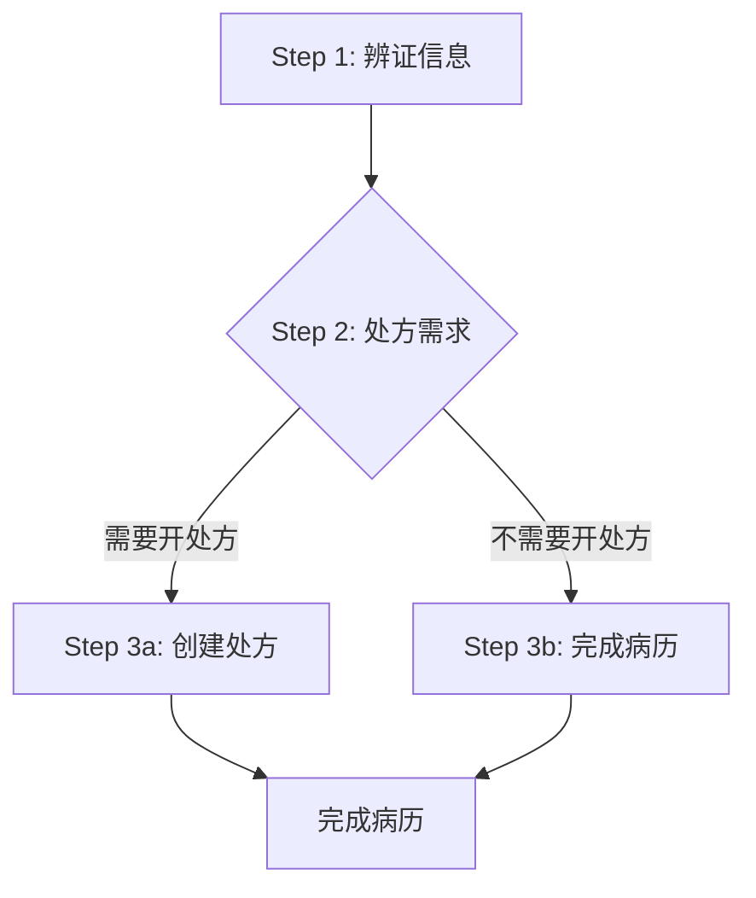

# 病历管理完整教程

> **学习导向**: 面向零基础用户，提供手把手的病历管理学习指导
> **学习时间**: 80分钟
> **适合人群**: 医生、护士、系统管理员、新入职开发者
> **学习方式**: 端到端、实践导向、循序渐进

## 🎯 学习目标

完成本教程后，您将能够：

- ✅ 理解LYBTZYZS病历管理的核心理念和三步流程
- ✅ 熟练创建和管理患者病历
- ✅ 掌握中医辨证信息录入和模板使用
- ✅ 运用处方管理功能进行药品开具
- ✅ 进行病历数据分析和报表生成
- ✅ 处理病历管理的常见问题和异常情况

## 📚 学习路线图

```
第1部分: 基础概念 (15分钟)
├── 病历管理核心理念
├── 三步流程详解
└── 系统界面概览

第2部分: 病历创建 (20分钟)
├── 新建病历
├── 患者信息关联
└── 基础信息录入

第3部分: 辨证信息 (25分钟)
├── 望闻问切录入
├── 中医诊断填写
├── 辨证模板使用
└── 病历模板管理

第4部分: 处方管理 (15分钟)
├── 处方需求标记
├── 药品配伍开具
└── 处方审核打印

第5部分: 高级功能 (5分钟)
├── 病历状态管理
├── 数据分析报表
└── 实践练习
```

---

## 第1部分: 基础概念 (15分钟)

### 1.1 病历管理核心理念

#### 什么是病历管理？

病历管理是中医诊所诊疗流程的核心环节，记录患者从接诊到治疗的完整医疗过程。在LYBTZYZS系统中，病历管理遵循以下核心理念：

```csharp
// 病历聚合根设计
public class MedicalCase : AggregateRoot<Guid>
{
    // 核心原则：一病案一诊断，一病案至多一处方
    public Guid PatientId { get; set; }      // 患者关联
    public Guid DoctorId { get; set; }       // 医生负责
    public DateTime ConsultationDate { get; set; } // 诊疗时间

    // 三步流程控制
    public bool? NeedsPrescription { get; set; } // 处方需求标记
    public MedicalCaseStatus Status { get; set; } // 病历状态

    // 导航属性 - 聚合关系
    public virtual Consultation? Consultation { get; set; }   // 1:1 诊疗记录
    public virtual Prescription? Prescription { get; set; }  // 0..1 处方信息
}
```

**设计优势**:
- **聚合根模式**: 通过MedicalCase聚合根统一管理整个诊疗过程
- **一致性保证**: 确保诊疗记录和处方的数据一致性
- **业务规则封装**: 核心业务逻辑封装在实体内部

#### 三步流程 (BF-002)

LYBTZYZS系统采用标准化的中医诊疗三步流程：



**详细流程**:

1. **Step 1: 辨证信息录入** (必须完成)
   - 望闻问切四诊信息采集
   - 中医诊断结论填写
   - 病情分析和治疗方案

2. **Step 2: 处方需求标记** (必须完成)
   - 判断是否需要开具中药处方
   - 动态流程控制，可选择跳过处方

3. **Step 3: 处方管理或完成** (条件执行)
   - 3a: 需要开处方 → 创建和管理处方
   - 3b: 不需要开处方 → 直接完成病历

### 1.2 系统界面概览

#### 主界面布局

```
┌─────────────────────────────────────────────────────────────┐
│ LYBTZYZS 中医诊所管理系统 - 病历管理                        │
├─────────────────────────────────────────────────────────────┤
│ [患者选择] [新建病历] [病历列表] [模板管理] [数据分析]        │
├─────────────────────────────────────────────────────────────┤
│ 患者信息区                  │ 病历内容区                    │
│ ├─ 患者基本信息              │ ├─ Step 1: 辨证信息           │
│ ├─ 历史病历                  │ ├─ Step 2: 处方需求           │
│ └─ 快速操作                  │ ├─ Step 3: 处方管理           │
│                             │ └─ 病历状态                  │
├─────────────────────────────────────────────────────────────┤
│ [保存] [完成] [打印] [导出] [删除]                        │
└─────────────────────────────────────────────────────────────┘
```

### 1.3 实践练习1: 界面熟悉

**练习目标**: 熟悉病历管理界面布局和基本操作

**练习步骤**:

1. **启动系统**，进入病历管理模块
2. **界面识别**:
   - 找到患者选择区域
   - 定位病历内容编辑区域
   - 识别操作按钮区域
3. **基础操作**:
   - 尝试选择一个已有患者
   - 查看患者的历史病历列表
   - 浏览病历模板选项

**验证清单**:
- [ ] 能够识别主界面的各个功能区域
- [ ] 可以成功选择患者并查看信息
- [ ] 了解病历列表的显示方式
- [ ] 熟悉基本的导航操作

---

## 第2部分: 病历创建 (20分钟)

### 2.1 新建病历流程

#### 业务规则

创建新病历时需要遵循以下业务规则：

```csharp
public class MedicalCaseRules
{
    // BR-001: 单患者仅一条未完成病案
    public static bool CanCreateNewCase(IEnumerable<MedicalCase> existingCases)
    {
        return !existingCases.Any(c => c.Status == MedicalCaseStatus.Active);
    }

    // BR-002: 当天可改原则
    public static bool CanEdit(MedicalCase medicalCase, Guid currentUserId, bool isAdmin)
    {
        if (isAdmin) return true;

        return medicalCase.DoctorId == currentUserId &&
               medicalCase.CreatedAt.Date == DateTime.Today;
    }
}
```

#### 创建病历实现

```csharp
// 病历创建Service方法
public async Task<MedicalCaseEntity?> CreateAsync(Guid patientId, DateTime visitDate)
{
    // 1. 业务规则验证
    var existingActiveCases = await _repository.GetByPatientIdAsync(patientId);
    if (!MedicalCaseRules.CanCreateNewCase(existingActiveCases))
    {
        throw new InvalidOperationException("该患者已有进行中的医案");
    }

    // 2. 创建MedicalCase实体
    var medicalCase = new MedicalCaseEntity
    {
        Id = Guid.NewGuid(),
        PatientId = patientId,
        ConsultationDate = visitDate,
        Status = MedicalCaseStatus.Active,
        CreatedAt = DateTime.Now,
        UpdatedAt = DateTime.Now
    };

    // 3. 自动创建关联的Consultation（共享主键）
    var consultation = new ConsultationEntity
    {
        Id = medicalCase.Id, // 共享主键
        Status = CommonStatus.Enabled,
        ChiefComplaint = string.Empty,
        CreatedAt = DateTime.Now,
        UpdatedAt = DateTime.Now
    };

    medicalCase.Consultation = consultation;

    // 4. 保存到数据库
    return await _repository.AddAsync(medicalCase);
}
```

### 2.2 患者信息关联

#### 患者选择界面

```csharp
// 患者选择ViewModel
public class PatientSelectionViewModel : BindableBase
{
    [ObservableProperty]
    private ObservableCollection<PatientDto> patients;

    [ObservableProperty]
    private PatientDto selectedPatient;

    // 搜索功能
    [RelayCommand]
    private async Task SearchPatientsAsync(string keyword)
    {
        var result = await _patientService.SearchPatientsAsync(new PatientSearchDto
        {
            Keyword = keyword,
            PageIndex = 1,
            PageSize = 20
        });

        Patients.Clear();
        foreach (var patient in result.Data.Items)
        {
            Patients.Add(patient);
        }
    }

    // 创建新病历
    [RelayCommand]
    private async Task CreateMedicalCaseAsync()
    {
        if (SelectedPatient == null)
        {
            _dialogService.ShowMessage("请先选择患者");
            return;
        }

        try
        {
            var medicalCase = await _medicalCaseService.CreateAsync(
                SelectedPatient.Id,
                DateTime.Now);

            // 导航到病历编辑页面
            _navigationService.NavigateToMedicalCaseEdit(medicalCase.Id);
        }
        catch (Exception ex)
        {
            _dialogService.ShowError($"创建病历失败: {ex.Message}");
        }
    }
}
```

### 2.3 基础信息录入

#### 病历基础字段

```csharp
public class MedicalCaseCreateDto
{
    [Required(ErrorMessage = "患者ID不能为空")]
    public Guid PatientId { get; set; }

    [Required(ErrorMessage = "医生ID不能为空")]
    public Guid DoctorId { get; set; }

    [Required(ErrorMessage = "诊疗时间不能为空")]
    public DateTime ConsultationDate { get; set; }

    [StringLength(500, ErrorMessage = "备注长度不能超过500字符")]
    public string? Remark { get; set; }
}
```

### 2.4 实践练习2: 创建第一个病历

**练习目标**: 成功创建一个完整的新病历

**练习步骤**:

1. **选择患者**:
   - 在患者搜索框输入患者姓名或拼音码
   - 从搜索结果中选择目标患者
   - 验证患者基本信息显示正确

2. **创建病历**:
   - 点击"新建病历"按钮
   - 确认诊疗时间（默认为当前时间）
   - 添加备注信息（可选）

3. **保存病历**:
   - 点击"保存"按钮保存基础信息
   - 验证病历创建成功
   - 记录生成的病历ID

**验证清单**:
- [ ] 能够成功搜索并选择患者
- [ ] 系统正确显示患者基本信息
- [ ] 病历创建按钮响应正常
- [ ] 基础信息保存成功
- [ ] 获得了有效的病历ID

**预期结果**: 成功创建一个状态为"Active"的新病历，系统自动关联空的辨证信息。

---

## 第3部分: 辨证信息 (25分钟)

### 3.1 望闻问切录入

#### 四诊信息结构

```csharp
public class ConsultationInputDto
{
    // 主诉和现病史
    [Required(ErrorMessage = "主诉不能为空")]
    [StringLength(200, ErrorMessage = "主诉长度不能超过200字符")]
    public string ChiefComplaint { get; set; }

    [StringLength(1000, ErrorMessage = "现病史长度不能超过1000字符")]
    public string PresentIllness { get; set; }

    // 望诊
    public string? Inspection { get; set; }  // 望神色、形态

    // 闻诊
    public string? Auscultation { get; set; } // 听声音
    public string? Olfaction { get; set; }    // 闻气味

    // 问诊
    public string? Inquiry { get; set; }     // 病情询问

    // 切诊
    public string? Pulse { get; set; }        // 脉象
    public string? Tongue { get; set; }      // 舌诊

    // 中医诊断
    [Required(ErrorMessage = "中医诊断不能为空")]
    [StringLength(500, ErrorMessage = "中医诊断长度不能超过500字符")]
    public string TcmDiagnosis { get; set; }

    [StringLength(1000, ErrorMessage = "辨证分析长度不能超过1000字符")]
    public string SyndromeDifferentiation { get; set; }

    // 治疗方案
    [StringLength(1000, ErrorMessage = "治疗方案长度不能超过1000字符")]
    public string TreatmentPlan { get; set; }
}
```

#### 四诊信息录入界面

```xml
<!-- WPF界面设计 -->
<StackPanel Grid.Row="1" Margin="10">
    <!-- 主诉 -->
    <GroupBox Header="主诉" Margin="0,0,0,10">
        <TextBox Text="{Binding Consultation.ChiefComplaint}"
                 Height="60" TextWrapping="Wrap"/>
    </GroupBox>

    <!-- 现病史 -->
    <GroupBox Header="现病史" Margin="0,0,0,10">
        <TextBox Text="{Binding Consultation.PresentIllness}"
                 Height="80" TextWrapping="Wrap"/>
    </GroupBox>

    <!-- 四诊信息 -->
    <TabControl Margin="0,0,0,10">
        <TabItem Header="望诊">
            <TextBox Text="{Binding Consultation.Inspection}"
                     TextWrapping="Wrap" Margin="5"/>
        </TabItem>
        <TabItem Header="闻诊">
            <StackPanel Margin="5">
                <TextBlock Text="听声音:"/>
                <TextBox Text="{Binding Consultation.Auscultation}" Height="60" TextWrapping="Wrap"/>
                <TextBlock Text="闻气味:" Margin="0,10,0,0"/>
                <TextBox Text="{Binding Consultation.Olfaction}" Height="60" TextWrapping="Wrap"/>
            </StackPanel>
        </TabItem>
        <TabItem Header="问诊">
            <TextBox Text="{Binding Consultation.Inquiry}"
                     TextWrapping="Wrap" Margin="5"/>
        </TabItem>
        <TabItem Header="切诊">
            <StackPanel Margin="5">
                <TextBlock Text="脉象:"/>
                <TextBox Text="{Binding Consultation.Pulse}" Height="60" TextWrapping="Wrap"/>
                <TextBlock Text="舌诊:" Margin="0,10,0,0"/>
                <TextBox Text="{Binding Consultation.Tongue}" Height="60" TextWrapping="Wrap"/>
            </StackPanel>
        </TabItem>
    </TabControl>

    <!-- 中医诊断 -->
    <GroupBox Header="中医诊断" Margin="0,0,0,10">
        <StackPanel>
            <TextBlock Text="诊断结论:"/>
            <TextBox Text="{Binding Consultation.TcmDiagnosis}" Height="60" TextWrapping="Wrap"/>
            <TextBlock Text="辨证分析:" Margin="0,10,0,0"/>
            <TextBox Text="{Binding Consultation.SyndromeDifferentiation}"
                     Height="80" TextWrapping="Wrap"/>
            <TextBlock Text="治疗方案:" Margin="0,10,0,0"/>
            <TextBox Text="{Binding Consultation.TreatmentPlan}"
                     Height="80" TextWrapping="Wrap"/>
        </StackPanel>
    </GroupBox>
</StackPanel>
```

### 3.2 辨证模板使用

#### 模板管理Service

```csharp
public class ConsultationTemplateService : IConsultationTemplateService
{
    // 获取模板列表
    public async Task<List<ConsultationTemplateDto>> GetTemplatesAsync()
    {
        var templates = await _repository.GetAllAsync();
        return _mapper.Map<List<ConsultationTemplateDto>>(templates);
    }

    // 应用模板
    public async Task<ConsultationInputDto> ApplyTemplateAsync(Guid templateId)
    {
        var template = await _repository.GetByIdAsync(templateId);
        if (template == null)
            throw new NotFoundException("模板不存在");

        return new ConsultationInputDto
        {
            ChiefComplaint = template.ChiefComplaint,
            PresentIllness = template.PresentIllness,
            Inspection = template.Inspection,
            Auscultation = template.Auscultation,
            Olfaction = template.Olfaction,
            Inquiry = template.Inquiry,
            Pulse = template.Pulse,
            Tongue = template.Tongue,
            TcmDiagnosis = template.TcmDiagnosis,
            SyndromeDifferentiation = template.SyndromeDifferentiation,
            TreatmentPlan = template.TreatmentPlan
        };
    }

    // 创建模板
    public async Task<ConsultationTemplateDto> CreateTemplateAsync(
        CreateConsultationTemplateDto dto)
    {
        var template = _mapper.Map<ConsultationTemplate>(dto);
        template.Id = Guid.NewGuid();
        template.CreatedAt = DateTime.Now;

        var result = await _repository.AddAsync(template);
        return _mapper.Map<ConsultationTemplateDto>(result);
    }
}
```

#### 模板应用功能

```csharp
public class MedicalCaseEditViewModel : BindableBase
{
    [RelayCommand]
    private async Task LoadConsultationTemplatesAsync()
    {
        try
        {
            var templates = await _templateService.GetTemplatesAsync();
            ConsultationTemplates.Clear();

            foreach (var template in templates)
            {
                ConsultationTemplates.Add(template);
            }
        }
        catch (Exception ex)
        {
            _dialogService.ShowError($"加载模板失败: {ex.Message}");
        }
    }

    [RelayCommand]
    private async Task ApplyTemplateAsync(ConsultationTemplateDto template)
    {
        try
        {
            var consultationData = await _templateService.ApplyTemplateAsync(template.Id);

            // 应用模板数据到当前辨证信息
            _mapper.Map(consultationData, Consultation);

            _dialogService.ShowMessage($"已应用模板: {template.Name}");
        }
        catch (Exception ex)
        {
            _dialogService.ShowError($"应用模板失败: {ex.Message}");
        }
    }

    [RelayCommand]
    private async Task SaveAsTemplateAsync()
    {
        try
        {
            var templateName = await _dialogService.ShowInputDialog("请输入模板名称:");
            if (string.IsNullOrEmpty(templateName))
                return;

            var createDto = new CreateConsultationTemplateDto
            {
                Name = templateName,
                Description = $"用户创建的模板 - {DateTime.Now:yyyy-MM-dd}",
                ChiefComplaint = Consultation.ChiefComplaint,
                PresentIllness = Consultation.PresentIllness,
                Inspection = Consultation.Inspection,
                Auscultation = Consultation.Auscultation,
                Olfaction = Consultation.Olfaction,
                Inquiry = Consultation.Inquiry,
                Pulse = Consultation.Pulse,
                Tongue = Consultation.Tongue,
                TcmDiagnosis = Consultation.TcmDiagnosis,
                SyndromeDifferentiation = Consultation.SyndromeDifferentiation,
                TreatmentPlan = Consultation.TreatmentPlan
            };

            await _templateService.CreateTemplateAsync(createDto);
            _dialogService.ShowMessage("模板保存成功");
        }
        catch (Exception ex)
        {
            _dialogService.ShowError($"保存模板失败: {ex.Message}");
        }
    }
}
```

### 3.3 Step 1完成验证

```csharp
// 更新辨证信息并标记Step 1完成
public async Task<MedicalCaseEntity?> UpdateConsultationAsync(
    Guid medicalCaseId,
    ConsultationInputDto request,
    Guid currentUserId,
    bool isAdmin = false)
{
    // 1. 权限检查
    var medicalCase = await _repository.GetByIdWithDetailsAsync(medicalCaseId);
    if (!MedicalCaseRules.CanEdit(medicalCase, currentUserId, isAdmin))
    {
        throw new UnauthorizedAccessException("无权限编辑此病案");
    }

    // 2. 业务规则验证
    if (medicalCase.Status != MedicalCaseStatus.Active)
    {
        throw new InvalidOperationException("只有Active状态可编辑");
    }

    // 3. 更新辨证信息
    _mapper.Map(request, medicalCase.Consultation);
    medicalCase.Consultation.UpdatedAt = DateTime.Now;

    // 4. 标记Step 1完成
    if (medicalCase.Consultation.Step1CompletedAt == null)
    {
        medicalCase.Consultation.Step1CompletedAt = DateTime.Now;
    }

    // 5. 保存并返回
    return await _repository.UpdateAsync(medicalCase);
}
```

### 3.4 实践练习3: 完成辨证信息录入

**练习目标**: 熟练完成四诊信息录入和模板使用

**练习步骤**:

1. **录入基础信息**:
   - 填写患者主诉（如：头痛3天）
   - 详细描述现病史
   - 录入望、闻、问、切四诊信息

2. **中医诊断**:
   - 填写中医诊断结论（如：风寒感冒）
   - 进行辨证分析
   - 制定治疗方案

3. **使用模板**:
   - 浏览现有的辨证模板
   - 选择并应用一个合适模板
   - 根据具体病情调整模板内容

4. **保存为模板**:
   - 将当前辨证信息保存为新模板
   - 命名模板并添加描述
   - 验证模板保存成功

**验证清单**:
- [ ] 主诉和现病史填写完整
- [ ] 四诊信息录入准确
- [ ] 中医诊断和辨证分析合理
- [ ] 成功应用了至少一个模板
- [ ] 创建并保存了自定义模板
- [ ] Step 1状态标记为完成

**预期结果**: 完成完整的辨证信息录入，Step 1时间戳已记录，可以进入Step 2。

---

## 第4部分: 处方管理 (15分钟)

### 4.1 处方需求标记 (Step 2)

#### 动态流程控制

```csharp
// Step 2: 标记是否需要开处方
public async Task<MedicalCaseEntity?> SetPrescriptionFlagAsync(
    Guid medicalCaseId,
    bool needsPrescription,
    Guid currentUserId,
    bool isAdmin = false)
{
    var medicalCase = await _repository.GetByIdWithDetailsAsync(medicalCaseId);

    // 业务规则验证：必须先完成Step 1
    if (medicalCase.Consultation?.Step1CompletedAt == null)
    {
        throw new InvalidOperationException("请先完成辨证信息填写（Step1）");
    }

    // 更新NeedsPrescription标志
    medicalCase.NeedsPrescription = needsPrescription;
    medicalCase.UpdatedAt = DateTime.Now;

    // 同步更新Consultation
    if (medicalCase.Consultation != null)
    {
        medicalCase.Consultation.PrescriptionEnabled = needsPrescription;
        medicalCase.Consultation.UpdatedAt = DateTime.Now;

        // 标记Step 2完成
        if (medicalCase.Consultation.Step2CompletedAt == null)
        {
            medicalCase.Consultation.Step2CompletedAt = DateTime.Now;
        }
    }

    return await _repository.UpdateAsync(medicalCase);
}
```

#### 处方需求选择界面

```xml
<!-- 处方需求选择 -->
<GroupBox Header="Step 2: 处方需求" Margin="10">
    <StackPanel>
        <TextBlock Text="根据辨证结果，是否需要为患者开具中药处方？"
                   Margin="0,0,0,10" FontWeight="Bold"/>

        <StackPanel Orientation="Horizontal" Margin="0,0,0,10">
            <RadioButton Content="需要开处方"
                         IsChecked="{Binding MedicalCase.NeedsPrescription, Converter={StaticResource BoolToTrueConverter}}"
                         Margin="0,0,20,0"/>
            <RadioButton Content="不需要开处方（如仅进行针灸、推拿等治疗）"
                         IsChecked="{Binding MedicalCase.NeedsPrescription, Converter={StaticResource BoolToFalseConverter}}"/>
        </StackPanel>

        <!-- 选择结果提示 -->
        <TextBlock Text="{Binding PrescriptionNeedHint}"
                   Foreground="DarkBlue" Margin="0,10,0,0"/>

        <Button Content="确认处方需求"
                Command="{Binding ConfirmPrescriptionNeedCommand}"
                Width="150" Height="30" HorizontalAlignment="Left"/>
    </StackPanel>
</GroupBox>
```

### 4.2 处方创建和管理

#### 处方实体结构

```csharp
public class Prescription : BaseEntity
{
    public Guid MedicalCaseId { get; set; }        // 关联病历
    public Guid PatientId { get; set; }           // 患者ID
    public Guid UserId { get; set; }              // 开具医生ID

    public PrescriptionStatus Status { get; set; } // 处方状态
    public string? Diagnosis { get; set; }        // 诊断
    public string? Instructions { get; set; }     // 用药指导

    public DateTime? PrescribedAt { get; set; }   // 开具时间
    public DateTime? PrintedAt { get; set; }      // 打印时间
    public bool IsPrinted { get; set; }           // 是否已打印

    // 处方明细
    public virtual ICollection<PrescriptionDetail> Details { get; set; }
}

public class PrescriptionDetail : BaseEntity
{
    public Guid PrescriptionId { get; set; }      // 处方ID
    public Guid HerbId { get; set; }             // 药材ID
    public string HerbName { get; set; }         // 药材名称
    public decimal Dosage { get; set; }          // 剂量
    public string Unit { get; set; }             // 单位
    public int Quantity { get; set; }            // 数量
    public string? Instructions { get; set; }    // 煎服方法
}
```

#### 处方创建Service

```csharp
public async Task<PrescriptionEntity?> CreatePrescriptionAsync(
    Guid medicalCaseId,
    PrescriptionCreateDto request)
{
    var medicalCase = await _repository.GetByIdWithDetailsAsync(medicalCaseId);

    // 业务规则验证：必须标记需要开处方
    if (medicalCase.NeedsPrescription != true)
    {
        throw new InvalidOperationException("病案未标记需要开处方");
    }

    // 业务规则验证：一诊一方约束
    if (medicalCase.Prescription != null && !medicalCase.Prescription.IsDeleted)
    {
        throw new InvalidOperationException("病案已存在处方，请使用更新接口");
    }

    // 创建处方
    var prescription = _mapper.Map<PrescriptionEntity>(request);
    prescription.Id = Guid.NewGuid();
    prescription.MedicalCaseId = medicalCaseId;
    prescription.PatientId = medicalCase.PatientId;
    prescription.UserId = medicalCase.DoctorId;
    prescription.Status = PrescriptionStatus.Draft;
    prescription.CreatedAt = DateTime.Now;
    prescription.UpdatedAt = DateTime.Now;

    // 关联到聚合根
    medicalCase.Prescription = prescription;
    medicalCase.UpdatedAt = DateTime.Now;

    // 通过聚合根保存
    await _repository.UpdateAsync(medicalCase);

    return prescription;
}
```

### 4.3 药品配伍系统

#### 中药配伍规则验证

```csharp
public class HerbCompatibilityService
{
    // 检查药物配伍禁忌
    public async Task<CompatibilityResult> CheckCompatibilityAsync(
        List<PrescriptionDetailDto> details)
    {
        var result = new CompatibilityResult { IsValid = true };

        foreach (var detail in details)
        {
            // 1. 检查剂量是否在安全范围内
            var dosageValid = await CheckDosageSafetyAsync(detail.HerbId, detail.Dosage);
            if (!dosageValid.IsValid)
            {
                result.AddWarning($"药材 {detail.HerbName} 剂量可能超标: {dosageValid.Message}");
            }

            // 2. 检查配伍禁忌
            var incompatibilities = await CheckIncompatibilitiesAsync(
                detail.HerbId,
                details.Where(d => d.HerbId != detail.HerbId).Select(d => d.HerbId).ToList());

            foreach (var incompatibility in incompatibilities)
            {
                result.AddError($"配伍禁忌: {detail.HerbName} 与 {incompatibility.ConflictHerbName} 不宜同时使用");
                result.IsValid = false;
            }

            // 3. 检查特殊人群禁忌
            var contraindications = await CheckContraindicationsAsync(
                detail.HerbId,
                /* 患者信息 */);

            foreach (var contraindication in contraindications)
            {
                result.AddWarning($"注意事项: {contraindication.Message}");
            }
        }

        return result;
    }
}
```

### 4.4 实践练习4: 处方管理实战

**练习目标**: 掌握处方需求标记和药品配伍开具

**练习步骤**:

1. **处方需求标记**:
   - 在Step 2界面选择是否需要开处方
   - 分别尝试选择"需要"和"不需要"
   - 验证选择结果对后续流程的影响

2. **药品配伍** (如果选择需要开处方):
   - 添加常用中药材到处方
   - 设置合适的剂量和单位
   - 输入用药指导

3. **配伍检查**:
   - 运行配伍禁忌检查
   - 查看系统给出的警告和错误
   - 根据检查结果调整处方

4. **处方保存**:
   - 保存处方草稿
   - 预览处方打印效果
   - 测试处方打印功能

**验证清单**:
- [ ] 成功标记了处方需求
- [ ] 理解了处方需求对流程的影响
- [ ] 添加了至少3种中药材
- [ ] 设置了正确的剂量和单位
- [ ] 运行了配伍检查并理解结果
- [ ] 成功保存和预览了处方
- [ ] Step 2状态标记为完成

**预期结果**: 根据选择完成处方需求标记，如需要则创建了完整处方，三步流程验证通过。

---

## 第5部分: 高级功能 (5分钟)

### 5.1 病历状态管理

#### 状态流转规则

```csharp
public enum MedicalCaseStatus
{
    Active = 1,      // 进行中
    Completed = 2,   // 已完成
    Cancelled = 3    // 已取消
}

// 状态流转验证
public static class MedicalCaseStatusTransition
{
    public static bool IsValidTransition(MedicalCaseStatus from, MedicalCaseStatus to)
    {
        return (from, to) switch
        {
            (MedicalCaseStatus.Active, MedicalCaseStatus.Completed) => true,
            (MedicalCaseStatus.Active, MedicalCaseStatus.Cancelled) => true,
            (MedicalCaseStatus.Completed, _) => false,  // 已完成不能修改状态
            (MedicalCaseStatus.Cancelled, MedicalCaseStatus.Active) => true,  // 取消可重新激活
            _ => false
        };
    }
}
```

### 5.2 数据分析和报表

#### 病历统计Service

```csharp
public class MedicalCaseAnalyticsService
{
    // 获取病历统计
    public async Task<MedicalCaseAnalyticsDto> GetAnalyticsAsync(
        DateTime startDate,
        DateTime endDate)
    {
        var cases = await _repository.GetByDateRangeAsync(startDate, endDate);

        return new MedicalCaseAnalyticsDto
        {
            TotalCases = cases.Count,
            CompletedCases = cases.Count(c => c.Status == MedicalCaseStatus.Completed),
            CasesWithPrescription = cases.Count(c => c.NeedsPrescription == true),
            AverageDuration = CalculateAverageTreatmentDuration(cases),
            TopDiagnoses = GetTopDiagnoses(cases, 10),
            DoctorStats = GetDoctorStatistics(cases)
        };
    }

    // 获取疾病趋势分析
    public async Task<List<DiseaseTrendDto>> GetDiseaseTrendsAsync(
        DateTime startDate,
        DateTime endDate,
        int groupByDays = 7)
    {
        // 按时间分组统计疾病发生趋势
        var trends = new List<DiseaseTrendDto>();
        var currentDate = startDate;

        while (currentDate <= endDate)
        {
            var periodEnd = currentDate.AddDays(groupByDays);
            var periodCases = await _repository.GetByDateRangeAsync(currentDate, periodEnd);

            var diagnosisGroups = periodCases
                .Where(c => c.Consultation != null)
                .GroupBy(c => c.Consultation.TcmDiagnosis)
                .Select(g => new DiagnosisCount
                {
                    Diagnosis = g.Key,
                    Count = g.Count()
                })
                .OrderByDescending(g => g.Count)
                .Take(5)
                .ToList();

            trends.Add(new DiseaseTrendDto
            {
                StartDate = currentDate,
                EndDate = periodEnd,
                TotalCases = periodCases.Count,
                TopDiagnoses = diagnosisGroups
            });

            currentDate = periodEnd.AddDays(1);
        }

        return trends;
    }
}
```

### 5.3 综合练习

**练习目标**: 完成完整的病历管理流程

**练习场景**: 模拟一位患者（张女士，35岁）因"失眠多梦"前来就诊

**练习步骤**:

1. **患者接诊**:
   - 搜索并选择患者张女士
   - 创建新病历

2. **辨证施治**:
   - 录入主诉：失眠多梦2周，加重3天
   - 详细询问现病史、既往史
   - 进行四诊信息采集
   - 做出中医诊断：心脾两虚

3. **治疗方案**:
   - 标记需要开处方
   - 配伍中药（如：酸枣仁、茯苓、白术等）
   - 设置用药指导

4. **完成病历**:
   - 完成三步流程验证
   - 标记病历状态为已完成
   - 打印处方和病历

**验证清单**:
- [ ] 成功完成患者接诊流程
- [ ] 辨证信息完整准确
- [ ] 处方配伍合理安全
- [ ] 三步流程全部完成
- [ ] 病历状态正确更新
- [ ] 打印功能正常工作

---

## 🎯 学习成果验收

### 知识检查点

请回答以下问题，检验学习成果：

1. **三步流程**：请描述LYBTZYZS病历管理的三步流程，以及每个步骤的核心要求？

2. **聚合根设计**：为什么MedicalCase被设计为聚合根？这种设计有什么优势？

3. **权限控制**：病历编辑权限是如何控制的？什么是"当天可改"原则？

4. **状态管理**：病历有哪些状态？状态流转有什么规则？

5. **处方管理**：如何确保处方的安全性？配伍检查的原理是什么？

### 技能考核

完成以下实操任务：

1. **基础操作**：为虚拟患者创建一份完整病历
2. **高级功能**：使用模板提高辨证信息录入效率
3. **问题处理**：处理一个存在配伍禁忌的处方
4. **数据分析**：查看并理解病历统计报表

### 后续学习建议

恭喜完成病历管理教程！建议继续学习：

- **深入知识**: [病历管理架构设计](../../../explanation/architecture/medical-case-system/medical-case-architecture.md)
- **问题解决**: [病历管理问题解决指南](../../../how-to-guides/modules/medicalcase/medical-case-issues.md)
- **技术参考**: [病历管理API文档](../../../reference/api/medical-case.md)
- **相关模块**: [处方管理](../prescriptions/prescription-management-tutorial.md)、[中医诊断](../consultation/consultation-tutorial.md)

---

**文档类型**: Tutorial
**学习时间**: 80分钟
**难度等级**: 中级
**更新时间**: 2025-11-22
**相关资源**: [病历管理问题解决指南](../../../how-to-guides/modules/medicalcase/medical-case-issues.md) | [API参考文档](../../../reference/api/medical-case.md) | [中医术语表](../../../reference/tcm-terminology.md)