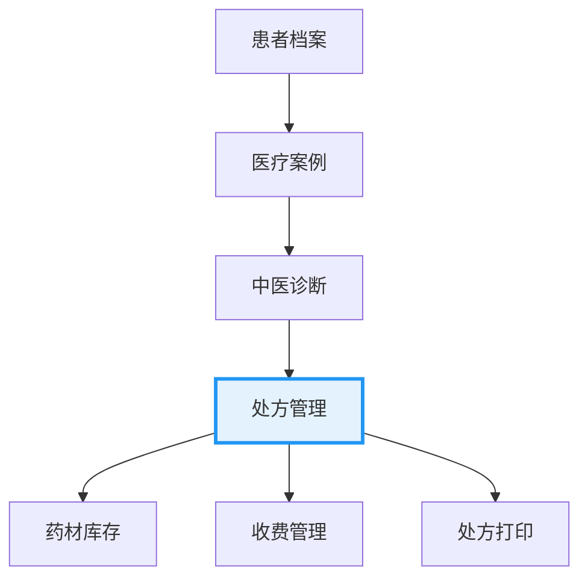

# 处方管理完全教程
**85分钟深入学习处方创建、管理、验方应用、价格计算和打印功能**

## 📋 目录

1. [系统概述](#1-系统概述) (5分钟)
2. [核心概念理解](#2-核心概念理解) (10分钟)
3. [处方数据模型详解](#3-处方数据模型详解) (10分钟)
4. [基础处方操作](#4-基础处方操作) (15分钟)
5. [验方集成应用](#5-验方集成应用) (10分钟)
6. [价格计算与收费](#6-价格计算与收费) (10分钟)
7. [处方打印功能](#7-处方打印功能) (8分钟)
8. [高级功能实践](#8-高级功能实践) (12分钟)
9. [实际业务场景](#9-实际业务场景) (5分钟)

---

## 1. 系统概述

### 1.1 处方管理在LYBTZYZS中的核心地位

处方管理是凌隐宝堂中医诊所管理系统的核心业务模块，承接着中医诊断（Consultation）和药材管理（Herbs）的关键环节。



### 1.2 业务流程概览

**三步诊疗工作流**:
1. **辨证信息采集** (Consultation) - 望闻问切四诊合参
2. **处方需求确认** (MedicalCase.NeedsPrescription) - 确定是否需要开具处方
3. **处方具体开具** (Prescription) - 创建和管理具体处方

### 1.3 核心价值主张

- **验方集成**: 支持经典方剂快速导入和个性化调整
- **智能定价**: 自动计算处方总价，支持折扣设置
- **版本管理**: 处方打印版本控制，支持修改重印
- **合规保障**: 处方编号、医师签名、打印日志等合规功能

---

## 2. 核心概念理解

### 2.1 处方实体结构

#### 2.1.1 核心字段说明

```csharp
public class Prescription : BaseEntity
{
    // 基础关联
    public Guid MedicalCaseId { get; set; }           // 医疗案例ID
    public string? PrescriptionNumber { get; set; }    // 处方编号：RX-YYYYMMDD-NNNN
    
    // 处方内容
    public string? Indication { get; set; }            // 主治（适应症）
    public int DosageCount { get; set; }              // 处方帖数（默认7帖）
    public string? Advice { get; set; }                // 医嘱
    
    // 验方关联
    public string? FormulaSource { get; set; }         // 验方来源
    public string? ReferencedFormulas { get; set; }    // 引用验方列表
    
    // 价格管理
    public decimal Discount { get; set; }              // 折扣（0-1之间）
    
    // 状态管理
    public PrescriptionStatus Status { get; set; }     // 处方状态
    public bool IsPrinted { get; set; }               // 是否已打印
    
    // 处方明细
    public List<PrescriptionItem> Items { get; set; }  // 药材明细
}
```

#### 2.1.2 处方药材项

```csharp
public class PrescriptionItem
{
    public Guid Id { get; set; }                       // 处方项ID
    public Guid PrescriptionId { get; set; }           // 所属处方ID
    public Guid HerbId { get; set; }                   // 药材ID
    public string HerbName { get; set; }               // 药材名称
    public int Quantity { get; set; }                  // 用量（整数）
    public string Unit { get; set; }                   // 单位（默认g）
    public decimal UnitPrice { get; set; }             // 单价
    public decimal Amount { get; set; }                // 小计 = 单价 × 用量
    public string? Usage { get; set; }                 // 用法说明
}
```

### 2.2 处方状态管理

**PrescriptionStatus枚举**:
```csharp
public enum PrescriptionStatus
{
    Draft = 0,        // 草稿 - 正在编辑中
    Active = 1,       // 激活 - 可用于取药
    Printed = 2,      // 已打印 - 已生成正式处方单
    Completed = 3,    // 已完成 - 已取药或结束
    Cancelled = 4     // 已取消 - 作废处方
}
```

### 2.3 打印版本控制

```csharp
public int PrintVersion { get; set; } = 1;            // 当前打印版本号
public DateTime? LastPrintedAt { get; set; }          // 最后打印时间
public int PrintCount { get; set; } = 0;              // 打印次数
public List<PrescriptionPrintLog> PrintLogs { get; set; } // 打印日志
```

---

## 3. 处方数据模型详解

### 3.1 处方与医疗案例关系

**一对零或一关系**:
```csharp
// MedicalCase实体中的关联
public Prescription? Prescription { get; set; }

// Prescription实体中的导航属性
public virtual MedicalCase? MedicalCase { get; set; }
```

**业务规则**:
- 一个医疗案例最多对应一个处方
- 处方创建时必须关联到已存在的医疗案例
- 医疗案例删除时，关联处方也需要处理

### 3.2 处方编号生成规则

**格式**: RX-YYYYMMDD-NNNN
- **RX**: 固定前缀（Prescription的缩写）
- **YYYYMMDD**: 8位日期（如20251122）
- **NNNN**: 4位顺序号（从0001开始）

**示例**: RX-20251122-0001

**生成算法**:
```csharp
public static string GeneratePrescriptionNumber(DateTime date, int sequence)
{
    return $"RX-{date:yyyyMMdd}-{sequence:D4}";
}
```

### 3.3 价格计算逻辑

**处方总价计算**:
```csharp
public decimal CalculateTotalPrice()
{
    return Items.Sum(item => item.Amount) * DosageCount * Discount;
}
```

**药材小计计算**:
```csharp
public class PrescriptionItem
{
    public decimal Amount => UnitPrice * Quantity;
}
```

**折扣应用**:
```csharp
// 折扣范围：0 < Discount ≤ 1
// 0.8 表示8折，1.0 表示无折扣
decimal finalPrice = CalculateSubtotal() * Discount;
```

---

## 4. 基础处方操作

### 4.1 创建新处方

#### 4.1.1 检查处方前置条件

```csharp
// 前置条件：医疗案例必须存在且确认需要处方
public async Task<bool> CanCreatePrescriptionAsync(Guid medicalCaseId)
{
    var medicalCase = await _medicalCaseRepository.GetByIdAsync(medicalCaseId);
    return medicalCase?.NeedsPrescription == true && medicalCase.Prescription == null;
}
```

#### 4.1.2 处方创建流程

**步骤1: 验证医疗案例**
```csharp
var medicalCase = await _medicalCaseRepository.GetByIdAsync(request.MedicalCaseId);
if (medicalCase == null)
{
    throw new NotFoundException("未找到指定的医疗案例");
}

if (!medicalCase.NeedsPrescription)
{
    throw new BusinessException("该医疗案例未确认需要处方");
}

if (medicalCase.Prescription != null)
{
    throw new BusinessException("该医疗案例已存在处方");
}
```

**步骤2: 创建处方实体**
```csharp
var prescription = new Prescription
{
    Id = Guid.NewGuid(),
    MedicalCaseId = request.MedicalCaseId,
    PatientId = medicalCase.PatientId,
    UserId = medicalCase.DoctorId,
    PrescriptionNumber = await GeneratePrescriptionNumberAsync(),
    Indication = request.Indication,
    DosageCount = request.DosageCount,
    Advice = request.Advice,
    Discount = request.Discount,
    Status = PrescriptionStatus.Draft,
    CreatedBy = _currentUser.Id
};
```

**步骤3: 添加处方药材**
```csharp
foreach (var itemRequest in request.Items)
{
    var herb = await _herbRepository.GetByIdAsync(itemRequest.HerbId);
    if (herb == null)
    {
        throw new NotFoundException($"未找到药材: {itemRequest.HerbName}");
    }

    var prescriptionItem = new PrescriptionItem
    {
        Id = Guid.NewGuid(),
        PrescriptionId = prescription.Id,
        HerbId = herb.Id,
        HerbName = herb.Name,
        Quantity = itemRequest.Quantity,
        Unit = herb.Unit,
        UnitPrice = herb.UnitPrice,
        Usage = itemRequest.Usage,
        Remark = itemRequest.Remark
    };

    prescription.Items.Add(prescriptionItem);
}
```

**步骤4: 保存处方**
```csharp
prescription.CalculateTotalPrice(); // 自动计算总价
await _prescriptionRepository.AddAsync(prescription);
await _prescriptionRepository.SaveChangesAsync();
```

### 4.2 处方查询功能

#### 4.2.1 按医疗案例查询处方

```csharp
public async Task<PrescriptionDto?> GetPrescriptionByMedicalCaseAsync(Guid medicalCaseId)
{
    var prescription = await _prescriptionRepository
        .GetByConditionAsync(p => p.MedicalCaseId == medicalCaseId, 
                             include: p => p.Include(p => p.Items)
                                          .Include(p => p.MedicalCase));
    
    if (prescription == null) return null;

    return new PrescriptionDto
    {
        Id = prescription.Id,
        MedicalCaseId = prescription.MedicalCaseId,
        PrescriptionNumber = prescription.PrescriptionNumber,
        PatientId = prescription.PatientId,
        PatientName = prescription.MedicalCase?.Patient?.Name,
        Indication = prescription.Indication,
        DosageCount = prescription.DosageCount,
        Advice = prescription.Advice,
        Discount = prescription.Discount,
        Status = prescription.Status,
        TotalPrice = prescription.CalculateTotalPrice(),
        Items = prescription.Items.Select(MapToPrescriptionItemDto).ToList()
    };
}
```

#### 4.2.2 处方列表查询（支持筛选）

```csharp
public async Task<PagedResult<PrescriptionSummaryDto>> GetPrescriptionsAsync(PrescriptionQueryRequest request)
{
    var query = _prescriptionRepository.GetQueryable()
        .Include(p => p.MedicalCase)
        .Include(p => p.MedicalCase.Patient)
        .AsQueryable();

    // 按患者筛选
    if (request.PatientId.HasValue)
    {
        query = query.Where(p => p.PatientId == request.PatientId);
    }

    // 按医生筛选
    if (request.DoctorId.HasValue)
    {
        query = query.Where(p => p.UserId == request.DoctorId);
    }

    // 按状态筛选
    if (request.Status.HasValue)
    {
        query = query.Where(p => p.Status == request.Status);
    }

    // 按日期范围筛选
    if (request.StartDate.HasValue)
    {
        query = query.Where(p => p.CreatedAt >= request.StartDate);
    }

    if (request.EndDate.HasValue)
    {
        query = query.Where(p => p.CreatedAt <= request.EndDate);
    }

    // 按处方编号或患者姓名搜索
    if (!string.IsNullOrEmpty(request.SearchTerm))
    {
        query = query.Where(p => p.PrescriptionNumber.Contains(request.SearchTerm) ||
                               p.MedicalCase.Patient.Name.Contains(request.SearchTerm));
    }

    var totalCount = await query.CountAsync();
    var prescriptions = await query
        .OrderByDescending(p => p.CreatedAt)
        .Skip((request.PageIndex - 1) * request.PageSize)
        .Take(request.PageSize)
        .ToListAsync();

    return new PagedResult<PrescriptionSummaryDto>
    {
        Items = prescriptions.Select(MapToPrescriptionSummaryDto).ToList(),
        TotalCount = totalCount,
        PageIndex = request.PageIndex,
        PageSize = request.PageSize
    };
}
```

### 4.3 处方修改操作

#### 4.3.1 修改条件验证

```csharp
public async Task ValidateUpdatePermissionAsync(Guid prescriptionId)
{
    var prescription = await _prescriptionRepository.GetByIdAsync(prescriptionId);
    if (prescription == null)
    {
        throw new NotFoundException("处方不存在");
    }

    // 检查处方状态
    if (prescription.Status == PrescriptionStatus.Printed)
    {
        throw new BusinessException("已打印的处方不能修改");
    }

    if (prescription.Status == PrescriptionStatus.Completed)
    {
        throw new BusinessException("已完成的处方不能修改");
    }

    // 检查创建时间（当天创建的处方才能修改）
    if (prescription.CreatedAt.Date < DateTime.Today)
    {
        throw new BusinessException("只能修改当天创建的处方");
    }

    // 检查创建人（只能修改自己创建的处方）
    if (prescription.CreatedBy != _currentUser.Id)
    {
        throw new BusinessException("只能修改自己创建的处方");
    }
}
```

#### 4.3.2 更新处方内容

```csharp
public async Task<PrescriptionDto> UpdatePrescriptionAsync(UpdatePrescriptionRequest request)
{
    // 验证权限
    await ValidateUpdatePermissionAsync(request.PrescriptionId);

    var prescription = await _prescriptionRepository
        .GetByConditionAsync(p => p.Id == request.PrescriptionId,
                             include: p => p.Include(p => p.Items));
    
    // 更新基础信息
    prescription.Indication = request.Indication;
    prescription.DosageCount = request.DosageCount;
    prescription.Advice = request.Advice;
    prescription.Discount = request.Discount;
    prescription.Remark = request.Remark;
    prescription.UpdatedBy = _currentUser.Id;
    prescription.UpdatedAt = DateTime.UtcNow;

    // 处理处方项目变更
    await UpdatePrescriptionItemsAsync(prescription, request.Items);

    // 重新计算总价
    prescription.CalculateTotalPrice();

    await _prescriptionRepository.UpdateAsync(prescription);
    await _prescriptionRepository.SaveChangesAsync();

    return await GetPrescriptionAsync(prescription.Id);
}
```

---

## 5. 验方集成应用

### 5.1 验方概念和类型

**验方分类**:
- **经典方剂**: 伤寒论、金匮要略等经典方剂
- **经验方剂**: 医院或医生个人经验方
- **协定方剂**: 科室协定方、医院协定方

**验方实体关系**:
```csharp
public class Formula
{
    public Guid Id { get; set; }
    public string Name { get; set; }              // 验方名称
    public string Category { get; set; }          // 验方分类
    public string? Source { get; set; }           // 验方来源
    public string Indication { get; set; }        // 功能主治
    public List<FormulaItem> Items { get; set; }  // 药材组成
}
```

### 5.2 从验方创建处方

#### 5.2.1 验方选择界面

```csharp
public async Task<List<FormulaSearchResultDto>> SearchFormulasAsync(FormulaSearchRequest request)
{
    var query = _formulaRepository.GetQueryable().AsQueryable();

    // 按名称搜索
    if (!string.IsNullOrEmpty(request.Keyword))
    {
        query = query.Where(f => f.Name.Contains(request.Keyword) ||
                               f.Pinyin.Contains(request.Keyword));
    }

    // 按分类筛选
    if (!string.IsNullOrEmpty(request.Category))
    {
        query = query.Where(f => f.Category == request.Category);
    }

    // 按主治搜索
    if (!string.IsNullOrEmpty(request.Indication))
    {
        query = query.Where(f => f.Indication.Contains(request.Indication));
    }

    var formulas = await query
        .OrderBy(f => f.Name)
        .Take(50) // 限制返回数量
        .ToListAsync();

    return formulas.Select(f => new FormulaSearchResultDto
    {
        Id = f.Id,
        Name = f.Name,
        Category = f.Category,
        Indication = f.Indication,
        HerbCount = f.Items.Count,
        Pinyin = f.Pinyin
    }).ToList();
}
```

#### 5.2.2 验方导入处方

```csharp
public async Task<PrescriptionDto> CreatePrescriptionFromFormulaAsync(CreatePrescriptionFromFormulaRequest request)
{
    // 1. 获取验方信息
    var formula = await _formulaRepository
        .GetByConditionAsync(f => f.Id == request.FormulaId,
                             include: f => f.Include(f => f.Items));
    
    if (formula == null)
    {
        throw new NotFoundException("未找到指定验方");
    }

    // 2. 验证医疗案例
    var medicalCase = await _medicalCaseRepository.GetByIdAsync(request.MedicalCaseId);
    if (medicalCase?.Prescription != null)
    {
        throw new BusinessException("该医疗案例已存在处方");
    }

    // 3. 创建处方
    var prescription = new Prescription
    {
        Id = Guid.NewGuid(),
        MedicalCaseId = request.MedicalCaseId,
        PatientId = medicalCase.PatientId,
        UserId = medicalCase.DoctorId,
        PrescriptionNumber = await GeneratePrescriptionNumberAsync(),
        Indication = formula.Indication,
        DosageCount = request.DosageCount,
        Advice = request.Advice,
        Discount = request.Discount,
        FormulaSource = formula.Name,
        ReferencedFormulas = formula.Name,
        Status = PrescriptionStatus.Draft,
        CreatedBy = _currentUser.Id
    };

    // 4. 添加验方药材
    foreach (var formulaItem in formula.Items)
    {
        // 获取药材最新价格信息
        var herb = await _herbRepository.GetByIdAsync(formulaItem.HerbId);
        if (herb == null || !herb.IsActive)
        {
            throw new BusinessException($"药材 {formulaItem.HerbName} 不存在或已停用");
        }

        var prescriptionItem = new PrescriptionItem
        {
            Id = Guid.NewGuid(),
            PrescriptionId = prescription.Id,
            HerbId = herb.Id,
            HerbName = herb.Name,
            Quantity = formulaItem.Quantity, // 使用验方中的剂量
            Unit = herb.Unit,
            UnitPrice = herb.UnitPrice, // 使用当前药材价格
            Usage = formulaItem.Usage,
            Remark = $"来自验方: {formula.Name}"
        };

        prescription.Items.Add(prescriptionItem);
    }

    // 5. 应用个性化调整
    if (request.Modifications?.Any() == true)
    {
        await ApplyFormulaModificationsAsync(prescription, request.Modifications);
    }

    // 6. 保存处方
    await _prescriptionRepository.AddAsync(prescription);
    await _prescriptionRepository.SaveChangesAsync();

    return await GetPrescriptionAsync(prescription.Id);
}
```

#### 5.2.3 验方个性化调整

```csharp
public async Task ApplyFormulaModificationsAsync(Prescription prescription, List<FormulaModificationDto> modifications)
{
    foreach (var modification in modifications)
    {
        var existingItem = prescription.Items
            .FirstOrDefault(item => item.HerbId == modification.HerbId);

        if (modification.ModificationType == FormulaModificationType.Remove)
        {
            // 移除药材
            if (existingItem != null)
            {
                prescription.Items.Remove(existingItem);
            }
        }
        else if (modification.ModificationType == FormulaModificationType.ModifyQuantity)
        {
            // 调整剂量
            if (existingItem != null)
            {
                existingItem.Quantity = modification.NewQuantity;
                existingItem.Remark = $"剂量调整: {modification.NewQuantity}{existingItem.Unit}";
            }
        }
        else if (modification.ModificationType == FormulaModificationType.AddHerb)
        {
            // 添加新药材
            var herb = await _herbRepository.GetByIdAsync(modification.HerbId);
            if (herb != null)
            {
                var newItem = new PrescriptionItem
                {
                    Id = Guid.NewGuid(),
                    PrescriptionId = prescription.Id,
                    HerbId = herb.Id,
                    HerbName = herb.Name,
                    Quantity = modification.Quantity,
                    Unit = herb.Unit,
                    UnitPrice = herb.UnitPrice,
                    Usage = modification.Usage,
                    Remark = "个性化添加"
                };
                prescription.Items.Add(newItem);
            }
        }
    }
}
```

### 5.3 多个验方合并

```csharp
public async Task<PrescriptionDto> CreatePrescriptionFromMultipleFormulasAsync(CreatePrescriptionFromMultipleFormulasRequest request)
{
    var prescription = new Prescription
    {
        Id = Guid.NewGuid(),
        MedicalCaseId = request.MedicalCaseId,
        PrescriptionNumber = await GeneratePrescriptionNumberAsync(),
        DosageCount = request.DosageCount,
        Discount = request.Discount,
        Status = PrescriptionStatus.Draft,
        CreatedBy = _currentUser.Id
    };

    var referencedFormulas = new List<string>();

    // 合并多个验方的药材
    foreach (var formulaId in request.FormulaIds)
    {
        var formula = await _formulaRepository
            .GetByConditionAsync(f => f.Id == formulaId,
                                 include: f => f.Include(f => f.Items));
        
        if (formula != null)
        {
            referencedFormulas.Add(formula.Name);
            
            foreach (var formulaItem in formula.Items)
            {
                // 检查是否已存在相同药材
                var existingItem = prescription.Items
                    .FirstOrDefault(item => item.HerbId == formulaItem.HerbId);

                if (existingItem != null)
                {
                    // 合并剂量
                    existingItem.Quantity += formulaItem.Quantity;
                    existingItem.Remark = $"合并: {existingItem.Remark} + {formula.Name}";
                }
                else
                {
                    // 添加新药材
                    var herb = await _herbRepository.GetByIdAsync(formulaItem.HerbId);
                    if (herb != null)
                    {
                        prescription.Items.Add(new PrescriptionItem
                        {
                            Id = Guid.NewGuid(),
                            PrescriptionId = prescription.Id,
                            HerbId = herb.Id,
                            HerbName = herb.Name,
                            Quantity = formulaItem.Quantity,
                            Unit = herb.Unit,
                            UnitPrice = herb.UnitPrice,
                            Usage = formulaItem.Usage,
                            Remark = $"来自验方: {formula.Name}"
                        });
                    }
                }
            }
        }
    }

    // 记录引用的验方
    prescription.ReferencedFormulas = string.Join(", ", referencedFormulas.Distinct());

    await _prescriptionRepository.AddAsync(prescription);
    await _prescriptionRepository.SaveChangesAsync();

    return await GetPrescriptionAsync(prescription.Id);
}
```

---

## 6. 价格计算与收费

### 6.1 价格计算逻辑

#### 6.1.1 基础价格计算

```csharp
public class PrescriptionPriceCalculator
{
    public decimal CalculateSubtotal(Prescription prescription)
    {
        // 计算每帖价格
        decimal perDosePrice = prescription.Items.Sum(item => item.Amount);
        
        // 计算总价（每帖价格 × 帖数）
        decimal totalPrice = perDosePrice * prescription.DosageCount;
        
        return totalPrice;
    }

    public decimal CalculateDiscountedPrice(Prescription prescription)
    {
        decimal subtotal = CalculateSubtotal(prescription);
        
        // 应用折扣
        decimal discountedPrice = subtotal * prescription.Discount;
        
        return discountedPrice;
    }

    public PrescriptionPriceDetail CalculatePriceDetail(Prescription prescription)
    {
        var items = prescription.Items.Select(item => new PrescriptionItemPriceDetail
        {
            HerbName = item.HerbName,
            Quantity = item.Quantity,
            Unit = item.Unit,
            UnitPrice = item.UnitPrice,
            Amount = item.Amount,
            // 计算在总帖数中的价格
            TotalAmount = item.Amount * prescription.DosageCount
        }).ToList();

        return new PrescriptionPriceDetail
        {
            Items = items,
            PerDosePrice = items.Sum(item => item.Amount),
            SubtotalPrice = items.Sum(item => item.TotalAmount),
            Discount = prescription.Discount,
            DiscountAmount = items.Sum(item => item.TotalAmount) * (1 - prescription.Discount),
            FinalPrice = items.Sum(item => item.TotalAmount) * prescription.Discount
        };
    }
}
```

#### 6.1.2 价格更新机制

```csharp
public async Task UpdatePrescriptionPricesAsync()
{
    // 获取所有未打印的处方
    var activePrescriptions = await _prescriptionRepository
        .GetByConditionAsync(p => p.Status == PrescriptionStatus.Draft || 
                               p.Status == PrescriptionStatus.Active,
                             include: p => p.Include(p => p.Items));

    foreach (var prescription in activePrescriptions)
    {
        bool priceUpdated = false;
        
        foreach (var item in prescription.Items)
        {
            // 获取药材最新价格
            var currentHerb = await _herbRepository.GetByIdAsync(item.HerbId);
            if (currentHerb != null && currentHerb.UnitPrice != item.UnitPrice)
            {
                // 记录价格变更
                _logger.LogInformation($"处方 {prescription.PrescriptionNumber} 药材 {item.HerbName} 价格从 {item.UnitPrice:C} 更新为 {currentHerb.UnitPrice:C}");
                
                item.UnitPrice = currentHerb.UnitPrice;
                priceUpdated = true;
            }
        }

        if (priceUpdated)
        {
            // 重新计算总价
            prescription.CalculateTotalPrice();
            prescription.UpdatedBy = "System";
            prescription.UpdatedAt = DateTime.UtcNow;
            
            await _prescriptionRepository.UpdateAsync(prescription);
        }
    }

    await _prescriptionRepository.SaveChangesAsync();
}
```

### 6.2 折扣管理

#### 6.2.1 折扣规则配置

```csharp
public class DiscountRule
{
    public string Name { get; set; }
    public decimal DiscountRate { get; set; }
    public string Condition { get; set; }
    public string Description { get; set; }
}

public static class DiscountRules
{
    public static List<DiscountRule> GetDefaultRules()
    {
        return new List<DiscountRule>
        {
            new DiscountRule
            {
                Name = "无折扣",
                DiscountRate = 1.0m,
                Condition = "默认",
                Description = "标准价格，无折扣"
            },
            new DiscountRule
            {
                Name = "老患者优惠",
                DiscountRate = 0.9m,
                Condition = "就诊次数超过10次",
                Description = "老患者享受9折优惠"
            },
            new DiscountRule
            {
                Name = "批量处方优惠",
                DiscountRate = 0.8m,
                Condition = "单帖价格超过200元",
                Description = "高价处方享受8折优惠"
            },
            new DiscountRule
            {
                Name = "特殊优惠",
                DiscountRate = 0.7m,
                Condition = "特定患者群体",
                Description = "特殊情况下享受7折优惠"
            }
        };
    }
}
```

#### 6.2.2 自动折扣建议

```csharp
public async Task<decimal> SuggestDiscountAsync(Guid medicalCaseId)
{
    var medicalCase = await _medicalCaseRepository
        .GetByConditionAsync(m => m.Id == medicalCaseId,
                             include: m => m.Include(m => m.Patient)
                                            .Include(m => m.Prescription)
                                            .ThenInclude(p => p.Items));
    
    if (medicalCase?.Prescription == null) return 1.0m;

    var rules = DiscountRules.GetDefaultRules();
    
    // 老患者检查
    var visitCount = await GetPatientVisitCountAsync(medicalCase.PatientId);
    if (visitCount > 10)
    {
        var oldPatientRule = rules.FirstOrDefault(r => r.Name == "老患者优惠");
        if (oldPatientRule != null) return oldPatientRule.DiscountRate;
    }

    // 高价处方检查
    var perDosePrice = medicalCase.Prescription.Items.Sum(item => item.Amount);
    if (perDosePrice > 200)
    {
        var bulkRule = rules.FirstOrDefault(r => r.Name == "批量处方优惠");
        if (bulkRule != null) return bulkRule.DiscountRate;
    }

    return 1.0m; // 默认无折扣
}
```

---

## 7. 处方打印功能

### 7.1 处方打印版本管理

#### 7.1.1 打印版本控制

```csharp
public async Task<PrescriptionPrintResult> PrintPrescriptionAsync(PrintPrescriptionRequest request)
{
    var prescription = await _prescriptionRepository
        .GetByConditionAsync(p => p.Id == request.PrescriptionId,
                             include: p => p.Include(p => p.MedicalCase)
                                            .Include(p => p.MedicalCase.Patient)
                                            .Include(p => p.Items));

    // 验证打印权限
    await ValidatePrintPermissionAsync(prescription);

    // 更新打印版本信息
    prescription.PrintVersion += 1;
    prescription.LastPrintedAt = DateTime.UtcNow;
    prescription.PrintCount += 1;
    prescription.IsPrinted = true;
    prescription.Status = PrescriptionStatus.Printed;

    // 记录打印日志
    var printLog = new PrescriptionPrintLog
    {
        Id = Guid.NewGuid(),
        PrescriptionId = prescription.Id,
        PrintVersion = prescription.PrintVersion,
        PrintedAt = DateTime.UtcNow,
        PrintedBy = _currentUser.Id,
        PrinterName = request.PrinterName,
        PrintReason = request.Reason
    };

    prescription.PrintLogs.Add(printLog);

    // 保存更新
    await _prescriptionRepository.UpdateAsync(prescription);
    await _prescriptionRepository.SaveChangesAsync();

    // 生成打印数据
    var printData = await GeneratePrescriptionPrintDataAsync(prescription, request);

    return new PrescriptionPrintResult
    {
        PrescriptionId = prescription.Id,
        PrescriptionNumber = prescription.PrescriptionNumber,
        PrintVersion = prescription.PrintVersion,
        PrintData = printData,
        PrintedAt = prescription.LastPrintedAt.Value
    };
}
```

#### 7.1.2 重新打印控制

```csharp
public async Task<bool> CanReprintPrescriptionAsync(Guid prescriptionId)
{
    var prescription = await _prescriptionRepository.GetByIdAsync(prescriptionId);
    
    if (prescription == null) return false;

    // 检查打印次数限制
    if (prescription.PrintCount >= 3)
    {
        throw new BusinessException("处方打印次数已达上限（3次），需要管理员权限");
    }

    // 检查时间限制（最后打印后24小时内不能重印）
    if (prescription.LastPrintedAt.HasValue && 
        prescription.LastPrintedAt.Value > DateTime.UtcNow.AddHours(-24))
    {
        throw new BusinessException("处方在24小时内只能打印一次");
    }

    return true;
}
```

### 7.2 处方打印数据生成

#### 7.2.1 标准处方格式

```csharp
public async Task<PrescriptionPrintData> GeneratePrescriptionPrintDataAsync(Prescription prescription, PrintPrescriptionRequest request)
{
    return new PrescriptionPrintData
    {
        // 基本信息
        PrescriptionNumber = prescription.PrescriptionNumber,
        PrintDate = DateTime.Now.ToString("yyyy年MM月dd日"),
        PrintVersion = prescription.PrintVersion,
        
        // 患者信息
        PatientInfo = new PatientPrintInfo
        {
            Name = prescription.MedicalCase?.Patient?.Name,
            Gender = GetGenderText(prescription.MedicalCase?.Patient?.Gender),
            Age = CalculateAge(prescription.MedicalCase?.Patient?.DateOfBirth),
            Phone = prescription.MedicalCase?.Patient?.PhoneNumber
        },
        
        // 医师信息
        DoctorInfo = new DoctorPrintInfo
        {
            Name = await GetDoctorNameAsync(prescription.UserId),
            License = await GetDoctorLicenseAsync(prescription.UserId),
            Department = "中医科"
        },
        
        // 诊断信息
        DiagnosisInfo = new DiagnosisPrintInfo
        {
            Indication = prescription.Indication,
            TCMDiagnosis = await GetTCMDiagnosisAsync(prescription.MedicalCaseId),
            TreatmentPrinciple = await GetTreatmentPrincipleAsync(prescription.MedicalCaseId)
        },
        
        // 处方内容
        PrescriptionItems = prescription.Items.Select((item, index) => new PrescriptionItemPrintInfo
        {
            Sequence = index + 1,
            HerbName = item.HerbName,
            Quantity = item.Quantity,
            Unit = item.Unit,
            Usage = item.Usage,
            Amount = item.Amount.ToString("C2")
        }).ToList(),
        
        // 处方统计
        PrescriptionSummary = new PrescriptionSummaryPrintInfo
        {
            TotalHerbs = prescription.Items.Count,
            DosageCount = prescription.DosageCount,
            PerDosePrice = prescription.Items.Sum(item => item.Amount).ToString("C2"),
            TotalPrice = prescription.CalculateTotalPrice().ToString("C2"),
            Discount = prescription.Discount < 1.0m ? $"{(1 - prescription.Discount) * 100}%" : "无",
            FinalPrice = (prescription.Items.Sum(item => item.Amount) * prescription.DosageCount * prescription.Discount).ToString("C2")
        },
        
        // 医嘱信息
        MedicalAdvice = new MedicalAdvicePrintInfo
        {
            Advice = prescription.Advice,
            DosageInstruction = $"每日1次，每次1帖，水煎服",
            StorageInstruction = "请置于阴凉干燥处保存"
        },
        
        // 签名信息
        SignatureInfo = new SignaturePrintInfo
        {
            DoctorSignature = await GetDoctorSignatureAsync(prescription.UserId),
            PrintDate = DateTime.Now.ToString("yyyy年MM月dd日 HH:mm"),
            HospitalName = "凌隐宝堂中医诊所",
            HospitalSeal = true
        }
    };
}
```

#### 7.2.2 处方样式配置

```csharp
public class PrescriptionPrintStyle
{
    public string FontFamily { get; set; } = "SimSun";
    public int FontSize { get; set; } = 12;
    public int TitleFontSize { get; set; } = 18;
    public int LineHeight { get; set; } = 1.5;
    public double PageWidth { get; set; } = 210; // A4纸宽度(mm)
    public double PageHeight { get; set; } = 297; // A4纸高度(mm)
    public double Margin { get; set; } = 15; // 页边距(mm)
    
    // 处方头部样式
    public PrintStyle Header { get; set; } = new PrintStyle 
    { 
        FontSize = 16, 
        Bold = true, 
        Center = true 
    };
    
    // 处方表格样式
    public PrintStyle Table { get; set; } = new PrintStyle 
    { 
        Border = true, 
        FontSize = 12 
    };
}
```

### 7.3 打印日志管理

```csharp
public async Task<List<PrescriptionPrintLogDto>> GetPrescriptionPrintLogsAsync(Guid prescriptionId)
{
    var logs = await _prescriptionPrintLogRepository
        .GetByConditionAsync(log => log.PrescriptionId == prescriptionId,
                            include: log => log.Include(l => l.PrintedByUser));
    
    return logs.OrderByDescending(log => log.PrintedAt)
                .Select(MapToPrintLogDto)
                .ToList();
}
```

---

## 8. 高级功能实践

### 8.1 处方审核流程

#### 8.1.1 审核规则配置

```csharp
public class PrescriptionAuditRule
{
    public string Name { get; set; }
    public string Description { get; set; }
    public Func<Prescription, AuditResult> Validate { get; set; }
}

public class PrescriptionAuditService
{
    private readonly List<PrescriptionAuditRule> _auditRules;

    public PrescriptionAuditService()
    {
        _auditRules = InitializeAuditRules();
    }

    private List<PrescriptionAuditRule> InitializeAuditRules()
    {
        return new List<PrescriptionAuditRule>
        {
            new PrescriptionAuditRule
            {
                Name = "药材数量检查",
                Description = "检查处方药材数量是否合理",
                Validate = prescription => new AuditResult
                {
                    Passed = prescription.Items.Count >= 1 && prescription.Items.Count <= 30,
                    Message = prescription.Items.Count < 1 ? "处方不能为空" : 
                             prescription.Items.Count > 30 ? "处方药材过多" : null
                }
            },
            new PrescriptionAuditRule
            {
                Name = "单味药剂量检查",
                Description = "检查单味药剂量是否在安全范围内",
                Validate = prescription =>
                {
                    var overdoseItems = prescription.Items
                        .Where(item => IsDosageOverLimit(item.HerbName, item.Quantity))
                        .ToList();
                    
                    return new AuditResult
                    {
                        Passed = !overdoseItems.Any(),
                        Message = overdoseItems.Any() ? 
                                 $"以下药材剂量超限: {string.Join(", ", overdoseItems.Select(i => i.HerbName))}" : null,
                        Details = overdoseItems.Select(item => new AuditDetail
                        {
                            ItemName = item.HerbName,
                            CurrentValue = item.Quantity,
                            AllowedRange = GetSafeDosageRange(item.HerbName)
                        }).ToList()
                    };
                }
            },
            new PrescriptionAuditRule
            {
                Name = "配伍禁忌检查",
                Description = "检查是否存在中药配伍禁忌",
                Validate = prescription =>
                {
                    var conflicts = CheckHerbConflicts(prescription.Items.Select(i => i.HerbName).ToList());
                    
                    return new AuditResult
                    {
                        Passed = !conflicts.Any(),
                        Message = conflicts.Any() ? 
                                 $"存在配伍禁忌: {string.Join(", ", conflicts)}" : null,
                        WarningLevel = WarningLevel.High
                    };
                }
            },
            new PrescriptionAuditRule
            {
                Name = "价格合理性检查",
                Description = "检查处方价格是否在合理范围内",
                Validate = prescription =>
                {
                    var totalPrice = prescription.CalculateTotalPrice();
                    var isReasonable = totalPrice >= 10 && totalPrice <= 5000;
                    
                    return new AuditResult
                    {
                        Passed = isReasonable,
                        Message = isReasonable ? null : 
                                 $"处方价格{totalPrice:C}超出合理范围(10-5000元)"
                    };
                }
            }
        };
    }

    public async Task<PrescriptionAuditResult> AuditPrescriptionAsync(Guid prescriptionId)
    {
        var prescription = await _prescriptionRepository
            .GetByConditionAsync(p => p.Id == prescriptionId,
                                 include: p => p.Include(p => p.Items));

        var results = new List<AuditResult>();
        
        foreach (var rule in _auditRules)
        {
            try
            {
                var result = rule.Validate(prescription);
                results.Add(new AuditResult
                {
                    RuleName = rule.Name,
                    RuleDescription = rule.Description,
                    Passed = result.Passed,
                    Message = result.Message,
                    Details = result.Details,
                    WarningLevel = result.WarningLevel
                });
            }
            catch (Exception ex)
            {
                results.Add(new AuditResult
                {
                    RuleName = rule.Name,
                    RuleDescription = rule.Description,
                    Passed = false,
                    Message = $"审核规则执行失败: {ex.Message}",
                    WarningLevel = WarningLevel.Error
                });
            }
        }

        return new PrescriptionAuditResult
        {
            PrescriptionId = prescriptionId,
            PrescriptionNumber = prescription.PrescriptionNumber,
            OverallPassed = results.All(r => r.Passed),
            AuditResults = results,
            AuditTime = DateTime.UtcNow
        };
    }
}
```

### 8.2 处方统计分析

#### 8.2.1 处方统计查询

```csharp
public async Task<PrescriptionStatisticsDto> GetPrescriptionStatisticsAsync(PrescriptionStatisticsRequest request)
{
    var query = _prescriptionRepository.GetQueryable().AsQueryable();

    // 时间范围筛选
    if (request.StartDate.HasValue)
    {
        query = query.Where(p => p.CreatedAt >= request.StartDate);
    }

    if (request.EndDate.HasValue)
    {
        query = query.Where(p => p.CreatedAt <= request.EndDate);
    }

    // 按医生筛选
    if (request.DoctorId.HasValue)
    {
        query = query.Where(p => p.UserId == request.DoctorId);
    }

    var prescriptions = await query.ToListAsync();

    return new PrescriptionStatisticsDto
    {
        TotalCount = prescriptions.Count,
        TotalAmount = prescriptions.Sum(p => p.CalculateTotalPrice()),
        
        // 按状态统计
        StatusStatistics = prescriptions
            .GroupBy(p => p.Status)
            .Select(g => new PrescriptionStatusStatistics
            {
                Status = g.Key,
                Count = g.Count(),
                Amount = g.Sum(p => p.CalculateTotalPrice())
            }).ToList(),
        
        // 按日期统计
        DailyStatistics = prescriptions
            .GroupBy(p => p.CreatedAt.Date)
            .OrderBy(g => g.Key)
            .Select(g => new PrescriptionDailyStatistics
            {
                Date = g.Key,
                Count = g.Count(),
                Amount = g.Sum(p => p.CalculateTotalPrice())
            }).ToList(),
        
        // 热门药材统计
        PopularHerbs = prescriptions
            .SelectMany(p => p.Items)
            .GroupBy(item => item.HerbName)
            .Select(g => new HerbUsageStatistics
            {
                HerbName = g.Key,
                UsageCount = g.Count(),
                TotalQuantity = g.Sum(item => item.Quantity),
                TotalAmount = g.Sum(item => item.Amount)
            })
            .OrderByDescending(h => h.UsageCount)
            .Take(20)
            .ToList(),
        
        // 热门验方统计
        PopularFormulas = prescriptions
            .Where(p => !string.IsNullOrEmpty(p.ReferencedFormulas))
            .SelectMany(p => p.ReferencedFormulas.Split(',', StringSplitOptions.RemoveEmptyEntries))
            .GroupBy(formula => formula.Trim())
            .Select(g => new FormulaUsageStatistics
            {
                FormulaName = g.Key,
                UsageCount = g.Count()
            })
            .OrderByDescending(f => f.UsageCount)
            .Take(10)
            .ToList()
    };
}
```

#### 8.2.2 处方趋势分析

```csharp
public async Task<PrescriptionTrendDto> AnalyzePrescriptionTrendsAsync(AnalysisRequest request)
{
    var endDate = request.EndDate ?? DateTime.Today;
    var startDate = request.StartDate ?? endDate.AddDays(-30);
    var groupBy = request.GroupBy ?? "day";

    var query = _prescriptionRepository.GetQueryable()
        .Where(p => p.CreatedAt >= startDate && p.CreatedAt <= endDate)
        .Include(p => p.Items);

    var prescriptions = await query.ToListAsync();

    // 按时间分组
    var groupedData = groupBy.ToLower() switch
    {
        "hour" => prescriptions.GroupBy(p => new { p.CreatedAt.Date, p.CreatedAt.Hour }),
        "day" => prescriptions.GroupBy(p => p.CreatedAt.Date),
        "week" => prescriptions.GroupBy(p => GetWeekStart(p.CreatedAt)),
        "month" => prescriptions.GroupBy(p => new { p.CreatedAt.Year, p.CreatedAt.Month }),
        _ => prescriptions.GroupBy(p => p.CreatedAt.Date)
    };

    return new PrescriptionTrendDto
    {
        AnalysisPeriod = new DateRange
        {
            StartDate = startDate,
            EndDate = endDate
        },
        TrendData = groupedData
            .OrderBy(g => g.Key)
            .Select(g => new TrendDataPoint
            {
                Period = GetPeriodLabel(g.Key, groupBy),
                PrescriptionCount = g.Count(),
                TotalAmount = g.Sum(p => p.CalculateTotalPrice()),
                AverageAmount = g.Average(p => p.CalculateTotalPrice()),
                UniquePatients = g.Select(p => p.PatientId).Distinct().Count(),
                UniqueDoctors = g.Select(p => p.UserId).Distinct().Count()
            }).ToList(),
        
        // 趋势分析
        TrendAnalysis = new TrendAnalysis
        {
            CountTrend = CalculateTrend(groupedData.Select(g => g.Count()).ToList()),
            AmountTrend = CalculateTrend(groupedData.Select(g => g.Sum(p => p.CalculateTotalPrice())).ToList())
        }
    };
}
```

---

## 9. 实际业务场景

### 9.1 典型诊疗流程

#### 9.1.1 完整处方开具流程

**场景**: 患者45岁男性，因"失眠多梦"就诊

```csharp
// 1. 患者就诊登记（已在Patients模块完成）
var patient = await patientService.GetPatientByIdAsync("patient-guid");

// 2. 创建医疗案例
var medicalCase = await medicalCaseService.CreateMedicalCaseAsync(new CreateMedicalCaseRequest
{
    PatientId = patient.Id,
    ConsultationDate = DateTime.Today,
    ChiefComplaint = "失眠多梦3月余",
    PresentIllness = "患者3月前因工作压力大出现失眠多梦，每晚睡眠时间约3-4小时，"
});

// 3. 中医诊断（四诊合参）
await consultationService.UpdateConsultationAsync(new UpdateConsultationRequest
{
    MedicalCaseId = medicalCase.Id,
    Inspection: "面色少华，眼圈发黑，舌淡红，苔薄白",
    AuscultationOlfaction: "语声低微，无异常气味",
    Inquiry: "失眠多梦，心烦易怒，口干咽燥，食欲不振，二便正常",
    Palpation: "脉弦细",
    TCMDiagnosis: "心脾两虚，肝郁化火",
    TreatmentPrinciple: "健脾养心，疏肝解郁"
});

// 4. 确认处方需求
await medicalCaseService.UpdatePrescriptionNeedAsync(medicalCase.Id, true);

// 5. 从验方创建处方（使用"归脾汤"加减）
var prescription = await prescriptionService.CreatePrescriptionFromFormulaAsync(
    new CreatePrescriptionFromFormulaRequest
    {
        MedicalCaseId = medicalCase.Id,
        FormulaId = "guipi-tang-guid", // 归脾汤
        DosageCount = 7, // 7帖
        Discount = 0.9m, // 老患者9折
        Advice = "睡前1小时服用，避免咖啡因，保持规律作息",
        Modifications = new List<FormulaModificationDto>
        {
            // 个性化调整
            new FormulaModificationDto
            {
                ModificationType = FormulaModificationType.AddHerb,
                HerbId = "suansun-zaoren-guid", // 酸枣仁
                Quantity = 15,
                Usage = "安神助眠"
            },
            new FormulaModificationDto
            {
                ModificationType = FormulaModificationType.ModifyQuantity,
                HerbId = "huangqi-guid", // 黄芪增加剂量
                NewQuantity = 20
            }
        }
    });

// 6. 处方审核
var auditResult = await prescriptionService.AuditPrescriptionAsync(prescription.Id);
if (!auditResult.OverallPassed)
{
    // 处理审核不通过的情况
    throw new BusinessException($"处方审核未通过: {auditResult.AuditResults.First(r => !r.Passed).Message}");
}

// 7. 打印处方
var printResult = await prescriptionService.PrintPrescriptionAsync(new PrintPrescriptionRequest
{
    PrescriptionId = prescription.Id,
    PrinterName = "HP_LaserJet_1010",
    Reason = "患者取药"
});

// 8. 处方收费
var billingResult = await billingService.CreatePrescriptionBillingAsync(new CreateBillingRequest
{
    PrescriptionId = prescription.Id,
    PaymentMethod = "现金",
    PatientId = patient.Id
});

Console.WriteLine($"处方创建完成: {prescription.PrescriptionNumber}");
Console.WriteLine($"处方总价: {prescription.TotalPrice:C}");
Console.WriteLine($"实付金额: {billingResult.ActualAmount:C}");
```

#### 9.1.2 复诊处方调整

**场景**: 患者复诊，需要调整处方

```csharp
// 获取原处方
var originalPrescription = await prescriptionService.GetPrescriptionByMedicalCaseAsync(medicalCase.Id);

// 创建新医疗案例（复诊）
var followUpCase = await medicalCaseService.CreateMedicalCaseAsync(new CreateMedicalCaseRequest
{
    PatientId = patient.Id,
    ConsultationDate = DateTime.Today,
    ChiefComplaint = "失眠症状改善，仍有多梦",
    PresentIllness = "患者服药后睡眠时间延长至5-6小时，但仍有多梦症状",
});

// 复诊诊断
await consultationService.UpdateConsultationAsync(new UpdateConsultationRequest
{
    MedicalCaseId = followUpCase.Id,
    TCMDiagnosis: "心脾两虚好转，肾阴不足",
    TreatmentPrinciple: "继续健脾养心，滋肾安神"
});

// 基于原处方创建新处方
var newPrescription = await prescriptionService.CreatePrescriptionFromExistingAsync(
    new CreatePrescriptionFromExistingRequest
    {
        MedicalCaseId = followUpCase.Id,
        SourcePrescriptionId = originalPrescription.Id,
        DosageCount = 10, // 增加帖数
        Modifications = new List<PrescriptionModificationDto>
        {
            new PrescriptionModificationDto
            {
                Type = PrescriptionModificationType.AddHerb,
                HerbId = "shudi-huang-guid", // 熟地黄
                Quantity = 15,
                Reason = "滋肾阴"
            },
            new PrescriptionModificationDto
            {
                Type = PrescriptionModificationType.ModifyQuantity,
                HerbId = "suansun-zaoren-guid", // 酸枣仁增加
                NewQuantity = 20,
                Reason = "加强安神效果"
            }
        }
    });
```

### 9.2 特殊业务处理

#### 9.2.1 处方作废处理

```csharp
public async Task VoidPrescriptionAsync(Guid prescriptionId, string reason)
{
    var prescription = await _prescriptionRepository.GetByIdAsync(prescriptionId);
    
    if (prescription == null)
    {
        throw new NotFoundException("处方不存在");
    }

    // 检查处方状态
    if (prescription.Status == PrescriptionStatus.Completed)
    {
        throw new BusinessException("已完成的处方不能作废");
    }

    if (prescription.Status == PrescriptionStatus.Cancelled)
    {
        throw new BusinessException("处方已作废");
    }

    // 更新处方状态
    prescription.Status = PrescriptionStatus.Cancelled;
    prescription.Remark = $"{prescription.Remark}\n[作废] {DateTime.Now:yyyy-MM-dd HH:mm}: {reason}";
    prescription.UpdatedBy = _currentUser.Id;
    prescription.UpdatedAt = DateTime.UtcNow;

    await _prescriptionRepository.UpdateAsync(prescription);
    await _prescriptionRepository.SaveChangesAsync();

    // 记录作废日志
    await _auditLogService.LogPrescriptionVoidAsync(prescriptionId, reason, _currentUser.Id);
}
```

#### 9.2.2 处方历史查询

```csharp
public async Task<List<PrescriptionHistoryDto>> GetPatientPrescriptionHistoryAsync(Guid patientId, int limit = 10)
{
    var prescriptions = await _prescriptionRepository.GetQueryable()
        .Where(p => p.PatientId == patientId)
        .Include(p => p.MedicalCase)
        .Include(p => p.Items)
        .OrderByDescending(p => p.CreatedAt)
        .Take(limit)
        .ToListAsync();

    return prescriptions.Select(p => new PrescriptionHistoryDto
    {
        PrescriptionId = p.Id,
        PrescriptionNumber = p.PrescriptionNumber,
        ConsultationDate = p.MedicalCase.ConsultationDate,
        Indication = p.Indication,
        TCMDiagnosis = GetTCMDiagnosisFromMedicalCase(p.MedicalCase),
        TotalPrice = p.CalculateTotalPrice(),
        Status = p.Status,
        HerbCount = p.Items.Count,
        KeyHerbs = p.Items.Take(5).Select(i => i.HerbName).ToList(),
        FormulaSource = p.ReferencedFormulas
    }).ToList();
}
```

---

## ✅ 教程总结

通过这个85分钟的处方管理完全教程，您已经掌握了：

### ✅ 核心技能

1. **处方创建管理** - 从医疗案例到完整处方的创建流程
2. **验方集成应用** - 经典方剂导入和个性化调整
3. **价格计算体系** - 自动定价、折扣管理和收费逻辑
4. **处方打印控制** - 版本管理、打印权限和格式生成
5. **高级业务功能** - 处方审核、统计分析、历史管理

### ✅ 业务理解

1. **三步诊疗流程** - 辨证信息采集 → 处方需求确认 → 处方具体开具
2. **处方数据模型** - 实体关系、状态管理、版本控制
3. **验方应用场景** - 经典方剂、经验方剂、协定方剂的使用
4. **价格计算逻辑** - 单价获取、剂量计算、折扣应用
5. **合规管理要求** - 处方编号、打印日志、审核流程

### ✅ 实践应用

1. **完整诊疗流程** - 从患者就诊到处方打印的端到端操作
2. **复诊处理逻辑** - 基于历史处方的调整和优化
3. **特殊情况处理** - 处方作废、重新打印、权限控制
4. **数据分析应用** - 处方统计、趋势分析、热门药材

### 🎯 下一步建议

1. **深入学习验方管理** - 了解方剂学和验方库管理
2. **掌握药材管理** - 学习药材信息、库存管理、价格维护
3. **熟悉收费系统** - 了解收费流程、医保对接、财务统计
4. **实践操作练习** - 在测试环境中练习完整的处方管理流程

通过本教程的学习，您已经具备了独立进行处方管理的核心能力，能够处理中医诊所中的各种处方业务场景。