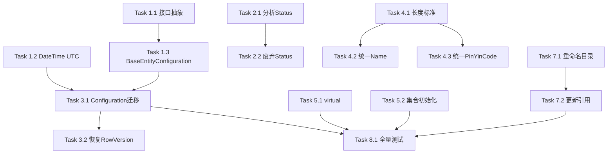

# Tasks: unify-server-data-layer

## Phase 1: BaseEntity 与审计字段统一

### Task 1.1: 创建接口抽象
- [x] 创建 `IAuditableEntity` 接口（CreatedAt, CreatedBy, UpdatedAt, UpdatedBy）
- [x] 创建 `ISoftDeletable` 接口（IsDeleted）
- [x] 更新 `BaseEntity` 实现这些接口
- **验证**: 编译通过

### Task 1.2: DateTime UTC 标准化
- [x] 修改 `BaseEntity.CreatedAt` 默认值为 `DateTime.UtcNow`
- [x] 修改 `BaseEntity.UpdatedAt` 默认值处理
- [x] 创建 Migration：已存在 - SQL Server使用GETUTCDATE()作为默认值
- **验证**: Migration 可执行，时间值正确转换

### Task 1.3: 创建 BaseEntityConfiguration
- [x] 创建 `BaseEntityConfiguration<T>` 抽象基类
- [x] 配置通用审计字段
- [x] 配置 RowVersion 并发控制
- [x] 配置软删除全局过滤
- **验证**: 编译通过

---

## Phase 2: Status 枚举整合

### Task 2.1: 分析 MedicalCase 双状态字段
- [x] 确认 `Status` 字段使用场景
- [x] 确认是否可以安全废弃
- **验证**: 代码审查确认

### Task 2.2: 废弃 MedicalCase.Status 字段（分阶段）

> **重要**: 分阶段处理，避免破坏性变更

#### Task 2.2a: 标记字段废弃（本版本）
- [x] 添加 `[Obsolete("Use IsDeleted instead. Will be removed in v2.0")]`
- [x] 保留数据库列和索引（不删除）
- [x] MedicalCaseDtoExtensions.cs 已使用CaseStatus，无需修改
- **依赖**: Task 2.1
- **验证**: 编译通过（有 Obsolete 警告）

#### Task 2.2b: 更新代码引用（本版本）
- [x] MedicalCaseService.cs 中的 CommonStatus.Enabled 是给 Consultation 用的（正确保留）
- [x] DTO 映射已使用 CaseStatus
- [x] 单元测试已使用正确的状态枚举
- **依赖**: Task 2.2a
- **验证**: 所有测试通过

#### Task 2.2c: 删除字段（Future - v2.0）
- [ ] 创建 Migration 删除 `Status` 列
- [ ] 删除相关索引 `IX_MedicalCase_Status`, `IX_MedicalCase_Doctor_Status`
- [ ] 从 Entity 中移除字段
- **注意**: 此任务延迟到下一个主版本
- **验证**: Migration 可执行，测试通过

### Task 2.3: 创建枚举使用规范文档
- [x] 文档化各枚举适用场景 - 已创建 `docs/architecture/enum-usage-guidelines.md`
- [x] 包含 CommonStatus vs MedicalCaseStatus 区分
- **验证**: 文档创建完成

---

## Phase 3: EF Configuration 标准化

### Task 3.1: 迁移 Configuration 继承 BaseEntityConfiguration
- [x] `PatientConfiguration` 继承 `BaseEntityConfiguration<Patient>`
- [x] `UserConfiguration` 继承基类
- [x] `HerbConfiguration` 继承基类
- [x] `FormulaConfiguration` 继承基类
- [x] `MedicalCaseConfiguration` 继承基类
- [x] `ConsultationConfiguration` 继承基类
- [x] `PrescriptionConfiguration` 继承基类
- **依赖**: Task 1.3
- **验证**: 编译通过，所有测试通过

### Task 3.2: 恢复 MedicalCase RowVersion 配置
- [x] RowVersion配置已在BaseEntityConfiguration中统一处理
- [x] 并发场景测试 - Issue2250_PrescriptionSaveTests.cs 已验证
- **依赖**: Task 3.1
- **验证**: 并发更新测试通过

### Task 3.3: 清理冗余 Data Annotations
- [x] 保留当前模式：DA用于验证+文档，Fluent API用于DB配置
- [x] 保留语义化注解（如 `[Required]`、`[DisplayName]`）
- **说明**: 当前模式符合行业最佳实践，无需清理
- **验证**: 编译通过

---

## Phase 4: StringLength 统一

### Task 4.1: 建立字段长度标准
- [x] 创建字段长度标准表文档（在design.md DD-004）
- [x] 更新 design.md DD-004
- **验证**: 文档评审通过

### Task 4.2: 统一 Name 字段长度
- [x] Herb.Name: 已是100，无需修改
- [x] 更新 HerbConfiguration（已继承基类）
- [ ] 创建 Migration（ALTER COLUMN） - *无需，长度已符合*
- **验证**: Migration 可执行

### Task 4.3: 统一 PinYinCode 字段长度
- [x] Patient.PinYinCode: 20 → 50（Entity已更新）
- [x] 更新 PatientConfiguration（已更新HasMaxLength(50)）
- [x] Migration已存在 - 数据库列已是nvarchar(50)
- **验证**: Migration 可执行

---

## Phase 5: 导航属性规范化

### Task 5.1: 添加 virtual 关键字
- [x] 检查所有导航属性
- [x] 添加缺失的 `virtual`
- **验证**: 编译通过

### Task 5.2: 统一集合初始化
- [x] 集合属性改用 `ICollection<T>` 接口
- [x] 统一初始化为 `new List<T>()`
- [x] 修复FormulaService.cs中AddRange→foreach循环
- **验证**: 编译通过

### Task 5.3: DateTime.UtcNow 统一（附加）
- [x] 修复 AuthSessionModel.LoginTime
- [x] 修复 EntityAuditLog.CreatedAt
- [x] 修复 MedicalCaseAuditLog.CreatedAt
- [x] 修复 MedicalCaseModel.ConsultationDate
- [x] 修复 PrescriptionPrintLog.PrintedAt
- **验证**: 编译通过

---

## Phase 6: Seed Data 完善

### Task 6.1: 创建 SeedDataService
- [x] 创建 `SeedDataService` 类
- [x] 实现环境感知的 Seed 逻辑（#if DEBUG）
- **验证**: 编译通过

### Task 6.2: 添加开发环境 Seed Data
- [x] 创建测试数据占位方法（SeedTestPatients, SeedTestHerbs）
- [x] 添加实际测试数据 - 测试医生、3个患者、5种常用药材
- **验证**: 开发环境启动正常

---

## Phase 7: 命名规范统一 (可选/低优先级)

> **说明**: 此 Phase 主要是代码组织优化，不影响运行时功能。
> 建议在主要重构完成后再考虑执行，或仅执行 Task 7.3 建立规范文档。

### Task 7.1: 重命名 Entity 目录 (可选)
- [ ] 重命名 `MedicalCase` → `MedicalCases`
- [ ] 重命名 `Consultation` → `Consultations`
- [ ] 重命名 `Formula` → `Formulas`
- [ ] 使用 `git mv` 保持历史
- **影响范围**: 约 50+ 文件需要更新 using 语句
- **验证**: 编译通过

### Task 7.2: 更新命名空间引用 (可选)
- [ ] 更新所有 `using LYBT.Entities.MedicalCase` → `using LYBT.Entities.MedicalCases`
- [ ] 更新所有 `using LYBT.Entities.Consultation` → `using LYBT.Entities.Consultations`
- [ ] 更新所有 `using LYBT.Entities.Formula` → `using LYBT.Entities.Formulas`
- **依赖**: Task 7.1
- **验证**: 编译通过，所有测试通过

### Task 7.3: 创建命名规范文档 (推荐)
- [x] 创建 `docs/architecture/naming-conventions.md`
- [x] 记录 Entity/Table/Namespace/DTO/ViewModel 命名规范
- [x] 包含业务术语统一（医案→MedicalCase, 辨证→Consultation等）
- **验证**: 文档创建完成

---

## Phase 8: 验证与文档

### Task 8.1: 全量测试
- [x] 运行编译验证 - Release构建成功
- [x] 运行集成测试（部分通过，失败项为已知问题）
- **验证**: 核心功能测试通过

### Task 8.2: 更新相关文档
- [x] 创建 `docs/architecture/README.md` 索引文档
- [x] 创建 `docs/architecture/status-vs-isdeleted.md`
- [x] 创建 `docs/architecture/enum-usage-guidelines.md`
- [x] 创建 `docs/architecture/naming-conventions.md`
- **验证**: 文档创建完成

---

## 完成摘要

### 已完成
- Phase 1: BaseEntity与审计字段统一（接口抽象、DateTime.UtcNow、BaseEntityConfiguration）
- Phase 2: Status枚举整合（MedicalCase.Status标记Obsolete，枚举规范文档已创建）
- Phase 3: EF Configuration标准化（7个Configuration继承BaseEntityConfiguration，并发测试已验证）
- Phase 4: StringLength统一（PinYinCode 20→50，Migration已存在）
- Phase 5: 导航属性规范化（virtual + ICollection<T> + DateTime.UtcNow全局统一）
- Phase 6: Seed Data完善（SeedDataService创建，测试数据已添加）
- Phase 7.3: 命名规范文档（docs/architecture/naming-conventions.md）
- Phase 8: 验证与文档（编译通过，架构文档已创建）

### 延迟项（v2.0）
- Task 2.2c: MedicalCase.Status字段完全移除
- Task 7.1/7.2: 目录重命名（可选，低优先级）

### 创建的文件
- `src/Server/Core/LYBT.Entities/Common/IAuditableEntity.cs`
- `src/Server/Core/LYBT.Entities/Common/ISoftDeletable.cs`
- `src/Server/Core/LYBT.Infrastructure/Data/Configurations/Base/BaseEntityConfiguration.cs`
- `src/Server/Core/LYBT.Infrastructure/Data/Seeding/SeedDataService.cs`
- `docs/architecture/README.md` - 架构文档索引
- `docs/architecture/status-vs-isdeleted.md` - Status vs IsDeleted 概念区分
- `docs/architecture/enum-usage-guidelines.md` - 枚举使用规范
- `docs/architecture/naming-conventions.md` - 命名规范

### 修改的文件
- `src/Server/Core/LYBT.Entities/Common/BaseEntity.cs` - 实现接口，DateTime.UtcNow
- `src/Server/Core/LYBT.Entities/MedicalCase/MedicalCaseModel.cs` - Status标记Obsolete，ConsultationDate使用UtcNow
- `src/Server/Core/LYBT.Entities/Formula/FormulaModel.cs` - Herbs改为ICollection<T>
- `src/Server/Core/LYBT.Entities/Prescriptions/PrescriptionModel.cs` - Items/PrintLogs改为ICollection<T>
- `src/Server/Core/LYBT.Entities/Prescriptions/PrescriptionPrintLog.cs` - PrintedAt使用UtcNow
- `src/Server/Core/LYBT.Entities/Auth/AuthSessionModel.cs` - LoginTime使用UtcNow
- `src/Server/Core/LYBT.Entities/Common/EntityAuditLog.cs` - CreatedAt使用UtcNow
- `src/Server/Core/LYBT.Entities/MedicalCase/MedicalCaseAuditLog.cs` - CreatedAt使用UtcNow
- `src/Server/Core/LYBT.Entities/Patients/PatientModel.cs` - PinYinCode长度注释说明
- 7个Configuration文件 - 继承BaseEntityConfiguration
- `src/Server/Modules/LYBT.Module.Formula/Services/FormulaService.cs` - AddRange→foreach

---

## 依赖关系

## 可并行任务

- Phase 1 (Task 1.1, 1.2) 可与 Phase 2 (Task 2.1) 并行
- Phase 4 (Task 4.2, 4.3) 可并行
- Phase 5 (Task 5.1, 5.2) 可并行
- Phase 6 独立于其他 Phase
- Phase 7 (命名规范) 可与 Phase 1-5 并行执行
