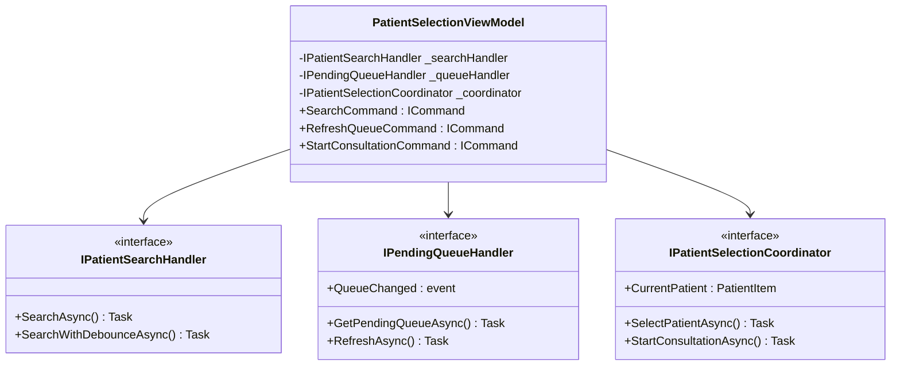
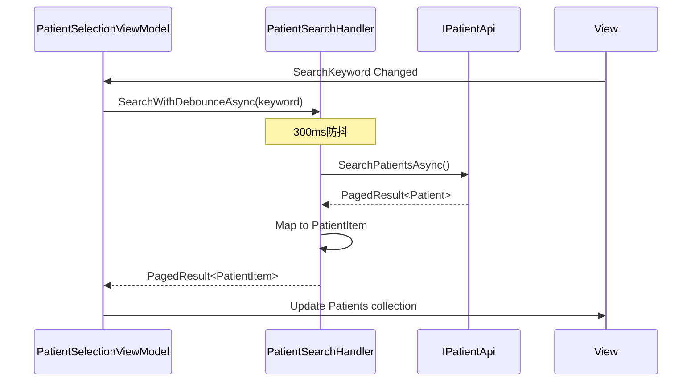

# Design: refactor-oversized-viewmodels

## Overview

本设计文档描述如何将18个超大ViewModel/DataManager重构为符合VM-001规范的结构，同时进行XAML控件化和代码清理。

## Architecture

### Component模式参考

MedicalCase模块已成功采用Component模式，作为本次重构的参考模板：

```
LYBT.Desktop.MedicalCase/ViewModels/Components/
├── MedicalCaseWorkspaceCoordinator.cs    # 工作区协调
├── MedicalCaseEditModeStateMachine.cs    # 编辑模式状态机
├── PrescriptionImportHandler.cs          # 导入处理
├── PrescriptionSaveHandler.cs            # 保存处理
├── PrescriptionCalculator.cs             # 计算逻辑
├── PrescriptionValidator.cs              # 验证逻辑
├── PrescriptionItemHandler.cs            # 条目处理
└── PrescriptionDataLoader.cs             # 数据加载
```

### Handler命名规范

| 后缀 | 职责 | 示例 |
|------|------|------|
| `Handler` | 处理特定业务逻辑 | `ImportExportHandler` |
| `Coordinator` | 协调多个组件 | `WorkspaceCoordinator` |
| `Calculator` | 计算逻辑 | `PrescriptionCalculator` |
| `Validator` | 验证逻辑 | `PrescriptionValidator` |
| `Loader` | 数据加载 | `DataLoader` |

---

## Phase 1 Detailed Design

### 1.1 PatientSelectionViewModel重构

#### 当前结构分析
```
PatientSelectionViewModel.cs (1347行)
├── 患者搜索逻辑 (~300行)
├── 待诊队列管理 (~250行)
├── 患者选择协调 (~200行)
├── 分页逻辑 (~150行)
├── 命令定义 (~200行)
└── 属性定义 (~250行)
```

#### 目标结构
```
LYBT.Desktop.Patients/ViewModels/
├── PatientSelectionViewModel.cs     # 重构后 < 500行
└── Components/
    ├── IPatientSearchHandler.cs
    ├── PatientSearchHandler.cs      # 搜索+分页
    ├── IPendingQueueHandler.cs
    ├── PendingQueueHandler.cs       # 待诊队列
    ├── IPatientSelectionCoordinator.cs
    └── PatientSelectionCoordinator.cs # 选择协调
```

#### 接口定义

```csharp
namespace LYBT.Desktop.Patients.ViewModels.Components;

/// <summary>
/// 患者搜索处理器接口
/// </summary>
public interface IPatientSearchHandler
{
    /// <summary>
    /// 搜索患者
    /// </summary>
    Task<PagedResult<PatientItem>> SearchAsync(
        string keyword, 
        int page, 
        int pageSize,
        CancellationToken cancellationToken = default);
    
    /// <summary>
    /// 实时搜索（带防抖）
    /// </summary>
    Task<PagedResult<PatientItem>> SearchWithDebounceAsync(
        string keyword,
        CancellationToken cancellationToken = default);
}

/// <summary>
/// 待诊队列处理器接口
/// </summary>
public interface IPendingQueueHandler
{
    /// <summary>
    /// 获取待诊队列
    /// </summary>
    Task<IList<PendingPatientItem>> GetPendingQueueAsync();
    
    /// <summary>
    /// 刷新待诊队列
    /// </summary>
    Task RefreshAsync();
    
    /// <summary>
    /// 队列变更事件
    /// </summary>
    event EventHandler<PendingQueueChangedEventArgs> QueueChanged;
}

/// <summary>
/// 患者选择协调器接口
/// </summary>
public interface IPatientSelectionCoordinator
{
    /// <summary>
    /// 当前选中患者
    /// </summary>
    PatientItem? CurrentPatient { get; }
    
    /// <summary>
    /// 选择患者
    /// </summary>
    Task SelectPatientAsync(PatientItem patient);
    
    /// <summary>
    /// 开始诊断
    /// </summary>
    Task<bool> StartConsultationAsync();
    
    /// <summary>
    /// 选择变更事件
    /// </summary>
    event EventHandler<PatientSelectedEventArgs> PatientSelected;
}
```

### 1.2 PrescriptionPanelViewModel重构

#### 目标结构
```
LYBT.Desktop.Prescriptions/ViewModels/
├── PrescriptionPanelViewModel.cs    # 重构后 < 500行
└── Components/
    ├── IPrescriptionEditHandler.cs
    ├── PrescriptionEditHandler.cs
    ├── IPrescriptionCalculationHandler.cs
    ├── PrescriptionCalculationHandler.cs
    ├── IPrescriptionValidationHandler.cs
    └── PrescriptionValidationHandler.cs
```

### 1.3 MedicalCaseWorkspaceViewModel重构

#### 目标结构
```
LYBT.Desktop.MedicalCase/ViewModels/
├── MedicalCaseWorkspaceViewModel.cs # 重构后 < 500行
└── Components/
    ├── (现有组件...)
    ├── IWorkspaceNavigationHandler.cs
    ├── WorkspaceNavigationHandler.cs
    ├── IWorkspaceStateHandler.cs
    ├── WorkspaceStateHandler.cs
    ├── IWorkspaceCommandHandler.cs
    └── WorkspaceCommandHandler.cs
```

### 1.4 MedicalCaseDataManager重构

#### 目标结构
```
LYBT.Desktop.MedicalCase/
├── Components/
│   ├── (现有组件...)
│   ├── IMedicalCaseQueryHandler.cs
│   ├── MedicalCaseQueryHandler.cs
│   ├── IMedicalCaseCacheHandler.cs
│   └── MedicalCaseCacheHandler.cs
└── MedicalCaseDataManager.cs        # 重构后 < 500行
```

---

## Phase 5 XAML控件化设计

### 5.1 FormFieldControl

可复用的表单字段控件，封装Label+Input模式。

```xml
<!-- 使用方式 -->
<controls:FormFieldControl 
    Label="用户名" 
    IsRequired="True"
    Text="{Binding UserName}" />
```

```csharp
namespace LYBT.Desktop.Infrastructure.Controls;

public class FormFieldControl : UserControl
{
    public static readonly DependencyProperty LabelProperty;
    public static readonly DependencyProperty TextProperty;
    public static readonly DependencyProperty IsRequiredProperty;
    public static readonly DependencyProperty IsReadOnlyProperty;
    public static readonly DependencyProperty PlaceholderProperty;
    
    // ... 实现
}
```

### 5.2 CardContainer

带阴影的卡片容器控件。

```xml
<controls:CardContainer Title="患者信息" Padding="20">
    <!-- 内容 -->
</controls:CardContainer>
```

### 5.3 LoadingOverlay

加载遮罩层控件。

```xml
<controls:LoadingOverlay 
    IsVisible="{Binding IsLoading}" 
    Message="正在加载..." />
```

### 5.4 EmptyStateView

空数据状态控件。

```xml
<controls:EmptyStateView
    Icon="📋"
    Title="暂无数据"
    Subtitle="请添加新记录" />
```

### 5.5 PaginationControl

分页控件。

```xml
<controls:PaginationControl
    CurrentPage="{Binding CurrentPage}"
    TotalPages="{Binding TotalPages}"
    TotalCount="{Binding TotalCount}"
    PageSize="20"
    PreviousCommand="{Binding PreviousPageCommand}"
    NextCommand="{Binding NextPageCommand}" />
```

### 5.6 SearchBox

带占位符的搜索框控件。

```xml
<controls:SearchBox
    Text="{Binding SearchKeyword}"
    Placeholder="输入姓名/手机号搜索"
    SearchCommand="{Binding SearchCommand}" />
```

---

## DI注册模式

### Module注册示例

```csharp
public class PatientsModule : IModule
{
    public void RegisterTypes(IContainerRegistry containerRegistry)
    {
        // 现有注册...
        
        // Handler注册 (Scoped生命周期)
        containerRegistry.RegisterScoped<IPatientSearchHandler, PatientSearchHandler>();
        containerRegistry.RegisterScoped<IPendingQueueHandler, PendingQueueHandler>();
        containerRegistry.RegisterScoped<IPatientSelectionCoordinator, PatientSelectionCoordinator>();
        containerRegistry.RegisterScoped<IPatientImportExportHandler, PatientImportExportHandler>();
    }
}
```

---

## Class Diagram



---

## Sequence Diagram - 患者搜索流程



---

## Testing Strategy

### Handler单元测试

```csharp
public class PatientSearchHandlerTests
{
    private readonly Mock<IPatientApi> _apiMock;
    private readonly PatientSearchHandler _handler;

    [Fact]
    public async Task SearchAsync_WithKeyword_ReturnsMatchingPatients()
    {
        // Arrange
        _apiMock.Setup(a => a.SearchPatientsAsync(It.IsAny<PatientSearchRequest>()))
            .ReturnsAsync(new PagedResponse<PatientDto> { Items = [...] });

        // Act
        var result = await _handler.SearchAsync("张", 1, 20);

        // Assert
        Assert.NotEmpty(result.Items);
        Assert.All(result.Items, p => Assert.Contains("张", p.Name));
    }

    [Fact]
    public async Task SearchWithDebounceAsync_MultipleCallsInDebounceWindow_OnlyExecutesOnce()
    {
        // 测试防抖逻辑
    }
}
```

---

## Migration Guide

### 重构步骤（每个ViewModel）

1. **创建Handler接口和实现**
   - 不修改现有ViewModel
   - 新建Components目录和文件

2. **注册Handler到DI容器**
   - 在Module.cs中添加注册

3. **重构ViewModel**
   - 添加Handler依赖注入
   - 修改逻辑为委托模式
   - 删除原有实现代码

4. **添加测试**
   - 为Handler添加单元测试
   - 验证现有ViewModel测试通过

5. **验证**
   - 运行架构测试
   - 运行单元测试
   - 手动验证功能

---

## Rollback Plan

如果重构出现问题：

1. Git revert相关commits
2. 移除新增的Handler文件
3. 恢复Module.cs的注册
4. 恢复ViewModel原有实现

由于采用增量重构方式（先新增再删除），回滚风险较低。

---

## References

- [VM-001 ViewModel规范](../../specs/viewmodel-conventions/spec.md)
- [PrescriptionImportHandler参考实现](../../../src/Client/Desktop/Modules/LYBT.Desktop.MedicalCase/ViewModels/Components/PrescriptionImportHandler.cs)
- [Prism MVVM最佳实践](https://prismlibrary.com/docs/wpf/mvvm.html)
- [WPF UserControl开发指南](https://docs.microsoft.com/en-us/dotnet/desktop/wpf/controls/usercontrol)
