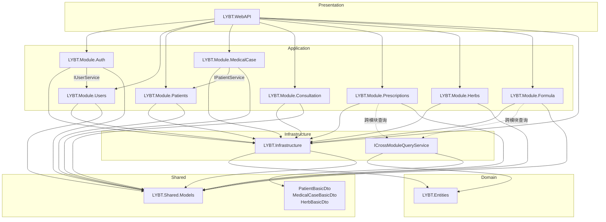
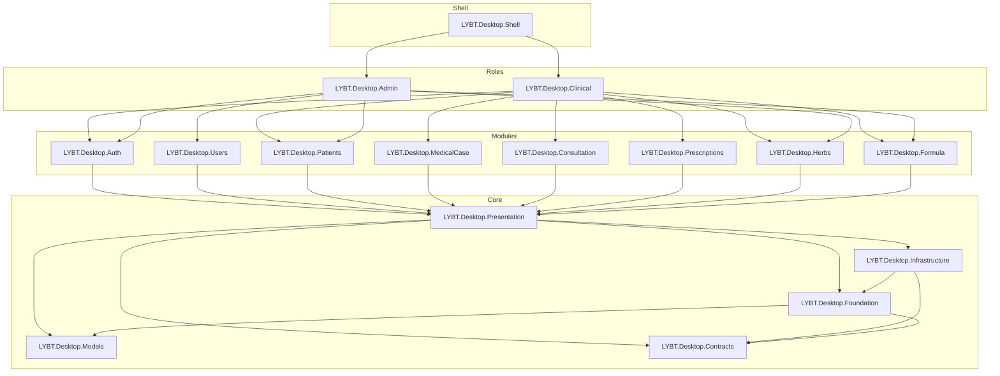

# Design: document-project-architecture

## Overview

本设计文档详细描述LYBTZYZS项目的完整架构，包括35个项目的定位、职责和依赖关系。

---

## Part 1: Server层架构 (13个项目)

### 1.1 Core层 (2个项目)

#### LYBT.Entities - 领域实体层

**职责**: 定义所有领域实体、枚举、值对象

**目录结构**:
```
LYBT.Entities/
├── Common/
│   ├── BaseEntity.cs           # 基础实体(Id, CreatedAt, UpdatedAt, IsDeleted, RowVersion)
│   ├── SoftDeleteEntity.cs     # 软删除实体
│   └── AuditableEntity.cs      # 审计实体(CreatedBy, UpdatedBy)
├── Auth/
│   └── RefreshToken.cs         # 刷新令牌
├── Consultations/
│   └── Consultation.cs         # 诊断实体(聚合根边界内)
├── Formulas/
│   ├── Formula.cs              # 经验方
│   └── FormulaItem.cs          # 经验方条目
├── Herbs/
│   └── Herb.cs                 # 药材
├── MedicalCases/
│   ├── MedicalCase.cs          # 医案(核心聚合根)
│   └── MedicalCaseAuditLog.cs  # 医案审计日志
├── Patients/
│   └── Patient.cs              # 患者
├── Prescriptions/
│   ├── Prescription.cs         # 处方(聚合根边界内)
│   └── PrescriptionItem.cs     # 处方条目
└── Users/
    └── User.cs                 # 用户
```

**设计原则**:
- 无外部依赖，仅引用.NET BCL
- 实体类不包含业务逻辑(贫血模型)
- 使用DataAnnotations定义基本约束

**BaseEntity基类定义**:
```csharp
public abstract class BaseEntity
{
    public Guid Id { get; set; }
    public DateTime CreatedAt { get; set; }
    public DateTime? UpdatedAt { get; set; }
    public Guid? CreatedBy { get; set; }
    public Guid? UpdatedBy { get; set; }
    public bool IsDeleted { get; set; }
    public byte[] RowVersion { get; set; }  // 乐观并发
}
```

---

#### LYBT.Infrastructure - 基础设施层

**职责**: 数据访问、仓储基类、数据库迁移、通用服务

**目录结构**:
```
LYBT.Infrastructure/
├── Data/
│   ├── AppDbContext.cs                    # EF Core上下文
│   └── EntityConfigurations/              # Fluent API配置
│       ├── MedicalCaseConfiguration.cs
│       ├── PatientConfiguration.cs
│       └── ...
├── Interfaces/
│   ├── IRepository.cs                     # 完整仓储接口
│   └── IReadRepository.cs                 # 只读仓储接口
├── Repositories/
│   ├── BaseRepository.cs                  # 仓储基类(14个标准方法)
│   └── BaseReadRepository.cs              # 只读仓储基类
├── Services/
│   ├── BaseService.cs                     # 服务基类
│   ├── EntityAuditService.cs              # 实体审计服务
│   └── CurrentUserService.cs              # 当前用户服务
├── Migrations/                            # EF Core迁移(28个)
└── Extensions/
    └── ServiceCollectionExtensions.cs     # DI注册扩展
```

**BaseRepository标准方法** (14个):
```csharp
public abstract class BaseRepository<T> : IRepository<T> where T : BaseEntity
{
    // 查询方法
    Task<T?> GetByIdAsync(Guid id);
    Task<IEnumerable<T>> GetAllAsync();
    Task<PagedResult<T>> GetPagedAsync(int page, int pageSize, string? keyword);
    Task<bool> ExistsAsync(Guid id);
    Task<int> CountAsync();

    // 写入方法
    Task<T> AddAsync(T entity);
    Task<IEnumerable<T>> AddRangeAsync(IEnumerable<T> entities);
    Task UpdateAsync(T entity);
    Task UpdateRangeAsync(IEnumerable<T> entities);
    Task DeleteAsync(Guid id);           // 软删除
    Task DeleteRangeAsync(IEnumerable<Guid> ids);
    Task HardDeleteAsync(Guid id);       // 硬删除

    // 模板方法(供子类覆盖)
    protected virtual IQueryable<T> ApplyKeywordFilter(IQueryable<T> query, string keyword);
    protected virtual IQueryable<T> ApplyDefaultOrdering(IQueryable<T> query);
}
```

---

#### ICrossModuleQueryService - 跨模块查询服务 (OpenSpec: decouple-server-modules)

**职责**: 提供模块间只读数据访问，避免直接跨模块注入Repository

**位置**: `LYBT.Infrastructure/Services/ICrossModuleQueryService.cs`

**设计原则**:
- 轻量封装：不引入框架级复杂性，仅封装跨模块查询
- 返回DTO：防止Entity泄露，符合Bounded Context
- 批量优先：提供批量查询方法，避免N+1问题
- 只读查询：使用AsNoTracking()优化性能

**接口定义**:
```csharp
public interface ICrossModuleQueryService
{
    // 患者查询
    Task<PatientBasicDto?> GetPatientBasicInfoAsync(Guid patientId);
    Task<Dictionary<Guid, PatientBasicDto>> GetPatientsBasicInfoAsync(IEnumerable<Guid> patientIds);

    // 医案查询(含诊断)
    Task<MedicalCaseBasicDto?> GetMedicalCaseBasicInfoAsync(Guid medicalCaseId);
    Task<Dictionary<Guid, MedicalCaseBasicDto>> GetMedicalCasesBasicInfoAsync(IEnumerable<Guid> medicalCaseIds);

    // 药材查询
    Task<HerbBasicDto?> GetHerbBasicInfoAsync(Guid herbId);
    Task<HerbBasicDto?> GetHerbByNameOrPinyinAsync(string nameOrPinyin);
}
```

**BasicDto定义** (位于LYBT.Shared.Models/Contracts/Common/):
```csharp
// PatientBasicDto - 患者基本信息
public class PatientBasicDto { Guid Id; string Name; Gender Gender; string? Phone; }

// MedicalCaseBasicDto - 医案基本信息(含诊断)
public class MedicalCaseBasicDto { Guid Id; Guid PatientId; MedicalCaseStatus Status; DateTime CreatedAt; string? TCMDiagnosis; }

// HerbBasicDto - 药材基本信息
public class HerbBasicDto { Guid Id; string Name; string? Pinyin; string? Category; }
```

**DI注册**: `DatabaseServiceCollectionExtensions.RegisterInfrastructureServices()`

---

### 1.2 Modules层 (8个项目)

#### 模块职责对照表

| 模块 | 架构模式 | 主要Service | 跨模块通信 | 说明 |
|------|----------|-------------|------------|------|
| LYBT.Module.Auth | 传统三层 | AuthService | IUserService | 认证、令牌管理 |
| LYBT.Module.Users | 传统三层 | UserService | - | 用户CRUD |
| LYBT.Module.Patients | 传统三层 | PatientService | - | 患者CRUD |
| LYBT.Module.MedicalCase | **CQRS** | 5个Service | IPatientService | 医案核心业务 |
| LYBT.Module.Consultation | 传统三层 | ConsultationService | - | 诊断CRUD(聚合内) |
| LYBT.Module.Prescriptions | 传统三层 | PrescriptionService | **ICrossModuleQueryService** | 处方CRUD |
| LYBT.Module.Herbs | 传统三层 | HerbService | - | 药材CRUD |
| LYBT.Module.Formula | 传统三层 | FormulaService | **ICrossModuleQueryService** | 经验方CRUD |

**模块依赖变化** (OpenSpec: decouple-server-modules):
- **Prescriptions**: 移除5个直接模块依赖(Patients, Consultation, MedicalCase, Herbs, Formula) → 全部通过ICrossModuleQueryService
- **Formula**: 移除1个直接模块依赖(Herbs) → 通过ICrossModuleQueryService

---

#### LYBT.Module.MedicalCase - CQRS模式详解

**Service拆分**:
```
IMedicalCaseCommandService     # 写操作(Create/Update/Delete)
├── CreateMedicalCaseAsync()
├── UpdateMedicalCaseAsync()
└── DeleteMedicalCaseAsync()

IMedicalCaseQueryService       # 读操作(Get/List/Search)
├── GetByIdAsync()
├── GetPagedAsync()
├── GetByPatientIdAsync()
└── SearchAsync()

IMedicalCaseStateService       # 状态变更
├── SubmitAsync()
├── ArchiveAsync()
└── RevertAsync()

IMedicalCasePermissionService  # 权限检查
├── CanEditAsync()
├── CanDeleteAsync()
└── CanArchiveAsync()

IMedicalCaseAuditService       # 审计日志
├── LogCreateAsync()
├── LogUpdateAsync()
└── LogStateChangeAsync()
```

**目录结构**:
```
LYBT.Module.MedicalCase/
├── MedicalCaseModule.cs
├── Repositories/
│   └── MedicalCaseRepository.cs
├── Services/
│   ├── IMedicalCaseCommandService.cs
│   ├── MedicalCaseCommandService.cs
│   ├── IMedicalCaseQueryService.cs
│   ├── MedicalCaseQueryService.cs
│   ├── IMedicalCaseStateService.cs
│   ├── MedicalCaseStateService.cs
│   ├── IMedicalCasePermissionService.cs
│   ├── MedicalCasePermissionService.cs
│   ├── IMedicalCaseAuditService.cs
│   └── MedicalCaseAuditService.cs
├── Validators/
│   ├── CreateMedicalCaseRequestValidator.cs
│   └── UpdateMedicalCaseRequestValidator.cs
└── Dtos/
    └── MedicalCaseDtos.cs     # 模块私有DTO
```

---

#### 传统三层模块标准结构

以`LYBT.Module.Patients`为例:
```
LYBT.Module.Patients/
├── PatientsModule.cs              # 模块注册
│   └── RegisterTypes()            # 注册Service和Repository
├── Repositories/
│   ├── IPatientRepository.cs      # (可选,使用基类接口时可省略)
│   └── PatientRepository.cs       # 继承BaseRepository<Patient>
├── Services/
│   ├── IPatientService.cs         # 服务接口
│   └── PatientService.cs          # 服务实现,继承BaseService<Patient>
└── Validators/
    ├── CreatePatientRequestValidator.cs
    └── UpdatePatientRequestValidator.cs
```

---

### 1.3 Services层 (1个项目)

#### LYBT.WebAPI - API入口

**职责**: HTTP请求处理、路由、认证授权、全局中间件

**目录结构**:
```
LYBT.WebAPI/
├── Controllers/
│   ├── AuthController.cs
│   ├── UsersController.cs
│   ├── PatientsController.cs
│   ├── MedicalCaseController.cs
│   ├── ConsultationController.cs
│   ├── PrescriptionController.cs
│   ├── HerbsController.cs
│   └── FormulaController.cs
├── Middleware/
│   ├── ExceptionMiddleware.cs      # 全局异常处理
│   └── RequestLoggingMiddleware.cs # 请求日志
├── Extensions/
│   └── ServiceCollectionExtensions.cs
├── appsettings.json
└── Program.cs
```

**Controller规范**:
```csharp
[ApiController]
[Route("api/[controller]")]
[Authorize]
public class PatientsController : ControllerBase
{
    private readonly IPatientService _patientService;

    // 注入Service，不注入Repository
    public PatientsController(IPatientService patientService)
    {
        _patientService = patientService;
    }

    [HttpGet]
    public async Task<IActionResult> GetAll([FromQuery] PagedRequest request)
    {
        var result = await _patientService.GetPagedAsync(request);
        return result.IsSuccess ? Ok(result.Data) : BadRequest(result.Error);
    }
}
```

---

## Part 2: Shared层架构 (4个项目)

### 2.1 LYBT.Shared.Models - 共享模型

**职责**: DTO定义、API契约、共享枚举

**目录结构**:
```
LYBT.Shared.Models/
├── Contracts/                      # API契约DTO
│   ├── Auth/
│   │   ├── LoginRequest.cs
│   │   ├── LoginResponse.cs
│   │   └── RefreshTokenRequest.cs
│   ├── MedicalCase/
│   │   ├── CreateMedicalCaseRequest.cs
│   │   ├── UpdateMedicalCaseRequest.cs
│   │   ├── MedicalCaseDto.cs
│   │   └── MedicalCaseDetailDto.cs
│   ├── Patient/
│   ├── User/
│   ├── Consultation/
│   ├── Prescription/
│   ├── Herb/
│   └── Formula/
├── Common/
│   ├── BaseDto.cs                 # DTO基类(Id)
│   ├── TimestampDto.cs            # 时间戳DTO(CreatedAt, UpdatedAt)
│   ├── StatusDto.cs               # 状态DTO(IsDeleted)
│   ├── PagedRequest.cs            # 分页请求
│   ├── PagedResponse.cs           # 分页响应
│   └── Result.cs                  # 统一结果类型
├── Enums/
│   ├── UserRole.cs
│   ├── MedicalCaseStatus.cs
│   ├── HerbCategory.cs
│   └── ...
└── Constants/
    └── ErrorCodes.cs
```

**DTO继承层次**:
```
BaseDto (Id)
    └── TimestampDto (CreatedAt, UpdatedAt)
        └── StatusDto (IsDeleted)
            └── AuditDto (CreatedBy, UpdatedBy)
```

---

### 2.2 LYBT.Shared.Utilities - 工具类

**目录结构**:
```
LYBT.Shared.Utilities/
├── Configuration/
│   └── ConfigurationHelper.cs
├── Security/
│   ├── PasswordHasher.cs          # BCrypt封装
│   └── JwtHelper.cs
├── Text/
│   ├── PinYinConverter.cs         # 中文转拼音
│   └── StringExtensions.cs
└── Helpers/
    └── DateTimeHelper.cs
```

---

### 2.3 LYBT.Shared.Validators - 验证器

**目录结构**:
```
LYBT.Shared.Validators/
├── Common/
│   ├── BaseValidator.cs           # 验证器基类
│   └── BusinessRuleValidator.cs   # 业务规则验证
├── Auth/
│   └── LoginRequestValidator.cs
├── Patient/
│   ├── CreatePatientRequestValidator.cs
│   └── UpdatePatientRequestValidator.cs
└── ...
```

---

### 2.4 LYBT.Shared.Components - 业务组件

**职责**: 可复用的业务计算和验证组件

**目录结构**:
```
LYBT.Shared.Components/
├── Interfaces/
│   └── IHerbItem.cs               # 药材条目接口
├── Calculators/
│   ├── HerbCalculatorBase.cs      # 药材计算基类
│   └── PrescriptionCalculator.cs  # 处方计算
└── Validators/
    └── HerbValidatorBase.cs       # 药材验证基类
```

---

## Part 3: Client层架构 (16个项目)

### 3.1 Core层 (5个项目)

#### LYBT.Desktop.Contracts - 接口定义

**职责**: 定义所有客户端接口，实现依赖倒置

**目录结构**:
```
LYBT.Desktop.Contracts/
├── Apis/                          # Refit API接口
│   ├── IAuthApi.cs
│   ├── IPatientApi.cs
│   ├── IMedicalCaseApi.cs
│   └── ...
├── Services/                      # 服务接口
│   ├── IAuthService.cs
│   ├── INavigationService.cs
│   └── IDialogService.cs
└── Repositories/                  # 客户端仓储接口
    └── IApiRepository.cs
```

---

#### LYBT.Desktop.Foundation - 基础设施

**职责**: HTTP客户端、缓存、安全、配置

**目录结构**:
```
LYBT.Desktop.Foundation/
├── Http/
│   ├── HttpClientFactory.cs
│   ├── AuthenticatedHttpHandler.cs  # JWT处理
│   └── RefitClientFactory.cs        # Refit工厂
├── Caching/
│   ├── ICacheService.cs
│   └── MemoryCacheService.cs
├── Security/
│   ├── TokenStorage.cs
│   └── SecureStorage.cs
├── Configuration/
│   ├── AppSettings.cs
│   └── ConfigurationManager.cs
└── Logging/
    └── FileLogger.cs
```

---

#### LYBT.Desktop.Infrastructure - WPF服务

**职责**: WPF特定服务、控件、转换器

**目录结构**:
```
LYBT.Desktop.Infrastructure/
├── Services/
│   ├── DialogService.cs           # 弹窗服务
│   ├── NavigationService.cs       # 导航服务
│   ├── MessageBoxService.cs       # 消息框
│   └── NotificationService.cs     # 通知服务
├── Controls/
│   ├── LoadingOverlay.xaml
│   ├── EmptyStateView.xaml
│   └── PaginationControl.xaml
├── Converters/
│   ├── BoolToVisibilityConverter.cs
│   ├── NullToVisibilityConverter.cs
│   └── EnumDescriptionConverter.cs
├── Themes/
│   ├── Colors.xaml
│   ├── Buttons.xaml
│   └── TextBoxes.xaml
└── Behaviors/
    └── TextBoxBehavior.cs
```

---

#### LYBT.Desktop.Models - 客户端模型

**职责**: 客户端专用模型、状态枚举

**目录结构**:
```
LYBT.Desktop.Models/
├── ViewStates/
│   ├── LoadingState.cs
│   └── EditState.cs
├── Items/
│   ├── PatientItem.cs             # ListView项
│   └── HerbItem.cs
└── Events/
    ├── PatientSelectedEvent.cs
    └── MedicalCaseSavedEvent.cs
```

---

#### LYBT.Desktop.Presentation - UI基类

**职责**: ViewModel基类、通用UI逻辑

**目录结构**:
```
LYBT.Desktop.Presentation/
├── ViewModels/
│   ├── UnifiedViewModelBase.cs    # ViewModel基类
│   ├── DialogViewModelBase.cs     # 弹窗ViewModel基类
│   └── ListViewModelBase.cs       # 列表ViewModel基类
├── Commands/
│   └── AsyncDelegateCommand.cs
└── Repositories/
    └── BaseApiRepository.cs       # API仓储基类
```

**UnifiedViewModelBase定义**:
```csharp
public abstract class UnifiedViewModelBase : BindableBase, INavigationAware
{
    protected readonly IRegionManager _regionManager;
    protected readonly IEventAggregator _eventAggregator;
    protected readonly IDialogService _dialogService;

    // 通用属性
    public bool IsLoading { get; set; }
    public bool IsRefreshing { get; set; }
    public string? ErrorMessage { get; set; }

    // 生命周期
    public virtual void OnNavigatedTo(NavigationContext context) { }
    public virtual void OnNavigatedFrom(NavigationContext context) { }
    public virtual bool IsNavigationTarget(NavigationContext context) => true;
}
```

---

### 3.2 Modules层 (8个项目)

#### 模块标准结构

```
LYBT.Desktop.{Domain}/
├── {Domain}Module.cs              # Prism模块注册
├── Views/
│   ├── {Feature}View.xaml         # 主视图
│   ├── {Feature}View.xaml.cs
│   └── Dialogs/                   # 弹窗视图
│       ├── {Dialog}Dialog.xaml
│       └── {Dialog}Dialog.xaml.cs
├── ViewModels/
│   ├── {Feature}ViewModel.cs      # 主ViewModel
│   ├── Dialogs/                   # 弹窗ViewModel
│   │   └── {Dialog}DialogViewModel.cs
│   └── Components/                # 组件(Handler/Coordinator)
│       ├── I{Feature}Handler.cs
│       └── {Feature}Handler.cs
└── Services/                      # 客户端服务(可选)
    └── {Domain}LocalService.cs
```

---

#### 各模块职责

| 模块 | 主要视图 | ViewModel数量 | 说明 |
|------|----------|---------------|------|
| Auth | LoginView | 1 | 登录、令牌管理 |
| Users | UserManagement, UserDetail | 2 | 用户CRUD、角色管理 |
| Patients | PatientSelection, PatientManagement, PatientDetail | 3 | 患者选择、CRUD |
| MedicalCase | MedicalCaseWorkspace, MedicalCaseList | 17 | 医案核心工作区 |
| Consultation | ConsultationForm | 1 | 诊断录入 |
| Prescriptions | PrescriptionPanel | 2 | 处方编辑 |
| Herbs | HerbManagement, HerbDetail | 2 | 药材CRUD |
| Formula | FormulaManagement, FormulaDetail | 2 | 经验方CRUD |

---

### 3.3 Roles层 (2个项目)

#### LYBT.Desktop.Clinical - 临床端工作站

**职责**: 组装临床医生使用的模块和导航

**包含模块**: Auth, Patients, MedicalCase, Consultation, Prescriptions, Herbs, Formula

---

#### LYBT.Desktop.Admin - 管理员端工作站

**职责**: 组装管理员使用的模块和导航

**包含模块**: Auth, Users, Patients, Herbs, Formula

---

### 3.4 Shell层 (1个项目)

#### LYBT.Desktop.Shell - 应用入口

**职责**: 应用启动、主窗口、Region定义

**目录结构**:
```
LYBT.Desktop.Shell/
├── App.xaml                       # PrismApplication
├── App.xaml.cs
├── Views/
│   ├── MainWindow.xaml            # 主窗口
│   └── MainWindow.xaml.cs
├── ViewModels/
│   └── MainWindowViewModel.cs
└── Bootstrapper.cs                # 启动配置(可选)
```

---

## Part 4: 依赖关系图

### Server层依赖 (OpenSpec: decouple-server-modules 重构后)



**依赖矩阵** (重构后):

```
依赖方 →              Auth  Users  Patients  MedicalCase  Consultation  Prescriptions  Herbs  Formula
被依赖方 ↓
Auth                   -      -       -           -            -              -           -       -
Users                  Y      -       -           -            -              -           -       -
Patients               -      -       -           Y            -              -           -       -
MedicalCase            -      -       -           -            Y              -           -       -
Consultation           -      -       -           -            -              -           -       -
Prescriptions          -      -       -           -            -              -           -       -
Herbs                  -      -       -           -            -              -           -       -
Formula                -      -       -           -            -              -           -       -
CrossModule(Infra)     -      -       -           -            -              Y           -       Y
```

**变化总结**:
- Prescriptions: 5个模块依赖 → 0个 (全部通过ICrossModuleQueryService)
- Formula: 1个模块依赖 → 0个 (通过ICrossModuleQueryService)

### Client层依赖



---

## Part 5: 架构测试策略

### 5.1 现有架构测试

```
tests/UnitTests/Architecture/
├── DesktopLayerArchTests.cs       # Desktop层架构测试(12个)
│   ├── ViewModels不超过500行
│   ├── Views不包含业务逻辑
│   ├── Services实现接口
│   └── ...
└── ServerLayerArchTests.cs        # Server层架构测试(待实现)
```

### 5.2 建议新增测试

```csharp
// 依赖方向测试
[Fact]
public void Entities_ShouldNotReference_Infrastructure()

[Fact]
public void Infrastructure_ShouldNotReference_Modules()

[Fact]
public void Modules_ShouldNotReference_WebAPI()

// Service规范测试
[Fact]
public void AllServices_ShouldReturnResultType()

[Fact]
public void AllServices_ShouldInheritBaseService()

// Repository规范测试
[Fact]
public void AllRepositories_ShouldInheritBaseRepository()
```

---

## References

- [Clean Architecture - Robert C. Martin](https://blog.cleancoder.com/uncle-bob/2012/08/13/the-clean-architecture.html)
- [Prism Library Documentation](https://prismlibrary.com/docs/)
- [Domain-Driven Design - Eric Evans](https://domainlanguage.com/ddd/)
- [CQRS Pattern - Martin Fowler](https://martinfowler.com/bliki/CQRS.html)
