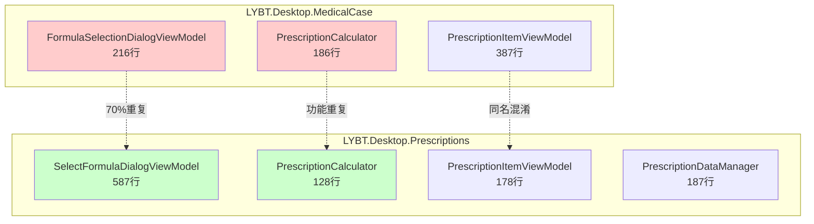
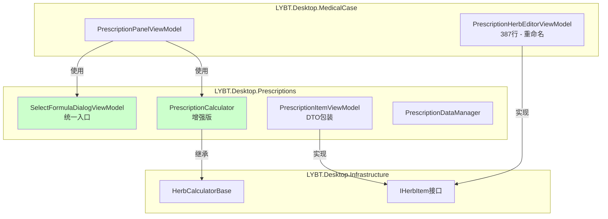

# Design: 重构Client端处方模块代码整合

**Change ID:** refactor-prescription-module-consolidation
**Spec:** desktop-prescription
**Created:** 2025-12-10

## Architecture Overview

### 当前架构问题



### 目标架构



## Design Decisions

### DD-1: 验方选择对话框统一策略

**决策**: 保留`SelectFormulaDialogViewModel`，删除`FormulaSelectionDialogViewModel`

**理由**:
1. SelectFormulaDialogViewModel功能更完整（587行 vs 216行）
2. 已与PrescriptionDataManager集成
3. 支持分类筛选、效能筛选等高级功能
4. 遵循DRY原则

**影响**:
- MedicalCase模块需要添加对Prescriptions模块的依赖
- PrescriptionPanelViewModel需要更新对话框调用代码

### DD-2: 处方计算器统一策略

**决策**: 保留Prescriptions模块的`PrescriptionCalculator`，增强后删除MedicalCase版本

**理由**:
1. Prescriptions版本使用了`HerbCalculatorBase<T>`基类，架构更好
2. 支持`IHerbItem`接口，更具扩展性
3. MedicalCase版本的事件机制可以合并到保留版本

**增强内容**:
```csharp
// 从MedicalCase版本迁移的功能
public event EventHandler<PriceCalculatedEventArgs>? PriceCalculated;
public List<PrescriptionItemDto> BuildItemsWithPrice(
    IEnumerable<IHerbItem> items,
    IEnumerable<HerbDto> allHerbs);
```

### DD-3: ViewModel命名澄清策略

**决策**: 重命名MedicalCase的`PrescriptionItemViewModel`为`PrescriptionHerbEditorViewModel`

**理由**:
1. 消除同名类混淆
2. 更准确反映其职责（交互式药材编辑）
3. 与Prescriptions模块的`PrescriptionItemViewModel`（DTO包装器）区分

**命名对比**:
| 模块 | 类名 | 职责 |
|------|------|------|
| MedicalCase | `PrescriptionHerbEditorViewModel` | 交互式编辑、7级拼音过滤 |
| Prescriptions | `PrescriptionItemViewModel` | DTO包装、数据传输 |

### DD-4: 模块依赖方向

**决策**: MedicalCase依赖Prescriptions，而非反向

**理由**:
1. 处方是医案的组成部分，医案依赖处方符合业务逻辑
2. Prescriptions模块更底层（打印、独立管理）
3. 避免循环依赖

**依赖图**:
```
Shell
  ├── MedicalCase ──> Prescriptions ──> Formula
  │                                  └── Herbs
  └── Admin
```

## Component Details

### 统一后的SelectFormulaDialogViewModel

```csharp
/// <summary>
/// 统一的验方选择对话框 - 用于处方编辑和医案中的验方导入
/// </summary>
public class SelectFormulaDialogViewModel : UnifiedViewModelBase, IDialogAware
{
    // 数据源
    private readonly PrescriptionDataManager _dataManager;

    // 筛选功能
    public string[] CategoryOptions { get; }  // 分类筛选
    public string[] EffectOptions { get; }    // 效能筛选

    // 核心功能
    public DelegateCommand SearchCommand { get; }
    public DelegateCommand ConfirmCommand { get; }
    public DelegateCommand ImportCommand { get; }  // Issue #1367

    // 输出
    public FormulaDto? SelectedFormula { get; }
}
```

### 增强后的PrescriptionCalculator

```csharp
/// <summary>
/// 统一的处方价格计算器 - 继承自HerbCalculatorBase
/// </summary>
public class PrescriptionCalculator : HerbCalculatorBase<PrescriptionItemViewModel>
{
    // 保留的核心方法
    public CalculationResult CalculatePrescriptionPrice(
        IEnumerable<PrescriptionItemViewModel> items,
        int dosageCount = 1,
        decimal discount = 1.0m);

    // 从MedicalCase版本迁移
    public event EventHandler<PriceCalculatedEventArgs>? PriceCalculated;

    public decimal CalculateSingleDosagePrice(
        IEnumerable<IHerbItem> items,
        IEnumerable<HerbDto> allHerbs);

    public List<PrescriptionItemDto> BuildItemsWithPrice(
        IEnumerable<IHerbItem> items,
        IEnumerable<HerbDto> allHerbs);
}
```

### 重命名后的PrescriptionHerbEditorViewModel

```csharp
/// <summary>
/// 处方药材交互式编辑器ViewModel
/// 提供7级拼音过滤、药材选择、数量编辑等功能
/// </summary>
public class PrescriptionHerbEditorViewModel : ViewModelBase, IHerbItem
{
    // 7级拼音过滤（保留特有功能）
    public ObservableCollection<HerbDto> FilteredHerbs { get; }
    private int GetMatchScore(HerbDto herb, string searchText);

    // IHerbItem接口实现
    public Guid HerbId { get; set; }
    public string HerbName { get; set; }
    public decimal Quantity { get; set; }
    public string Unit { get; set; }
    public decimal UnitPrice { get; set; }
}
```

## Interface Contracts

### IHerbItem (已存在于Infrastructure)

```csharp
/// <summary>
/// 药材项接口 - 用于统一处方计算
/// </summary>
public interface IHerbItem
{
    Guid HerbId { get; }
    string HerbName { get; }
    decimal Quantity { get; }
    string Unit { get; }
    decimal UnitPrice { get; }
}
```

### PriceCalculatedEventArgs (迁移到Prescriptions)

```csharp
/// <summary>
/// 价格计算完成事件参数
/// </summary>
public class PriceCalculatedEventArgs : EventArgs
{
    public decimal SingleDosagePrice { get; init; }
    public decimal TotalPrice { get; init; }
    public int DosageCount { get; init; }
    public decimal Discount { get; init; }
}
```

### DD-5: 打印服务层级提升策略

**决策**: 在MedicalCase模块新增`IMedicalCasePrintService`，内部委托`IPrescriptionPrintService`

**理由**:
1. 医案打印需求包括诊断+处方+医嘱的完整打印
2. 当前`IPrescriptionPrintService`仅支持处方打印
3. 保持向后兼容，处方打印功能不受影响
4. 符合职责分离原则

**设计图**:
```
IMedicalCasePrintService (新增)
├── PrintFullCaseAsync() ──> 诊断 + 处方 + 医嘱
├── PrintConsultationAsync() ──> 仅诊断
├── PrintPrescriptionAsync() ──> 委托给 IPrescriptionPrintService
└── PrintSummaryAsync() ──> 医案摘要

IPrescriptionPrintService (保留)
└── PrintAsync() ──> 处方打印核心实现
```

### DD-6: 全栈冗余字段清理策略

**决策**: 使用`[Obsolete]`标记而非直接删除字段

**理由**:
1. **数据库兼容** - 不修改数据库Schema，避免数据迁移风险
2. **编译时警告** - 提醒开发者迁移到正确访问路径
3. **渐进式清理** - 允许逐步重构，不造成编译错误
4. **可追溯** - 注释说明废弃原因和替代方案

**清理范围**:
```
Server层 (LYBT.Entities)
└── Prescription.PatientId [Obsolete]
└── Prescription.UserId [Obsolete]

Shared层 (LYBT.Shared.Models)
└── PrescriptionDto.PatientId [Obsolete]
└── PrescriptionDto.UserId [Obsolete]
└── PrescriptionCreateDto.PatientId [Obsolete]
└── PrescriptionCreateDto.UserId [Obsolete]
```

**正确访问路径**:
```csharp
// 错误（使用冗余字段）
var patientId = prescription.PatientId;

// 正确（通过聚合根导航）
var patientId = prescription.MedicalCase.PatientId;
// 或
var patientId = medicalCase.PatientId;
```

## Component Details - Phase 5 & 6

### IMedicalCasePrintService接口

```csharp
namespace LYBT.Desktop.MedicalCase.Services
{
    /// <summary>
    /// 医案级别打印服务接口
    /// </summary>
    public interface IMedicalCasePrintService
    {
        /// <summary>打印完整医案（诊断+处方+医嘱）</summary>
        Task<PrintResult> PrintFullCaseAsync(MedicalCaseDto medicalCase);

        /// <summary>打印诊断部分</summary>
        Task<PrintResult> PrintConsultationAsync(ConsultationDto consultation);

        /// <summary>打印处方（委托给IPrescriptionPrintService）</summary>
        Task<PrintResult> PrintPrescriptionAsync(PrescriptionDto prescription);

        /// <summary>打印医案摘要</summary>
        Task<PrintResult> PrintSummaryAsync(MedicalCaseDto medicalCase);
    }
}
```

### MedicalCasePrintService实现

```csharp
namespace LYBT.Desktop.MedicalCase.Services
{
    public class MedicalCasePrintService : IMedicalCasePrintService
    {
        private readonly IPrescriptionPrintService _prescriptionPrintService;
        private readonly ILogger<MedicalCasePrintService> _logger;

        public MedicalCasePrintService(
            IPrescriptionPrintService prescriptionPrintService,
            ILogger<MedicalCasePrintService> logger)
        {
            _prescriptionPrintService = prescriptionPrintService;
            _logger = logger;
        }

        public async Task<PrintResult> PrintFullCaseAsync(MedicalCaseDto medicalCase)
        {
            // 组合诊断、处方、医嘱进行打印
            // 实现细节待定
        }

        public async Task<PrintResult> PrintPrescriptionAsync(PrescriptionDto prescription)
        {
            // 委托给现有处方打印服务
            return await _prescriptionPrintService.PrintAsync(prescription);
        }

        // ... 其他方法实现
    }
}
```

## File Changes Summary

### 删除的文件

```
src/Client/Desktop/Modules/LYBT.Desktop.MedicalCase/
├── ViewModels/
│   └── FormulaSelectionDialogViewModel.cs  [DELETE]
├── Views/
│   ├── FormulaSelectionDialog.xaml         [DELETE]
│   └── FormulaSelectionDialog.xaml.cs      [DELETE]
└── Services/
    └── PrescriptionCalculator.cs           [DELETE]
```

### 修改的文件

```
src/Client/Desktop/Modules/LYBT.Desktop.MedicalCase/
├── MedicalCaseModule.cs                    [MODIFY - 移除对话框注册]
├── LYBT.Desktop.MedicalCase.csproj         [MODIFY - 添加Prescriptions引用]
└── ViewModels/
    └── PrescriptionPanelViewModel.cs       [MODIFY - 使用统一对话框和计算器]

src/Client/Desktop/Modules/LYBT.Desktop.Prescriptions/
└── ViewModels/Components/
    └── PrescriptionCalculator.cs           [MODIFY - 添加事件支持]
```

### 重命名的文件

```
src/Client/Desktop/Modules/LYBT.Desktop.MedicalCase/ViewModels/
└── PrescriptionItemViewModel.cs  -->  PrescriptionHerbEditorViewModel.cs
```

### 新增的文件 (Phase 5)

```
src/Client/Desktop/Modules/LYBT.Desktop.MedicalCase/Services/
├── IMedicalCasePrintService.cs              [NEW - 打印服务接口]
└── MedicalCasePrintService.cs               [NEW - 打印服务实现]
```

### 修改的文件 (Phase 6)

```
Server层:
src/Server/Core/LYBT.Entities/Prescriptions/
└── PrescriptionModel.cs                     [MODIFY - 添加Obsolete标记]

Shared层:
src/Shared/LYBT.Shared.Models/Contracts/Prescriptions/
└── PrescriptionDtos.cs                      [MODIFY - 添加Obsolete标记]

Client层:
src/Client/Desktop/Modules/LYBT.Desktop.MedicalCase/
└── ViewModels/PrescriptionPanelViewModel.cs [MODIFY - 确保不使用冗余字段]
```

## Testing Strategy

### 单元测试

1. **PrescriptionCalculator测试**
   - 单剂价格计算准确性
   - 总价计算（含剂数、折扣）
   - 事件触发验证
   - 空集合边界条件

2. **SelectFormulaDialogViewModel测试**
   - 搜索功能
   - 分类筛选
   - 导入功能

### 集成测试

1. 医案创建->处方编辑->导入验方全流程
2. 价格计算实时更新
3. 模块加载顺序验证

### Phase 5 测试

1. **IMedicalCasePrintService测试**
   - 完整医案打印格式验证
   - 诊断单独打印
   - 处方打印委托验证
   - 摘要打印格式

### Phase 6 测试

1. **Obsolete警告验证**
   - 编译时显示警告
   - 警告信息包含替代方案说明

2. **正确访问路径验证**
   - 通过MedicalCase导航访问PatientId/UserId
   - 不直接使用冗余字段

### 手动测试检查清单

参见 `tasks.md` 中的验证清单
