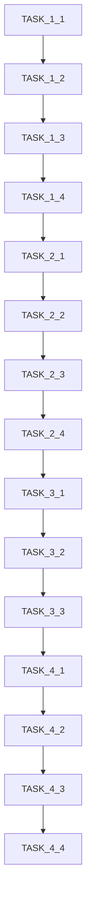

# Tasks: 重构处方模块代码整合（全栈）

**Change ID:** refactor-prescription-module-consolidation
**Spec:** desktop-prescription
**Created:** 2025-12-10
**Updated:** 2025-12-10

## Phase 1: 统一验方选择对话框

### TASK-1.1: 添加MedicalCase对Prescriptions模块的项目引用
- [ ] 修改`LYBT.Desktop.MedicalCase.csproj`添加对`LYBT.Desktop.Prescriptions`的引用
- [ ] 验证无循环依赖
- [ ] 编译验证

### TASK-1.2: 修改PrescriptionPanelViewModel使用统一对话框
- [ ] 将`FormulaSelectionDialogViewModel`引用改为`SelectFormulaDialogViewModel`
- [ ] 更新对话框参数传递
- [ ] 更新对话框结果处理
- [ ] 保持导入验方功能不变

### TASK-1.3: 删除MedicalCase模块的重复对话框
- [ ] 删除`ViewModels/FormulaSelectionDialogViewModel.cs`
- [ ] 删除`Views/FormulaSelectionDialog.xaml`
- [ ] 删除`Views/FormulaSelectionDialog.xaml.cs`
- [ ] 从`MedicalCaseModule.cs`移除对话框注册

### TASK-1.4: 验证Phase 1
- [ ] 编译通过
- [ ] 手动测试：医案编辑->处方面板->导入验方->选择验方->确认导入

---

## Phase 2: 统一处方计算器

### TASK-2.1: 增强Prescriptions模块的PrescriptionCalculator
- [ ] 添加`PriceCalculatedEventArgs`事件支持（从MedicalCase版本迁移）
- [ ] 确保与`IHerbItem`接口兼容
- [ ] 添加`BuildItemsWithPrice`方法（如MedicalCase版本）

### TASK-2.2: 修改MedicalCase模块使用统一计算器
- [ ] `PrescriptionPanelViewModel`改为使用Prescriptions模块的计算器
- [ ] 更新事件订阅逻辑
- [ ] 保持价格计算结果一致

### TASK-2.3: 删除MedicalCase模块的重复计算器
- [ ] 删除`Services/PrescriptionCalculator.cs`
- [ ] 删除`Events/PriceCalculatedEventArgs.cs`（如存在）
- [ ] 更新相关using语句

### TASK-2.4: 验证Phase 2
- [ ] 编译通过
- [ ] 单元测试：验证单剂价格计算
- [ ] 单元测试：验证总价计算（含剂数、折扣）
- [ ] 手动测试：添加药材->修改数量->验证价格实时更新

---

## Phase 3: 重命名澄清

### TASK-3.1: 重命名MedicalCase的PrescriptionItemViewModel
- [ ] 重命名`PrescriptionItemViewModel.cs`为`PrescriptionHerbEditorViewModel.cs`
- [ ] 更新类名`PrescriptionItemViewModel` -> `PrescriptionHerbEditorViewModel`
- [ ] 使用IDE重构工具更新所有引用
- [ ] 更新XAML绑定

### TASK-3.2: 可选-重命名FormulaTemplateDialogViewModel
- [ ] 评估是否需要重命名为`FormulaImportDialogViewModel`
- [ ] 如需要，执行重命名并更新所有引用
- [ ] 更新模块注册

### TASK-3.3: 验证Phase 3
- [ ] 编译通过
- [ ] 全文搜索确认无遗留的旧类名引用
- [ ] 手动测试相关功能

---

## Phase 4: 清理骨架代码

### TASK-4.1: 清理Prescriptions模块骨架代码
- [ ] 删除或完整实现`PrescriptionEditorDialogViewModel`
- [ ] 确认`PrescriptionManagementViewModel`状态，如弃用则删除
- [ ] 清理`PrescriptionsModule.cs`中注释掉的注册代码

### TASK-4.2: 清理无用的Views
- [ ] 检查`PrescriptionManagementView.xaml`状态
- [ ] 如弃用则删除相关View文件
- [ ] 更新模块注册

### TASK-4.3: 更新模块依赖注释
- [ ] 在`PrescriptionsModule.cs`添加清晰的职责说明注释
- [ ] 在`MedicalCaseModule.cs`添加处方功能依赖说明

### TASK-4.4: 最终验证
- [ ] 完整编译解决方案
- [ ] 运行所有单元测试
- [ ] 执行完整手动测试流程
- [ ] 代码行数统计对比

---

## Phase 5: 打印服务提升至MedicalCase级别

### TASK-5.1: 创建IMedicalCasePrintService接口
- [ ] 在MedicalCase模块创建`Services/IMedicalCasePrintService.cs`
- [ ] 定义`PrintFullCaseAsync(MedicalCaseDto)`方法
- [ ] 定义`PrintConsultationAsync(ConsultationDto)`方法
- [ ] 定义`PrintPrescriptionAsync(PrescriptionDto)`方法
- [ ] 定义`PrintSummaryAsync(MedicalCaseDto)`方法

### TASK-5.2: 实现MedicalCasePrintService
- [ ] 创建`Services/MedicalCasePrintService.cs`
- [ ] 注入`IPrescriptionPrintService`作为内部实现
- [ ] 实现完整医案打印（诊断+处方+医嘱）
- [ ] 实现诊断单独打印
- [ ] 实现处方单独打印（委托给IPrescriptionPrintService）

### TASK-5.3: 更新MedicalCaseModule注册
- [ ] 在`MedicalCaseModule.cs`注册`IMedicalCasePrintService`
- [ ] 确保依赖`IPrescriptionPrintService`正确解析

### TASK-5.4: 验证Phase 5
- [ ] 编译通过
- [ ] 手动测试：医案详情->打印完整医案
- [ ] 手动测试：医案详情->打印诊断
- [ ] 手动测试：医案详情->打印处方
- [ ] 原有处方打印功能不受影响

---

## Phase 6: 全栈处方职责分离

### TASK-6.1: Server端标记冗余字段
- [ ] 在`Prescription.PatientId`添加`[Obsolete("通过MedicalCase.PatientId获取")]`
- [ ] 在`Prescription.UserId`添加`[Obsolete("通过MedicalCase.UserId获取")]`
- [ ] 更新XML注释说明废弃原因
- [ ] 确保编译无错误（警告可接受）

### TASK-6.2: Shared层标记冗余字段
- [ ] 在`PrescriptionDto.PatientId`添加`[Obsolete]`
- [ ] 在`PrescriptionDto.UserId`添加`[Obsolete]`
- [ ] 在`PrescriptionCreateDto`相关字段添加`[Obsolete]`
- [ ] 在`PrescriptionEditDto`相关字段添加`[Obsolete]`
- [ ] 在`PrescriptionInputDto`相关字段添加`[Obsolete]`

### TASK-6.3: Client端代码对齐
- [ ] 审查`PrescriptionPanelViewModel`确保从MedicalCase获取Patient信息
- [ ] 审查打印相关代码确保不依赖冗余字段
- [ ] 处理所有Obsolete警告（抑制或重构）

### TASK-6.4: 验证Phase 6
- [ ] Server端编译通过（允许Obsolete警告）
- [ ] Client端编译通过（允许Obsolete警告）
- [ ] 运行所有单元测试
- [ ] 手动测试：创建医案->开处方->验证Patient/User信息正确
- [ ] 记录剩余Obsolete警告数量，计划后续清理

---

## Validation Checklist

### 功能测试
- [ ] 医案管理->新建医案->填写诊断->开处方
- [ ] 处方编辑->添加药材->修改数量->删除药材
- [ ] 处方编辑->导入验方->选择验方->确认
- [ ] 处方编辑->价格计算->修改剂数->价格更新
- [ ] 处方打印功能正常

### 技术验证
- [ ] 所有xUnit测试通过
- [ ] 无编译警告
- [ ] 无运行时异常
- [ ] 内存使用无明显增加

### 代码质量
- [ ] 代码行数减少统计
- [ ] 无重复代码（通过代码相似度工具验证）
- [ ] 命名清晰无歧义

---

## Dependencies

## Rollback Plan

如果重构导致严重问题：
1. Git revert到重构前的commit
2. 恢复原有的对话框和计算器
3. 记录问题根因，修订重构方案后重试
