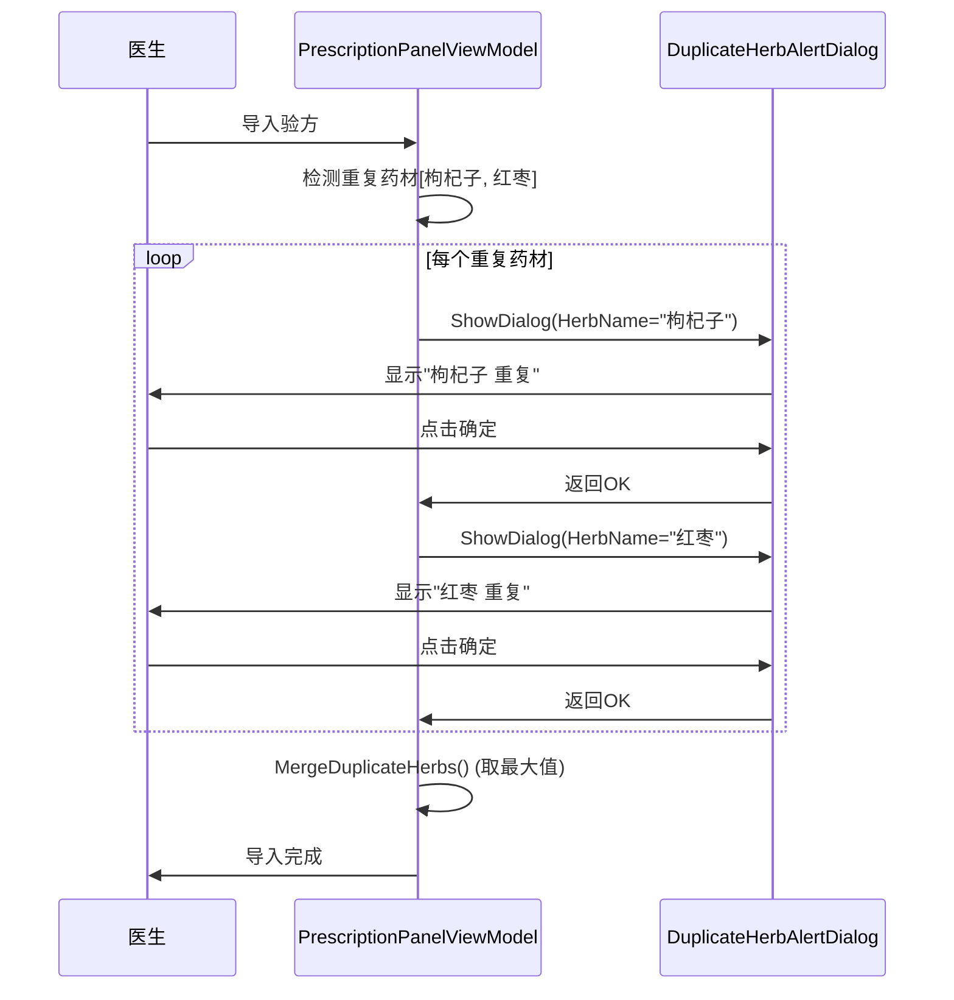

# Technical Design: enhance-duplicate-herb-dialog

## Overview

将重复药材批量提醒对话框重构为逐个确认模式。每个重复药材单独弹窗，医生点击"确定"后继续下一个。

## Current Implementation Analysis

### 现有对话框

`DuplicateHerbAlertDialog` 当前接收所有重复药材列表，一次性显示：

```csharp
// PrescriptionPanelViewModel.cs
var parameters = new DialogParameters
{
    { "DuplicateHerbs", duplicateInfos }  // 传入完整列表
};
_dialogService.ShowDialog("DuplicateHerbAlertDialog", parameters, ...);
```

### 现有剂量合并

```csharp
// DuplicateHerbInfo.cs
public decimal MergedDosage => Math.Max(ExistingDosage, IncomingDosage);
```

## Proposed Design

### 1. 简化对话框

重构 `DuplicateHerbAlertDialog` 为单药材确认对话框：

**UI设计**:
```
+----------------------------------+
|  重复药材提醒                   X |
+----------------------------------+
|                                  |
|      [药材名称] 重复             |
|                                  |
+----------------------------------+
|            [确定]                |
+----------------------------------+
```

**XAML结构**:
```xml
<StackPanel Margin="20">
    <TextBlock HorizontalAlignment="Center" FontSize="16">
        <Run Text="{Binding HerbName}"/>
        <Run Text=" 重复"/>
    </TextBlock>
    <Button Content="确定"
            Command="{Binding ConfirmCommand}"
            IsDefault="True"
            HorizontalAlignment="Center"
            Margin="0,20,0,0"
            Padding="30,8"/>
</StackPanel>
```

**ViewModel**:
```csharp
public class DuplicateHerbAlertDialogViewModel : BindableBase, IDialogAware
{
    public string HerbName { get; private set; }
    public string Title => "重复药材提醒";
    public DelegateCommand ConfirmCommand { get; }

    public DuplicateHerbAlertDialogViewModel()
    {
        ConfirmCommand = new DelegateCommand(OnConfirm);
    }

    public void OnDialogOpened(IDialogParameters parameters)
    {
        HerbName = parameters.GetValue<string>("HerbName");
    }

    private void OnConfirm()
    {
        RequestClose?.Invoke(new DialogResult(ButtonResult.OK));
    }

    public event Action<IDialogResult> RequestClose;

    public bool CanCloseDialog() => true;
    public void OnDialogClosed() { }
}
```

### 2. 循环调用逻辑

在 `PrescriptionPanelViewModel` 中循环显示对话框：

```csharp
private async Task ShowDuplicateHerbDialogsAsync(List<DuplicateHerbInfo> duplicates)
{
    foreach (var duplicate in duplicates)
    {
        var parameters = new DialogParameters
        {
            { "HerbName", duplicate.HerbName }
        };

        var tcs = new TaskCompletionSource<bool>();
        _dialogService.ShowDialog("DuplicateHerbAlertDialog", parameters, result =>
        {
            tcs.SetResult(true);
        });

        await tcs.Task;  // 等待用户确认后继续下一个
    }

    // 所有确认完成后，执行合并（使用现有的Max逻辑）
    MergeDuplicateHerbs(duplicates);
}
```

### 3. 剂量合并逻辑

保持现有逻辑不变，继续使用 `Math.Max()`:

```csharp
// DuplicateHerbInfo.cs - 无需修改
public decimal MergedDosage => Math.Max(ExistingDosage, IncomingDosage);
```

## Component Changes

### DuplicateHerbAlertDialog.xaml

| 变更 | 说明 |
|------|------|
| 移除 `ItemsControl` | 不再需要列表显示 |
| 简化布局 | 只显示单个药材名称 + "重复" 文字 |
| 单按钮 | 只保留"确定"按钮 |

### DuplicateHerbAlertDialogViewModel.cs

| 变更 | 说明 |
|------|------|
| 参数简化 | 从 `List<DuplicateHerbInfo>` 改为 `string HerbName` |
| 移除其他命令 | 只保留 `ConfirmCommand` |
| 移除列表属性 | 只保留 `HerbName` 属性 |

### PrescriptionPanelViewModel.cs

| 变更 | 说明 |
|------|------|
| 循环调用对话框 | 遍历重复列表，逐个弹窗 |
| 异步等待 | 使用 `TaskCompletionSource` 等待用户确认 |
| 调用位置 | 修改 `ImportFormulaAsync` 和 `CopyHistoryPrescriptionAsync` |

## Sequence Diagram



## File Changes Summary

| 文件 | 操作 | 说明 |
|------|------|------|
| `MedicalCase/Views/DuplicateHerbAlertDialog.xaml` | 修改 | 简化为单药材显示 |
| `MedicalCase/ViewModels/DuplicateHerbAlertDialogViewModel.cs` | 修改 | 简化参数和命令 |
| `MedicalCase/ViewModels/PrescriptionPanelViewModel.cs` | 修改 | 添加循环调用逻辑 |

## Testing Strategy

| 测试类型 | 场景 |
|----------|------|
| 手动测试 | 导入含1/2/3个重复药材的验方，验证逐个弹窗 |
| 手动测试 | 验证每个对话框显示正确的药材名称 |
| 手动测试 | 验证所有确认后剂量按最大值合并 |

## Migration Notes

- 直接修改现有 `DuplicateHerbAlertDialog`，简化其功能
- 剂量合并逻辑（`Math.Max`）保持不变，无需数据迁移
- 无需添加新文件或配置
