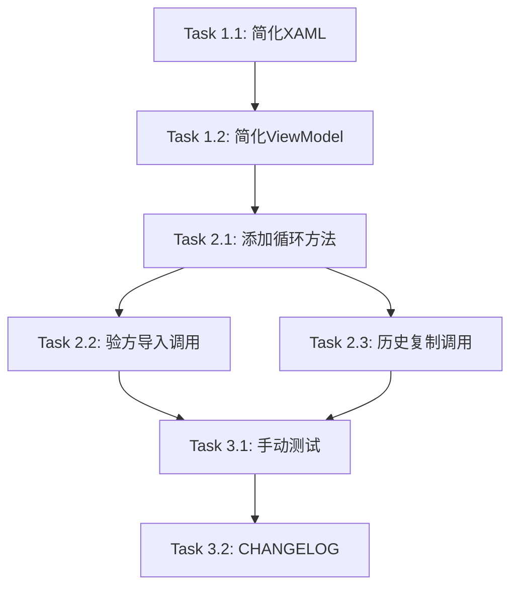

# Tasks: enhance-duplicate-herb-dialog

## Phase 1: 对话框简化 (Dialog Simplification)

### Task 1.1: 简化DuplicateHerbAlertDialog.xaml

**目标**: 将批量显示改为单药材显示

**文件**:
- `src/Client/Desktop/Modules/LYBT.Desktop.MedicalCase/Views/DuplicateHerbAlertDialog.xaml` (修改)

**修改内容**:
- 移除 `ItemsControl` 列表显示
- 简化为单个药材名称 + "重复" 文字
- 只保留"确定"按钮

**新布局**:
```xml
<StackPanel Margin="20">
    <TextBlock HorizontalAlignment="Center" FontSize="16">
        <Run Text="{Binding HerbName}"/>
        <Run Text=" 重复"/>
    </TextBlock>
    <Button Content="确定"
            Command="{Binding ConfirmCommand}"
            IsDefault="True"
            HorizontalAlignment="Center"
            Margin="0,20,0,0"/>
</StackPanel>
```

**验收标准**:
- [x] XAML编译通过
- [x] 只显示单个药材名称

---

### Task 1.2: 简化DuplicateHerbAlertDialogViewModel

**目标**: 简化ViewModel，只接收单个药材名称

**文件**:
- `src/Client/Desktop/Modules/LYBT.Desktop.MedicalCase/ViewModels/DuplicateHerbAlertDialogViewModel.cs` (修改)

**修改内容**:
```csharp
public class DuplicateHerbAlertDialogViewModel : BindableBase, IDialogAware
{
    public string HerbName { get; private set; }
    public string Title => "重复药材提醒";
    public DelegateCommand ConfirmCommand { get; }

    public DuplicateHerbAlertDialogViewModel()
    {
        ConfirmCommand = new DelegateCommand(OnConfirm);
    }

    public void OnDialogOpened(IDialogParameters parameters)
    {
        HerbName = parameters.GetValue<string>("HerbName");
    }

    private void OnConfirm()
    {
        RequestClose?.Invoke(new DialogResult(ButtonResult.OK));
    }
}
```

**验收标准**:
- [x] 参数从 `List<DuplicateHerbInfo>` 改为 `string HerbName`
- [x] 只保留 `ConfirmCommand`

---

## Phase 2: 调用逻辑重构 (Caller Logic Refactoring)

### Task 2.1: 添加循环调用方法

**目标**: 在PrescriptionPanelViewModel中添加逐个弹窗方法

**文件**:
- `src/Client/Desktop/Modules/LYBT.Desktop.MedicalCase/ViewModels/PrescriptionPanelViewModel.cs` (修改)

**新增方法**:
```csharp
private async Task ShowDuplicateHerbDialogsAsync(List<DuplicateHerbInfo> duplicates)
{
    foreach (var duplicate in duplicates)
    {
        var parameters = new DialogParameters
        {
            { "HerbName", duplicate.HerbName }
        };

        var tcs = new TaskCompletionSource<bool>();
        _dialogService.ShowDialog("DuplicateHerbAlertDialog", parameters, result =>
        {
            tcs.SetResult(true);
        });

        await tcs.Task;
    }

    // 所有确认完成后执行合并
    MergeDuplicateHerbs(duplicates);
}
```

**验收标准**:
- [x] 方法编译通过
- [x] 使用TaskCompletionSource等待用户确认

---

### Task 2.2: 修改验方导入调用

**目标**: 修改ImportFormulaAsync使用新的逐个弹窗逻辑

**文件**:
- `src/Client/Desktop/Modules/LYBT.Desktop.MedicalCase/ViewModels/PrescriptionPanelViewModel.cs` (修改)

**修改点**:
- 找到原来调用 `DuplicateHerbAlertDialog` 的位置
- 替换为调用 `ShowDuplicateHerbDialogsAsync`

**验收标准**:
- [x] 验方导入时逐个弹窗

---

### Task 2.3: 修改历史处方复制调用

**目标**: 历史处方复制同样使用逐个弹窗

**文件**:
- `src/Client/Desktop/Modules/LYBT.Desktop.MedicalCase/ViewModels/PrescriptionPanelViewModel.cs` (修改)

**验收标准**:
- [x] 历史处方复制时逐个弹窗
- [x] 复用 `ShowDuplicateHerbDialogsAsync` 方法

---

## Phase 3: 测试与验证 (Testing & Validation)

### Task 3.1: 手动测试

**测试场景**:
- [ ] 导入包含0个重复药材的验方 - 无对话框弹出
- [ ] 导入包含1个重复药材的验方 - 弹出1个对话框
- [ ] 导入包含2个重复药材的验方 - 依次弹出2个对话框
- [ ] 导入包含3个重复药材的验方 - 依次弹出3个对话框
- [ ] 每个对话框显示正确的药材名称
- [ ] 所有确认后剂量按最大值合并

---

### Task 3.2: 更新CHANGELOG

**文件**:
- `CHANGELOG.md` (修改)

**内容**:
```markdown
### Changed
- 处方导入重复药材提醒从批量对话框改为逐个确认
```

**验收标准**:
- [x] CHANGELOG已更新

---

## Task Dependencies



## Estimated Effort

| Phase | Tasks | Estimated |
|-------|-------|-----------|
| Phase 1: 对话框简化 | 2 | 1h |
| Phase 2: 调用逻辑重构 | 3 | 1.5h |
| Phase 3: 测试与验证 | 2 | 0.5h |
| **Total** | **7** | **3h** |

## Implementation Status

**Completed: 2025-12-13**

所有开发任务已完成，待手动测试验证。
