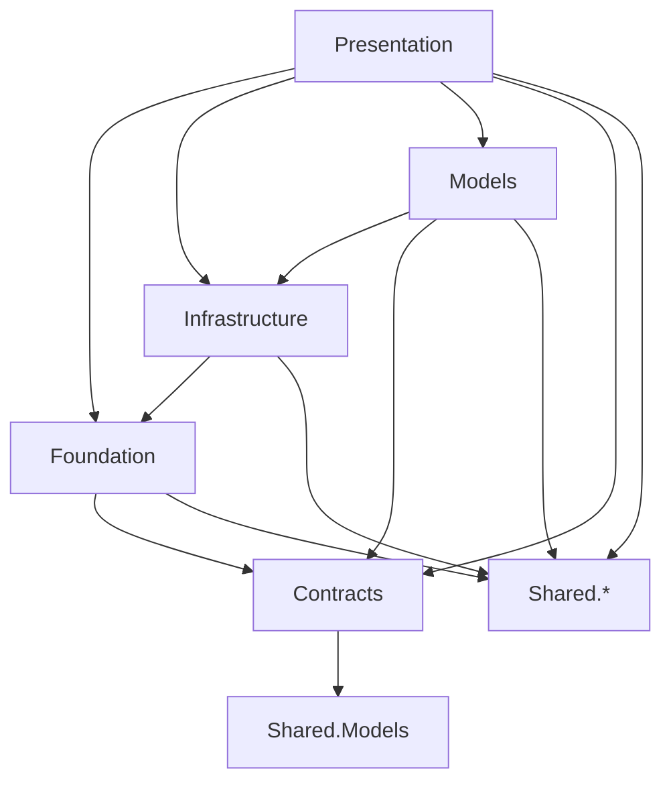
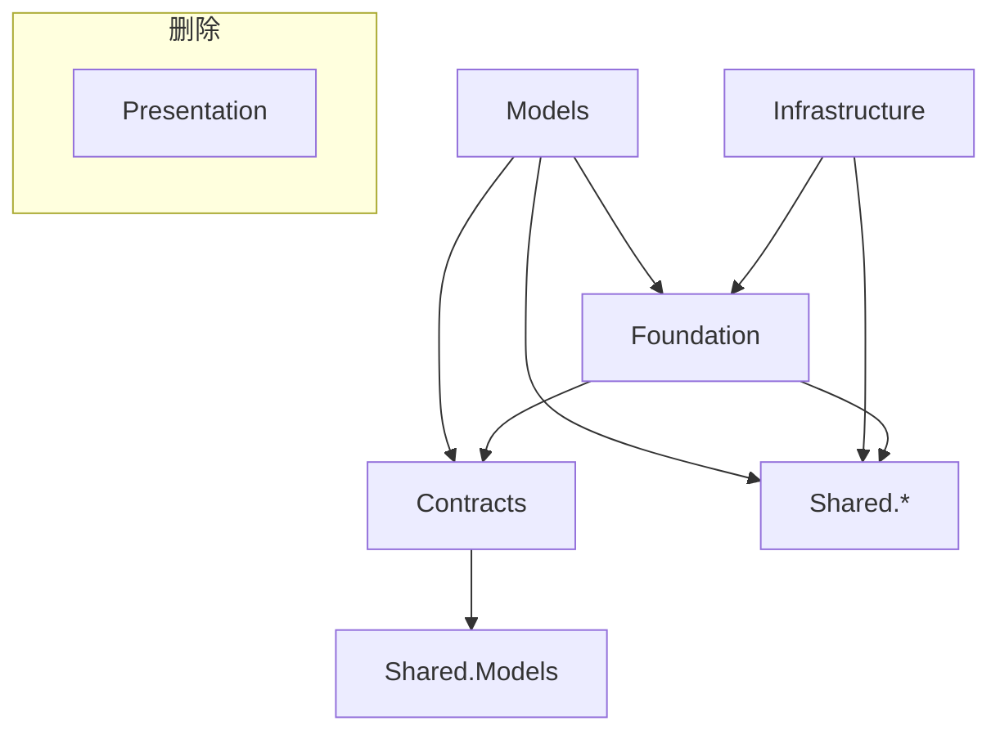

# Design Document: optimize-desktop-core

## 技术设计

### 1. 依赖关系变更

#### 当前依赖图



#### 目标依赖图



### 2. 命名空间映射

#### Phase 1: 接口迁移

| 原命名空间 | 新命名空间 |
|-----------|-----------|
| LYBT.Desktop.Infrastructure.Interfaces | LYBT.Desktop.Contracts.Services |
| LYBT.Desktop.Infrastructure.Interfaces.Components | LYBT.Desktop.Contracts.Components |

#### Phase 2: Presentation合并

| 原命名空间 | 新命名空间 |
|-----------|-----------|
| LYBT.Desktop.Presentation.Components | LYBT.Desktop.Infrastructure.Controls.Components |
| LYBT.Desktop.Presentation.Notifications | LYBT.Desktop.Infrastructure.Services.Notifications |
| LYBT.Desktop.Presentation.UserExperience | LYBT.Desktop.Infrastructure.Services.UserExperience |
| LYBT.Desktop.Presentation.Theming | LYBT.Desktop.Infrastructure.Themes |

### 3. 接口迁移详细设计

#### 3.1 迁移到Contracts.Services的接口

这些接口被多个模块引用，应该在Contracts层定义:

```csharp
// Contracts/Services/IUserNotificationService.cs
namespace LYBT.Desktop.Contracts.Services;

public interface IUserNotificationService
{
    Task ShowErrorAsync(string message);
    Task ShowSuccessAsync(string message);
    Task<bool> ShowConfirmAsync(string title, string message);
}

// Contracts/Services/ILoginCoordinator.cs
namespace LYBT.Desktop.Contracts.Services;

public interface ILoginCoordinator
{
    Task LogoutAsync();
    Task<bool> LoginAsync(string username, string password);
}
```

#### 3.2 迁移到Contracts.Components的接口

组件级别的接口，用于ViewModel组件化设计:

```csharp
// Contracts/Components/ICommandHandler.cs
namespace LYBT.Desktop.Contracts.Components;

public interface ICommandHandler<TCommand>
{
    Task HandleAsync(TCommand command);
}

// Contracts/Components/IDataManager.cs
namespace LYBT.Desktop.Contracts.Components;

public interface IDataManager<TItem>
{
    Task LoadAsync();
    Task SaveAsync(TItem item);
}
```

### 4. ViewModelBase依赖解耦设计

#### 当前问题

ViewModelBase依赖Infrastructure中的具体类:
- `ClientErrorMessageMapper` (Infrastructure.Localization)
- `ILoginCoordinator` (Infrastructure.Interfaces)
- `IUserNotificationService` (Infrastructure.Interfaces)

#### 解决方案

1. 将`ClientErrorMessageMapper`的接口抽取到Contracts:

```csharp
// Contracts/Services/IErrorMessageMapper.cs
namespace LYBT.Desktop.Contracts.Services;

public interface IErrorMessageMapper
{
    string GetUserFriendlyMessage(Exception ex);
    string GetShortTrackingCode();
}
```

2. ViewModelBase改为依赖接口:

```csharp
// Models/ViewModels/Base/ViewModelBase.cs
public abstract class ViewModelBase : BindableBase, IDisposable, INotifyDataErrorInfo
{
    // 通过DI注入获取服务
    protected virtual IErrorMessageMapper? GetErrorMessageMapper() => null;
    protected virtual IUserNotificationService? GetNotificationService() => null;
    protected virtual ILoginCoordinator? GetLoginCoordinator() => null;
    
    protected virtual void HandleError(Exception ex, string? context = null)
    {
        var mapper = GetErrorMessageMapper();
        var trackingCode = mapper?.GetShortTrackingCode() ?? "UNKNOWN";
        var baseMessage = mapper?.GetUserFriendlyMessage(ex) ?? "操作失败";
        ErrorMessage = $"{baseMessage} (追踪码: {trackingCode})";
    }
}
```

3. 具体实现类需要在Shell层提供服务解析:

```csharp
// Shell层的ViewModel基类扩展
public abstract class ShellViewModelBase : ViewModelBase
{
    private readonly IServiceProvider _serviceProvider;
    
    protected override IErrorMessageMapper? GetErrorMessageMapper() 
        => _serviceProvider.GetService<IErrorMessageMapper>();
}
```

### 5. UI组件迁移设计

#### HerbCard系列控件

迁移到 `Infrastructure.Controls.Components`:

```
Infrastructure/Controls/Components/
├── HerbCardControl.xaml      # 药材卡片控件
├── HerbCardControl.xaml.cs
├── HerbListEditor.xaml       # 药材列表编辑器
├── HerbListEditor.xaml.cs
├── HerbListView.xaml         # 药材列表视图
└── HerbListView.xaml.cs
```

#### 命名空间声明更新

```xml
<!-- 旧的XAML命名空间声明 -->
xmlns:presentation="clr-namespace:LYBT.Desktop.Presentation.Components;assembly=LYBT.Desktop.Presentation"

<!-- 新的XAML命名空间声明 -->
xmlns:components="clr-namespace:LYBT.Desktop.Infrastructure.Controls.Components;assembly=LYBT.Desktop.Infrastructure"
```

### 6. 批量替换策略

#### 使用PowerShell脚本批量替换

```powershell
# Phase 1: 接口命名空间替换
Get-ChildItem -Path "src/Client/Desktop" -Recurse -Include "*.cs" | ForEach-Object {
    $content = Get-Content $_.FullName -Raw
    $content = $content -replace 'using LYBT\.Desktop\.Infrastructure\.Interfaces;', 'using LYBT.Desktop.Contracts.Services;'
    $content = $content -replace 'using LYBT\.Desktop\.Infrastructure\.Interfaces\.Components;', 'using LYBT.Desktop.Contracts.Components;'
    Set-Content -Path $_.FullName -Value $content
}

# Phase 2: Presentation命名空间替换
Get-ChildItem -Path "src/Client/Desktop" -Recurse -Include "*.cs","*.xaml" | ForEach-Object {
    $content = Get-Content $_.FullName -Raw
    $content = $content -replace 'LYBT\.Desktop\.Presentation\.Components', 'LYBT.Desktop.Infrastructure.Controls.Components'
    $content = $content -replace 'LYBT\.Desktop\.Presentation\.Notifications', 'LYBT.Desktop.Infrastructure.Services.Notifications'
    $content = $content -replace 'LYBT\.Desktop\.Presentation\.UserExperience', 'LYBT.Desktop.Infrastructure.Services.UserExperience'
    Set-Content -Path $_.FullName -Value $content
}
```

### 7. csproj引用调整

#### Infrastructure.csproj变更

```xml
<!-- 移除 -->
<ItemGroup>
  <ProjectReference Include="..\LYBT.Desktop.Presentation\LYBT.Desktop.Presentation.csproj" />
</ItemGroup>

<!-- 保留 -->
<ItemGroup>
  <ProjectReference Include="..\LYBT.Desktop.Foundation\LYBT.Desktop.Foundation.csproj" />
  <ProjectReference Include="..\..\..\..\Shared\LYBT.Shared.Models\LYBT.Shared.Models.csproj" />
</ItemGroup>
```

#### Models.csproj变更

```xml
<!-- 移除 -->
<ItemGroup>
  <ProjectReference Include="..\LYBT.Desktop.Infrastructure\LYBT.Desktop.Infrastructure.csproj" />
</ItemGroup>

<!-- 新增/保留 -->
<ItemGroup>
  <ProjectReference Include="..\LYBT.Desktop.Contracts\LYBT.Desktop.Contracts.csproj" />
  <ProjectReference Include="..\LYBT.Desktop.Foundation\LYBT.Desktop.Foundation.csproj" />
</ItemGroup>
```

### 8. 编译顺序

变更后的编译顺序:

```
1. LYBT.Shared.* (无变化)
2. LYBT.Desktop.Contracts (扩展后)
3. LYBT.Desktop.Foundation (无变化)
4. LYBT.Desktop.Infrastructure (扩展后)
5. LYBT.Desktop.Models (依赖调整后)
6. LYBT.Desktop.Shell
7. LYBT.Desktop.Modules.*
```

### 9. 验证清单

#### 每个Phase完成后验证

- [ ] `dotnet build LYBT.All.sln` 编译成功
- [ ] 无循环依赖错误
- [ ] 无命名空间解析错误
- [ ] 单元测试通过

#### 最终验证

- [ ] 完整编译通过
- [ ] 所有单元测试通过
- [ ] UI组件(HerbCard等)功能正常
- [ ] 通知服务功能正常
- [ ] 登录流程正常
