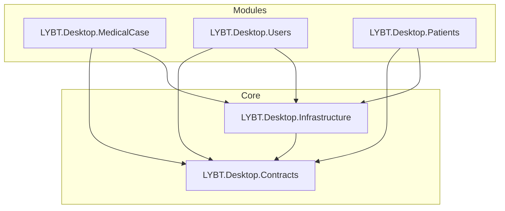

# refactor-frontend-srp-patterns 设计文档

## 概述

基于 [proposal.md](./proposal.md) 的详细技术设计。本设计针对前端架构分析发现的16个问题（5 HIGH + 6 MEDIUM + 5 LOW），提供系统性的解决方案。

## 架构决策

### ADR-1: MedicalCaseService 按职责拆分

**状态**: 已采纳

**背景**: MedicalCaseService 605行代码承担4个职责（查询、持久化、命令、生命周期），违反SRP原则，难以测试和维护。

**决策**: 拆分为4个专职服务，保留门面接口保持向后兼容：
- `IMedicalCaseQueryService` - 查询职责（4个方法）
- `IMedicalCaseCommandService` - 命令职责（6个方法）
- `IMedicalCaseLifecycleService` - 生命周期职责（5个方法）
- `IMedicalCaseService` - 门面接口（聚合上述服务）

**后果**:
- 正面: 每个服务单一职责，易于测试和维护
- 负面: 增加DI注册数量，需要更新引用点

### ADR-2: ViewModel Handler 提取模式

**状态**: 已采纳

**背景**: UserMasterDetailViewModel 584行代码承担8个职责，MasterDetailViewModelBase 565行代码，代码膨胀严重。

**决策**: 采用Handler组件提取模式，将特定功能封装为独立Handler类：
```csharp
// Handler接口模式
public interface IUserPasswordHandler
{
    Task ResetPasswordAsync(UserListDto user);
}

// ViewModel持有Handler引用
public partial class UserMasterDetailViewModel
{
    private readonly IUserPasswordHandler _passwordHandler;
    private readonly IUserImportExportHandler _importExportHandler;
}
```

**后果**:
- 正面: ViewModel职责清晰，Handler可复用
- 负面: 需要新增多个Handler类文件

### ADR-3: ElementName 绑定修复策略

**状态**: 已采纳

**背景**: 68个ElementName绑定中，存在跨NameScope风险（特别是Popup内部绑定）。

**决策**:
- 对Popup内跨NameScope的绑定，使用RelativeSource替代
- 对安全的ElementName绑定（同NameScope内）保持不变
- 使用BindingProxy模式作为复杂场景的替代方案

**具体修复**:
```xml
<!-- HerbItemControl.xaml L112 修复 -->
<!-- Before -->
MinWidth="{Binding ActualWidth, ElementName=HerbNameTextBox}"
<!-- After -->
MinWidth="{Binding PlacementTarget.ActualWidth, RelativeSource={RelativeSource AncestorType=Popup}}"
```

### ADR-4: 缓存用户隔离方案

**状态**: 已采纳

**背景**: PatientSearchCache缓存键无用户隔离，多用户场景存在数据泄露风险。

**决策**:
- 缓存键添加UserId前缀：`{userId}:{keyword}:{page}`
- 订阅会话变更事件，用户切换时清理缓存
- 登出时完全清空缓存

```csharp
private string GenerateKey(string keyword, int page)
{
    var userId = _sessionManager.CurrentUserId ?? Guid.Empty;
    return $"{userId}:{keyword?.ToLowerInvariant() ?? string.Empty}:{page}";
}
```

### ADR-5: 泛型基类控件模式

**状态**: 已采纳

**背景**: 5个Master-Detail控件存在40-50%重复代码。

**决策**: 创建泛型基类 `MasterDetailControlBase<TViewModel>`，子控件继承并提供差异化实现：

```csharp
public abstract class MasterDetailControlBase<TViewModel> : UserControl
    where TViewModel : class
{
    protected TViewModel ViewModel => DataContext as TViewModel;

    protected virtual void OnLoaded() { }
    protected virtual void OnUnloaded() { }
}
```

## 实现策略

### 执行顺序

```
Phase 1: SRP核心修复 (H1-H3)
    ├── H3: MasterDetailViewModelBase优化 (先行，提取共享组件)
    ├── H2: UserMasterDetailViewModel重构 (验证Handler模式)
    └── H1: MedicalCaseService拆分 (最大改动最后)

Phase 2: 架构风险修复 (H4-H5)
    ├── H4: ElementName绑定修复 (独立修改)
    └── H5: 缓存用户隔离 (独立修改)

Phase 3: 代码质量改进 (M1-M6)
    ├── M1: PatientService位置规范化
    ├── M3: Dialog ViewModel继承统一
    └── M5: Master-Detail控件抽象

Phase 4: 规范统一 (L1-L5)
    └── 批量处理或延迟
```

### 执行优先级调整

基于代码分析，对原proposal做以下调整：

| 原计划 | 调整后 | 原因 |
|--------|--------|------|
| M2 对话框服务合并 | **跳过** | 分析未发现重复对话框服务类 |
| M4 构造函数参数聚合 | **延迟** | IViewModelServices已存在且使用中 |
| M6 角色层View模板化 | **延迟** | AdminHome与ClinicalHome差异较大，模板化收益低 |

## 变更清单

### 新增文件

| 文件路径 | 说明 |
|----------|------|
| `Contracts/Services/IMedicalCaseCommandService.cs` | 医案命令服务接口 |
| `Contracts/Services/IMedicalCaseLifecycleService.cs` | 医案生命周期服务接口 |
| `MedicalCase/Services/MedicalCaseCommandService.cs` | 命令服务实现 |
| `MedicalCase/Services/MedicalCaseLifecycleService.cs` | 生命周期服务实现 |
| `Users/ViewModels/Handlers/UserPasswordHandler.cs` | 密码重置Handler |
| `Users/ViewModels/Handlers/UserImportExportHandler.cs` | 导入导出Handler |
| `Users/ViewModels/Handlers/UserStatusHandler.cs` | 状态管理Handler |
| `Users/ViewModels/Handlers/UserAuditHandler.cs` | 审计日志Handler |
| `Infrastructure/ViewModels/Handlers/AuditLogHandler.cs` | 通用审计Handler |
| `Infrastructure/ViewModels/Handlers/ImportExportHandler.cs` | 通用导入导出Handler |
| `Infrastructure/Controls/MasterDetailControlBase.cs` | 泛型控件基类 |

### 修改文件

| 文件路径 | 修改内容 |
|----------|----------|
| `MedicalCase/Services/MedicalCaseService.cs` | 重构为门面模式，委托给专职服务 |
| `MedicalCase/MedicalCaseModule.cs` | 更新DI注册 |
| `Users/ViewModels/UserMasterDetailViewModel.cs` | 注入Handler，移除内联逻辑 |
| `Infrastructure/ViewModels/MasterDetailViewModelBase.cs` | 提取通用Handler到基类 |
| `Herbs/Controls/HerbItem/HerbItemControl.xaml` | 修复Popup内ElementName绑定 |
| `Patients/Services/PatientSearchCache.cs` | 添加UserId前缀和登出清理 |
| `Patients/ViewModels/Components/PatientService.cs` | 移动到Services/目录 |
| `Shell/Dialogs/ViewModels/*.cs` | 3个Dialog ViewModel改为继承DialogViewModelBase |
| `*MasterDetailControl.xaml.cs` | 改为继承MasterDetailControlBase |

### 删除文件

无文件删除（仅移动和重构）

## 依赖关系

### 模块依赖



### 变更顺序

1. **Phase 1必须先完成**：服务拆分影响后续Handler提取的依赖注入模式
2. **H3先于H2**：共享Handler提取后，User模块可复用
3. **Phase 2可与Phase 1后半并行**：ElementName和缓存修复独立
4. **Phase 4可延后**：规范统一影响范围小，优先级低

## 测试策略

### 单元测试

- `MedicalCaseQueryServiceTests` - 查询服务测试
- `MedicalCaseCommandServiceTests` - 命令服务测试
- `UserPasswordHandlerTests` - 密码Handler测试
- `PatientSearchCacheTests` - 缓存隔离测试

### 集成测试

- 医案创建流程端到端测试
- 用户管理完整流程测试
- 缓存用户切换场景测试

### UI测试

- ElementName绑定修复后的控件渲染测试
- Master-Detail布局GridSplitter功能测试

## 风险缓解

| 风险 | 概率 | 影响 | 缓解措施 |
|------|------|------|----------|
| 服务拆分引入Bug | 中 | 高 | 分阶段执行，每阶段编译验证 |
| DI注册遗漏 | 中 | 中 | 使用Prism模块初始化检查 |
| Handler提取遗漏依赖 | 低 | 中 | 编译时检测，保持方法签名 |
| 绑定修改导致UI异常 | 中 | 中 | 运行时测试关键页面 |
| 缓存清理影响性能 | 低 | 低 | 监控缓存命中率 |

## 回滚计划

如果变更失败:
1. `git revert` 回滚到Phase开始前的提交
2. 每个Phase完成后创建Git tag便于精确回滚
3. 保留旧服务实现作为注释，紧急时可快速恢复

---

**设计者**: Claude Code
**日期**: 2026-01-17
**状态**: 待审批
