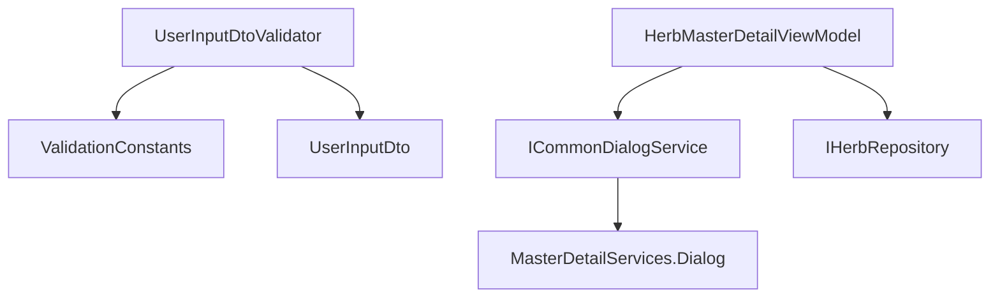

# complete-management-create-logic 设计文档

## 概述

基于 [proposal.md](./proposal.md) 的详细技术设计，完善管理界面新建逻辑。

## 架构决策

### ADR-1: UserInputDtoValidator使用FluentValidation统一模式

**状态**: 已采纳

**背景**: UserInputDtoValidator仅有1条验证规则，与其他模块（Herbs 10+规则，Patients 8规则）严重不一致。

**决策**: 参考HerbInputDtoValidator模式，使用ValidationConstants统一验证规则。

**后果**:
- 正面: 验证规则一致，安全性提升
- 负面: 现有创建请求可能因验证失败而被拒绝（通过When条件缓解）

### ADR-2: 导入导出使用ICommonDialogService

**状态**: 已采纳

**背景**: HerbMasterDetailViewModel的Import/Export有TODO注释，需要文件对话框服务。

**决策**: 使用已存在的ICommonDialogService（已通过DI注册），调用ShowOpenFileDialogAsync/ShowSaveFileDialogAsync。

**后果**:
- 正面: 复用现有基础设施，无需新增依赖
- 负面: 需要通过MasterDetailServices.Dialog或直接注入获取服务

### ADR-3: Formula模块暂不添加导出功能

**状态**: 已采纳

**背景**: FormulaMasterDetailViewModel没有Export方法，API层也没有导出端点。

**决策**: 本次变更仅完成Herbs模块导入导出，Formula导出作为后续独立提案。

**后果**:
- 正面: 缩小变更范围，降低风险
- 负面: Formula导出需另行处理

## 实现策略

### 策略选择

采用**最小侵入性**策略：
1. UserInputDtoValidator增强验证规则，保持向后兼容
2. HerbMasterDetailViewModel通过ViewModelServices获取ICommonDialogService
3. UsersController仅修改ApiVersion属性值

### 关键实现点

1. **UserInputDtoValidator使用When条件** - 区分创建和更新场景
2. **ICommonDialogService已在MasterDetailServices中** - 通过`MasterDetailServices.Dialog`访问
3. **导出使用SaveFileDialogAsync** - 返回null表示用户取消
4. **导入使用OpenFileDialogAsync** - 返回null表示用户取消

## 变更清单

### 新增文件

无

### 修改文件

| 文件路径 | 修改内容 |
|----------|----------|
| `src/Shared/LYBT.Shared.Validators/Users/UserInputDtoValidator.cs` | 增加Email/Phone/Role/RealName/Password验证规则 |
| `src/Client/Desktop/Modules/LYBT.Desktop.Herbs/ViewModels/HerbMasterDetailViewModel.cs` | 完成ImportHerbsAsync和ExportHerbsAsync实现 |
| `src/Server/Services/LYBT.WebAPI/Controllers/UsersController.cs` | ApiVersion("1.0") → ApiVersion("1") |

### 删除文件

无

## 详细设计

### UserInputDtoValidator 增强

```csharp
using FluentValidation;
using LYBT.Shared.Models.Contracts.Users;
using LYBT.Shared.Models.Enums;
using LYBT.Shared.Primitives.Validation;

namespace LYBT.Shared.Validators.Users
{
    public class UserInputDtoValidator : AbstractValidator<UserInputDto>
    {
        public UserInputDtoValidator()
        {
            // 用户名：创建时必填（Id为null），更新时可选
            RuleFor(x => x.UserName)
                .NotEmpty().WithMessage("用户名不能为空")
                .When(x => x.Id == null || x.Id == Guid.Empty);

            // 真实姓名：创建时必填
            RuleFor(x => x.RealName)
                .NotEmpty().WithMessage("真实姓名不能为空")
                .MaximumLength(ValidationConstants.NameMaxLength)
                .WithMessage($"真实姓名长度不能超过{ValidationConstants.NameMaxLength}个字符")
                .When(x => x.Id == null || x.Id == Guid.Empty);

            // 角色：创建时必填且有效
            RuleFor(x => x.Role)
                .NotNull().WithMessage("用户角色不能为空")
                .IsInEnum().WithMessage("用户角色无效")
                .When(x => x.Id == null || x.Id == Guid.Empty);

            // 密码：创建时如果提供则验证长度
            RuleFor(x => x.Password)
                .MinimumLength(6).WithMessage("密码长度不能少于6个字符")
                .MaximumLength(ValidationConstants.PasswordMaxLength)
                .WithMessage($"密码长度不能超过{ValidationConstants.PasswordMaxLength}个字符")
                .When(x => !string.IsNullOrEmpty(x.Password));

            // 确认密码：如果提供密码则必须匹配
            RuleFor(x => x.ConfirmPassword)
                .Equal(x => x.Password).WithMessage("两次输入的密码不一致")
                .When(x => !string.IsNullOrEmpty(x.Password));

            // 邮箱：可选，但填写时必须有效
            RuleFor(x => x.Email)
                .EmailAddress().WithMessage(ValidationConstants.EmailFormatErrorMessage)
                .MaximumLength(100).WithMessage("邮箱长度不能超过100个字符")
                .When(x => !string.IsNullOrEmpty(x.Email));

            // 手机号：可选，但填写时必须有效（中国手机号格式）
            RuleFor(x => x.PhoneNumber)
                .Matches(ValidationConstants.PhoneRegex)
                .WithMessage(ValidationConstants.PhoneFormatErrorMessage)
                .When(x => !string.IsNullOrEmpty(x.PhoneNumber));

            // 备注：可选，限制长度
            RuleFor(x => x.Remark)
                .MaximumLength(ValidationConstants.RemarkMaxLength)
                .WithMessage($"备注长度不能超过{ValidationConstants.RemarkMaxLength}个字符")
                .When(x => !string.IsNullOrEmpty(x.Remark));
        }
    }
}
```

### HerbMasterDetailViewModel 导入导出完善

```csharp
/// <summary>导入药材</summary>
[RelayCommand(CanExecute = nameof(CanImport))]
private async Task ImportHerbsAsync()
{
    try
    {
        // 选择文件
        var filePath = await MasterDetailServices.Dialog.ShowOpenFileDialogAsync(
            filter: "Excel文件|*.xlsx;*.xls",
            title: "选择药材导入文件");

        if (string.IsNullOrEmpty(filePath))
        {
            return; // 用户取消
        }

        await MasterDetailServices.Loading.ExecuteWithLoadingAsync(async () =>
        {
            var fileBytes = await File.ReadAllBytesAsync(filePath);
            var result = await _herbRepository.ImportHerbsAsync(fileBytes);

            if (result > 0)
            {
                await MasterDetailServices.Dialog.ShowSuccessAsync(
                    $"成功导入 {result} 条药材记录", "导入成功");
                await RefreshAsync();
            }
            else
            {
                await MasterDetailServices.Dialog.ShowWarningAsync(
                    "没有导入任何记录，请检查文件格式", "导入提示");
            }
        }, "导入药材");
    }
    catch (Exception ex)
    {
        Logger.LogError(ex, "导入药材失败");
        await MasterDetailServices.Dialog.ShowErrorAsync(
            $"导入药材失败: {ex.Message}", "操作失败");
    }
}

/// <summary>导出药材</summary>
[RelayCommand(CanExecute = nameof(CanExport))]
private async Task ExportHerbsAsync()
{
    try
    {
        // 选择保存位置
        var defaultFileName = $"药材导出_{DateTime.Now:yyyyMMdd}.xlsx";
        var filePath = await MasterDetailServices.Dialog.ShowSaveFileDialogAsync(
            filter: "Excel文件|*.xlsx",
            title: "导出药材数据",
            defaultFileName: defaultFileName);

        if (string.IsNullOrEmpty(filePath))
        {
            return; // 用户取消
        }

        await MasterDetailServices.Loading.ExecuteWithLoadingAsync(async () =>
        {
            Logger.LogInformation("导出药材数据，关键词：{Keyword}", SearchText);
            var bytes = await _herbRepository.ExportHerbsAsync(SearchText);

            if (bytes == null || bytes.Length == 0)
            {
                await MasterDetailServices.Dialog.ShowErrorAsync(
                    "导出失败，没有数据可导出", "导出药材");
                return;
            }

            await File.WriteAllBytesAsync(filePath, bytes);
            await MasterDetailServices.Dialog.ShowSuccessAsync(
                $"药材数据已导出到：{filePath}", "导出成功");
        }, "导出药材");
    }
    catch (Exception ex)
    {
        Logger.LogError(ex, "导出药材失败");
        await MasterDetailServices.Dialog.ShowErrorAsync(
            $"导出药材失败: {ex.Message}", "操作失败");
    }
}
```

### UsersController API版本修改

```csharp
// 修改前
[ApiVersion("1.0")]

// 修改后
[ApiVersion("1")]
```

## 依赖关系

### 模块依赖



### 变更顺序

Phase 1（验证器）和 Phase 2（导入导出）可并行执行。
Phase 3（API版本）可在任意时间执行。

## 测试策略

### 单元测试

- UserInputDtoValidator验证规则测试（现有测试扩展）
- 验证创建场景必填字段
- 验证更新场景可选字段

### 手动测试

1. Users模块：创建新用户，验证各字段验证规则
2. Herbs模块：导入Excel文件，验证导入成功
3. Herbs模块：导出到Excel文件，验证文件生成
4. API版本：验证UsersController正常响应

## 风险缓解

| 风险 | 概率 | 影响 | 缓解措施 |
|------|------|------|----------|
| 验证规则变严导致创建失败 | 低 | 中 | 使用When条件区分创建/更新 |
| 文件对话框在非UI线程调用 | 低 | 中 | 确保在UI线程调用 |
| 导出文件过大 | 低 | 低 | 已有分页机制 |

## 回滚计划

如果变更失败:
1. 回滚UserInputDtoValidator.cs到原版本
2. 回滚HerbMasterDetailViewModel.cs到原版本
3. 回滚UsersController.cs的ApiVersion
4. 重新编译验证

---

**设计者**: Claude Code
**日期**: 2026-01-23
**状态**: 待审批
