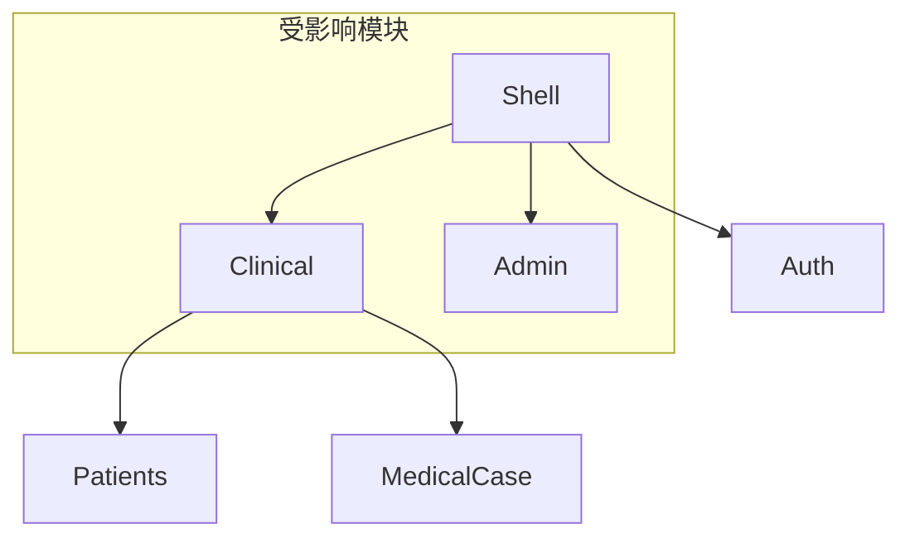

# fix-button-navigation-system 设计文档

## 概述

基于 [proposal.md](./proposal.md) 的详细技术设计，修复Desktop客户端按钮导航系统中的命令绑定问题，并统一术语命名规范。

## 架构决策

### ADR-1: 临时修复策略

**状态**: 已采纳

**背景**: Phase 1需要立即修复按钮功能，但Phase 3将进行术语统一重命名。为避免重复工作，需要决定Phase 1的修复策略。

**决策**:
- Phase 1采用"修改XAML绑定到现有ViewModel命令"的策略
- Phase 3再将ViewModel命令统一重命名为规范术语
- 这样可以先恢复功能，再统一命名

**后果**:
- 正面: 快速恢复按钮功能，用户可立即使用
- 负面: Phase 1修复后Phase 3会再次修改XAML绑定

### ADR-2: 术语规范定义

**状态**: 已采纳

**背景**: 代码中`Consultation`和`MedicalCase`术语使用混乱，需要明确定义。

**决策**:
- **MedicalCase** = 医案/看诊/病案（整体概念，用于所有层级）
- **Consultation** = 诊断（仅指诊断部分，特定场景使用）
- 统一使用`MedicalCase`作为主术语，`StartMedicalCase`代替`StartConsultation`

**后果**:
- 正面: 术语一致，代码可读性提升
- 负面: 需要批量重命名，涉及10个文件23处修改

### ADR-3: SaveAndStayCommand处理方案

**状态**: 已采纳

**背景**: `MedicalCaseWorkspaceView.xaml`中绑定的`SaveAndStayCommand`在ViewModel中不存在。

**决策**:
- 使用现有的`SaveDraftCommand`替代`SaveAndStayCommand`
- `SaveDraftCommand`功能为"保存草稿并留在当前页面"，符合"暂存"按钮语义

**后果**:
- 正面: 无需新增代码，复用现有功能
- 负面: 无

### ADR-4: NavigateToHomeCommand处理方案

**状态**: 已采纳

**背景**: `SystemSettingsView.xaml`中绑定的`NavigateToHomeCommand`在ViewModel中不存在。

**决策**:
- 在`SystemSettingsViewModel`中添加`NavigateToHomeCommand`
- 使用`IRegionManager.RequestNavigate`导航到AdminHomeView

**后果**:
- 正面: 完善系统设置页面的导航功能
- 负面: 新增少量代码

## 实现策略

### 策略选择

采用"分阶段渐进修复"策略：
1. **Phase 1**: 临时修复关键Bug，恢复按钮功能
2. **Phase 2**: 全量审计确认无遗漏
3. **Phase 3**: 术语统一重构，建立规范
4. **Phase 4**: 功能验证
5. **Phase 5**: 文档清理

### 关键实现点

1. **XAML绑定修复**: 使用Edit工具直接修改XAML中的Command绑定
2. **符号重命名**: 使用Serena的`rename_symbol`工具确保全量重命名
3. **编译验证**: 每个Phase完成后执行`dotnet build`验证

## 变更清单

### Phase 1: Critical Bug Fix

| 文件路径 | 行号 | 当前值 | 目标值 | 操作 |
|----------|------|--------|--------|------|
| `ClinicalHomeView.xaml` | 151 | `StartConsultationCommand` | `StartMedicalCaseCommand` | 修改绑定 |
| `MedicalCaseWorkspaceView.xaml` | 216 | `SaveAndStayCommand` | `SaveDraftCommand` | 修改绑定 |
| `MedicalCaseWorkspaceView.xaml` | 232 | `CompleteConsultationCommand` | `CompleteMedicalCaseCommand` | 修改绑定 |
| `MedicalCaseWorkspaceView.xaml` | 240 | `SaveAndStayCommand` | `SaveDraftCommand` | 修改绑定 |
| `SystemSettingsViewModel.cs` | - | 不存在 | `NavigateToHomeCommand` | 新增命令 |

### Phase 3: 术语统一重命名

| 文件路径 | 行号 | 当前值 | 目标值 |
|----------|------|--------|--------|
| `PatientSelectionViewModel.cs` | 49 | `StartConsultationCommand` | `StartMedicalCaseCommand` |
| `PatientSelectionViewModel.cs` | 159 | `CanStartConsultation` | `CanStartMedicalCase` |
| `PatientSelectionViewModel.cs` | 160 | `StartConsultationAsync` | `StartMedicalCaseAsync` |
| `PatientSelectionViewModel.cs` | 195 | `CanStartConsultation` | `CanStartMedicalCase` |
| `PatientSelectionView.xaml` | 54 | `StartConsultationCommand` | `StartMedicalCaseCommand` |
| `PatientSelectionView.xaml` | 91 | `StartConsultationCommand` | `StartMedicalCaseCommand` |
| `PatientSelectionView.xaml.cs` | 27,29 | `StartConsultationCommand` | `StartMedicalCaseCommand` |
| `TodayPatientItem.cs` | 89 | `CanStartConsultation` | `CanStartMedicalCase` |
| `MainWindowViewModel.cs` | 168 | `QuickStartConsultationCommand` | `QuickStartMedicalCaseCommand` |
| `MenuManager.cs` | 43 | `QuickStartConsultationCommand` | `QuickStartMedicalCaseCommand` |
| `MenuManager.cs` | 82 | `QuickStartConsultation` | `QuickStartMedicalCase` |
| `MenuManager.cs` | 111 | `QuickStartConsultationAsync` | `QuickStartMedicalCaseAsync` |
| `MainWindow.xaml` | 19 | `QuickStartConsultationCommand` | `QuickStartMedicalCaseCommand` |

### 已验证无需修改的文件

| 文件 | 状态 | 说明 |
|------|------|------|
| `AdminHomeView.xaml` | OK | 6个导航命令全部匹配 |
| `LoginView.xaml` | OK | 3个命令全部匹配 |
| `PatientSelectionView.xaml` | OK | 5个命令匹配（除StartConsultation术语问题） |

## 依赖关系

### 模块依赖



### Phase执行依赖

```
Phase 1 (Critical Fix)
    │
    ├─> Phase 2 (Audit) ─────────────────┐
    │                                     │
    └─────────────────────────────────────┼─> Phase 3 (术语统一)
                                          │
                                          ├─> Phase 4 (Validation)
                                          │
                                          └─> Phase 5 (Cleanup)
```

**依赖说明**:
- Phase 1可独立执行，立即恢复功能
- Phase 2审计结果确认Phase 1覆盖范围
- Phase 3基于Phase 1+2的完整问题清单执行
- Phase 4-5顺序执行

## 测试策略

### 编译验证

每个Phase完成后执行：
```bash
dotnet build LYBT.All.sln -c Release --no-restore
```

### 功能验证清单

#### Clinical角色
- [ ] ClinicalHomeView -> 开始看诊 -> PatientSelectionView
- [ ] ClinicalHomeView -> 患者管理/医案查询/药材库/验方库
- [ ] PatientSelectionView -> 返回主页
- [ ] PatientSelectionView -> 选择患者开始看诊 -> MedicalCaseWorkspaceView
- [ ] MedicalCaseWorkspaceView -> 返回/完成看诊/暂存/打印

#### Admin角色
- [ ] AdminHomeView -> 所有6个导航按钮
- [ ] SystemSettingsView -> 返回主页

#### Auth模块
- [ ] LoginView -> 登录/关闭/重试

## 风险缓解

| 风险 | 概率 | 影响 | 缓解措施 |
|------|------|------|----------|
| 遗漏命令绑定 | 低 | 高 | 使用Grep全量搜索XAML Command绑定 |
| 修复引入新问题 | 低 | 中 | 每个修复后编译验证 |
| 重命名遗漏引用 | 中 | 高 | 使用serena rename_symbol确保完整性 |
| SystemSettingsView导航实现错误 | 低 | 中 | 参考AdminHomeView的导航实现 |

## 回滚计划

如果变更失败:
1. 使用`git stash`保存当前修改
2. 使用`git checkout -- .`恢复原始文件
3. 分析失败原因，修正后重新执行

## 关键文件路径

```
src/Client/Desktop/Roles/LYBT.Desktop.Clinical/
├── Views/
│   ├── ClinicalHomeView.xaml              # Phase 1 修复
│   ├── PatientSelectionView.xaml          # Phase 3 重命名
│   ├── PatientSelectionView.xaml.cs       # Phase 3 重命名
│   └── MedicalCaseWorkspaceView.xaml      # Phase 1 修复
└── ViewModels/
    └── PatientSelectionViewModel.cs       # Phase 3 重命名

src/Client/Desktop/Roles/LYBT.Desktop.Admin/
├── Views/
│   └── SystemSettingsView.xaml            # Phase 1 修复(绑定已OK)
└── ViewModels/
    └── SystemSettingsViewModel.cs         # Phase 1 添加命令

src/Client/Desktop/Shell/
├── Models/
│   └── TodayPatientItem.cs                # Phase 3 重命名
├── Services/
│   └── MenuManager.cs                     # Phase 3 重命名
├── ViewModels/
│   └── MainWindowViewModel.cs             # Phase 3 重命名
└── Views/
    └── MainWindow.xaml                    # Phase 3 重命名
```

## 预估工作量

| Phase | 预估时间 | 说明 |
|-------|----------|------|
| Phase 1 | 30分钟 | 5处修复 |
| Phase 2 | 已完成 | 审计已在设计阶段完成 |
| Phase 3 | 1小时 | 10文件23处重命名 |
| Phase 4 | 手动验证 | 取决于测试深度 |
| Phase 5 | 30分钟 | README更新 |
| **合计** | **约2小时** | 不含手动验证 |

---

**设计者**: Claude Code
**日期**: 2026-01-09
**状态**: 待执行
