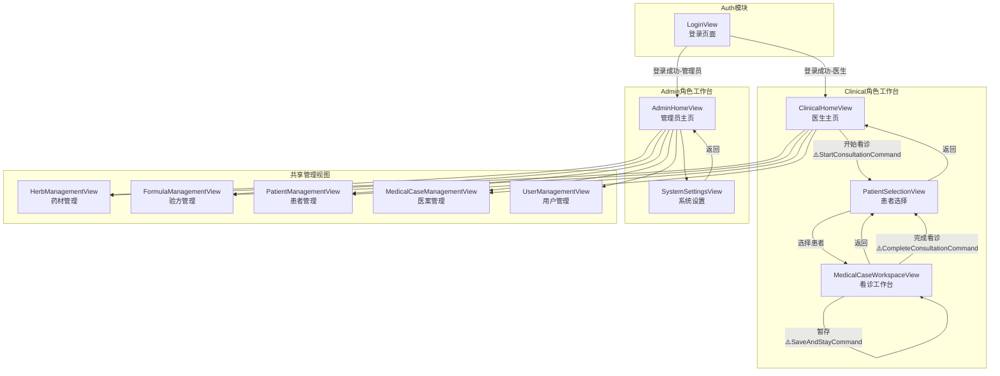

# fix-button-navigation-system

## Why

重构后发现大量按钮导航失效，主要原因是XAML命令绑定名称与ViewModel方法名不匹配。CommunityToolkit.Mvvm的`[RelayCommand]`源生成器遵循"方法名+Command"命名规则，但部分XAML绑定仍使用旧命名。

### 发现的问题

| 位置 | 问题类型 | 当前状态 | 期望状态 | 分析 |
|------|----------|----------|----------|------|
| ClinicalHomeView.xaml:151 | 命令名不匹配 | `StartConsultationCommand` | `StartMedicalCaseCommand` | ViewModel方法是`StartMedicalCase()` |
| MedicalCaseWorkspaceView.xaml:232 | 命令名不匹配 | `CompleteConsultationCommand` | `CompleteMedicalCaseCommand` | ViewModel定义的是`CompleteMedicalCaseCommand` |
| MedicalCaseWorkspaceView.xaml:216,240 | **命令不存在** | `SaveAndStayCommand` | `SaveDraftCommand`或删除 | ViewModel无此命令，建议改用`SaveDraftCommand` |

### 死代码/历史遗留

| 位置 | 内容 | 状态 | 处理建议 |
|------|------|------|----------|
| README.md多处 | `StartConsultationCommand`文档 | 过期文档 | 更新文档 |
| TodayPatientItem.cs:89 | `CanStartConsultation`属性 | 仍在使用 | 保留 |
| MedicalCaseItemMapper.cs | 注释引用已删除属性 | 注释可保留 | 无需处理 |

### 影响分析

**受影响的角色模块**:
- `LYBT.Desktop.Admin` - 管理员工作台
- `LYBT.Desktop.Clinical` - 医生工作台

**受影响的视图**:
- `ClinicalHomeView` - 开始看诊按钮失效
- `MedicalCaseWorkspaceView` - 完成看诊按钮失效
- 其他待确认的视图

## What Changes

### Phase 1: 命令绑定问题修复 (Critical Bug Fix)

**直接修复XAML绑定错误**:
1. `ClinicalHomeView.xaml:151` - 修正`StartConsultationCommand`为`StartMedicalCaseCommand`
2. `MedicalCaseWorkspaceView.xaml:232` - 修正`CompleteConsultationCommand`为`CompleteMedicalCaseCommand`
3. 验证`SaveAndStayCommand`的实际实现

### Phase 2: 全量命令清单审计

**建立完整的命令清单对照表**:

| View | XAML Command Binding | ViewModel Method | Status |
|------|---------------------|------------------|--------|
| ClinicalHomeView | StartConsultationCommand | StartMedicalCase() | **MISMATCH** |
| ClinicalHomeView | NavigateToPatientManagementCommand | NavigateToPatientManagement() | OK |
| ClinicalHomeView | NavigateToMedicalCaseQueryCommand | NavigateToMedicalCaseQuery() | OK |
| ClinicalHomeView | NavigateToHerbLibraryCommand | NavigateToHerbLibrary() | OK |
| ClinicalHomeView | NavigateToFormulaLibraryCommand | NavigateToFormulaLibrary() | OK |
| PatientSelectionView | BackToHomeCommand | BackToHome() | OK |
| PatientSelectionView | NewPatientCommand | NewPatient() | OK |
| PatientSelectionView | RefreshCommand | RefreshAsync() | OK |
| PatientSelectionView | SearchCommand | SearchAsync() | OK |
| PatientSelectionView | StartConsultationCommand | StartConsultationAsync() | OK |
| MedicalCaseWorkspaceView | ViewPatientHistoryCommand | ExecuteViewPatientHistory() | **VERIFY** |
| MedicalCaseWorkspaceView | SelectPendingCaseCommand | Manual Property | OK |
| MedicalCaseWorkspaceView | RefreshQueueCommand | Manual Property | OK |
| MedicalCaseWorkspaceView | BackCommand | Manual Property | OK |
| MedicalCaseWorkspaceView | EnterEditModeCommand | Manual Property | OK |
| MedicalCaseWorkspaceView | SaveAndStayCommand | **MISSING** | **MISMATCH** |
| MedicalCaseWorkspaceView | PrintPrescriptionCommand | Manual Property | OK |
| MedicalCaseWorkspaceView | CompleteConsultationCommand | CompleteMedicalCaseCommand | **MISMATCH** |
| AdminHomeView | NavigateToUserManagementCommand | NavigateToUserManagement() | OK |
| AdminHomeView | NavigateToHerbManagementCommand | NavigateToHerbManagement() | OK |
| AdminHomeView | NavigateToPatientManagementCommand | NavigateToPatientManagement() | OK |
| AdminHomeView | NavigateToFormulaManagementCommand | NavigateToFormulaManagement() | OK |
| AdminHomeView | NavigateToMedicalCaseManagementCommand | NavigateToMedicalCaseManagement() | OK |
| AdminHomeView | NavigateToSystemSettingsCommand | NavigateToSystemSettings() | OK |
| SystemSettingsView | SaveCommand | **VERIFY** | **VERIFY** |
| SystemSettingsView | ResetCommand | **VERIFY** | **VERIFY** |
| SystemSettingsView | NavigateToHomeCommand | **VERIFY** | **VERIFY** |
| SystemSettingsView | BrowseBackupPathCommand | **VERIFY** | **VERIFY** |
| LoginView | CloseApplicationCommand | **VERIFY** | **VERIFY** |
| LoginView | LoginCommand | **VERIFY** | **VERIFY** |
| LoginView | RetryApiCheckCommand | **VERIFY** | **VERIFY** |

### Phase 3: 术语统一规范

**核心原则**: 端到端语义一致，按钮 → Command → Service → Repository → API 整个调用链命名统一

**术语定义** (项目规范):
| 术语 | 中文 | 说明 |
|------|------|------|
| **Consultation** | 诊断 | 仅指医案中的诊断部分（诊断信息、症状描述等） |
| **MedicalCase** | 医案/看诊/病案 | 整体概念，包含诊断、处方等全部内容 |

**当前命名不一致问题**:

| 位置 | 当前命名 | 期望命名 | 说明 |
|------|----------|----------|------|
| ClinicalHomeViewModel | `StartMedicalCase()` | 保持 | 正确，"开始看诊"用MedicalCase |
| ClinicalHomeView.xaml | `StartConsultationCommand` | `StartMedicalCaseCommand` | **Bug**: 应改为MedicalCase |
| PatientSelectionViewModel | `StartConsultationAsync()` | `StartMedicalCaseAsync()` | 应改为MedicalCase |
| MedicalCaseWorkspaceViewModel | `CompleteMedicalCaseCommand` | 保持 | 正确，"完成看诊"用MedicalCase |
| MedicalCaseWorkspaceView.xaml | `CompleteConsultationCommand` | `CompleteMedicalCaseCommand` | **Bug**: 应改为MedicalCase |

**统一后的调用链示例**:

```
按钮: "开始看诊"
  ↓
XAML: Command="{Binding StartMedicalCaseCommand}"      ← 统一MedicalCase
  ↓
ViewModel: StartMedicalCase() → NavigateTo(PatientSelectionView)
  ↓
PatientSelectionView: StartMedicalCaseCommand          ← 统一MedicalCase
  ↓
ViewModel: StartMedicalCaseAsync()                     ← 需要重命名
  ↓
Service: CreateMedicalCaseAsync()
  ↓
Repository: CreateAsync()
  ↓
API: CreateMedicalCaseAsync()
```

### Phase 4: 导航模式标准化

**统一导航命令命名规范**:

```csharp
// 规范1: 导航到视图 - 使用 NavigateTo{ViewName} 前缀
[RelayCommand]
private void NavigateToPatientManagement()
    => RegionManager.RequestNavigate("ContentRegion", "PatientManagementView");

// 规范2: 返回操作 - 使用 Back/GoBack 前缀
[RelayCommand]
private void BackToHome() => NavigateToHome();

// 规范3: 看诊/医案操作 - 统一使用MedicalCase术语
[RelayCommand]
private async Task StartMedicalCaseAsync() { ... }  // 开始看诊

// 规范4: 诊断操作 - 仅诊断部分使用Consultation术语
[RelayCommand]
private void SaveConsultation() { ... }  // 保存诊断信息

// 规范5: XAML绑定必须与生成的命令名完全匹配
// 方法: StartMedicalCase() -> 命令: StartMedicalCaseCommand
// 方法: StartMedicalCaseAsync() -> 命令: StartMedicalCaseCommand
```

## Architecture

### UI导航流程图



### 命令绑定架构

```
┌─────────────────────────────────────────────────────────────────┐
│                    Navigation Architecture                       │
├─────────────────────────────────────────────────────────────────┤
│                                                                  │
│  ┌─────────────┐    ┌─────────────┐    ┌─────────────┐         │
│  │   XAML      │    │  ViewModel  │    │   Prism     │         │
│  │  Binding    │───▶│   Command   │───▶│ Navigation  │         │
│  └─────────────┘    └─────────────┘    └─────────────┘         │
│                                                                  │
│  Command="{Binding    [RelayCommand]    RegionManager          │
│   XXXCommand}"        private void     .RequestNavigate()      │
│                       XXX()                                      │
│                                                                  │
└─────────────────────────────────────────────────────────────────┘
```

### CommunityToolkit.Mvvm命令生成规则

```
方法名                     -> 生成的命令名
──────────────────────────────────────────
StartMedicalCase()         -> StartMedicalCaseCommand
StartConsultationAsync()   -> StartConsultationCommand
NavigateToHome()           -> NavigateToHomeCommand
```

## 命令-Service-Repository-API调用链验证

### 调用链完整性检查

| 命令绑定 | ViewModel方法 | Service方法 | Repository方法 | API方法 | 状态 |
|----------|---------------|-------------|----------------|---------|------|
| StartMedicalCaseCommand | StartMedicalCase() | - | - | - | **纯导航** |
| StartConsultationCommand | StartConsultationAsync() | CreateMedicalCaseAsync() | CreateAsync→CallApiCreateAsync | CreateMedicalCaseAsync | OK |
| SaveDraftCommand | ExecuteSaveDraft() | SaveDraftAsync→SaveDraftViaApiAsync | SaveDraftAsync | SaveDraftAsync | OK |
| CompleteMedicalCaseCommand | ExecuteCompleteMedicalCase() | CompleteMedicalCaseAsync→UpdateStatusAsync | UpdateStatusAsync | UpdateStatusAsync | OK |

### 调用链架构

```
┌─────────────────────────────────────────────────────────────────────────────┐
│                    Data Access Layer Architecture                            │
├─────────────────────────────────────────────────────────────────────────────┤
│                                                                              │
│  ┌──────────────┐    ┌──────────────┐    ┌──────────────┐    ┌───────────┐ │
│  │   Command    │───▶│   Service    │───▶│  Repository  │───▶│    API    │ │
│  └──────────────┘    └──────────────┘    └──────────────┘    └───────────┘ │
│                                                                              │
│  SaveDraftCommand     SaveDraftAsync      SaveDraftAsync      SaveDraftAsync │
│                         │                      │                   │        │
│                         └──SaveDraftViaApiAsync└──_api.SaveDraftAsync()     │
│                                                                              │
└─────────────────────────────────────────────────────────────────────────────┘
```

**结论**: 命令到API的调用链完整，数据流通正常。问题仅在于XAML绑定名称与Command属性名不匹配。

## Impact

- **文件变更**: 约10-15个文件
- **风险等级**: Medium（需要逐一验证每个命令绑定）
- **测试要求**: 每个角色工作台的所有按钮手动点击测试

## Risks

| 风险 | 缓解措施 |
|------|----------|
| 遗漏命令绑定 | 使用Grep全量搜索XAML Command绑定 |
| 修复引入新问题 | 每个修复后编译验证 |
| View/ViewModel不匹配 | 检查ViewModelLocator配置 |

## References

- CommunityToolkit.Mvvm RelayCommand文档: https://learn.microsoft.com/dotnet/communitytoolkit/mvvm/generators/relaycommand
- Prism Navigation文档: https://docs.prismlibrary.com/docs/wpf/navigation/
- 用户需求: 重构后按钮导航失效，需要全面修复

---

**生成时间**: 2026-01-09
**状态**: 待确认
