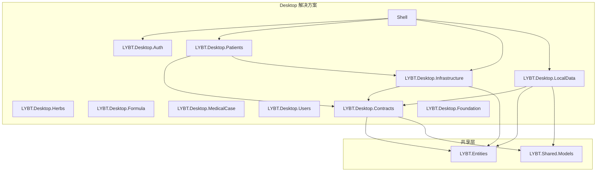

# implement-local-mode 设计文档

## 概述

基于 [proposal.md](./proposal.md) 的详细技术设计。

本文档定义 **DataSource 抽象层架构**的具体实现方案，实现 Desktop 端本地模式与远程模式的优雅切换。

---

## 架构决策

### ADR-001: 引入 DataSource 抽象层

**状态**: 已采纳

**背景**:
当前 Repository 存在职责混乱问题，混合了三个关注点：
1. 调用 Refit API 获取数据
2. 解包 ApiResponse 并处理错误
3. 执行 DTO 映射

这导致：
- 无法轻松切换数据源
- Repository 难以测试（需要 Mock HTTP）
- 违反单一职责原则

**决策**:
引入 IDataSource 抽象层，将数据获取逻辑从 Repository 中剥离：
- Repository 只负责业务映射（Entity → DTO）
- DataSource 只负责数据获取（调用 API 或查询数据库）

**后果**:
- 正面: 职责清晰、可测试性增强、支持多数据源
- 负面: 需要重构现有所有 Repository（约 5 个）

### ADR-002: IDataSource 返回 Entity 而非 DTO

**状态**: 已采纳

**背景**:
IDataSource 可以返回 Entity 或 DTO，各有优缺点。

**决策**:
IDataSource 统一返回 Entity：
- LocalDataSource 直接返回 EF Core 查询的 Entity
- RemoteDataSource 需要 DTO → Entity 反向映射

**后果**:
- 正面: 接口一致、Repository 映射逻辑统一
- 负面: RemoteDataSource 需要额外的映射层

### ADR-003: SQLite RowVersion 适配策略

**状态**: 已采纳

**背景**:
BaseEntity 包含 `[Timestamp] RowVersion` 字段，SQLite 不支持此类型的自动并发控制。

**决策**:
本地模式忽略 RowVersion 并发控制：
- LocalDbContext 配置 `.Ignore(e => e.RowVersion)`
- 本地单用户场景不需要并发控制
- 保持 Entity 定义不变，通过 EF Core 配置适配

**后果**:
- 正面: 无需修改 Entity 定义，保持与 Server 端一致
- 负面: 本地模式无并发保护（单用户场景可接受）

---

## 实现策略

### 1. IDataSource 接口设计

#### 1.1 基础 CRUD 契约

```csharp
// src/Client/Desktop/Core/LYBT.Desktop.Contracts/DataSources/IDataSourceBase.cs
public interface IDataSourceBase<TEntity> where TEntity : class
{
    Task<TEntity?> GetByIdAsync(Guid id, CancellationToken ct = default);
    Task<(List<TEntity> Items, int Total)> GetPagedAsync(
        int page, int pageSize, string? keyword, CancellationToken ct = default);
    Task<TEntity> CreateAsync(TEntity entity, CancellationToken ct = default);
    Task<TEntity> UpdateAsync(TEntity entity, CancellationToken ct = default);
    Task<bool> DeleteAsync(Guid id, CancellationToken ct = default);
}
```

#### 1.2 业务特定接口

```csharp
// src/Client/Desktop/Core/LYBT.Desktop.Contracts/DataSources/IPatientDataSource.cs
public interface IPatientDataSource : IDataSourceBase<Patient>
{
    Task<List<Patient>> SearchAsync(string keyword, CancellationToken ct = default);
    Task<Patient?> GetByIdNumberAsync(string idNumber, CancellationToken ct = default);
    Task<Patient?> RestoreAsync(Guid id, CancellationToken ct = default);
    Task<BatchOperationResult> BatchDeleteAsync(List<Guid> ids, CancellationToken ct = default);
}

// src/Client/Desktop/Core/LYBT.Desktop.Contracts/DataSources/IHerbDataSource.cs
public interface IHerbDataSource : IDataSourceBase<Herb>
{
    Task<(List<Herb> Items, int Total)> GetPagedAsync(
        int page, int pageSize, string? keyword, string? category, CancellationToken ct = default);
    Task<bool> ToggleStatusAsync(Guid id, CancellationToken ct = default);
    Task<Herb?> RestoreAsync(Guid id, CancellationToken ct = default);
}

// src/Client/Desktop/Core/LYBT.Desktop.Contracts/DataSources/IFormulaDataSource.cs
public interface IFormulaDataSource : IDataSourceBase<Formula>
{
    Task<Formula?> CloneAsync(Guid id, CancellationToken ct = default);
    Task<bool> ToggleStatusAsync(Guid id, CancellationToken ct = default);
    Task<Formula?> RestoreAsync(Guid id, CancellationToken ct = default);
}

// src/Client/Desktop/Core/LYBT.Desktop.Contracts/DataSources/IMedicalCaseDataSource.cs
public interface IMedicalCaseDataSource : IDataSourceBase<MedicalCase>
{
    Task<MedicalCase> SaveAsync(Guid id, MedicalCase entity, CancellationToken ct = default);
    Task<bool> CloseCaseAsync(Guid id, CancellationToken ct = default);
    Task<bool> CancelAsync(Guid id, string reason, CancellationToken ct = default);
    Task<List<MedicalCase>> QueryAsync(MedicalCaseQueryDto query, CancellationToken ct = default);
}

// src/Client/Desktop/Core/LYBT.Desktop.Contracts/DataSources/IUserDataSource.cs
public interface IUserDataSource : IDataSourceBase<User>
{
    Task<User?> GetByUsernameAsync(string username, CancellationToken ct = default);
    Task<bool> ChangePasswordAsync(Guid id, string oldPassword, string newPassword, CancellationToken ct = default);
    Task<bool> ToggleStatusAsync(Guid id, CancellationToken ct = default);
}
```

### 2. RemoteDataSource 实现策略

RemoteDataSource 需要完成三个任务：
1. 调用 Refit API
2. 解包 ApiResponse
3. DTO → Entity 反向映射

```csharp
// src/Client/Desktop/Core/LYBT.Desktop.Infrastructure/DataSources/Remote/RemotePatientDataSource.cs
public class RemotePatientDataSource : IPatientDataSource
{
    private readonly IPatientApi _api;
    private readonly ILogger<RemotePatientDataSource> _logger;
    private readonly IDataSourceMapper _mapper;

    public async Task<Patient?> GetByIdAsync(Guid id, CancellationToken ct = default)
    {
        var response = await _api.GetPatientByIdAsync(id);
        if (!response.IsSuccessStatusCode || response.Content?.Data == null)
        {
            _logger.LogWarning("[DataSource] Patient.GetById failed - Id={Id}", id);
            return null;
        }
        return _mapper.ToEntity(response.Content.Data);
    }

    public async Task<(List<Patient> Items, int Total)> GetPagedAsync(
        int page, int pageSize, string? keyword, CancellationToken ct = default)
    {
        var response = await _api.GetPatientsAsync(page, pageSize, keyword);
        if (!response.IsSuccessStatusCode || response.Content?.Data == null)
        {
            return (new List<Patient>(), 0);
        }
        var items = response.Content.Data.Items.Select(_mapper.ToEntity).ToList();
        return (items, response.Content.Data.TotalCount);
    }

    // ... 其他方法类似
}
```

### 3. LocalDataSource 实现策略

LocalDataSource 直接使用 EF Core 查询 SQLite：

```csharp
// src/Client/Desktop/Core/LYBT.Desktop.LocalData/DataSources/LocalPatientDataSource.cs
public class LocalPatientDataSource : IPatientDataSource
{
    private readonly LocalDbContext _dbContext;
    private readonly ILogger<LocalPatientDataSource> _logger;

    public async Task<Patient?> GetByIdAsync(Guid id, CancellationToken ct = default)
    {
        return await _dbContext.Patients
            .AsNoTracking()
            .FirstOrDefaultAsync(p => p.Id == id, ct);
    }

    public async Task<(List<Patient> Items, int Total)> GetPagedAsync(
        int page, int pageSize, string? keyword, CancellationToken ct = default)
    {
        var query = _dbContext.Patients.AsNoTracking();

        if (!string.IsNullOrWhiteSpace(keyword))
        {
            query = query.Where(p =>
                p.Name.Contains(keyword) ||
                (p.PhoneNumber != null && p.PhoneNumber.Contains(keyword)));
        }

        var total = await query.CountAsync(ct);
        var items = await query
            .OrderByDescending(p => p.CreatedAt)
            .Skip((page - 1) * pageSize)
            .Take(pageSize)
            .ToListAsync(ct);

        return (items, total);
    }

    public async Task<Patient> CreateAsync(Patient entity, CancellationToken ct = default)
    {
        entity.Id = Guid.NewGuid();
        entity.CreatedAt = DateTime.UtcNow;
        _dbContext.Patients.Add(entity);
        await _dbContext.SaveChangesAsync(ct);
        return entity;
    }

    // ... 其他方法类似
}
```

### 4. Repository 重构策略

重构后的 Repository 只负责映射：

```csharp
// src/Client/Desktop/Modules/LYBT.Desktop.Patients/Repositories/PatientRepository.cs
public class PatientRepository : IPatientRepository
{
    private readonly IPatientDataSource _dataSource;
    private readonly PatientMapper _mapper;
    private readonly ILogger<PatientRepository> _logger;

    public PatientRepository(
        IPatientDataSource dataSource,
        PatientMapper mapper,
        ILogger<PatientRepository> logger)
    {
        _dataSource = dataSource;
        _mapper = mapper;
        _logger = logger;
    }

    public async Task<PatientDetailDto?> GetByIdAsync(Guid id)
    {
        _logger.LogDebug("[REPO] Patient.GetById started - Id={Id}", id);
        var entity = await _dataSource.GetByIdAsync(id);
        if (entity == null)
        {
            _logger.LogWarning("[REPO] Patient.GetById → NotFound - Id={Id}", id);
            return null;
        }
        _logger.LogDebug("[REPO] Patient.GetById completed - Id={Id}", id);
        return _mapper.ToDetailDto(entity);
    }

    public async Task<PagedResult<PatientListDto>> GetPagedAsync(
        int page = 1, int pageSize = 20, string? keyword = null)
    {
        var (items, total) = await _dataSource.GetPagedAsync(page, pageSize, keyword);
        return new PagedResult<PatientListDto>
        {
            Items = items.Select(_mapper.ToListDto).ToList(),
            TotalCount = total,
            Page = page,
            PageSize = pageSize
        };
    }

    public async Task<PatientDetailDto> CreateAsync(PatientInputDto input)
    {
        var entity = _mapper.ToEntity(input);
        var created = await _dataSource.CreateAsync(entity);
        return _mapper.ToDetailDto(created);
    }

    // ... 其他方法类似
}
```

### 5. LocalDbContext 设计

```csharp
// src/Client/Desktop/Core/LYBT.Desktop.LocalData/Context/LocalDbContext.cs
public class LocalDbContext : DbContext
{
    private readonly ICurrentUserProvider _currentUserProvider;

    public LocalDbContext(
        DbContextOptions<LocalDbContext> options,
        ICurrentUserProvider currentUserProvider) : base(options)
    {
        _currentUserProvider = currentUserProvider;
    }

    public DbSet<Patient> Patients => Set<Patient>();
    public DbSet<User> Users => Set<User>();
    public DbSet<Herb> Herbs => Set<Herb>();
    public DbSet<Formula> Formulas => Set<Formula>();
    public DbSet<FormulaHerbItem> FormulaHerbItems => Set<FormulaHerbItem>();
    public DbSet<MedicalCase> MedicalCases => Set<MedicalCase>();
    public DbSet<Consultation> Consultations => Set<Consultation>();
    public DbSet<Prescription> Prescriptions => Set<Prescription>();
    public DbSet<PrescriptionItem> PrescriptionItems => Set<PrescriptionItem>();

    protected override void OnModelCreating(ModelBuilder modelBuilder)
    {
        base.OnModelCreating(modelBuilder);

        // 应用 Entity 配置
        modelBuilder.ApplyConfigurationsFromAssembly(typeof(LocalDbContext).Assembly);

        // 全局查询过滤器（软删除）
        foreach (var entityType in modelBuilder.Model.GetEntityTypes())
        {
            if (typeof(ISoftDeletable).IsAssignableFrom(entityType.ClrType))
            {
                var parameter = Expression.Parameter(entityType.ClrType, "e");
                var property = Expression.Property(parameter, nameof(ISoftDeletable.IsDeleted));
                var filter = Expression.Lambda(Expression.Not(property), parameter);
                modelBuilder.Entity(entityType.ClrType).HasQueryFilter(filter);
            }
        }

        // SQLite 适配：忽略 RowVersion
        foreach (var entityType in modelBuilder.Model.GetEntityTypes())
        {
            var rowVersionProperty = entityType.FindProperty("RowVersion");
            if (rowVersionProperty != null)
            {
                rowVersionProperty.SetIsRowVersion(false);
                modelBuilder.Entity(entityType.ClrType).Ignore("RowVersion");
            }
        }
    }

    public override async Task<int> SaveChangesAsync(CancellationToken ct = default)
    {
        SetAuditFields();
        return await base.SaveChangesAsync(ct);
    }

    private void SetAuditFields()
    {
        var userId = _currentUserProvider.CurrentUserId;
        var now = DateTime.UtcNow;

        foreach (var entry in ChangeTracker.Entries<IAuditableEntity>())
        {
            switch (entry.State)
            {
                case EntityState.Added:
                    entry.Entity.CreatedAt = now;
                    entry.Entity.CreatedBy = userId;
                    break;
                case EntityState.Modified:
                    entry.Entity.UpdatedAt = now;
                    entry.Entity.UpdatedBy = userId;
                    break;
            }
        }
    }
}
```

### 6. DI 注册策略

```csharp
// src/Client/Desktop/Shell/Extensions/DataSourceRegistrationExtensions.cs
public static class DataSourceRegistrationExtensions
{
    public static void RegisterDataSources(
        this IContainerRegistry containerRegistry,
        ConnectionMode mode)
    {
        if (mode == ConnectionMode.Remote)
        {
            RegisterRemoteDataSources(containerRegistry);
        }
        else
        {
            RegisterLocalDataSources(containerRegistry);
        }

        // Repository 统一注册（不依赖模式）
        RegisterRepositories(containerRegistry);
    }

    private static void RegisterRemoteDataSources(IContainerRegistry containerRegistry)
    {
        containerRegistry.Register<IPatientDataSource, RemotePatientDataSource>();
        containerRegistry.Register<IHerbDataSource, RemoteHerbDataSource>();
        containerRegistry.Register<IFormulaDataSource, RemoteFormulaDataSource>();
        containerRegistry.Register<IMedicalCaseDataSource, RemoteMedicalCaseDataSource>();
        containerRegistry.Register<IUserDataSource, RemoteUserDataSource>();
    }

    private static void RegisterLocalDataSources(IContainerRegistry containerRegistry)
    {
        containerRegistry.Register<IPatientDataSource, LocalPatientDataSource>();
        containerRegistry.Register<IHerbDataSource, LocalHerbDataSource>();
        containerRegistry.Register<IFormulaDataSource, LocalFormulaDataSource>();
        containerRegistry.Register<IMedicalCaseDataSource, LocalMedicalCaseDataSource>();
        containerRegistry.Register<IUserDataSource, LocalUserDataSource>();
    }

    private static void RegisterRepositories(IContainerRegistry containerRegistry)
    {
        containerRegistry.RegisterSingleton<IPatientRepository, PatientRepository>();
        containerRegistry.RegisterSingleton<IHerbRepository, HerbRepository>();
        containerRegistry.RegisterSingleton<IFormulaRepository, FormulaRepository>();
        containerRegistry.RegisterSingleton<IMedicalCaseRepository, MedicalCaseRepository>();
        containerRegistry.RegisterSingleton<IUserRepository, UserRepository>();
    }
}
```

---

## 变更清单

### 新增文件

| 文件路径 | 说明 |
|----------|------|
| `src/Client/Desktop/Core/LYBT.Desktop.Contracts/DataSources/IDataSourceBase.cs` | DataSource 基础接口 |
| `src/Client/Desktop/Core/LYBT.Desktop.Contracts/DataSources/IPatientDataSource.cs` | 患者数据源接口 |
| `src/Client/Desktop/Core/LYBT.Desktop.Contracts/DataSources/IHerbDataSource.cs` | 药材数据源接口 |
| `src/Client/Desktop/Core/LYBT.Desktop.Contracts/DataSources/IFormulaDataSource.cs` | 验方数据源接口 |
| `src/Client/Desktop/Core/LYBT.Desktop.Contracts/DataSources/IMedicalCaseDataSource.cs` | 医案数据源接口 |
| `src/Client/Desktop/Core/LYBT.Desktop.Contracts/DataSources/IUserDataSource.cs` | 用户数据源接口 |
| `src/Client/Desktop/Core/LYBT.Desktop.Infrastructure/DataSources/Remote/RemotePatientDataSource.cs` | 远程患者数据源 |
| `src/Client/Desktop/Core/LYBT.Desktop.Infrastructure/DataSources/Remote/RemoteHerbDataSource.cs` | 远程药材数据源 |
| `src/Client/Desktop/Core/LYBT.Desktop.Infrastructure/DataSources/Remote/RemoteFormulaDataSource.cs` | 远程验方数据源 |
| `src/Client/Desktop/Core/LYBT.Desktop.Infrastructure/DataSources/Remote/RemoteMedicalCaseDataSource.cs` | 远程医案数据源 |
| `src/Client/Desktop/Core/LYBT.Desktop.Infrastructure/DataSources/Remote/RemoteUserDataSource.cs` | 远程用户数据源 |
| `src/Client/Desktop/Core/LYBT.Desktop.Infrastructure/DataSources/IDataSourceMapper.cs` | DTO ↔ Entity 映射接口 |
| `src/Client/Desktop/Core/LYBT.Desktop.Infrastructure/DataSources/DataSourceMapper.cs` | 映射实现 |
| `src/Client/Desktop/Core/LYBT.Desktop.LocalData/LYBT.Desktop.LocalData.csproj` | 本地数据项目 |
| `src/Client/Desktop/Core/LYBT.Desktop.LocalData/Context/LocalDbContext.cs` | SQLite DbContext |
| `src/Client/Desktop/Core/LYBT.Desktop.LocalData/Configurations/*.cs` | Entity 配置（SQLite 适配） |
| `src/Client/Desktop/Core/LYBT.Desktop.LocalData/Initialization/DatabaseInitializer.cs` | 数据库初始化 |
| `src/Client/Desktop/Core/LYBT.Desktop.LocalData/Initialization/SeedData.cs` | 种子数据 |
| `src/Client/Desktop/Core/LYBT.Desktop.LocalData/DataSources/LocalPatientDataSource.cs` | 本地患者数据源 |
| `src/Client/Desktop/Core/LYBT.Desktop.LocalData/DataSources/LocalHerbDataSource.cs` | 本地药材数据源 |
| `src/Client/Desktop/Core/LYBT.Desktop.LocalData/DataSources/LocalFormulaDataSource.cs` | 本地验方数据源 |
| `src/Client/Desktop/Core/LYBT.Desktop.LocalData/DataSources/LocalMedicalCaseDataSource.cs` | 本地医案数据源 |
| `src/Client/Desktop/Core/LYBT.Desktop.LocalData/DataSources/LocalUserDataSource.cs` | 本地用户数据源 |
| `src/Client/Desktop/Core/LYBT.Desktop.LocalData/Services/LocalAuthService.cs` | 本地认证服务 |
| `src/Client/Desktop/Shell/Extensions/DataSourceRegistrationExtensions.cs` | DataSource DI 注册 |

### 修改文件

| 文件路径 | 修改内容 |
|----------|----------|
| `src/Client/Desktop/Modules/LYBT.Desktop.Patients/Repositories/PatientRepository.cs` | 重构：依赖 IPatientDataSource |
| `src/Client/Desktop/Modules/LYBT.Desktop.Herbs/Repositories/HerbRepository.cs` | 重构：依赖 IHerbDataSource |
| `src/Client/Desktop/Modules/LYBT.Desktop.Formula/Repositories/FormulaRepository.cs` | 重构：依赖 IFormulaDataSource |
| `src/Client/Desktop/Modules/LYBT.Desktop.MedicalCase/Repositories/MedicalCaseRepository.cs` | 重构：依赖 IMedicalCaseDataSource |
| `src/Client/Desktop/Modules/LYBT.Desktop.Users/Repositories/UserRepository.cs` | 重构：依赖 IUserDataSource |
| `src/Client/Desktop/Shell/Extensions/ServiceCollectionExtensions.cs` | 调用 RegisterDataSources |
| `src/Client/Desktop/Shell/App.xaml.cs` | 添加 ConnectionMode 判断 |
| `src/Client/Desktop/Modules/LYBT.Desktop.Auth/ViewModels/LoginViewModel.cs` | 激活本地模式选择 |
| `src/Client/Desktop/Shell/Services/Login/LoginCoordinator.cs` | 本地模式认证适配 |
| `src/Client/Desktop/Shell/Services/HealthCheck/HealthCheckCoordinator.cs` | 本地模式健康检查 |
| `LYBT.Desktop.sln` | 添加 LYBT.Desktop.LocalData 项目 |

### 删除文件

| 文件路径 | 原因 |
|----------|------|
| `src/Client/Desktop/Core/LYBT.Desktop.Infrastructure/Repositories/RepositoryBase.cs` | 重构后不再需要（逻辑分散到 DataSource + Repository） |

---

## 依赖关系

### 项目依赖图



### 变更顺序

1. **Phase 1 (基础设施)** 必须最先完成
   - 创建项目和接口是后续所有工作的基础

2. **Phase 2 (DataSource)** 和 **Phase 3 (Repository)** 可以并行部分工作
   - 但每个模块的 DataSource 必须在对应 Repository 重构前完成

3. **Phase 4 (集成)** 依赖 Phase 1-3 全部完成

4. **Phase 5 (测试)** 依赖 Phase 4 完成

5. **Phase 6 (同步)** 独立于 Phase 1-5，可选实施

---

## 测试策略

### 单元测试

| 测试类 | 覆盖范围 |
|--------|----------|
| `LocalPatientDataSourceTests` | CRUD + 搜索 + 分页 |
| `LocalHerbDataSourceTests` | CRUD + 分类过滤 + 状态切换 |
| `LocalMedicalCaseDataSourceTests` | 聚合根 CRUD + 生命周期 |
| `RemotePatientDataSourceTests` | API 调用 + ApiResponse 解包 |
| `PatientRepositoryTests` | 映射正确性 + 空值处理 |

### 集成测试

| 测试场景 | 验证点 |
|----------|--------|
| 本地模式登录 | SQLite 文件创建、种子数据、BCrypt 验证 |
| 本地模式 CRUD | Patient/Herb/Formula/MedicalCase 完整流程 |
| 模式切换 | 远程 → 本地、本地 → 远程 |
| 远程模式回归 | 确保重构未影响远程模式 |

---

## 风险缓解

| 风险 | 概率 | 影响 | 缓解措施 |
|------|------|------|----------|
| Repository 重构引入回归 | 中 | 高 | 分步重构，每步编译验证，保持测试覆盖 |
| SQLite Entity 配置遗漏 | 中 | 中 | 复用 Server 端配置，逐表验证 |
| MedicalCase 聚合复杂度 | 高 | 高 | 参考 Server 端实现，增量验证 |
| DTO → Entity 映射错误 | 低 | 中 | 使用 Mapperly 编译时检查 |

---

## 回滚计划

如果变更失败:

1. **Phase 1-2 失败**:
   - 删除新建的 LocalData 项目和 DataSource 接口
   - 无需回滚代码

2. **Phase 3 失败**:
   - 使用 git revert 回滚 Repository 重构
   - 恢复 RepositoryBase 基类

3. **Phase 4 失败**:
   - 回滚 DI 注册和 App.xaml.cs 变更
   - 保持远程模式运行

---

**设计者**: Claude Code
**日期**: 2026-02-03
**状态**: 待审批
