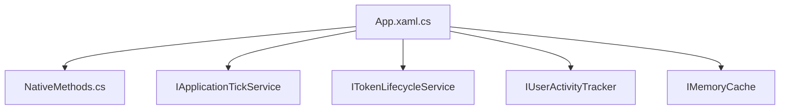

# implement-single-instance-mode 设计文档

## 概述

基于 [proposal.md](./proposal.md) 的详细技术设计，实现WPF Shell单实例模式和完善资源释放机制。

## 架构决策

### ADR-1: 使用命名Mutex实现单实例

**状态**: 已采纳

**背景**: WPF Shell缺乏单实例检查，用户多次点击启动会创建多个进程，导致资源浪费和状态混乱。

**决策**: 使用Windows命名Mutex (`Global\\LYBTZYZS_Shell_Instance`) 实现单实例检查。

**后果**:
- 正面: 系统级单实例保证，跨用户会话有效
- 负面: 需要正确释放Mutex，否则可能导致锁死

### ADR-2: Windows API激活已有窗口

**状态**: 已采纳

**背景**: 当检测到已有实例运行时，需要激活已有窗口而非静默退出。

**决策**: 使用P/Invoke调用 `FindWindow`/`SetForegroundWindow`/`ShowWindow` API。

**后果**:
- 正面: 用户体验良好，点击启动总能看到窗口
- 负面: 依赖Windows API，需要正确声明P/Invoke签名

### ADR-3: DI容器统一释放资源

**状态**: 已采纳

**背景**: 多个服务实现`IDisposable`但未在应用退出时显式释放。

**决策**: 在`OnExit`中通过DI容器获取并释放关键服务。

**后果**:
- 正面: 确保所有资源正确释放，防止僵尸进程
- 负面: 需要try-catch保护，确保释放顺序正确

## 实现策略

### 策略选择

采用**最小侵入性**策略，在现有App.xaml.cs中添加单实例检查和资源释放逻辑，不引入额外的Service类。

### 关键实现点

1. **Mutex在OnStartup最早期创建** - 在任何初始化之前检查
2. **Windows API封装在独立类** - `NativeMethods.cs` 使用`partial class`便于扩展
3. **资源释放按依赖顺序** - Timer服务 → HttpClient → 缓存 → 容器 → Mutex
4. **释放失败不阻塞退出** - 每个释放操作独立try-catch

## 变更清单

### 新增文件

| 文件路径 | 说明 |
|----------|------|
| `src/Client/Desktop/Shell/NativeMethods.cs` | Windows API P/Invoke封装 |

### 修改文件

| 文件路径 | 修改内容 |
|----------|----------|
| `src/Client/Desktop/Shell/App.xaml.cs` | 添加Mutex单实例检查、完善OnExit资源释放 |

### 删除文件

无

## 详细设计

### NativeMethods.cs

```csharp
using System;
using System.Runtime.InteropServices;

namespace LYBT.Desktop.Shell;

/// <summary>
/// Windows API P/Invoke 封装
/// </summary>
internal static partial class NativeMethods
{
    private const int SW_RESTORE = 9;
    private const int SW_SHOW = 5;

    [LibraryImport("user32.dll", EntryPoint = "FindWindowW", StringMarshalling = StringMarshalling.Utf16)]
    public static partial IntPtr FindWindow(string? lpClassName, string lpWindowName);

    [LibraryImport("user32.dll")]
    [return: MarshalAs(UnmanagedType.Bool)]
    public static partial bool SetForegroundWindow(IntPtr hWnd);

    [LibraryImport("user32.dll")]
    [return: MarshalAs(UnmanagedType.Bool)]
    public static partial bool ShowWindow(IntPtr hWnd, int nCmdShow);

    [LibraryImport("user32.dll")]
    [return: MarshalAs(UnmanagedType.Bool)]
    public static partial bool IsIconic(IntPtr hWnd);

    /// <summary>
    /// 激活已存在的应用程序窗口
    /// </summary>
    /// <param name="windowTitle">窗口标题</param>
    /// <returns>是否成功激活</returns>
    public static bool ActivateExistingWindow(string windowTitle)
    {
        var hWnd = FindWindow(null, windowTitle);
        if (hWnd == IntPtr.Zero)
            return false;

        // 如果窗口最小化，先恢复
        if (IsIconic(hWnd))
            ShowWindow(hWnd, SW_RESTORE);
        else
            ShowWindow(hWnd, SW_SHOW);

        return SetForegroundWindow(hWnd);
    }
}
```

### App.xaml.cs 修改

#### 新增字段

```csharp
private static Mutex? _instanceMutex;
private const string MutexName = "Global\\LYBTZYZS_Shell_Instance";
private const string MainWindowTitle = "凌隐宝堂中医诊所管理系统";
```

#### OnStartup 修改

```csharp
protected override void OnStartup(StartupEventArgs e)
{
    // 单实例检查 - 必须在任何初始化之前
    if (!TryAcquireSingleInstance())
    {
        // 尝试激活已有窗口
        NativeMethods.ActivateExistingWindow(MainWindowTitle);
        Shutdown();
        return;
    }

    // 设置控制台编码为UTF-8（必须在Serilog初始化前）
    SetConsoleEncoding();

    // 初始化Serilog日志系统
    DesktopSerilogConfiguration.Initialize();
    Log.Information("应用程序启动");

    _splashScreen = new SplashScreenWindow();
    _splashScreen.Show();
    _splashScreen.UpdateStatus("正在初始化应用程序...");
    base.OnStartup(e);
}

/// <summary>
/// 尝试获取单实例锁
/// </summary>
/// <returns>true表示当前是唯一实例，false表示已有实例运行</returns>
private static bool TryAcquireSingleInstance()
{
    _instanceMutex = new Mutex(true, MutexName, out var createdNew);
    if (!createdNew)
    {
        // 已有实例，释放当前创建的Mutex句柄
        _instanceMutex.Dispose();
        _instanceMutex = null;
        return false;
    }
    return true;
}
```

#### OnExit 修改

```csharp
protected override void OnExit(ExitEventArgs e)
{
    Log.Information("应用程序退出，开始释放资源");

    // 1. 停止定时服务
    SafeDispose(() =>
    {
        var tickService = Container.Resolve<IApplicationTickService>();
        tickService.Stop();
        (tickService as IDisposable)?.Dispose();
    }, "ApplicationTickService");

    SafeDispose(() =>
    {
        var tokenService = Container.Resolve<ITokenLifecycleService>();
        tokenService.StopMonitoring();
        tokenService.Dispose();
    }, "TokenLifecycleService");

    // 2. 释放用户活动追踪
    SafeDispose(() =>
    {
        var activityTracker = Container.Resolve<IUserActivityTracker>();
        (activityTracker as IDisposable)?.Dispose();
    }, "UserActivityTracker");

    // 3. 释放缓存
    SafeDispose(() =>
    {
        var cache = Container.Resolve<IMemoryCache>();
        cache.Dispose();
    }, "MemoryCache");

    // 4. 释放Mutex
    SafeDispose(() =>
    {
        _instanceMutex?.ReleaseMutex();
        _instanceMutex?.Dispose();
        _instanceMutex = null;
    }, "InstanceMutex");

    // 5. 关闭日志（最后执行）
    Log.Information("资源释放完成");
    DesktopSerilogConfiguration.CloseAndFlush();

    base.OnExit(e);
}

/// <summary>
/// 安全执行释放操作，捕获异常确保后续清理继续
/// </summary>
private static void SafeDispose(Action disposeAction, string resourceName)
{
    try
    {
        disposeAction();
        Log.Debug("已释放资源: {ResourceName}", resourceName);
    }
    catch (Exception ex)
    {
        Log.Warning(ex, "释放资源失败: {ResourceName}", resourceName);
    }
}
```

## 依赖关系

### 模块依赖



### 变更顺序

Phase 1 必须在 Phase 2 之前完成，因为单实例检查是资源管理的前提。

## 测试策略

### 手动测试

1. **单实例验证**:
   - 启动应用，再次双击启动 → 应激活已有窗口
   - 检查任务管理器仅有一个Shell进程

2. **资源释放验证**:
   - 正常退出应用 → 检查任务管理器无残留进程
   - 查看日志确认资源释放顺序

3. **异常场景**:
   - 强制结束进程后重新启动 → 应能正常启动（Mutex自动释放）

### 单元测试

- `NativeMethods` 为静态P/Invoke，不需要单元测试
- `TryAcquireSingleInstance` 和 `SafeDispose` 为私有方法，通过集成测试覆盖

## 风险缓解

| 风险 | 概率 | 影响 | 缓解措施 |
|------|------|------|----------|
| Mutex名称冲突 | 低 | 中 | 使用 `Global\\` 前缀 + 唯一应用标识 |
| FindWindow找不到窗口 | 中 | 低 | 提供fallback：静默退出，不影响用户 |
| 资源释放异常中断 | 中 | 高 | 每个释放操作独立try-catch |
| 强制退出后Mutex未释放 | 低 | 中 | Windows自动释放进程Mutex |

## 回滚计划

如果变更失败:
1. 回滚 `App.xaml.cs` 到原版本
2. 删除 `NativeMethods.cs`
3. 重新编译验证

---

**设计者**: Claude Code
**日期**: 2026-01-23
**状态**: 待审批
