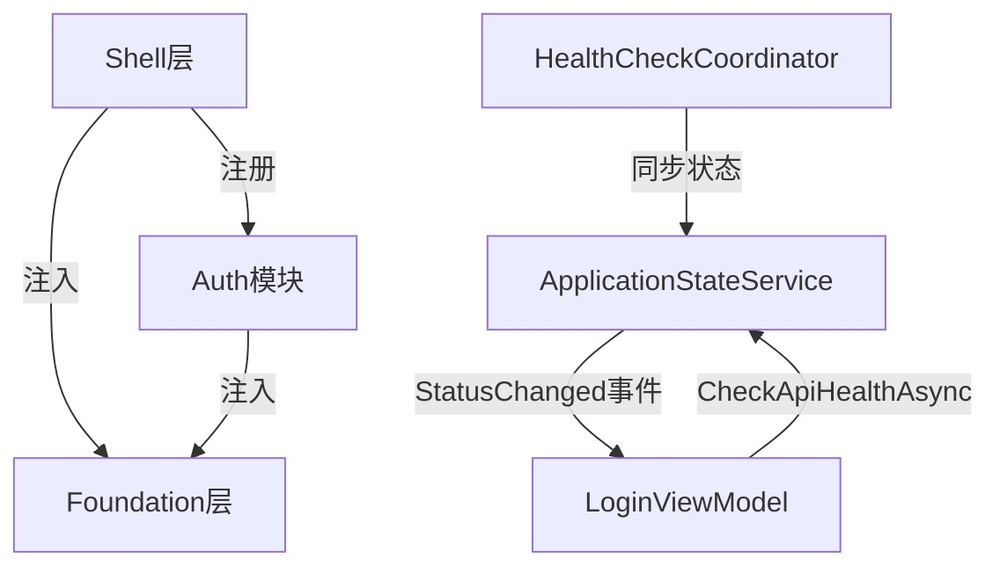

# refactor-startup-connection-resilience 设计文档

## 概述

基于 [proposal.md](./proposal.md) 的详细技术设计。

重构WPF Desktop连接处理架构: 非阻塞启动 + 登录页统一连接入口 + 事件驱动状态更新。

## 架构决策

### ADR-1: Polly弹性策略层级 -- 保留现有应用层

**状态**: 已采纳

**背景**: proposal计划安装`Microsoft.Extensions.Http.Resilience`在HttpClient handler层新增弹性管道。但代码分析发现:
- 现有`RetryPolicyExtensions.CreateCompositePolicy()`已在ApiService层提供retry(3x指数)+circuit breaker(5fail/1min)+timeout(30s)
- HttpClient是手动Singleton+handler chain，加HttpClient层Polly需迁移IHttpClientFactory，影响TokenRefreshHandler循环依赖规避方案
- 双层Polly导致最坏3x3=9次重试，是严重设计缺陷

**决策**: 不安装`Microsoft.Extensions.Http.Resilience`，保留现有应用层Polly弹性管道不变。

**后果**:
- 正面: 避免双重重试、减小变更范围、保持现有稳定的弹性策略
- 负面: 未来如需迁移到HttpClient层，需独立提案处理IHttpClientFactory迁移

### ADR-2: 状态更新机制 -- ApplicationStateService作为事件桥梁

**状态**: 已采纳

**背景**: LoginViewModel(Auth模块)需要实时感知API连接状态变化，但HealthCheckCoordinator(Shell层)与Auth模块存在层级隔离。

**决策**:
1. IApplicationStateService(Foundation层)新增StatusChanged事件+LastError属性
2. HealthCheckCoordinator注入IApplicationStateService，每次健康检查后同步状态
3. LoginViewModel订阅ApplicationStateService.StatusChanged获得实时更新

**后果**:
- 正面: 依赖方向正确(Shell→Foundation←Auth)，单一真相源，事件驱动解耦
- 负面: HealthCheckCoordinator新增对ApplicationStateService的依赖（但方向合理）

### ADR-3: 接口属性可见性 -- 保持现有set访问器

**状态**: 已采纳

**背景**: IApplicationStateService的属性当前有public set，HealthCheckCoordinator等直接设置。

**决策**: 本次不修改属性可见性，仅新增StatusChanged事件和LastError属性。

**后果**:
- 正面: 减小变更范围，避免连锁修改
- 负面: 接口设计不够严谨，可在后续提案中优化

## 实现策略

### 策略选择

采用"先拆后建"策略:
1. Phase 1: 同时进行旧代码清理和新机制建设（因为它们互相依赖）
2. Phase 2: 更新OpenSpec规范

### 关键实现点

1. **启动非阻塞**: `ApiHealthCheckStartupStep.IsRequired=false` + 移除App.xaml.cs的while循环
2. **事件驱动**: ApplicationStateService.StatusChanged → LoginViewModel自动更新UI
3. **状态同步**: HealthCheckCoordinator每10秒检查 → 同步到ApplicationStateService → 触发事件
4. **Banner替换**: LoginView移除ConnectionMode RadioButton，用三色状态Banner替换

### 重构后架构

```
┌─────────────────────────────────────────────────────────────┐
│  Layer 1: 现有Polly弹性管道 (ApiService层)                   │
│  • RetryPolicyExtensions.CreateCompositePolicy()            │
│  • Retry(3x) + CircuitBreaker(5fail) + Timeout(30s)        │
│  • 对上层透明，所有API调用自动享受弹性保护                    │
└─────────────────────────────────────────────────────────────┘
                              |
┌─────────────────────────────────────────────────────────────┐
│  Layer 2: ApplicationStateService (状态中枢, Foundation层)   │
│  • IsApiHealthy: 单一真相源                                  │
│  • StatusChanged: 事件通知 [新增]                            │
│  • LastError: 最后错误详情 [新增]                             │
│  • HealthCheckCoordinator每10秒同步状态到此                  │
└─────────────────────────────────────────────────────────────┘
                              |
┌─────────────────────────────────────────────────────────────┐
│  Layer 3: LoginViewModel (统一交互入口, Auth层)              │
│  • 订阅StatusChanged事件，自动更新Banner                     │
│  • 手动重试按钮 → CheckApiHealthAsync()                      │
│  • 内联错误展示，不弹对话框                                   │
└─────────────────────────────────────────────────────────────┘
```

### 重构后启动流程

```
App.OnStartup()
  |-- 显示SplashScreen
  |-- 初始化DI容器
  |-- 执行启动管道
  |     |-- ErrorHandling (Order=10, Required)
  |     |-- ModuleCoordinator (Order=20, Required)
  |     |-- CoreServices (Order=30, Required)
  |     |-- ApiHealthCheck (Order=40, IsRequired=false) <-- 非阻塞
  |     '-- Warmup (Order=50, Required)
  |-- 启动HealthCheckCoordinator (后台10s定时探测)
  |-- 导航到LoginView
  '-- 隐藏SplashScreen
```

## 变更清单

### 新增文件

| 文件路径 | 说明 |
|----------|------|
| `Foundation/Application/ApiStatusChangedEventArgs.cs` | API状态变更事件参数类 |

### 修改文件

| 文件路径 | 修改内容 |
|----------|----------|
| `Shell/Services/Startup/Steps/ApiHealthCheckStartupStep.cs` | IsRequired改为false |
| `Shell/App.xaml.cs` | 移除while循环+HandleApiConnectionFailureAsync+Dialog注册 |
| `Foundation/Application/IApplicationStateService.cs` | 新增StatusChanged事件+LastError属性 |
| `Foundation/Application/ApplicationStateService.cs` | 实现StatusChanged+LastError |
| `Shell/Services/HealthCheck/HealthCheckCoordinator.cs` | 注入ApplicationStateService，同步状态 |
| `Auth/ViewModels/LoginViewModel.cs` | 移除ConnectionMode，订阅StatusChanged |
| `Auth/Views/LoginView.xaml` | Banner替换RadioButton |
| `Shell/Extensions/ServiceCollectionExtensions.cs` | 清理废弃服务注册 |

### 删除文件

| 文件路径 | 原因 |
|----------|------|
| `Shell/Dialogs/Views/ApiConnectionFailedDialog.xaml` + `.xaml.cs` | 启动不再弹对话框 |
| `Shell/Dialogs/ViewModels/ApiConnectionFailedDialogViewModel.cs` | 对话框已删除 |
| `Shell/Services/ApiConnectionRecoveryService.cs` | 恢复服务不再需要 |
| `Contracts/Services/IApiConnectionRecoveryService.cs` | 接口已废弃 |
| `Contracts/Services/RecoveryAction.cs` | 枚举已废弃 |
| `Auth/Models/ConnectionMode.cs` | YAGNI: Local模式永久禁用 |
| `Auth/Services/ConnectionSettingsService.cs` | ConnectionMode已删除 |
| `Auth/Interfaces/IConnectionSettingsService.cs` | 接口已废弃 |

## 依赖关系

### 模块依赖



### 变更顺序

Phase 1内部顺序: 1.1→1.2→1.3→1.4→1.5→1.6→1.7→1.8→1.9→1.10→1.11(编译验证)

关键依赖:
- 1.3-1.5 (ApplicationStateService增强) 必须在 1.6 (HealthCheckCoordinator) 和 1.7 (LoginViewModel) 之前
- 1.7 (LoginViewModel) 必须在 1.8 (LoginView) 之前（移除绑定属性）
- 1.9 (删除文件) 必须在 1.2+1.7 之后（确保无引用）
- 1.10 (清理注册) 必须在 1.9 之后

## 风险缓解

| 风险 | 概率 | 影响 | 缓解措施 |
|------|------|------|----------|
| 启动非阻塞后用户不知道API状态 | 中 | 中 | LoginView Banner三色明确指示，HealthCheckCoordinator每10秒自动更新 |
| HealthCheckCoordinator新增依赖导致DI问题 | 低 | 中 | ApplicationStateService已是Singleton注册，DI自动注入 |
| 删除文件后遗留引用 | 低 | 高 | 编译验证+Grep搜索确认 |
| LoginView XAML重构引入绑定错误 | 中 | 低 | 保留现有绑定模式，仅替换容器 |

## 回滚计划

如果变更失败:
1. `git revert` 回退所有提交
2. 所有变更在同一Phase内，可原子回滚

---

**设计者**: Claude Code
**日期**: 2026-01-30
**状态**: 已审批
