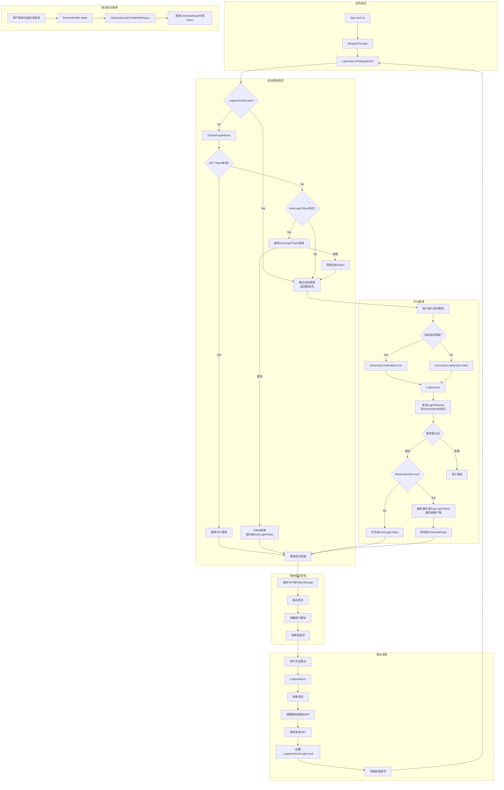

# 认证流程图 (simplify-auth-architecture)

## 整体认证流程



## 关键组件职责

| 组件 | 职责 |
|------|------|
| **LoginViewModel** | UI交互、触发登录/自动登录、管理RememberMe状态 |
| **LoginCoordinator** | 登录流程编排、状态机管理、自动登录抑制控制 |
| **AuthenticationService** | API调用、Token验证、登出 |
| **CredentialVault** | 安全存储AutoLoginToken (DPAPI加密) |
| **UsernameStorageService** | 存储用户名和RememberMe状态 |
| **TokenStorageService** | 存储JWT Token和LoginResponse |

## 关键标记

### `_suppressAutoLogin` (LoginCoordinator)
- **设置时机**: LogoutAsync执行时设为true
- **检查时机**: TryAutoLoginAsync开始时检查
- **重置时机**: 检查后立即重置为false
- **作用**: 防止登出后立刻触发自动登录形成死循环

### `RememberMe` (LoginRequest)
- **来源**: 用户勾选"自动登录"
- **传递**: LoginViewModel → LoginCoordinator → LoginRequest → 服务端
- **服务端行为**: 只有RememberMe=true时才生成AutoLoginToken

## 数据流

```
登录成功时:
  1. 用户名存储: UsernameStorageService.SaveUsernameAsync(username, true)
     - 始终保存用户名（无论是否勾选自动登录）
  2. AutoLoginToken: 只有RememberMe=true时
     → CredentialVault.SaveAutoLoginTokenAsync(username, token)

自动登录时:
  CredentialVault.GetAutoLoginTokenAsync(username) → autoLoginToken
  → AuthenticationService.LoginWithAutoTokenAsync(autoLoginToken)
  → 服务端验证 → 返回新LoginResponse(含新AutoLoginToken)
  → CredentialVault.SaveAutoLoginTokenAsync(username, newToken) [Token轮换]

登出时:
  不清除CredentialVault中的AutoLoginToken (保留用于下次启动)
  不清除UsernameStorage中的用户名 (保留用于下次登录)
  只清除JWT Token
  设置_suppressAutoLogin=true

取消勾选自动登录时:
  LoginViewModel.RememberMe setter
  → ClearAutoLoginCredentialsAsync
  → CredentialVault.ClearCredentialsAsync(username) [只清除AutoLoginToken]
  → 不清除UsernameStorage中的用户名
```

## 功能分离

| 功能 | 存储位置 | 清除时机 |
|------|---------|---------|
| **记住用户名** | UsernameStorageService | 永不自动清除（用户手动清除） |
| **自动登录** | CredentialVault (AutoLoginToken) | 取消勾选"自动登录"时 |

## 安全机制

1. **Token轮换**: 每次使用AutoLoginToken成功登录后，服务端生成新Token，旧Token失效
2. **DPAPI加密**: AutoLoginToken使用Windows DPAPI加密存储，与用户账户绑定
3. **HMAC验证**: 存储时计算HMAC，读取时验证防篡改
4. **服务端撤销**: 服务端可随时撤销AutoLoginToken，强制用户重新登录
