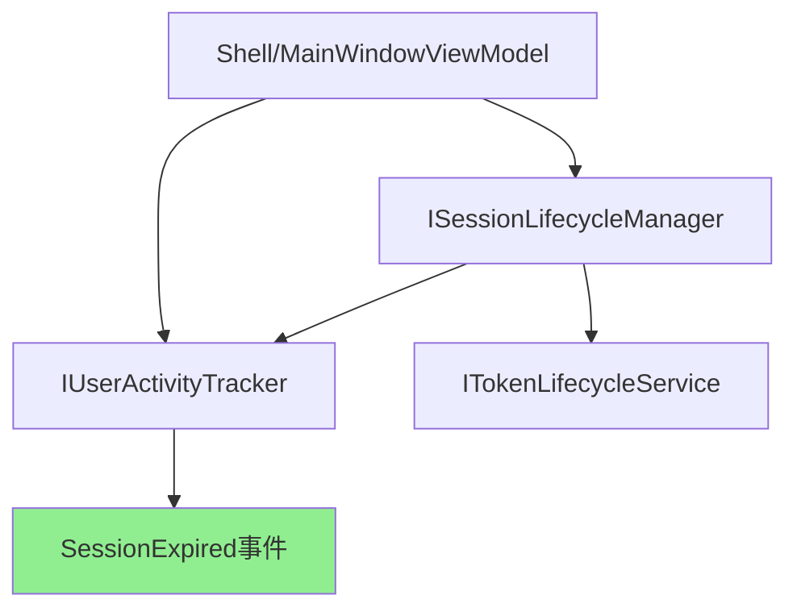

# simplify-auth-architecture 设计文档

## 概述

基于 [proposal.md](./proposal.md) 的详细技术设计。

**变更目标**: 简化Desktop端认证架构，从~5800行代码减少到~1200行，将6个服务整合为3个核心服务。

## 现状分析

### 现有架构（代码分析结果）

经过代码分析，实际架构已比提案描述更完善：

| 层级 | 服务 | 状态 |
|------|------|------|
| Foundation | AuthenticationService | ✅ 已存在 |
| Foundation | CredentialVault | ✅ 已存在（DPAPI+HMAC） |
| Foundation | TokenManager | ✅ 已存在（内存存储） |
| Foundation | TokenStorageService | ✅ 存在（JWT持久化） |
| Foundation | TokenLifecycleService | ✅ 存在（Token监控） |
| Foundation | AuthenticationStateMachine | ✅ 存在（统一状态机） |
| Infrastructure | UserActivityTracker | ✅ 已优化 |
| Shell | SessionLifecycleManager | ✅ 存在 |
| Shell | LoginCoordinator | ✅ 存在（登录编排） |

### 需要简化的问题

1. **Expiring状态冗余**: `SessionState.Expiring` 仍存在于代码中
2. **SessionExpiring事件残留**: 多处定义但UserActivityTracker已不触发
3. **重复的事件定义**: `ExpiringEvent`/`SessionExpiringEvent`等未使用
4. **死代码**: 与Expiring相关的事件处理器

## 架构决策

### ADR-1: 移除Expiring状态及相关代码

**状态**: 已采纳

**背景**: 用户确认超时无需警告，直接静默登出

**决策**:
- 从`SessionState`枚举移除`Expiring`状态
- 删除所有`SessionExpiring`相关事件和处理器
- 简化状态转换：Active直接到Expired

**后果**:
- 正面: 代码简洁，用户体验不变
- 负面: 需要更新多处事件订阅

### ADR-2: 保留现有服务架构

**状态**: 已采纳

**背景**: 代码分析发现现有架构已相对合理

**决策**:
- 保留`AuthenticationService`、`CredentialVault`、`TokenManager`三层架构
- 保留`LoginCoordinator`作为登录流程编排器
- 保留`SessionLifecycleManager`管理会话状态

**后果**:
- 正面: 最小化变更，降低风险
- 负面: 代码精简程度低于预期

### ADR-3: 清理死代码和未使用事件

**状态**: 已采纳

**背景**: 多个Expiring相关事件已不再使用

**决策**: 删除以下未使用代码:
- `ExpiringEvent` (Foundation/Security/TokenEvents.cs)
- `SessionExpiringEvent` (Foundation/Security/AuthEvents.cs)
- `SessionExpiringPayload` (Foundation/Security/AuthEvents.cs)
- `SessionExpiringEventArgs` (Contracts/Services/IUserActivityTracker.cs)
- `SessionExpiringWarningEventArgs` (Shell/Services/Session/ISessionLifecycleManager.cs)

**后果**:
- 正面: 减少代码体积和维护成本
- 负面: 需要更新接口定义

## 实现策略

### 策略选择

采用**渐进式清理**策略，按以下顺序执行：
1. 先移除事件定义和枚举值
2. 再更新状态机转换逻辑
3. 最后清理事件订阅代码

### 关键实现点

1. **SessionState枚举简化**
   - 移除`Expiring = 2`
   - 重新编号：Unauthenticated(0), Authenticated(1), Expired(2), Refreshing(3)

2. **UserActivityTracker简化**
   - 移除`SessionExpiring`事件定义
   - 移除`OnSessionExpiring`方法
   - 保留`SessionExpired`事件（已实现静默超时）

3. **SessionLifecycleManager简化**
   - 移除`SessionExpiring`事件
   - 移除`Expiring`状态转换逻辑
   - Token即将过期时直接刷新或过期

4. **MainWindowViewModel简化**
   - 移除`OnSessionExpiring`事件处理器
   - 移除相关事件订阅/取消订阅

## 变更清单

### 修改文件

| 文件路径 | 修改内容 |
|----------|----------|
| `Shell/Services/Session/ISessionLifecycleManager.cs` | 移除Expiring枚举值和SessionExpiring事件 |
| `Shell/Services/Session/SessionLifecycleManager.cs` | 移除Expiring状态转换逻辑 |
| `Shell/ViewModels/MainWindowViewModel.cs` | 移除SessionExpiring事件处理 |
| `Infrastructure/Services/UserActivityTracker.cs` | 移除SessionExpiring事件定义和方法 |
| `Contracts/Services/IUserActivityTracker.cs` | 移除SessionExpiring事件和EventArgs |
| `Contracts/Services/ISessionManager.cs` | 移除SessionExpiring事件定义 |
| `Infrastructure/Services/SessionManager.cs` | 移除SessionExpiring事件定义 |
| `Foundation/Security/AuthEvents.cs` | 移除SessionExpiringEvent和Payload |
| `Foundation/Security/TokenEvents.cs` | 移除ExpiringEvent |

### 删除文件

无文件需要删除（代码清理在现有文件中进行）

### 新增文件

无新文件需要创建

## 依赖关系

### 模块依赖

### 变更顺序

Phase 1（接口定义）必须在 Phase 2（实现清理）之前完成，因为实现依赖接口定义。

## 测试策略

### 手动测试

- 超时登出测试：等待15分钟不操作，验证直接logout无警告
- 正常登出测试：手动点击登出，验证流程正常
- 自动登录测试：验证AutoLoginToken流程不受影响

### 验证清单

- [ ] Desktop解决方案编译通过
- [ ] 超时logout直接触发（无警告对话框）
- [ ] 正常logout流程正常
- [ ] 自动登录流程正常
- [ ] Token刷新流程正常

## 风险缓解

| 风险 | 概率 | 影响 | 缓解措施 |
|------|------|------|----------|
| 状态转换异常 | 低 | 高 | 每阶段编译验证 |
| 事件订阅遗漏 | 中 | 中 | 全局搜索Expiring关键字 |
| 运行时异常 | 低 | 高 | 手动测试关键流程 |

## 回滚计划

如果变更失败:
1. `git checkout` 恢复修改的文件
2. 验证编译通过
3. 分析失败原因，调整方案

## 规范更新

### 需要更新的OpenSpec规范

| 规范文件 | 更新内容 |
|---------|---------|
| `login-state-machine/spec.md` | 移除Expiring状态，简化为5状态 |
| `authentication/spec.md` | AUTH-003改为静默超时（如存在） |

---

**设计者**: Claude Code
**日期**: 2026-01-26
**状态**: 待审批
