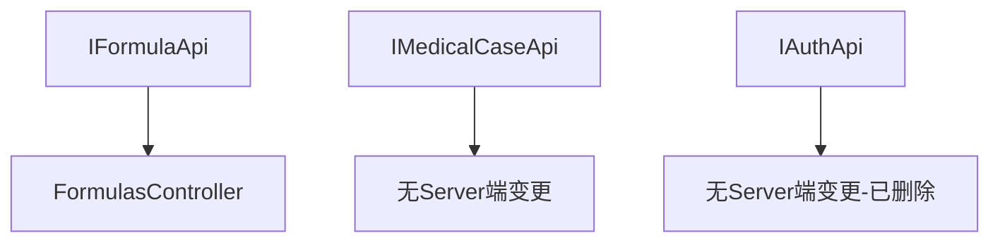

# standardize-api-naming 设计文档

## 概述

基于 [proposal.md](./proposal.md) 的详细技术设计。

**重要修订**: 代码分析发现原提案与实际代码状态存在重大差异，本设计文档基于实际代码分析结果进行了修订。

## 代码分析发现

### 发现1: IAuthApi.ChangeSysAdminPasswordAsync 是幽灵API

**分析结果**:
- Desktop端定义: `IAuthApi.cs:86-88` 存在该方法
- Server端状态: AuthController **已删除**该端点 (Issue #1909)
- 调用该API会导致404错误

**修订决策**: 删除该幽灵API，而非重命名URL

### 发现2: IHerbApi.BatchImportAsync URL冲突

**分析结果**:
- HerbsController存在**两个**导入端点:
  - `[HttpPost("import")]` (Line 142) - 接受IFormFile，用于Excel文件上传
  - `[HttpPost("batch-import")]` (Line 223) - 接受JSON Body
- Desktop的`IHerbApi.BatchImportAsync`使用Multipart调用`/import`
- 如果重命名为`/batch-import`会与现有JSON端点冲突

**修订决策**: 保持IHerbApi不变，避免功能破坏

### 发现3: IFormulaApi.BatchImportAsync 可安全重命名

**分析结果**:
- FormulasController只有一个导入端点: `[HttpPost("import")]` (Line 152)
- 不存在`/batch-import`端点
- 使用JSON Body，重命名安全

**修订决策**: 按原计划重命名 `/import` → `/batch-import`

### 发现4: IMedicalCaseApi.DeleteMedicalCaseAsync 返回类型确认

**分析结果**:
- 当前: `Task<Refit.IApiResponse>` (Line 107)
- 应改为: `Task<ApiResponse>`

**修订决策**: 按原计划修改返回类型

## 架构决策

### ADR-1: 删除幽灵API而非重命名

**状态**: 已采纳

**背景**: IAuthApi.ChangeSysAdminPasswordAsync在Server端已被移除(Issue #1909)，Desktop端仍保留该方法定义，形成幽灵API。

**决策**: 删除Desktop端的幽灵API定义，而非尝试重命名URL。

**后果**:
- 正面: 消除死代码，避免误调用
- 负面: 如果未来需要该功能，需重新实现

### ADR-2: 保留IHerbApi现有URL

**状态**: 已采纳

**背景**: HerbsController存在两个导入端点(`/import`和`/batch-import`)，分别用于Excel文件上传和JSON批量导入。重命名会导致端点冲突。

**决策**: 保持IHerbApi.BatchImportAsync的URL为`/api/v1/herbs/import`，不进行重命名。

**后果**:
- 正面: 保持功能正常，避免Breaking Change
- 负面: URL命名不完全符合`/batch-{action}`规范，但语义上合理(文件导入)

### ADR-3: IFormulaApi URL重命名

**状态**: 已采纳

**背景**: FormulasController只有一个导入端点，可安全重命名。

**决策**: 将`/api/v1/formulas/import`重命名为`/api/v1/formulas/batch-import`。

**后果**:
- 正面: 符合`/batch-{action}`命名规范
- 负面: 需同步修改Server端Controller

## 实现策略

### 策略选择

采用**最小化变更**策略，仅修复确认安全的问题，避免引入新的风险。

### 关键实现点

1. **删除幽灵API**: 直接删除IAuthApi中的ChangeSysAdminPasswordAsync方法及相关DTO
2. **修复返回类型**: 将IApiResponse替换为ApiResponse
3. **重命名FormulaAPI**: 同步修改Desktop和Server端

## 变更清单

### 修改文件

| 文件路径 | 修改内容 |
|----------|----------|
| `src/Client/Desktop/Core/LYBT.Desktop.Contracts/Api/IAuthApi.cs` | 删除ChangeSysAdminPasswordAsync方法 |
| `src/Client/Desktop/Core/LYBT.Desktop.Contracts/Api/IMedicalCaseApi.cs` | 修改DeleteMedicalCaseAsync返回类型 |
| `src/Client/Desktop/Core/LYBT.Desktop.Contracts/Api/IFormulaApi.cs` | 修改BatchImportAsync URL路径 |
| `src/Server/Modules/LYBT.Module.Formula/Controllers/FormulasController.cs` | 修改Import端点路由 |

### 不变更文件

| 文件路径 | 原因 |
|----------|------|
| `src/Client/Desktop/Core/LYBT.Desktop.Contracts/Api/IHerbApi.cs` | URL冲突，保持不变 |
| `src/Server/Services/LYBT.WebAPI/Controllers/HerbsController.cs` | 保持现有双端点设计 |
| `src/Server/Services/LYBT.WebAPI/Controllers/AuthController.cs` | 端点已不存在，无需修改 |

### 可能需要删除的文件/代码

| 位置 | 内容 | 原因 |
|------|------|------|
| `IAuthApi.cs:86-88` | ChangeSysAdminPasswordAsync方法 | 幽灵API |
| 相关DTO | ChangeSysAdminPassword类 | 如果仅被该方法使用 |

## 依赖关系

### 模块依赖

### 变更顺序

Phase 1 (IAuthApi删除) 和 Phase 2 (IMedicalCaseApi修复) 可并行执行。
Phase 3 (IFormulaApi重命名) 必须Desktop和Server同步修改。

## 测试策略

### 单元测试

- IMedicalCaseApi返回类型变更: 验证调用方兼容性
- IFormulaApi URL变更: 验证请求正确发送

### 集成测试

- 验方批量导入功能: 确保Desktop端正确调用Server端新URL
- 医案删除功能: 确保返回类型变更不影响功能

### 回归测试

- 药材批量导入: 确保未做变更的功能正常

## 风险缓解

| 风险 | 概率 | 影响 | 缓解措施 |
|------|------|------|----------|
| ChangeSysAdminPasswordAsync有未知调用方 | 低 | 中 | 全局搜索确认无调用 |
| IFormulaApi URL变更未同步 | 中 | 高 | Desktop和Server同步修改 |
| 返回类型变更影响调用方 | 低 | 低 | ApiResponse兼容IApiResponse |

## 回滚计划

如果变更失败:
1. Git revert相关提交
2. 重新部署Server端恢复原URL
3. 重新部署Desktop端恢复原API定义

---

**设计者**: Claude Code
**日期**: 2026-01-07
**状态**: 待审批
