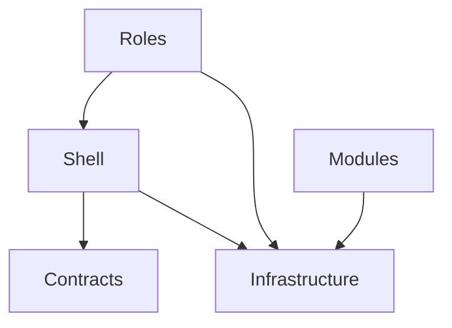

# unify-navigation-architecture 设计文档

## 概述

基于 [proposal.md](./proposal.md) 的详细技术设计。

统一Desktop层导航架构，消除代码重复，引入类型安全的视图名称常量，创建单一导航入口。

## 代码分析结果

### GetHomeViewName重复问题（6处实现）

| 位置 | 实现方式 | 默认值 | 问题 |
|------|----------|--------|------|
| IRoleRegistry (接口) | 声明 | - | 正确 |
| RoleRegistry | IRoleDefinition查询 | ClinicalHomeView | **权威源** |
| RoleNavigationService | 委托RoleRegistry | - | 正确 |
| NavigableViewModelBase:350-372 | switch硬编码 | AdminHomeView | **需删除** |
| UnifiedViewModelBase:103-141 | switch硬编码 | AdminHomeView | **需删除** |
| MenuManager:120-129 | switch硬编码 | AdminHomeView | **需删除** |

**关键差异**: 默认角色处理不一致（RoleRegistry返回ClinicalHomeView，其他返回AdminHomeView）

### 视图名称硬编码统计

**18个视图名称，162个文件涉及硬编码：**

| 视图名称 | 使用次数 | 分类 |
|---------|--------|------|
| AdminHomeView | 8 | Admin角色 |
| ClinicalHomeView | 7 | Clinical角色 |
| MedicalCaseWorkspaceView | 6 | 诊疗流程 |
| PatientManagementView | 5 | 患者管理 |
| MedicalCaseMasterDetailView | 4 | 医案管理 |
| UserProfileView | 2 | 账户 |
| PatientSelectionView | 2 | 诊疗流程 |
| 其他11个视图 | 各1-2次 | 各模块 |

### 导航服务职责对比

| 服务 | 职责 | 建议 |
|------|------|------|
| NavigationManager | 通用Prism导航 | 保留，整合到Coordinator |
| ViewNavigationService | MasterDetail导航+历史 | **评估删除或整合** |
| RoleNavigationService | 角色首页导航 | 保留，整合到Coordinator |

### ViewModel基类导航接口状态

| 基类 | INavigationAware | IConfirmNavigationRequest | GetHomeViewName |
|------|------------------|---------------------------|-----------------|
| NavigableViewModelBase | Yes | Yes | 硬编码（需改） |
| UnifiedViewModelBase | Yes | No | 硬编码（需改） |
| ComposableViewModelBase | Yes | No | 无 |
| MasterDetailViewModelBase | Yes | No | 无 |

## 架构决策

### ADR-1: RoleRegistry为GetHomeViewName唯一权威源

**状态**: 已采纳

**背景**: 当前有5处几乎相同的GetHomeViewName实现，导致维护困难且默认值不一致。

**决策**: 所有GetHomeViewName调用统一委托给RoleRegistry，删除其他3处硬编码实现。

**实现**:
- ViewModel基类通过注入IRoleRegistry获取视图名称
- 禁止使用ContainerLocator.Resolve获取SessionManager

**后果**:
- 正面: 单一职责，易于维护，默认值一致
- 负面: ViewModel基类需要新增IRoleRegistry依赖

### ADR-2: ViewNames常量类提供类型安全

**状态**: 已采纳

**背景**: 视图名称以字符串形式分散在代码各处，无编译时检查。

**决策**: 创建Shell/Constants/ViewNames.cs，所有视图名称使用常量引用。

**实现**:
```csharp
public static class ViewNames
{
    // === 主页视图 ===
    public const string AdminHome = "AdminHomeView";
    public const string ClinicalHome = "ClinicalHomeView";

    // === 管理视图 ===
    public const string PatientManagement = "PatientManagementView";
    public const string MedicalCaseManagement = "MedicalCaseManagementView";
    public const string HerbManagement = "HerbManagementView";
    public const string FormulaManagement = "FormulaManagementView";
    public const string UserManagement = "UserManagementView";

    // === 工作台/选择视图 ===
    public const string PatientSelection = "PatientSelectionView";
    public const string MedicalCaseWorkspace = "MedicalCaseWorkspaceView";

    // === MasterDetail视图 ===
    public const string PatientMasterDetail = "PatientMasterDetailView";
    public const string MedicalCaseMasterDetail = "MedicalCaseMasterDetailView";

    // === 列表视图 ===
    public const string MedicalCaseList = "MedicalCaseListView";

    // === 设置视图 ===
    public const string SystemSettings = "SystemSettingsView";
    public const string AccountSettings = "AccountSettingsView";

    // === 认证视图 ===
    public const string Login = "LoginView";

    // === 开发工具 ===
    public const string ControlExamples = "ControlExamplesView";
}
```

**后果**:
- 正面: 编译时类型安全，IDE自动补全，重命名安全
- 负面: 需全量替换现有硬编码

### ADR-3: INavigationCoordinator统一导航入口

**状态**: 已采纳

**背景**: 导航逻辑分散在NavigationManager、MenuManager、各ViewModel中。

**决策**: 创建INavigationCoordinator接口整合NavigationManager和RoleNavigationService功能。

**实现**:
```csharp
public interface INavigationCoordinator
{
    void NavigateTo(string viewName, NavigationParameters? parameters = null);
    void NavigateToHome();
    void NavigateBack();
    bool CanNavigateBack { get; }
    string CurrentView { get; }
}
```

**后果**:
- 正面: 单一入口，清晰的导航职责，便于扩展
- 负面: 需迁移现有导航调用

### ADR-4: 保留ViewNavigationService的历史功能

**状态**: 已采纳

**背景**: ViewNavigationService已创建但未完全集成，包含导航历史管理功能。

**决策**: ViewNavigationService的导航历史功能整合到NavigationCoordinator，然后删除ViewNavigationService。

**后果**:
- 正面: 减少服务数量，职责更清晰
- 负面: 需确认无其他依赖

### ADR-5: 统一系统设置入口（角色内容自适应）

**状态**: 已采纳

**背景**:
1. AdminHomeView和SidebarControl都定义了"系统设置"导航入口，造成冗余
2. 医生角色也需要设置功能

**决策**:
1. **统一入口**: 系统设置仅从各角色HomeView进入（AdminHomeView/ClinicalHomeView）
2. **Sidebar简化**: 移除系统设置，仅保留：主页、账户设置、退出登录
3. **角色自适应**: SystemSettingsView根据当前用户角色动态加载不同设置内容
4. **后期设计**: 具体设置内容在后续提案中细化

**UI布局**:

```
Sidebar (全局工具栏) - 所有角色统一
├── [主页]
├── [账户设置] - 个人信息/密码
└── [退出登录]

AdminHomeView (管理主页)
├── [患者管理] [医案管理] [药材管理] [验方管理]
├── [用户管理]
└── [系统设置] → SystemSettingsView (Admin内容)

ClinicalHomeView (诊疗主页)
├── 今日待诊列表
├── [患者选择] [开始看诊]
└── [系统设置] → SystemSettingsView (Doctor内容)
```

**SystemSettingsView角色内容适配**:

| 角色 | 可见设置模块 |
|------|-------------|
| Admin/SuperAdmin | 机构信息、系统参数、用户管理快捷入口、打印设置、备份恢复 |
| Doctor | 诊疗偏好、处方模板、常用药材、打印设置 |
| Receptionist | 挂号设置、打印设置 |

**实现方式**: ViewModel根据`ISessionManager.CurrentUser.Role`动态控制设置模块可见性

**后果**:
- 正面: 统一入口减少用户认知负担，角色自适应满足不同用户需求
- 负面: 需修改Sidebar和各HomeView

### ADR-6: 统一视图命名规范

**状态**: 已采纳

**背景**: 当前视图命名存在不一致：
- `MedicalCaseWorkspaceView` vs `PatientManagementView` - 后缀不统一
- `UserProfileView` vs `AccountSettingsView` - 功能边界模糊
- 缺少明确的命名模式文档

**决策**: 建立统一的视图命名模式

**命名模式规范**:

| 视图类型 | 命名模式 | 示例 |
|----------|----------|------|
| 主页视图 | `{Role}HomeView` | AdminHomeView, ClinicalHomeView |
| 管理视图 | `{Entity}ManagementView` | PatientManagementView, HerbManagementView |
| 列表视图 | `{Entity}ListView` | MedicalCaseListView |
| 详情视图 | `{Entity}DetailView` | PatientDetailView |
| MasterDetail视图 | `{Entity}MasterDetailView` | PatientMasterDetailView |
| 工作台视图 | `{Entity}WorkspaceView` | MedicalCaseWorkspaceView |
| 选择视图 | `{Entity}SelectionView` | PatientSelectionView |
| 设置视图 | `{Scope}SettingsView` | SystemSettingsView, AccountSettingsView |
| 认证视图 | `{Action}View` | LoginView |
| 开发工具 | `{Feature}View` | ControlExamplesView |

**视图功能边界澄清**:

| 视图 | 功能定位 |
|------|----------|
| AccountSettingsView | 当前用户的账户设置（个人信息、密码修改） |
| SystemSettingsView | 系统级设置（机构配置、系统参数，内容角色自适应） |
| UserProfileView | **删除** - 功能合并到AccountSettingsView |
| ChangePasswordView | **删除** - 功能合并到AccountSettingsView（作为Tab或Section） |

**重命名计划**:

| 原名称 | 新名称 | 原因 |
|--------|--------|------|
| UserProfileView | (删除) | 合并到AccountSettingsView |
| ChangePasswordView | (删除) | 合并到AccountSettingsView |

**后果**:
- 正面: 统一后缀模式便于快速识别视图类型，合并功能重叠的视图减少维护成本
- 负面: 需删除视图文件并迁移功能

### ADR-7: 完整统一所有导航服务

**状态**: 已采纳

**背景**: 当前存在4个导航相关服务，职责重叠、层级混乱：

| 服务 | 层级 | 功能 | 问题 |
|------|------|------|------|
| NavigationCoordinator | Shell | NavigateTo, NavigateToHome, NavigateBack | 新标准入口 |
| NavigationManager | Shell | NavigateTo, ShowLoginDialog, ClearRegions | NavigateTo重复 |
| ViewNavigationService | Infrastructure | NavigateToAsync, NavigationHistory | 历史功能独立 |
| RoleNavigationService | Shell | NavigateToRoleHome | 与NavigateToHome重复 |

**问题分析**:
1. **功能重叠**: NavigateTo在3处实现，NavigateBack在2处实现
2. **层级混乱**: 4个服务分散在Shell和Infrastructure层
3. **接口碎片化**: INavigationCoordinator、IViewNavigationService、IRoleNavigationService职责边界模糊

**决策**: 将所有导航功能完整统一到INavigationCoordinator，删除其他3个导航服务。

**统一后的INavigationCoordinator接口**:
```csharp
public interface INavigationCoordinator
{
    // === 基础导航 (原有) ===
    void NavigateTo(string viewName, IDictionary<string, object>? parameters = null);
    void NavigateToHome();
    string CurrentView { get; }

    // === 历史导航 (从ViewNavigationService整合) ===
    void NavigateBack();
    bool CanNavigateBack { get; }
    IReadOnlyList<string> NavigationHistory { get; }
    void ClearHistory();
    event EventHandler<NavigationChangedEventArgs>? NavigationChanged;

    // === Region管理 (从NavigationManager整合) ===
    void ShowLoginDialog();
    void ClearLoginRegion();
    void ClearContentRegion();

    // === 事件订阅 (从NavigationManager整合) ===
    void SubscribeToRegionCollection();
    void UnsubscribeFromRegionCollection();
}
```

**迁移策略**:

| 原服务 | 功能 | 迁移到 |
|--------|------|--------|
| NavigationManager.NavigateTo | 基础导航 | 已在NavigationCoordinator |
| NavigationManager.ShowLoginDialog | 登录区域管理 | NavigationCoordinator |
| NavigationManager.ClearLoginRegion | 登录区域清理 | NavigationCoordinator |
| NavigationManager.ClearContentRegion | 内容区域清理 | NavigationCoordinator |
| NavigationManager.Subscribe* | 事件订阅 | NavigationCoordinator |
| ViewNavigationService.NavigationHistory | 历史管理 | NavigationCoordinator |
| ViewNavigationService.NavigateBackAsync | 返回导航 | NavigationCoordinator.NavigateBack |
| ViewNavigationService.NavigationChanged | 导航事件 | NavigationCoordinator |
| RoleNavigationService.NavigateToRoleHome | 角色首页 | 已等效NavigateToHome |

**依赖更新**:

| 消费者 | 当前依赖 | 更新后 |
|--------|----------|--------|
| MainWindowViewModel | INavigationManager | INavigationCoordinator |
| LoginCoordinator | INavigationManager | INavigationCoordinator |
| MasterDetailServices | IViewNavigationService | INavigationCoordinator |
| 5个MasterDetail ViewModel | IMasterDetailServices | 无变化(透传) |
| MenuManager | IRoleNavigationService | 已是INavigationCoordinator |

**删除文件**:
- `Shell/Services/NavigationManager.cs`
- `Infrastructure/Services/ViewNavigationService.cs`
- `Shell/Services/RoleNavigationService.cs`
- `Contracts/Services/IViewNavigationService.cs`
- `Contracts/Services/IRoleNavigationService.cs`

**后果**:
- 正面: 单一导航入口，职责清晰，代码量减少约300行，层级统一
- 负面: 需更新所有消费者依赖，MasterDetailServices接口变更

## 实现策略

### 策略选择

采用**分阶段渐进式重构**策略：
1. 每个Phase独立可验证
2. 保持向后兼容
3. 失败可回滚

### 关键实现点

1. **RoleRegistry作为权威源** - 所有角色-视图映射由RoleRegistry管理
2. **ViewNames常量类** - 提供编译时类型安全
3. **INavigationCoordinator** - 统一导航入口，整合现有服务
4. **视图合并** - UserProfileView/ChangePasswordView功能合并到AccountSettingsView

## 变更清单

### 新增文件

| 文件路径 | 说明 |
|----------|------|
| `Shell/Constants/ViewNames.cs` | 视图名称常量类 (16个视图) |
| `Contracts/Services/INavigationCoordinator.cs` | 导航协调器接口 |
| `Shell/Services/NavigationCoordinator.cs` | 导航协调器实现 |
| `Infrastructure/ViewModels/NavigationAwareViewModelBase.cs` | 导航感知基类 |

### 修改文件

| 文件路径 | 修改内容 |
|----------|----------|
| `Shell/Config/RoleRegistry.cs` | 确认GetHomeViewName方法公开可用 |
| `Shell/Services/MenuManager.cs` | 删除GetHomeViewName，调用RoleRegistry，使用INavigationCoordinator |
| `Infrastructure/ViewModels/NavigableViewModelBase.cs` | 删除GetHomeViewName，注入IRoleRegistry，继承NavigationAwareViewModelBase |
| `Infrastructure/ViewModels/UnifiedViewModelBase.cs` | 删除GetHomeViewName，注入IRoleRegistry，添加IConfirmNavigationRequest |
| `Shell/Services/NavigationManager.cs` | 使用ViewNames常量 |
| `Shell/Services/RoleNavigationService.cs` | 使用ViewNames常量 |
| `Shell/ViewModels/MainWindowViewModel.cs` | 使用INavigationCoordinator |
| `Shell/Extensions/ServiceCollectionExtensions.cs` | 注册INavigationCoordinator服务 |
| `Roles/*/ViewModels/*.cs` | 替换硬编码为ViewNames.* |
| `AccountSettingsView/ViewModel` | 合并UserProfileView/ChangePasswordView功能 |

### 删除文件

| 文件路径 | 原因 |
|----------|------|
| `Views/UserProfileView.xaml` | 功能合并到AccountSettingsView (ADR-6) |
| `ViewModels/UserProfileViewModel.cs` | 功能合并到AccountSettingsView (ADR-6) |
| `Views/ChangePasswordView.xaml` | 功能合并到AccountSettingsView (ADR-6) |
| `ViewModels/ChangePasswordViewModel.cs` | 功能合并到AccountSettingsView (ADR-6) |
| `Shell/Services/ViewNavigationService.cs` | 功能整合到NavigationCoordinator (ADR-4) |

## 依赖关系

### 模块依赖



### 变更顺序

```
Phase 1 ─────────────────────┐
                             │
Phase 2 ─────────────────────┼──> Phase 5
                             │
Phase 3 ─────────────────────┤
                             │
Phase 4 ─────────────────────┘
```

Phase 1-4可以并行开发，但建议按顺序执行以降低风险。Phase 5依赖所有前序Phase完成。

## 测试策略

### 编译验证

每个Phase完成后执行：
```bash
dotnet build LYBT.All.sln -c Release --no-restore
```

### Phase 2特殊验证

确认无遗留硬编码：
```bash
grep -r "\".*View\"" --include="*.cs" | grep -v "ViewNames.cs" | grep -v "// ViewNames"
```

### 功能测试

- Admin主页 ↔ 各管理视图导航正常
- Clinical主页 ↔ 诊疗流程导航正常
- 角色切换后正确导航到对应主页
- 返回主页功能在所有视图可用
- 导航历史记录正确

## 风险缓解

| 风险 | 概率 | 影响 | 缓解措施 |
|------|------|------|----------|
| 遗漏视图名称替换 | 中 | 低 | Phase 2验证Grep全量搜索 |
| 导航行为变化 | 低 | 高 | 每个Phase编译验证+功能测试 |
| ViewModel基类循环依赖 | 低 | 中 | IRoleRegistry通过DI注入 |
| ViewModel继承链变化 | 中 | 中 | 渐进式迁移，保持向后兼容 |
| ViewNavigationService使用者遗漏 | 低 | 低 | 搜索引用确认 |
| 删除视图导致引用断裂 | 中 | 中 | 先搜索引用，确认功能已迁移后再删除 |
| AccountSettingsView功能遗漏 | 低 | 中 | 对比合并前后功能完整性 |

## 回滚计划

如果变更失败:
1. 每个Phase独立提交，可单独回滚
2. 保留原有方法签名，仅标记为Obsolete
3. 使用git revert回滚特定Phase的提交

---

**设计者**: Claude Code
**日期**: 2026-01-10
**状态**: 已批准
