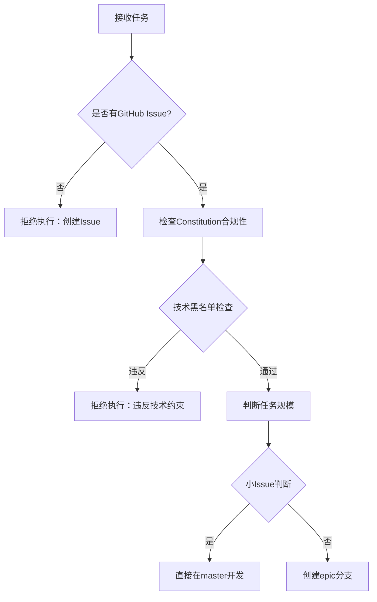

# AI Agent 开发操作标准

**版本**: v1.0
**创建时间**: 2025-10-28
**目标**: 为AI Agent提供可直接执行的项目操作规则

---

## 1. 项目基础信息

### 1.1 技术栈

| 层级 | 技术栈 | 版本 |
|------|--------|------|
| **Server端** | ASP.NET Core | 8.0 |
| **Client端** | WPF + Avalonia | .NET 8.0 |
| **数据库** | SQL Server | 2022 |
| **ORM** | Entity Framework Core | 8.0.0 |
| **认证** | JWT | - |
| **测试** | xUnit + NSubstitute | - |

### 1.2 GitHub仓库参数（MCP工具使用）

```
Owner: shouqitao
Repo:  LYBTZYZS
URL:   https://github.com/shouqitao/LYBTZYZS
```

**强制要求**: 使用GitHub MCP工具时，每次调用必须显式提供`owner`和`repo`参数。

### 1.3 项目目录结构

```
LYBTZYZS/
├── src/
│   ├── Server/                # ASP.NET Core后端
│   │   ├── Controllers/       # API端点
│   │   ├── Services/          # 业务逻辑层
│   │   ├── Repositories/      # 数据访问层
│   │   └── Migrations/        # 数据库迁移
│   ├── Client/
│   │   ├── Desktop/           # WPF桌面端（Modules划分）
│   │   └── Avalonia/          # 跨平台客户端
│   └── Shared/                # 跨端共享代码（DTOs/Contracts）
├── docs/                      # 三层对齐文档架构
│   ├── architecture/          # 架构文档（server/client/shared）
│   ├── api/                   # API文档
│   ├── modules/               # 模块文档
│   └── reports/               # 总结报告
├── tests/                     # 测试项目
│   ├── UnitTests/             # 单元测试
│   └── IntegrationTests/      # 集成测试
└── scripts/                   # 自动化脚本
```

---

## 2. 强制性执行流程（任务处理决策树）

### 2.1 任务启动前检查（必须按顺序执行）



#### 小Issue判断标准（5项全部满足）

- ✅ 单一Bug修复或小功能
- ✅ 影响文件 <5个
- ✅ 代码量 <200行
- ✅ 单模块改动
- ✅ 开发时间 <2小时
- ✅ 无架构调整

**不满足任一条件** → 归类为Epic，创建分支

### 2.2 编译验证流程（强制执行）

```bash
# Step 1: 编译验证
dotnet build LYBT.All.sln -c Release --no-restore

# 要求: 0 errors, 0 warnings
# 警告处理: ≤20个直接修复；>20个创建Issue跟踪
```

### 2.3 运行时验证流程（强制执行）

**禁止**: 只编译通过就提交

**必须执行**:
1. 启动应用（Client + Server）
2. 执行具体操作场景
3. 验证数据库状态（必要时检查数据）
4. 从用户视角确认功能完整可用

### 2.4 提交流程（按任务类型）

#### 小Issue提交（直接master）

```bash
# 1. 编译验证
dotnet build LYBT.All.sln -c Release --no-restore

# 2. 运行时验证（启动应用测试功能）

# 3. 提交并自动关闭Issue
git add .
git commit -m "fix(module): 修复XXX问题

Fixes #1234

- 具体改动1
- 具体改动2
- 验证：功能已正常工作

🤖 Generated with [Claude Code](https://claude.com/claude-code)

Co-Authored-By: Claude <noreply@anthropic.com>"

# 4. 推送
git push origin master
```

#### Epic提交（创建PR）

```bash
# 1. 创建分支
git checkout -b epic/issue-1234-description

# 2. 多次commit开发
git commit -m "feat: 完成子功能A"
git commit -m "feat: 完成子功能B"

# 3. 运行时验证

# 4. 创建PR
gh pr create --title "Epic #1234: XXX功能实现" --body "..."

# 5. 必须在1-3天内合并或关闭
gh pr merge --squash --delete-branch

# 6. 关闭Issue
gh issue close 1234
```

---

## 3. 架构约束（MUST遵守）

### 3.1 三层架构规则

| 层级 | 允许依赖 | 禁止依赖 |
|------|----------|----------|
| **Server端** | Controller → Service → Repository → DB | ❌ Controller直接访问Repository |
| **Client端** | View → ViewModel → Service → ApiClient → Model | ❌ View直接访问Service |
| **跨层调用** | 必须遵循依赖方向 | ❌ 任何反向依赖 |

### 3.2 依赖注入规范

**允许**:
```csharp
// ✅ 构造函数注入
public PatientService(
    IPatientRepository repository,
    ILogger<PatientService> logger)
{
    _repository = repository;
    _logger = logger;
}
```

**禁止**:
```csharp
// ❌ ServiceLocator
private IPatientRepository _repository =
    ServiceLocator.Resolve<IPatientRepository>();

// ❌ 属性注入
[Inject]
public IPatientRepository Repository { get; set; }

// ❌ Container.Resolve
var service = Container.Resolve<IPatientService>();
```

### 3.3 技术黑名单（禁止引入）

| 技术 | 原因 | 替代方案 |
|------|------|----------|
| ❌ Redis | 无分布式缓存需求 | 内存缓存 |
| ❌ CQRS | MVP过度设计 | 简单Service层 |
| ❌ MediatR | 增加复杂度无收益 | 直接依赖注入 |
| ❌ Docker | 暂无容器化需求 | 直接部署 |
| ❌ GraphQL | RESTful已足够 | REST API |
| ❌ 消息队列 (RabbitMQ/Kafka) | 无异步任务需求 | 同步处理 |
| ❌ 微服务架构 | 单体更适合当前规模 | 模块化单体 |

**允许技术**: .NET 8、EF Core、SQL Server/SQLite、WPF、Avalonia、JWT

**引入新技术**: 必须先创建ADR文档（`docs/architecture/decisions/ADR-XXX.md`）并获批准

---

## 4. 代码规范（生成代码时遵循）

### 4.1 命名规范

| 元素 | 规范 | 示例 |
|------|------|------|
| 类型和公开成员 | PascalCase | `PatientService`, `GetPatientById` |
| 私有字段 | _camelCase | `_repository`, `_logger` |
| 常量 | UPPER_SNAKE_CASE | `MAX_RETRY_COUNT` |
| 异步方法 | Async后缀 | `GetPatientAsync`, `SaveAsync` |

### 4.2 编码标准

- **文件编码**: 所有文本文件使用`UTF-8 with BOM`
- **文件体量**: 单文件建议≤500行，超出需拆分模块
- **语言**: 代码注释、终端输出、Git提交信息统一使用中文

### 4.3 Emoji使用规范

- ❌ **代码中禁用**: .cs/.json/.xml文件禁止使用Emoji
- ✅ **文档中允许**: .md文件、Issue/PR描述允许使用Emoji

---

## 5. 多文件协同规则（同步更新清单）

### 5.1 Server端改动

**修改Controller** → 必须同步更新:
- `docs/api/{module}-api.md` - API文档
- `docs/modules/{module}/README.md` - 模块文档
- `docs/architecture/server/README.md` - 架构文档（如架构变更）

**新增数据库迁移** → 必须同步更新:
- `docs/architecture/server/database-schema.md` - 数据库架构

### 5.2 Client端改动

**修改ViewModel** → 必须同步更新:
- `docs/modules/{module}/README.md` - 模块文档
- `docs/architecture/client/README.md` - 架构文档（如架构变更）

**新增View** → 必须同步更新:
- `docs/architecture/client/README.md` - UI组件清单

### 5.3 Shared层改动

**新增DTO** → 必须同步更新:
- `docs/architecture/shared/README.md` - 共享组件文档
- 相关API文档（Server端和Client端）

### 5.4 架构调整

**任何架构变更** → 必须同步更新:
1. 创建`docs/architecture/decisions/ADR-XXX.md` - 架构决策记录
2. 更新`docs/architecture/exceptions.md` - 例外清单（如有违反）
3. 更新`docs/index.md` - 版本号和日期

### 5.5 Epic完成

**完成Epic** → 必须创建:
- `docs/reports/epic-{number}-{phase}-summary-{date}.md` - 总结报告

---

## 6. 文件组织规范（强制归档）

### 6.1 禁止行为

- ❌ **禁止在根目录创建临时文件**
- ❌ 禁止在docs/外创建文档
- ❌ 禁止在scripts/外创建脚本

### 6.2 文件归档规则

| 文件类型 | 归档位置 | 示例 |
|---------|---------|------|
| **架构文档** | `docs/architecture/{server\|client\|shared}/` | README.md, design-patterns.md |
| **API文档** | `docs/api/` | medicalcase-api.md |
| **模块文档** | `docs/modules/{module-name}/` | README.md |
| **总结报告** | `docs/reports/` | epic-1676-phase-4-summary.md |
| **脚本** | `scripts/{功能目录}/` | analysis/, deployment/ |
| **脚本输出** | `scripts/analysis/outputs/` | CSV、日志文件 |

### 6.3 自动检查

Pre-commit hook会自动检查根目录文件规范，违规将阻止提交。

---

## 7. Git工作流规则

### 7.1 分支策略

| 场景 | 分支名称 | 合并方式 | 时限 |
|------|---------|---------|------|
| **小Issue** | 直接master | 无需PR | 立即提交 |
| **Epic** | `epic/issue-{number}-{desc}` | 创建PR后squash merge | 1-3天内合并 |

### 7.2 Commit Message格式

```
<type>(<scope>): <subject>

Fixes #1234  # 小Issue：自动关闭
Related to Epic #1234  # Epic：关联但不关闭

- 具体改动1
- 具体改动2
- 验证：功能已正常工作  # ⚠️ 必须包含验证说明

🤖 Generated with [Claude Code](https://claude.com/claude-code)

Co-Authored-By: Claude <noreply@anthropic.com>
```

**Type类型**:
- `feat`: 新功能
- `fix`: Bug修复
- `refactor`: 重构
- `docs`: 文档更新
- `test`: 测试相关
- `chore`: 构建/工具配置

### 7.3 渐进式修复策略

**同一Issue分多个Phase**:
```bash
# Phase 1
git commit -m "fix(module): 修复XXX - Phase 1

Issue #1234 (Part 1/3)
- 验证：部分功能可用"

# Phase 2
git commit -m "fix(module): 修复XXX - Phase 2

Issue #1234 (Part 2/3)
- 验证：功能进一步完善"

# Phase 3 (关闭Issue)
git commit -m "fix(module): 修复XXX - Phase 3

Fixes #1234 (Part 3/3)
- 验证：完整功能可用"
```

---

## 8. 测试要求

### 8.1 覆盖率标准

| 层级 | 覆盖率要求 |
|------|-----------|
| 核心业务逻辑 | ≥ 80% |
| Service层 | ≥ 75% |
| Repository层 | ≥ 70% |
| ViewModel层 | ≥ 60% |

### 8.2 测试模式

**必须使用**: AAA模式（Arrange-Act-Assert）

```csharp
[Fact]
public async Task GetPatientById_ValidId_ReturnsPatient()
{
    // Arrange
    var repository = Substitute.For<IPatientRepository>();
    var service = new PatientService(repository);
    var patientId = Guid.NewGuid();

    // Act
    var result = await service.GetPatientByIdAsync(patientId);

    // Assert
    Assert.NotNull(result);
}
```

### 8.3 Mock工具

**必须使用**: NSubstitute

```csharp
// ✅ 正确
var repository = Substitute.For<IPatientRepository>();

// ❌ 错误
var repository = new Mock<IPatientRepository>(); // Moq
```

### 8.4 测试文件组织

| 测试类型 | 位置 |
|---------|------|
| Server端单元测试 | `tests/UnitTests/Server/` |
| Desktop端单元测试 | `tests/UnitTests/Desktop/` |
| 集成测试 | `tests/IntegrationTests/` |

---

## 9. 禁止行为清单（绝对不允许）

### 9.1 工作流违规

| 序号 | 禁止行为 | 后果 |
|------|---------|------|
| 1 | ❌ 无GitHub Issue情况下改动任何代码 | 任务失败 |
| 2 | ❌ 只编译通过就提交（未运行时验证） | 任务失败 |
| 3 | ❌ PR超过3天不合并或关闭 | PR被强制关闭 |
| 4 | ❌ 代码改动后不更新文档 | 提交被拒绝 |

### 9.2 架构违规

| 序号 | 禁止行为 | 后果 |
|------|---------|------|
| 5 | ❌ 引入技术黑名单中的任何技术 | 代码回滚 |
| 6 | ❌ 跨层直接调用（如UI直接访问Repository） | 架构检查失败 |
| 7 | ❌ 使用ServiceLocator模式 | 代码审查失败 |
| 8 | ❌ 未经ADR批准进行架构调整 | 变更被拒绝 |

### 9.3 代码规范违规

| 序号 | 禁止行为 | 后果 |
|------|---------|------|
| 9 | ❌ 在代码(.cs/.json/.xml)中使用Emoji | 格式检查失败 |
| 10 | ❌ 在根目录创建临时文件 | Pre-commit阻止提交 |

---

## 10. 操作示例（应该做/不应该做）

### 10.1 新增Server端点

**✅ 应该做**:
```
1. 创建GitHub Issue
2. 实现Controller方法
3. 实现Service方法
4. 实现Repository方法
5. 编写单元测试（AAA模式）
6. 更新docs/api/{module}-api.md
7. 编译验证（0 errors 0 warnings）
8. 运行时验证（启动Server测试端点）
9. 提交并关闭Issue
```

**❌ 不应该做**:
- 直接写代码，无Issue
- 跳过测试
- 忘记更新API文档
- 只编译不测试

### 10.2 修复Desktop端Bug

**✅ 应该做**:
```
1. 创建GitHub Issue
2. 定位ViewModel
3. 修改逻辑
4. 编译验证
5. 运行时验证（启动Desktop测试修复）
6. 更新模块文档（如需要）
7. 提交并关闭Issue
```

**❌ 不应该做**:
- 只编译不测试
- 修改后不验证功能
- 跳过文档更新

### 10.3 架构调整

**✅ 应该做**:
```
1. 创建ADR文档（docs/architecture/decisions/ADR-XXX.md）
2. 更新架构文档（server/client/shared README）
3. 等待批准
4. 实施代码变更
5. 更新例外清单（如有违反）
6. 编译+运行时验证
7. 提交变更
```

**❌ 不应该做**:
- 直接修改架构
- 事后补文档
- 未经批准实施

---

## 11. AI Agent决策标准（处理模糊情况）

### 11.1 判断任务是否可执行

```
检查顺序：
1. 是否有GitHub Issue？ → 无 → 拒绝执行
2. 是否违反技术黑名单？ → 是 → 拒绝执行
3. 是否需要架构调整？ → 是 → 要求创建ADR
4. 是否需要新技术？ → 是 → 要求创建ADR
5. 影响文件数？ → >5 → 归类为Epic
6. 代码量？ → >200行 → 归类为Epic
```

### 11.2 判断文档更新范围

```
改动位置：
- src/Server/Controllers/ → 更新docs/api/
- src/Server/Services/ → 更新docs/modules/
- src/Client/Desktop/Modules/ → 更新docs/modules/ + docs/architecture/client/
- src/Shared/DTOs/ → 更新docs/architecture/shared/
- src/Server/Migrations/ → 更新docs/architecture/server/database-schema.md
- 任何架构变更 → 更新docs/index.md版本号
```

### 11.3 判断是否需要创建测试

```
代码类型：
- 新增Service方法 → 必须创建单元测试
- 新增Repository方法 → 必须创建单元测试
- 新增ViewModel业务逻辑 → 必须创建单元测试
- 新增API端点 → 建议创建集成测试
- 修改View → 不强制测试
```

---

## 12. 快速检查清单（任务完成前）

### 12.1 代码质量

- [ ] 编译通过（0 errors, 0 warnings）
- [ ] 运行时验证通过（真实测试功能）
- [ ] 测试覆盖率达标
- [ ] 代码符合命名规范
- [ ] 无Emoji在代码中

### 12.2 文档同步

- [ ] 架构文档已更新
- [ ] API文档已更新（如有API改动）
- [ ] 模块文档已更新
- [ ] docs/index.md版本号已更新（如有架构变更）

### 12.3 Git工作流

- [ ] 有GitHub Issue关联
- [ ] Commit message格式正确
- [ ] 包含验证说明
- [ ] 小Issue已直接推送master / Epic已创建PR

### 12.4 架构合规

- [ ] 无技术黑名单违规
- [ ] 依赖方向正确
- [ ] 无跨层直接调用
- [ ] 使用构造函数注入

---

**文档版本**: v1.0
**最后更新**: 2025-10-28
**维护**: AI Agent遵循本标准进行所有开发操作
